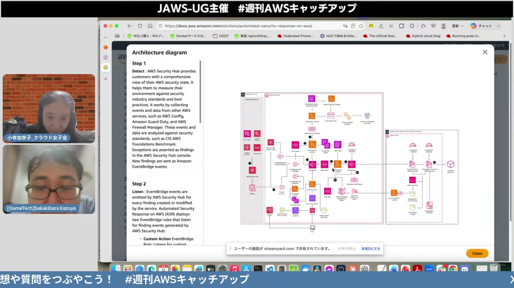
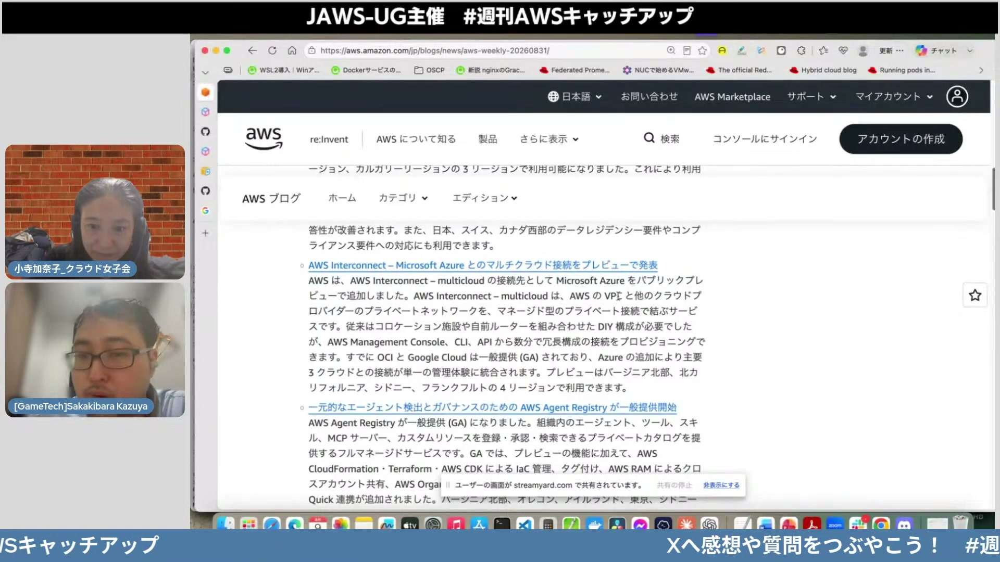
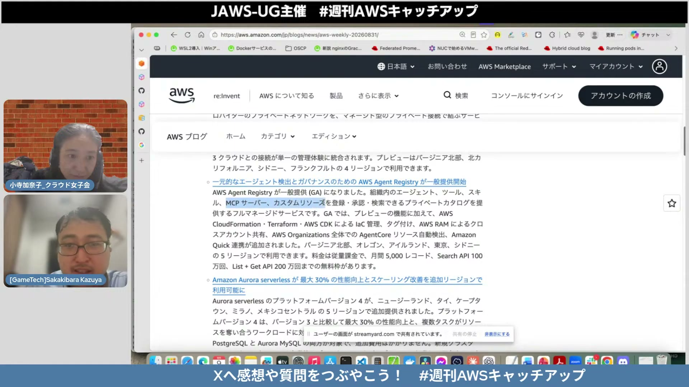
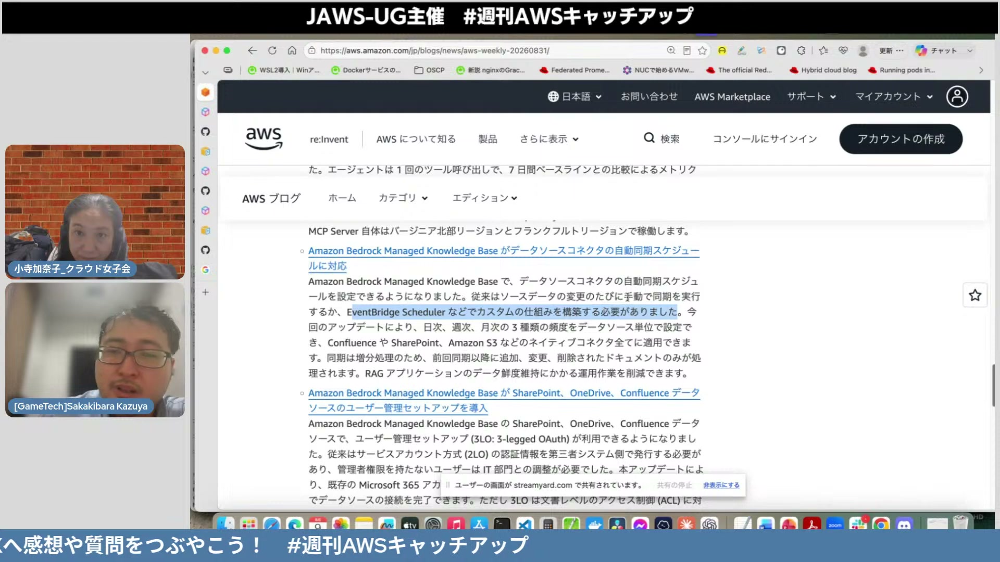

# #140 JAWS-UG主催 週刊AWSキャッチアップ（8/31週）

[https://www.youtube.com/watch?v=vZBnrthWuPo](https://www.youtube.com/watch?v=vZBnrthWuPo)

## 要点

- セキュリティ自動修復ソリューションである ASR（Automated Security Response on AWS）のバージョン4や、エージェントをカタログ管理する AWS Agent Registry が登場した。
- マルチクラウド接続サービスにおける Microsoft Azure のプレビュー対応や、Amazon Linux 2027 のパブリックプレビュー公開などインフラ基盤が強化された。
- Amazon Bedrock のナレッジベース自動同期スケジュール機能や、Amazon Connect 向けのノーコード AI キャンバスなど生成 AI 連携機能が拡充された。

## 詳細

### セキュリティと自動修復ソリューションの更新

Automated Security Response on AWS（ASR）バージョン4がリリースされ、AIによるカスタム修復生成ツールキットや Amazon Inspector、Amazon GuardDuty 等の検出結果に対する自動修復機能が追加されました。また、Amazon SES（Amazon Simple Email Service）が S/MIME（Secure / Multipurpose Internet Mail Extensions）によるメールのサーバー側デジタル署名に対応し、自前署名の手間なく送信元検証が可能になりました。

*3:14 — [動画のこの位置を開く](https://www.youtube.com/watch?v=vZBnrthWuPo&t=194s)*

### 認証効率化とマルチクラウド・インフラ基盤の拡張

AWS ワークロードクレデンシャルプロバイダーが Linux や Windows 向けにワンクリックで導入可能になり、Secrets Manager のシークレット取得やメモリキャッシュが容易になりました。さらにマルチクラウド間をプライベート接続するサービスで Microsoft Azure がパブリックプレビューに追加されたほか、Amazon Linux 2027 のパブリックプレビューも公開されました。

*7:29 — [動画のこの位置を開く](https://www.youtube.com/watch?v=vZBnrthWuPo&t=449s)*

### エージェント管理と生成 AI アプリケーション構築

組織内のエージェントやツール、MCP（Model Context Protocol）サーバーをプライベートに登録・検索できるフルマネージドサービス「AWS Agent Registry」が一般提供（GA）されました。また、Amazon Connect では LLM の推論ステップと厳格なルール判定を組み合わせたセルフサービス体験をノーコードで設計できる「Agentic Customer Experience Designer」が GA となっています。

*8:33 — [動画のこの位置を開く](https://www.youtube.com/watch?v=vZBnrthWuPo&t=513s)*

### Bedrock ナレッジベースおよび MCP 連携の強化

Amazon Bedrock のマネージドナレッジベースにおいて、日次・週次・月次などの頻度でデータソースの自動同期スケジュールが設定可能になり、ServiceNow へのネイティブ接続や 3LO によるユーザー管理セットアップも利用できるようになりました。また、Amazon Q のコネクターで外部 MCP サーバーの変更を自動反映する MCP Sync や、AWS MCP サーバーによる Lambda 等のサーバーレス障害診断機能が追加されています。

*21:06 — [動画のこの位置を開く](https://www.youtube.com/watch?v=vZBnrthWuPo&t=1266s)*

## 用語

- **ASR**（Automated Security Response on AWS） — AWS環境で検出されたセキュリティの脆弱性や脅威に対して自動的に修復処理を実行するソリューション。
- **MCP**（Model Context Protocol） — AIエージェントやLLMが外部ツールやデータソース、コンテキストと安全にやり取りするためのオープンプロトコル。
- **3LO**（Three-Legged OAuth） — ユーザー、クライアントアプリケーション、認証サーバーの3者間でアクセストークンをやり取りして認証・認可を行う方式。

## 所感

<!-- ここは自分で書く -->
