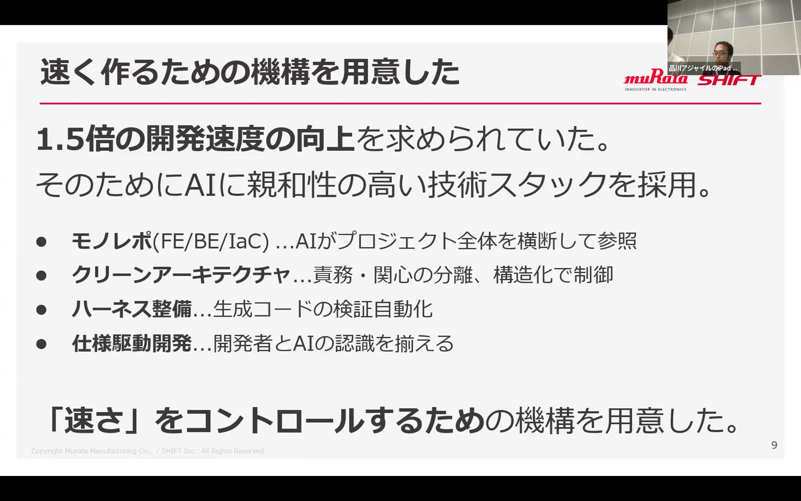
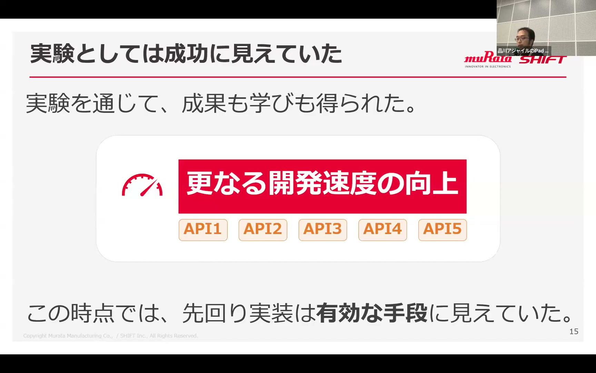
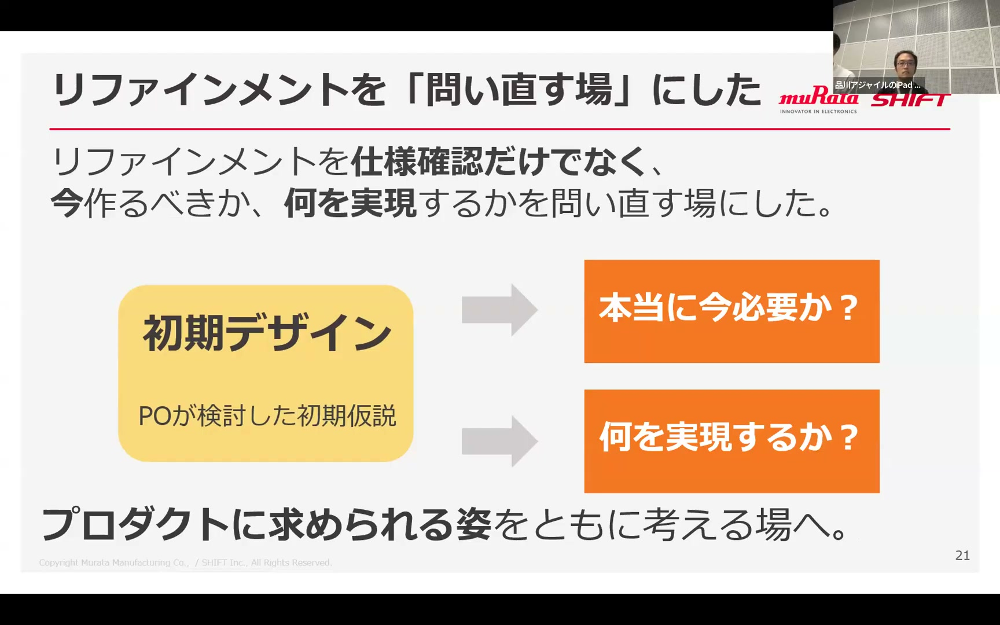
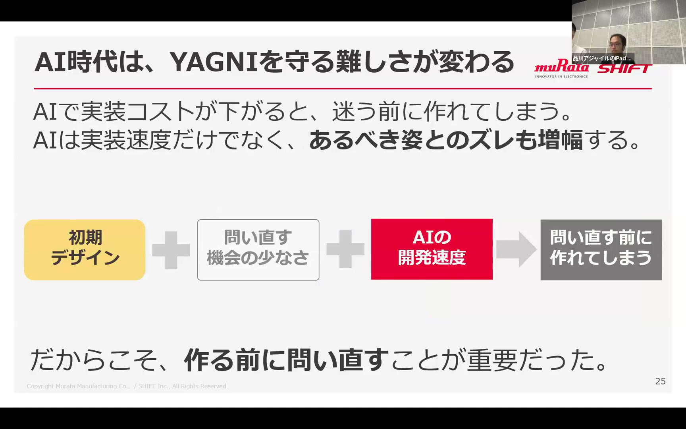

# AIは実装を速くする。では、私たちは何を今作るべきか？ ― 立場を越えてリリースに向き合ったチーム開発の実践 / Naoki Takahashi / Hiromi Nakaya

[https://www.youtube.com/watch?v=ZPnx3CBPFpw](https://www.youtube.com/watch?v=ZPnx3CBPFpw)

## 要点

- AIの活用によって実装速度を1.5倍以上に向上させたものの、先回りで一括実装した簡易API 5本が仕様変更等によりすべて不要となり、技術負債を残す失敗を経験した。
- 初期デザインは確定仕様ではなくPO（プロダクトオーナー）の初期仮説であると認識を改め、リファインメントを「どう作るか」から「今本当に必要なのか」を問い直す場へと再定義した。
- 不要な機能のスコープ除外やスクリプト運用への代替など、実装前に必要性と実現形態を精査することで、初回リリースに必要な価値に絞り込んだ。
- AIは開発速度だけでなく設計のズレも増幅するため、AI時代こそYAGNI原則を徹底し、内製と準委任の立場を越えて人間がプロダクトのあるべき姿を問い直すことが不可欠である。

## 詳細

### AI活用を前提とした開発体制と高速化の取り組み

半年後の商用システムリリースに向け、村田製作所の内製メンバー3名とSHIFTの準委任メンバー2名の混成チームでスクラム開発を開始しました。内製側では開発速度1.5倍の向上を目指し、モノレポ構成やクリーンアーキテクチャ（Clean Architecture）、コーディングエージェントのハーネス整備、仕様駆動開発を採用しました。AIを制御しやすい設計環境を整えたことで、初期から想定通りの速度向上を実現しました。

*5:56 — [動画のこの位置を開く](https://www.youtube.com/watch?v=ZPnx3CBPFpw&t=356s)*

### 先回り実装の失敗と使われないAPIの負債化

AIによる実装速度の向上を受けてさらなる効率を求め、初期デザインから画面用APIを洗い出して5本の簡易APIを先回りして一気に実装しました。しかし、その後の要件変更や消滅により、作成した5本のAPIはすべて使われなくなりました。結果としてスピードが空回りしただけでなく、チームにとって扱いづらいソースコードや異なる使用技術がコードベースに技術負債として残る結果となりました。

*10:13 — [動画のこの位置を開く](https://www.youtube.com/watch?v=ZPnx3CBPFpw&t=613s)*

### リファインメントの転換と機能の引き算

初期デザインは確定仕様ではなくPOの「初期仮説」に過ぎず、周辺機能は変わりやすいという気付きから、リファインメントの役割を刷新しました。仕様や振る舞いの確認にとどまっていた場を、「今作る価値があるのか」「何を実現したいのか」を問い直す場へと変更しました。主要業務フローから外れる機能の除外、管理者向け画面の廃止、低頻度機能のスクリプト手運用への代替などを通じて、初回リリースに必要な形へ機能を削ぎ落としました。

*13:11 — [動画のこの位置を開く](https://www.youtube.com/watch?v=ZPnx3CBPFpw&t=791s)*

### 増幅器としてのAIとYAGNI原則の重要性

AIは実装速度を加速させる一方で、あるべき姿との認識のズレも増幅させます。不要なものまで高速に作り出してしまう危険があるからこそ、「今必要なものだけを作る」というYAGNI原則の重要性が浮き彫りになりました。AIが実装を高速化する時代だからこそ、何を作り何を作らないかの判断は人間に残り、内製や準委任といった役割の垣根を越えて共通のプロダクト目標に向き合い続けることが求められます。

*15:42 — [動画のこの位置を開く](https://www.youtube.com/watch?v=ZPnx3CBPFpw&t=942s)*

## 用語

- **YAGNI原則**（You Aren't Gonna Need It） — 「現時点で必要になるまでは機能を追加するな」というソフトウェア開発の設計原則。
- **仕様駆動開発**（Specification-Driven Development） — コードを生成する前に明確な仕様を定義し、AIが意図通りの振る舞いや品質を満たすコードを出力できるように制御する進め方。
- **コーディングエージェントのハーネス**（Coding Agent Harness） — AIがプロジェクトのコンテキストを正しく理解し、高精度なコード生成を行えるように整備する周辺の制御環境やテストの仕組み。
- **クリーンアーキテクチャ**（Clean Architecture） — 責務や関心をレイヤーごとに分離し、ビジネスロジックを外部フレームワークやDBから独立させて保守性やテスト容易性を高める設計方針。

## 所感

<!-- ここは自分で書く -->
