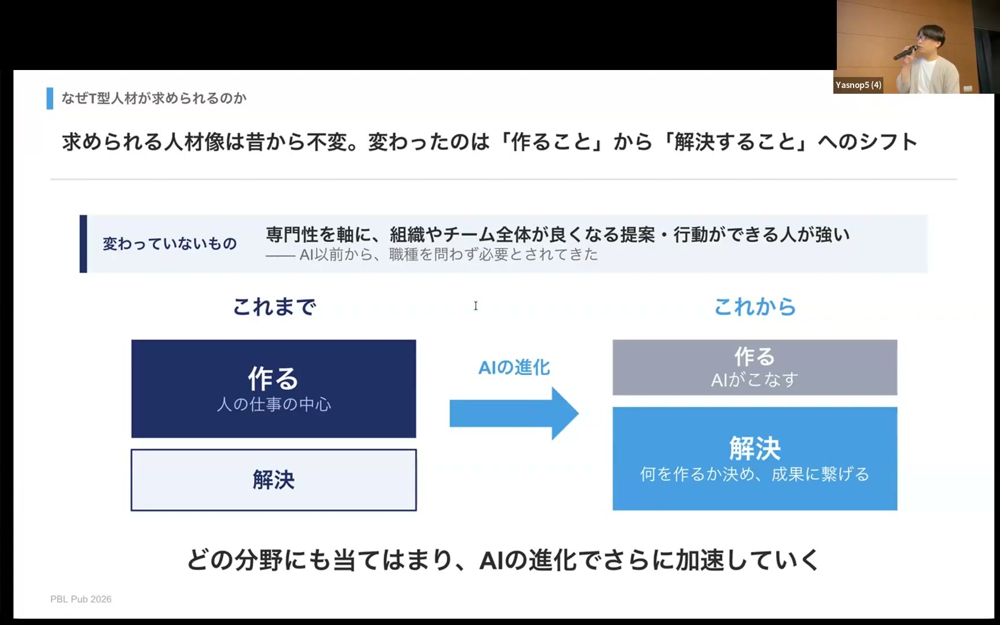
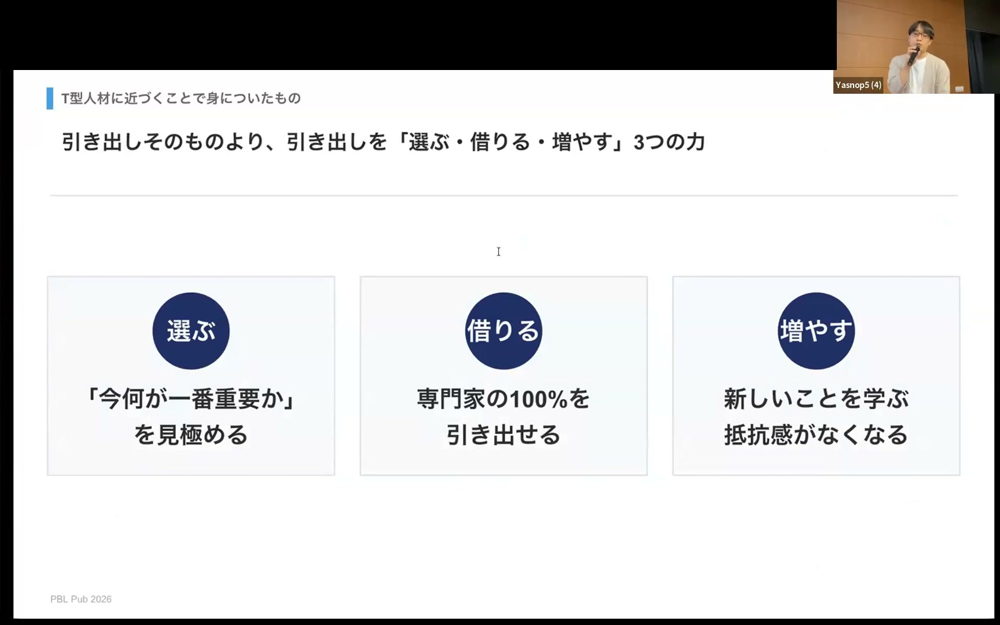
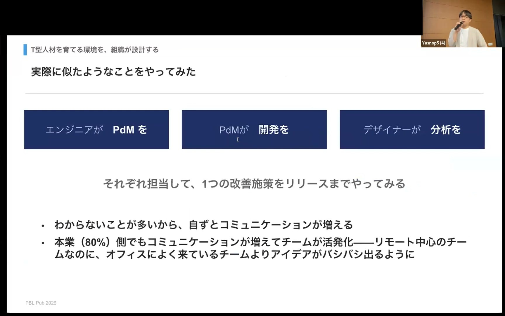
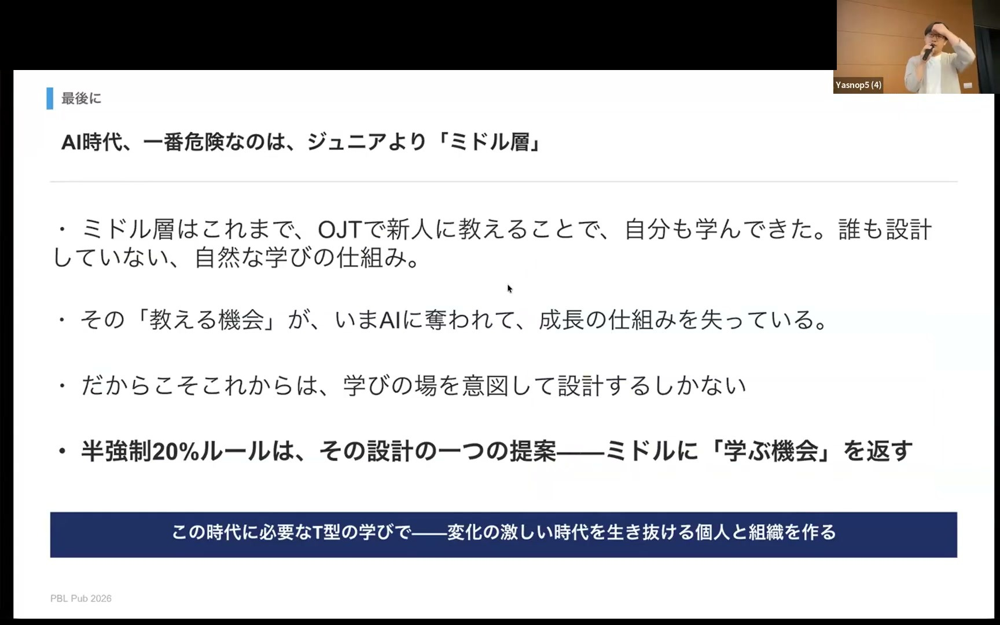

# AI時代に求められるT型人材は、PBLで設計できるのか？ なんでも屋の越境体験から考える Yuta Sugai

[https://www.youtube.com/watch?v=-K_Pn7Xvq94](https://www.youtube.com/watch?v=-K_Pn7Xvq94)

## 要点

- AIが制作や実装を代替できる時代においては、発散したアイデアを事業成果へ収束させるために、広い視野と複数のドメイン知識を持つT型人材の必要性が高まっている。
- 職域を越境してT型に広げることで、最適な手段を「選ぶ力」、専門家の能力を対等に「借りる力」、未知の分野への抵抗感をなくす「増やす力」が身につく。
- 個人の適性や勇気だけに頼る越境は難しいため、AIが生んだ余剰時間を活用して普段と異なる職種の役割を担わせる「半強制20%ルール」というPBL（Project-Based Learning）の組織的設計が有効である。

## 詳細

### AI時代の成果シフトとT型人材の必要性

AIの進化により「作ること」自体の難易度が下がった結果、求められる比重は「課題を解決し成果を残すこと」へシフトしています。AIによってアイデアの発散は容易になったものの、事業にとって最適なものへ収束させるには複数のドメイン知識と広い視野が不可欠であり、全体最適を判断できるT型人材が求められています。

*3:25 — [動画のこの位置を開く](https://www.youtube.com/watch?v=-K_Pn7Xvq94&t=205s)*

### 越境キャリアから得られる3つの力

エンジニアからプロダクトマネージャーやバックオフィスへ領域を広げた経験から、T型人材化によって「選ぶ力」「借りる力」「増やす力」の3つが身につくと語られます。全体最適の視点で解決策を「選ぶ力」、専門家への理解を通じて相手の力を100%引き出す「借りる力」、そして新しい分野を学ぶ恐怖心を克服して適応領域を「増やす力」が変化の激しい時代に重要となります。

*9:14 — [動画のこの位置を開く](https://www.youtube.com/watch?v=-K_Pn7Xvq94&t=554s)*

### 「半強制20%ルール」によるPBLの組織設計

自発的な越境はハードルが高いため、AIが生み出した余剰時間を活用して業務時間の20%を普段と異なる役割（エンジニアがPdM、PdMが開発など）に充てる「半強制20%ルール」が提案されています。実際の改善施策に別職種として取り組むことで、余計なプライドを捨てて学習者として質問し合える「業務の中の小さなPBL」が成立します。

*15:53 — [動画のこの位置を開く](https://www.youtube.com/watch?v=-K_Pn7Xvq94&t=953s)*

### ミドル層の成長危機と意図的な学習環境の構築

AI時代において最も危機に瀕しているのは、後輩へのOJT指導を通じた成長機会をAIに奪われつつあるミドル層です。組織が意図的に学習者になれる越境の場をPBLとして設計することで、変化に適応できる個人と強い組織を作ることが可能になります。

*18:33 — [動画のこの位置を開く](https://www.youtube.com/watch?v=-K_Pn7Xvq94&t=1113s)*

## 用語

- **T型人材**（T-shaped skills） — 特定の専門分野（縦の軸）を持ちつつ、周辺の多様な領域に対する幅広い知識や視野（横の軸）を兼ね備えた人材のこと。
- **PBL**（Project-Based Learning） — 現実の課題やプロジェクトに当事者として取り組み、実践を通じて解決策を導き出しながら知識やスキルを学ぶ課題解決型学習法。
- **カーブアウト**（Carve-out） — 企業が自社の一部門や特定の事業を切り離し、独立した新会社として分離・設立すること。

## 所感

<!-- ここは自分で書く -->
