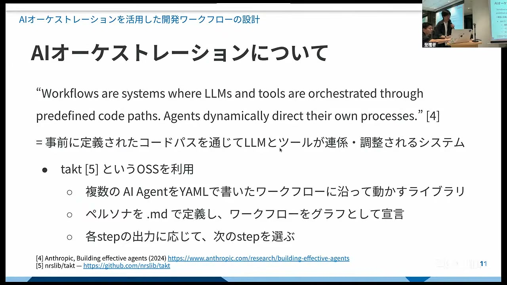
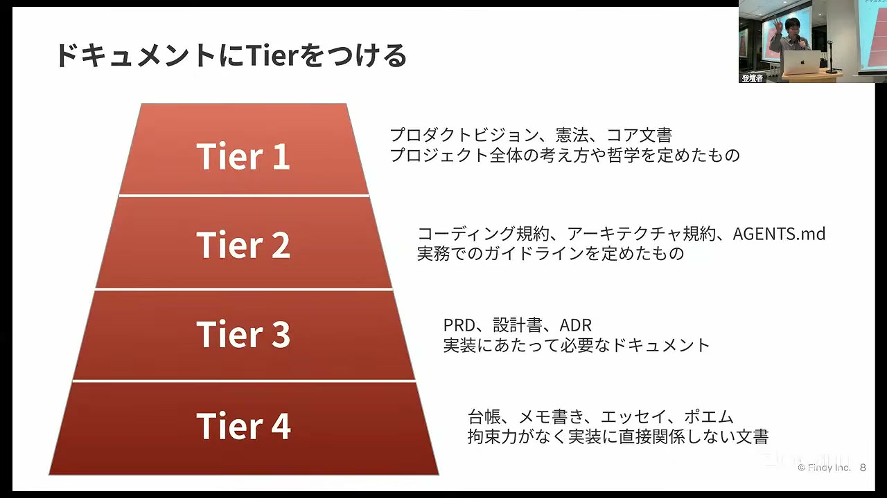
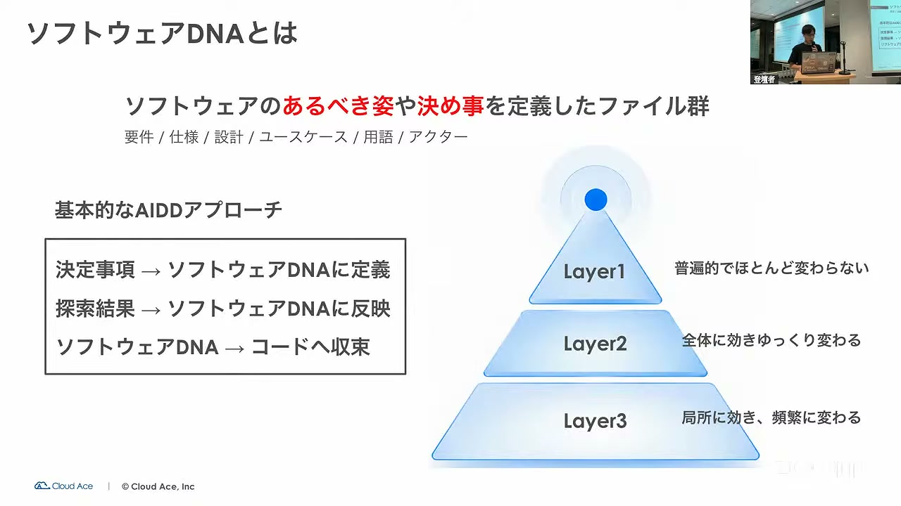
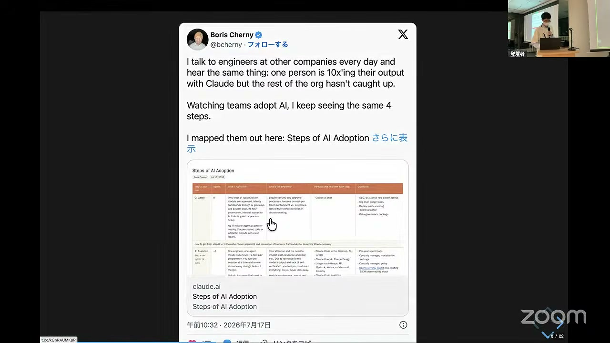
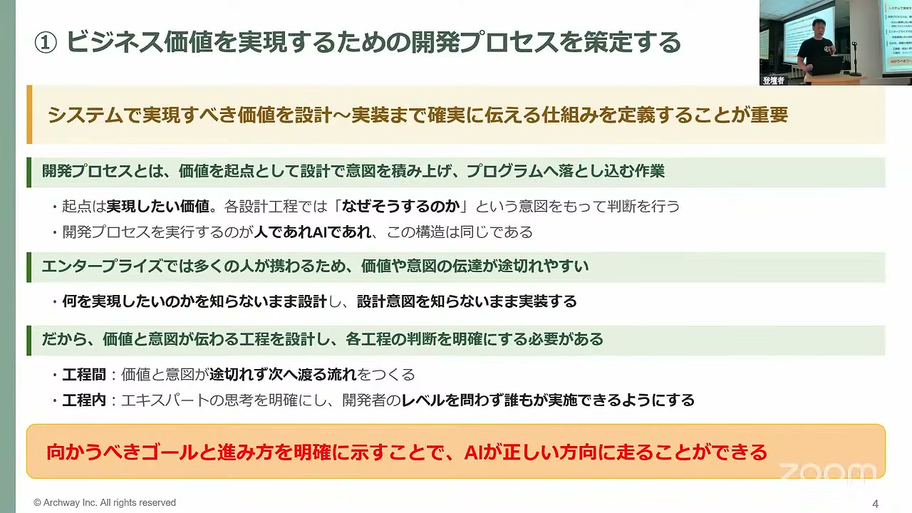
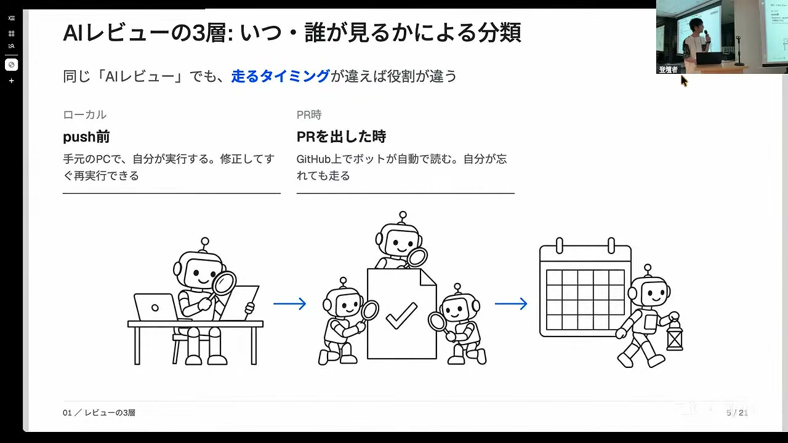
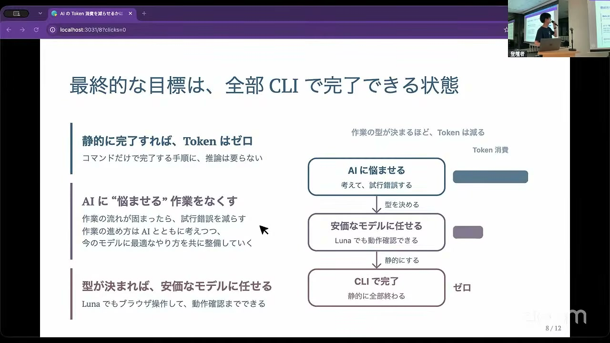
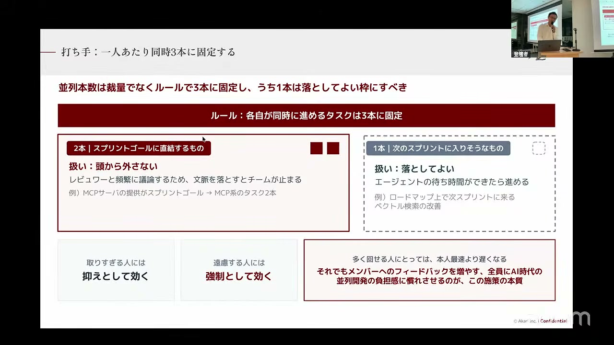
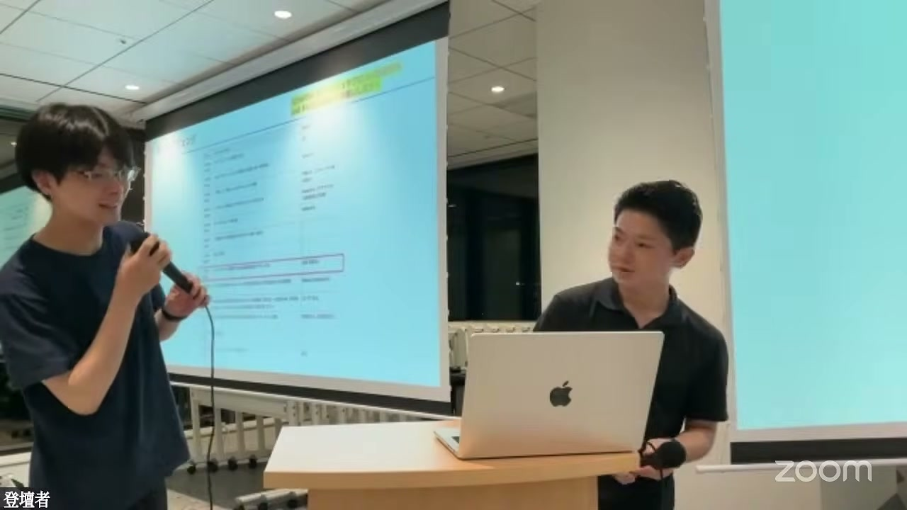

# AI自走環境整備・運用スペシャル#6

[https://www.youtube.com/watch?v=kGNXNtWAb6E](https://www.youtube.com/watch?v=kGNXNtWAb6E)

## 要点

- AIエージェントに自走させるためには、タスクの解像度を高め、ソフトウェアのあるべき姿（ソフトウェアDNA）やドキュメントの階層ルールを定義して向かうべき方向を明確にする必要がある。
- 賢いモデルをオーケストレーター（監督役）に専任させてサブエージェントを制御する構成や、ローカル・PR・定期実行の3層レビューなど、AIの役割分担と多層的な品質ハーネスの整備が重要である。
- チーム全体の開発生産性を最大化するには、個人の裁量に任せるだけでなく、並列タスク数のルール化や開発環境の整備によってジュニア層のボトルネックを解消する運用が有効である。

## 詳細

### AIオーケストレーションを活用した開発フローの効率化

GMOペパボのbqnq氏は、OSSの「Tact」を用いて複数のAIエージェントをYAMLとグラフ構造で連携させる開発フローを紹介した。判断の重いタスクには賢いモデル（Opusなど）、調査や実装にはSonnetなどを割り当て、人間の介入ポイントを「実装計画の承認」と「PR品質チェック」の2箇所に限定することで、反自律的なタスク遂行を実現している。

*9:39 — [動画のこの位置を開く](https://www.youtube.com/watch?v=kGNXNtWAb6E&t=579s)*

### 「正本」と「契約」によるドキュメント管理

ファインディの中畠氏は、AIが作成するドキュメントの複雑化や矛盾を防ぐため、ドキュメントをティア1（憲法・ビジョン）からティア4（メモ等）に階層化する手法を提示した。上位ティア優先、下位から上位のみを参照する依存方向の固定、状態を持たせないステートレス化、そしてティア2以上は人間の明示承認なしで変更不可とする更新ルールを「契約」として徹底することが推奨された。

*15:38 — [動画のこの位置を開く](https://www.youtube.com/watch?v=kGNXNtWAb6E&t=938s)*

### ソフトウェアDNAとクラウドエージェントのススメ

クラウドエースのakane氏は、バイブコーディング（探索）と仕様駆動開発（SDD / 収束）をつなぐ概念として「ソフトウェアDNA」（要件や設計などあるべき姿を定義したファイル群）を提唱した。また、ローカル環境から隔離され高い自己完結力を持つクラウドエージェントに対し、ソフトウェアDNAで進むべき方向を提示することで、人間の介入を最小限に抑えた開発が可能になると述べた。

*21:27 — [動画のこの位置を開く](https://www.youtube.com/watch?v=kGNXNtWAb6E&t=1287s)*

### 賢いモデルにサブエージェントを監督させるオーケストレーション

nikkie氏は、高性能なモデル（Opusなど）自身にはコードを書かせずオーケストレータ（監督役）に専任させ、ワーカーとしてSonnetなどのサブエージェントを動的に呼び出す開発手法を紹介した。監督役がバックグラウンドで調査やサブエージェントの成果物判定（ベビーシッティング）を行うことで、開発者自身の分身を作ったような感覚で並列開発を進められる。

*27:35 — [動画のこの位置を開く](https://www.youtube.com/watch?v=kGNXNtWAb6E&t=1655s)*

### エンタープライズ開発におけるAI駆動開発のデザイン

アークウェイの生地氏は、エンタープライズ開発においてビジネス価値と設計意図を途切れさせずにコードへ落とし込む工程設計の重要性を強調した。AIに成果物の形を任せるのではなく、人間が意図を持って「標準の型」を定義し、AIにその通り出力させることで品質保証と説明責任を果たし、長期的な運用保守に耐えうる仕組みを作るべきだと論じた。

*1:03:44 — [動画のこの位置を開く](https://www.youtube.com/watch?v=kGNXNtWAb6E&t=3824s)*

### AIレビューは3層で回す実運用

フリーランスの篠田氏は、コード差分が小さく修正ループが速い「ローカル（プッシュ前）」、PR作成時、そして定期実行する「デイリー」の3層でAIレビューを実施する方式を提示した。スイスチーズモデルの考え方に基づき、複数のモデルによる第三者レビューや、危険度・変更規模に応じたセキュリティレビューへの自動昇格を組み合わせて品質の穴を防いでいる。

*1:11:11 — [動画のこの位置を開く](https://www.youtube.com/watch?v=kGNXNtWAb6E&t=4271s)*

### タスクの解像度向上によるトークン消費の抑制

スナガク氏は、AIが試行錯誤で遠回りしてトークンを大量消費するのを防ぐには、タスクの手順を人間側で書き出し解像度を上げることが不可欠だと指摘した。AIの作業ログを観察してディレクトリや仕様の勘違いなどの挙動を見逃さず、結果だけでなく途中の行動プロセス自体にフィードバックを加えて型化することで、安価なモデルでも確実に動作させられるようになる。

*1:19:39 — [動画のこの位置を開く](https://www.youtube.com/watch?v=kGNXNtWAb6E&t=4779s)*

### チームの並列開発数を引き上げるスクラム運用

燈の町田氏は、メンバーごとのアウトプット格差を解消するため、1人あたり同時に3本のエピックを進める運用ルールを導入した事例を共有した。ジュニア層がAIの完了待ち時間に気づけなかったり判断に迷ったりする問題を解決するため、サブモニターの支給や完了通知フックの導入といった環境整備を行った結果、チームのベロシティが1.5倍に向上した。

*1:25:15 — [動画のこの位置を開く](https://www.youtube.com/watch?v=kGNXNtWAb6E&t=5115s)*

### Q&Aセッションにおける実践的な知見

質疑応答では、エージェント定義の肥大化に対しては単一責任の原則に従いスキルを細かくモジュール化すること、若手の技術力向上には設計の場数を踏んでプロや大規模OSSのコードと打ち合うことで「勘」を養うことが語られた。また、AIとの並列作業による認知負荷を下げるためにHTML形式の要約を出力させる工夫や、コードが得意なベテラン開発者をAI開発の仕組み化側に巻き込むアプローチなどが共有された。

*1:39:07 — [動画のこの位置を開く](https://www.youtube.com/watch?v=kGNXNtWAb6E&t=5947s)*

## 用語

- **Tact**（Tact） — YAMLで定義されたワークフローに沿って、複数のAIエージェントをグラフ構造として連携・実行させるOSSライブラリ。
- **ソフトウェアDNA**（Software DNA） — 要件や仕様、設計など、ソフトウェアのあるべき姿や決め事を定義したファイル群のこと。
- **スイスチーズモデル**（Swiss Cheese Model） — 個別の防護壁にある欠陥（チーズの穴）を、複数の異なる層を重ね合わせることで貫通（事故や不具合の発生）を防ぐリスク管理モデル。

## 所感

<!-- ここは自分で書く -->
