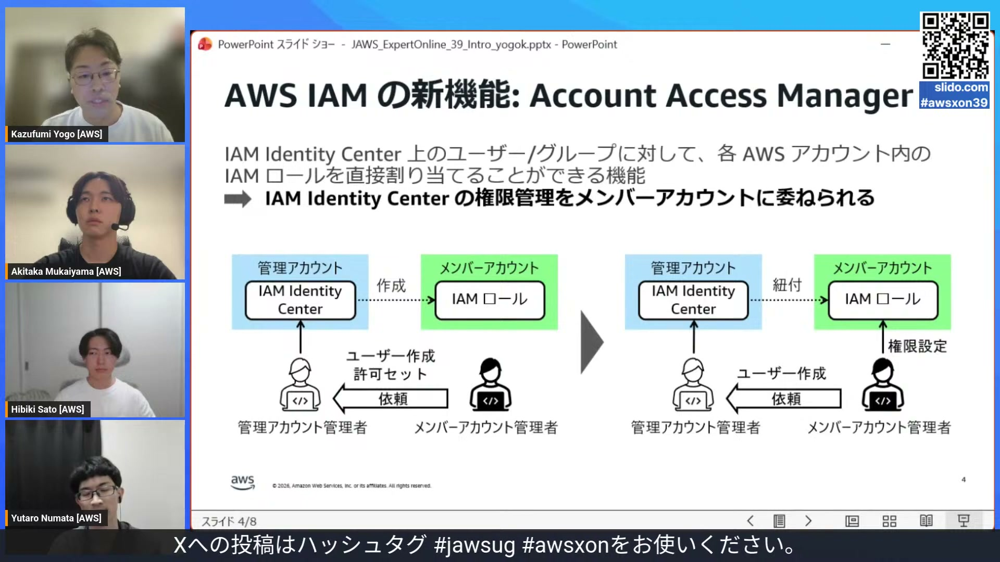
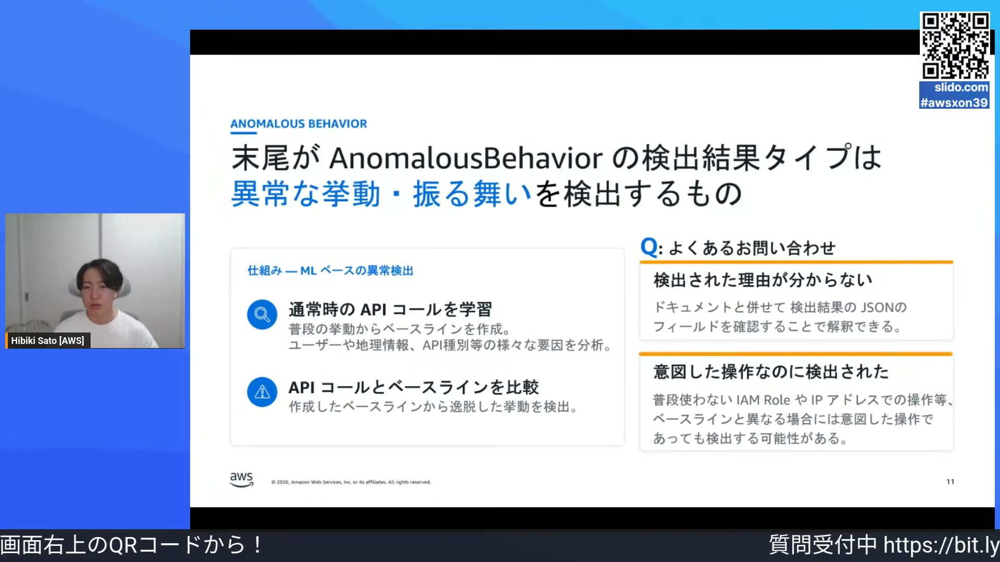
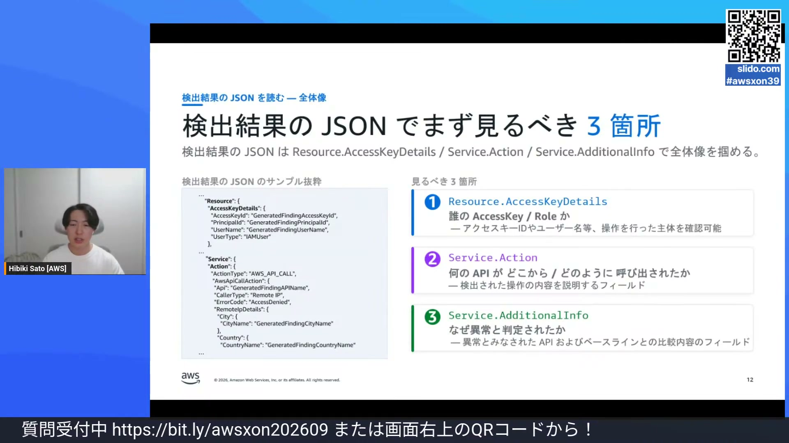
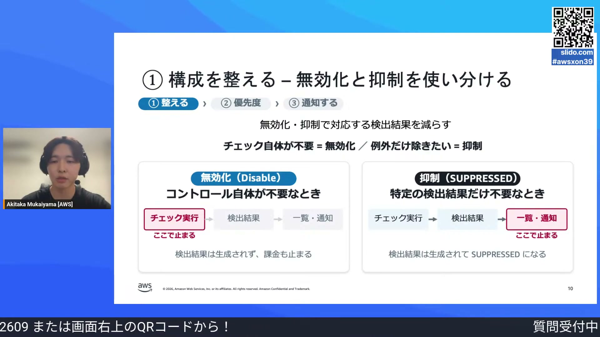
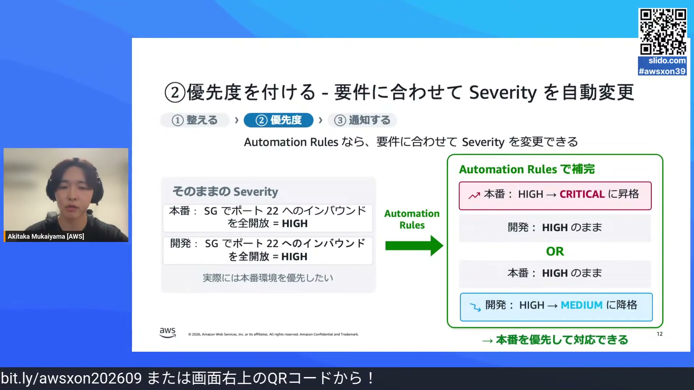
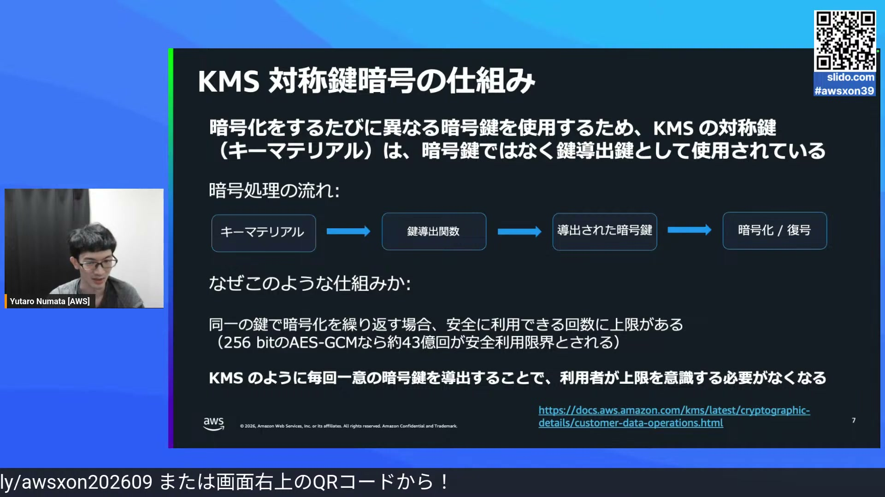
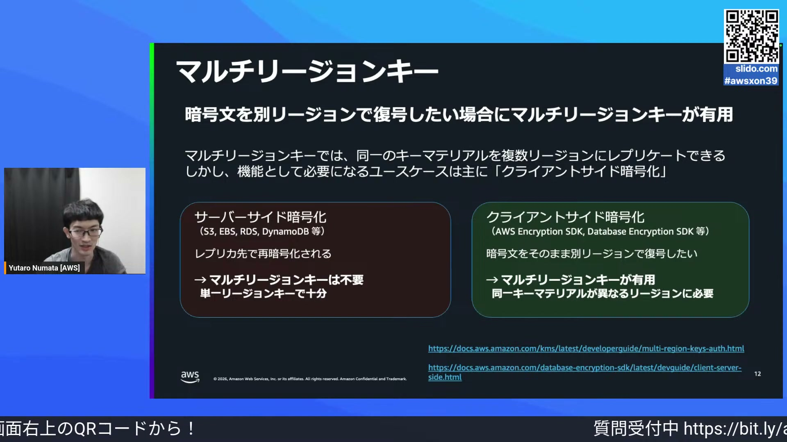

# AWS Expert Online for JAWS-UG #39

[https://www.youtube.com/watch?v=aiatHXA8Now](https://www.youtube.com/watch?v=aiatHXA8Now)

## 要点

- Amazon GuardDuty で末尾に「AnomalousBehavior」が付く検出結果は、普段の振る舞いベースラインからの逸脱を検知したものであり、検出結果 JSON の additionalInfo を読み解くことで異常と判定された具体的な要素を把握できる。
- AWS Security Hub CSPM で検出結果が膨大になる問題は、不要なコントロールの無効化・抑制による「構成の整備」、環境に応じた「優先度付け」、必要な重要結果のみに絞る「通知設計」の 3 ステップで解決できる。
- AWS KMS の対称暗号におけるキーマテリアルは暗号鍵そのものではなく鍵導出鍵として機能するため、キーローテーションの必要性は漏洩や鍵の摩耗対策ではなく主にコンプライアンス対応にある。
- KMS のマルチリージョンキーは S3 などのサーバーサイド暗号化による DR（災害対策）構成では不要であり、クライアントサイド暗号化したデータを別リージョンでそのまま復号するユースケースで真価を発揮する。

## 詳細

### IAM の新機能：アカウントアクセスマネージャー

IAM アイデンティティセンター（AWS IAM Identity Center）を利用できないメンバーアカウントの課題に対し、新機能のアカウントアクセスマネージャー（Account Access Manager）が紹介されました。この機能により、管理アカウントで集中管理されていた権限設定を、メンバーアカウント内の既存の IAM ロールをユーザーに直接紐付ける形に委任できるようになります。組織全体で IAM アイデンティティセンターへの移行を進めやすくするメリットがあります。

*3:49 — [動画のこの位置を開く](https://www.youtube.com/watch?v=aiatHXA8Now&t=229s)*

### GuardDuty：AnomalousBehavior 検出結果の仕組み

GuardDuty は、普段の API 実行ユーザーや位置情報、API 種別などを継続的に機械学習し、アカウントやリージョンごとのベースラインを作成しています。末尾が「AnomalousBehavior」で終わる検出結果タイプは、このベースラインから逸脱した異常な挙動を検知するものです。そのため、悪意のない正当な通常業務の操作であっても、普段と異なる環境や拠点から実行された場合には検知されることがあります。

*13:21 — [動画のこの位置を開く](https://www.youtube.com/watch?v=aiatHXA8Now&t=801s)*

### GuardDuty 検出結果 JSON の確認ポイント

検出結果の JSON を確認する際は、「誰が（accessKeyDetails）」「いつ（eventFirstSeen/LastSeen）」「どこから何を実行したか（service.action）」の 3 点に加え、「なぜ異常と判定されたか」を特定します。特に「service.additionalInfo」内の「anomalousBehavior」には、異常判定された具体的な要素（API、ASN、ユーザーエージェントなど）が明記されます。例えば ASN のみが記録されていれば、普段と異なる拠点ネットワークからアクセスしただけであると判断できます。

*14:30 — [動画のこの位置を開く](https://www.youtube.com/watch?v=aiatHXA8Now&t=870s)*

### Security Hub CSPM：無効化と抑制の使い分け

Security Hub CSPM を使いこなす第一歩は構成の整備です。責任を持つセキュリティ標準のみを有効化し、不要なコントロールは無効化するか抑制機能を使用します。「無効化」はチェックの実行自体を止めるため課金も止まりますが、「抑制（サプレスト）」はチェックや検出結果の生成・課金は継続し、一覧や通知から特定リソースの例外を除外する機能です。

*27:34 — [動画のこの位置を開く](https://www.youtube.com/watch?v=aiatHXA8Now&t=1654s)*

### オートメーションルールによる優先度付けと通知設計

Security Hub CSPM のセベリティは悪用難易度と侵害可能性で自動判定されるため、本番環境と開発環境で差がつきません。オートメーションルールズ（Automation Rules）を利用して本番環境のセベリティを Critical に昇格させるなど、リソース環境に応じた優先度付けを行います。通知設計では Amazon EventBridge のイベントパターンを使い、対応が必要な新規（NEW）かつ Critical や High の結果のみに絞り込むことで、通知の埋もれを防ぎます。

*29:47 — [動画のこの位置を開く](https://www.youtube.com/watch?v=aiatHXA8Now&t=1787s)*

### AWS KMS：対称暗号の仕組みとローテーションの目的

KMS の対称暗号におけるキーマテリアルは、データの暗号化に直接使われるのではなく「鍵導出鍵」として機能します。暗号化リクエストのたびに一意の暗号鍵が導出されるため、同一鍵を使い続けることによる「鍵の摩耗」や上限リスクは発生しません。また平文のキーマテリアルは HSM（Hardware Security Module）外部に出ないため漏洩リスクも極めて低く、キーローテーションの主目的はコンプライアンス要件の証明にあります。

*40:02 — [動画のこの位置を開く](https://www.youtube.com/watch?v=aiatHXA8Now&t=2402s)*

### マルチリージョンキーとキーマテリアルインポートの使い所

S3 クロスリージョンレプリケーションなどのサーバーサイド暗号化を用いた DR 構成では、レプリカ先の単一リージョンキーで再暗号化が行われるため、マルチリージョンキーは不要です。マルチリージョンキーが真に有効なのは、AWS Encryption SDK を使ったクライアントサイド暗号化データを別リージョンで直接復号するシナリオです。また、外部からキーマテリアルをインポートした場合、KMS の暗号化方式の違いから外部環境で作成した暗号文との互換性はない点に注意が必要です。

*44:20 — [動画のこの位置を開く](https://www.youtube.com/watch?v=aiatHXA8Now&t=2660s)*

## 用語

- **自律システム番号**（ASN (Autonomous System Number)） — インターネット上でネットワーク経路制御を行うために各ネットワーク組織へ割り当てられる固有の識別番号。
- **CSPM**（Cloud Security Posture Management） — クラウド環境の設定状況をベストプラクティスやコンプライアンス標準と照らし合わせ、継続的に評価・管理するセキュリティ手法。
- **鍵導出鍵**（Key Derivation Key） — データを直接暗号化するのではなく、暗号処理ごとに個別の一意な暗号鍵を計算・生成するための大元となる鍵。
- **鍵の摩耗**（Key Wear-out） — 同一の暗号鍵で繰り返し暗号化処理を行うことで、暗号文から鍵情報が推測されやすくなり安全性が低下する現象。

## 所感

<!-- ここは自分で書く -->
