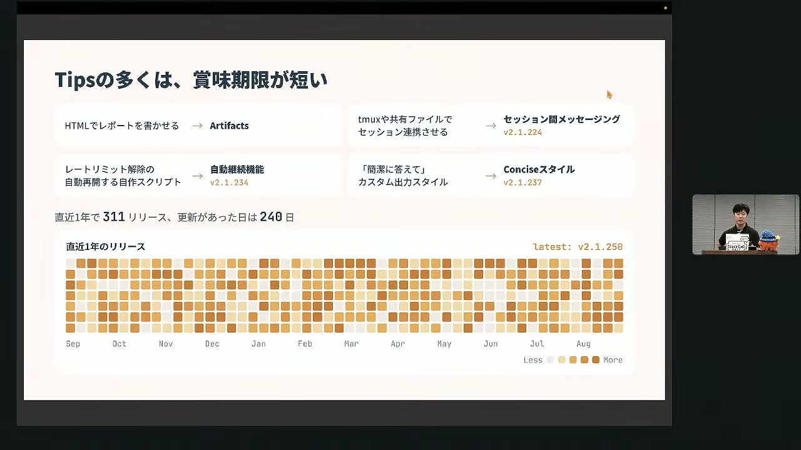
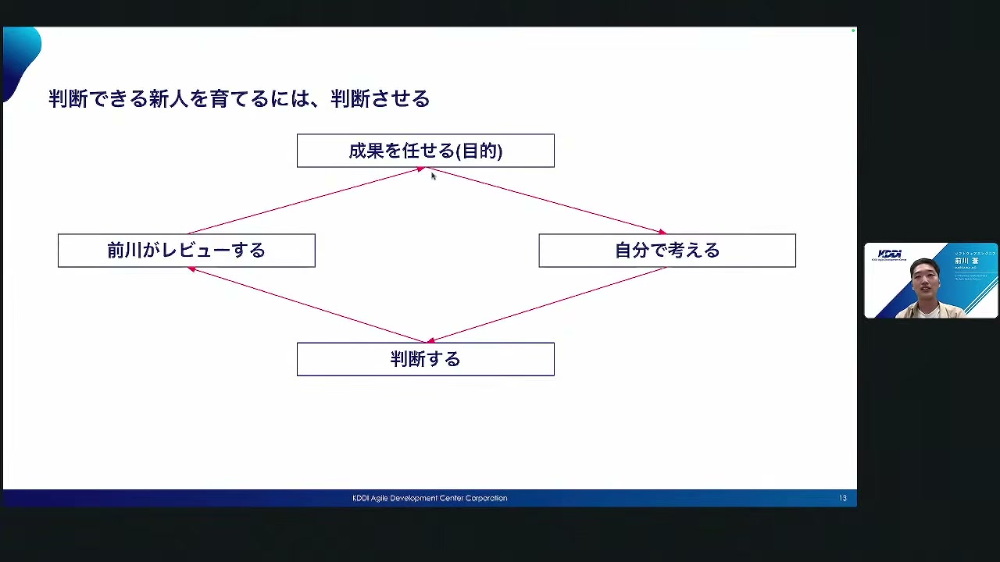
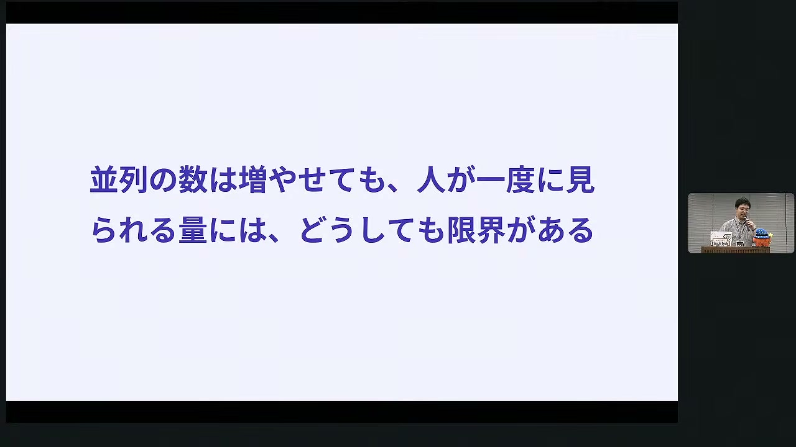
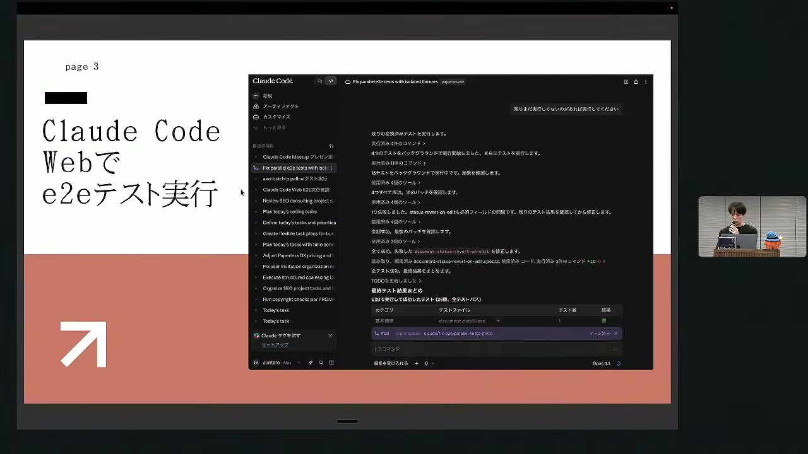
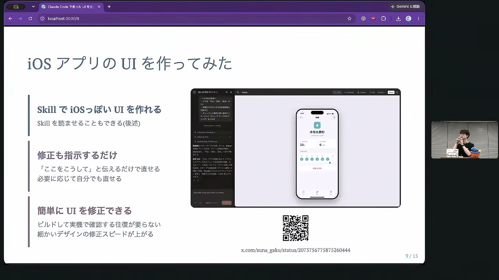
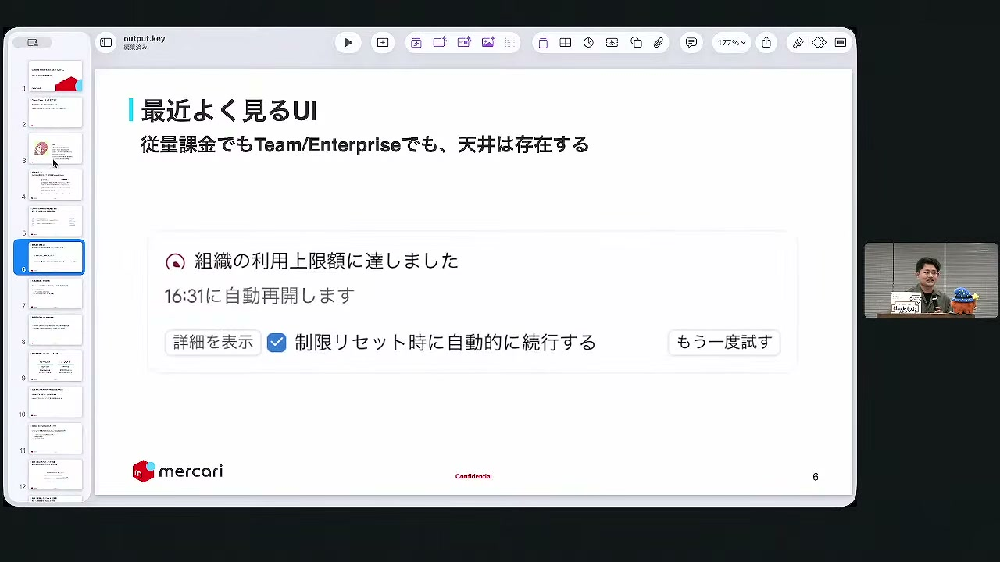
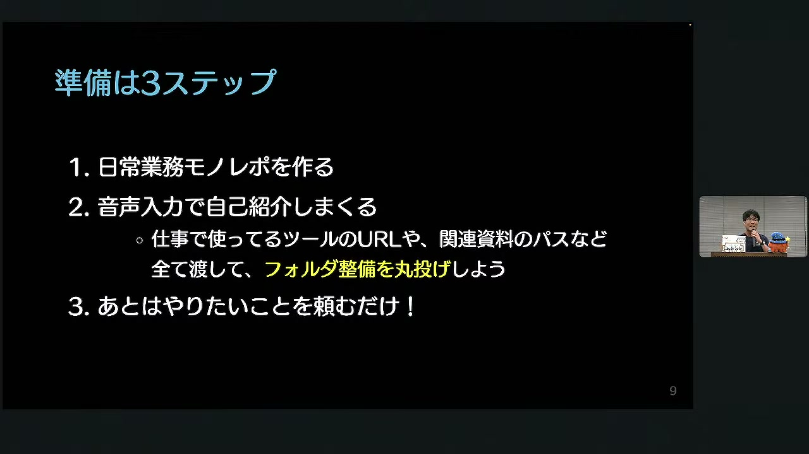
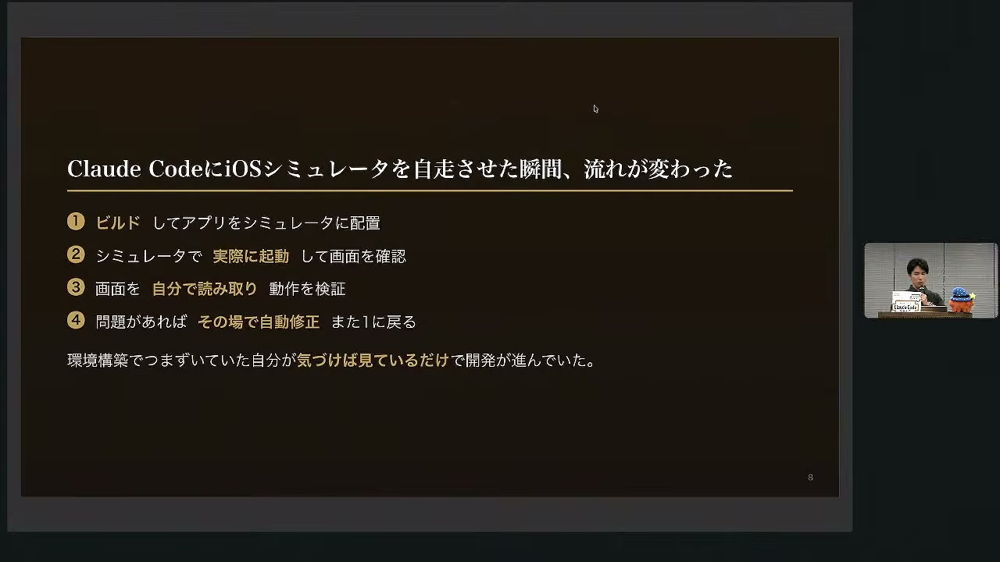

# Claude Code Meetup Japan #7  (Claude Code祭り!)

[https://www.youtube.com/watch?v=-Thyupg3nMI](https://www.youtube.com/watch?v=-Thyupg3nMI)

## 要点

- AI駆動開発（AIDD）をスケールさせるには、CI失敗やレビューなどの環境からの変化を、人間の介入なしに直接AIへフィードバックさせてループを閉じることが重要である。
- AI時代におけるE2Eテストは、壊れたコードをAIが修正しやすく、人間にとってもレビューが容易なため、速度と品質を両立するための強力な機械判定手段となる。
- Claude Codeだけでなく、デザインに特化したClaude Designや、GitHub連携に強いNotion AIなどを適材適所で「分散利用」することで、利用制限（Limit）を回避しつつ高度なアウトプットが可能になる。
- 開発業務に限らず、日常のビジネス業務（経費精算や資料作成など）も、専用のモノレポに自分の状況や情報を蓄積してClaudeに任せることで、使えば使うほど精度が上がる「コンテキストの福利」を得られる。

## 詳細

### 体系的な理解と「知識のフック」の重要性

Claude Codeは極めてアップデートが速く、これまでエンジニアが個別のスクリプトやTMAX、ハック（Tips）で対応していた多くの機能（自動継続、出力スタイルの制御など）が次々と公式機能として取り込まれている。そのため、小手先のテクニックを追うことよりも、エージェントが「何ができて、何ができないか」を体系的に理解し、新しいモデルが登場した際に発想できる「知識のフック」を持つことが重要である。

*11:54 — [動画のこの位置を開く](https://www.youtube.com/watch?v=-Thyupg3nMI&t=714s)*

### AI時代の新卒育成と「判断軸のレビュー」

新人がAIにコード作成を任せると「理解度が低いまま実装され怖い」という不安を抱きがちである。AI開発時代においては、細かい実装コードの書き方を最初から教えるのではなく、解決すべき課題や目的という「成果」だけを渡し、新人に「何が必要で何がいらないか」を判断させる。その判断プロセスを先輩がレビューして判断軸を育てることで、エンジニアリングのライフサイクルを自ら回せる人材へと成長させられる。

*23:07 — [動画のこの位置を開く](https://www.youtube.com/watch?v=-Thyupg3nMI&t=1387s)*

### 環境からのフィードバックによる自動ループ化

AIエージェントの作業時に、CIの失敗や外部サービスのエラーを人間が仲介して指示を出す手法は人間の認知負荷が高く、スケールしない。LSP（Language Server Protocol）による表記揺れやリンク切れの自動検査、GitHubや特定イベントの状態変化を捉えるモニター機能を活用し、環境側の変化を直接AIに返す仕組みを作ることで、人間の確認なしに「エージェントの自律的な修正ループ」を構築できる。なお、高頻度なポーリング（監視ループ）は莫大なトークンコストを消費するため、イベント駆動の仕組みが必須となる。

*29:38 — [動画のこの位置を開く](https://www.youtube.com/watch?v=-Thyupg3nMI&t=1778s)*

### 自律的な機械判定を支えるE2Eテストとサンドボックス

AI駆動開発では「速さ」と「品質」にトレードオフがあり、それを解決するのがテストによる機械判定である。特にUI全体の挙動を確認するE2E（End-to-End）テストは、人間にとってレビューがしやすく、かつ壊れやすいという弱点もAI自身が自動修復できるため相性が良い。Web環境における外部API制約等を回避するため、E2BやDaytonaなどの一時的な「サンドボックス環境」を立ち上げてテストをそこに押し付け、結果をAIに戻すアプローチが極めて有効である。

*51:03 — [動画のこの位置を開く](https://www.youtube.com/watch?v=-Thyupg3nMI&t=3063s)*

### Claude DesignによるUIとスライド作成

Anthropic社の新ツール「Claude Design」は、デザイン編集に特化しており、Web上のキャンバスの要素を直接クリックして修正指示を送ることができる。Appleのガイドライン等に沿った高精度なiOSアプリUIのモック作成のほか、PowerPoint（PPTX）でエクスポートして人間が微調整できる資料スライドの作成も容易である。ここで作成したUI構成データは、スムーズにClaude Codeに引き継ぎ可能である。

*1:24:41 — [動画のこの位置を開く](https://www.youtube.com/watch?v=-Thyupg3nMI&t=5081s)*

### 他ツールとの「分散利用」によるトークン制限の回避

Claude Codeで高度な開発を大量に行うと、利用上限に達して実行が一時停止することがある。これを回避するために、GitHubの全情報を参照可能なNotion AIなどのクラウド型AIを並行活用する「分散利用（ハンズオフ）」を推奨。仕様変更の調査やプロンプトの作成といった事前作業を他AIに任せ、出力されたプロンプトを使ってClaude Codeにローカルでの高速な実装・テスト実行をさせることで、リミットに悩まされずに開発を継続できる。

*1:32:21 — [動画のこの位置を開く](https://www.youtube.com/watch?v=-Thyupg3nMI&t=5541s)*

### 開発外業務を爆速化する「コンテキストの福利」

経費精算や人事評価シート、資料作成といった非開発業務も、Claude Codeの能力を最大限活かせる領域である。業務用のモノレポを作成し、最初に自分の状況や関わっている案件情報を数十枚分しっかりとClaudeに自己紹介（インプット）しておく。あとはタスクを投げるだけで、履歴や関連資料が同一リポジトリにMarkdownとして蓄積され、使えば使うほどAIが賢くなりアウトプットが早くなる「コンテキストの福利」が得られる。

*1:39:38 — [動画のこの位置を開く](https://www.youtube.com/watch?v=-Thyupg3nMI&t=5978s)*

### モバイル開発を克服するシミュレーター連携

環境構築や実機デバッグの難しさから苦手意識を持たれやすいモバイルアプリ開発も、Claude Codeのシミュレーター機能によって克服できる。指示を送ると、Claude Codeが自動的にiOS/Androidシミュレーターを起動。自身で画面遷移をさせ、スクリーンショットを確認しながらボタン動作などのバグを自動修正してくれるため、開発者は大局的な設計に専念できる。

*1:54:35 — [動画のこの位置を開く](https://www.youtube.com/watch?v=-Thyupg3nMI&t=6875s)*

## 用語

- **AI駆動開発**（AI-Driven Development: AIDD） — ソフトウェア開発プロセスにおいて、コーディングやテストの一部を自動化するだけでなく、ライフサイクル全体（設計、テスト、レビュー、デプロイ等）をAIの活用を前提に再設計し、自律的に推進する手法。
- **LSP**（Language Server Protocol） — エディタや開発ツールに対し、オートコンプリートやエラー検出などの言語支援機能を提供する共通プロトコル。動画内では、資料やコードの表記揺れ、リンクエラー等を高速に検出してAIに再修正させるために活用されている。
- **Claude Design** — Anthropic社が提供するデザイン編集用のWebツール。画面を可視化したキャンバス上で要素を修正でき、UIプロトタイプやプレゼン資料を直感的に作成して、Claude Code等に引き継ぐことができる。
- **MCP**（Model Context Protocol） — AIモデルが外部データベースや特定のツール、アプリケーションを安全に制御し、データを取得・操作して自律的なアクションを実行するための接続プロトコル。
- **グラフエンジニアリング**（Graph Engineering） — AIが参照するデータや概念を「ノード」と「エッジ（関係性）」からなるグラフ構造として整理・結合する技術。複雑に関連したコンテキストを効率的に探索し、AIの回答精度や自律性を高める目的で使われる。

## 所感

<!-- ここは自分で書く -->
