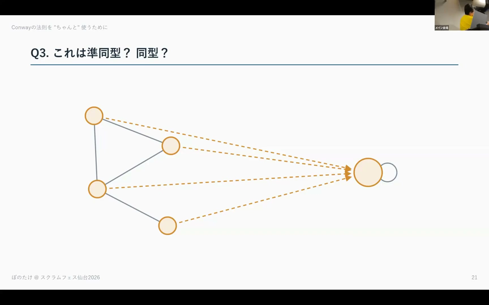
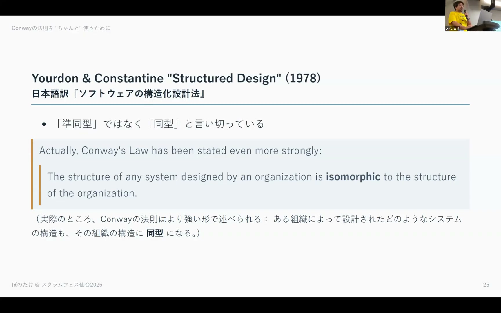
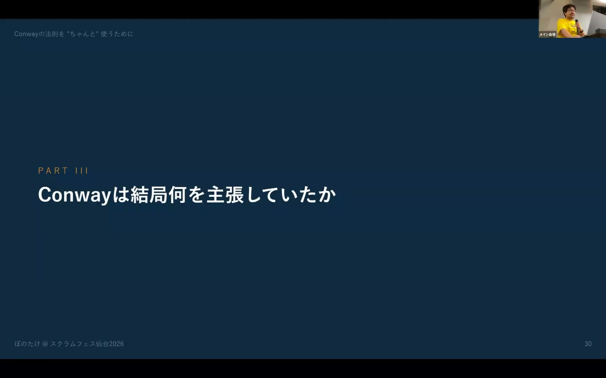
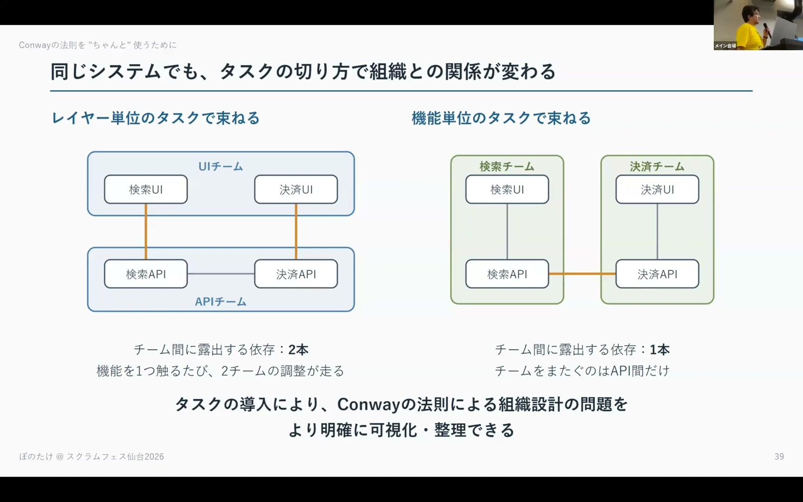

# Conwayの法則を"ちゃんと"使うために — 原典でConwayは何を言っていたのか Takeo Imai (Bonotake)

[https://www.youtube.com/watch?v=QoJGb-_AZVQ](https://www.youtube.com/watch?v=QoJGb-_AZVQ)

## 要点

- Conwayの法則の原典（1968年）では、組織構造とシステム構造の関係は1対1対応の「同型」ではなく「準同型」として定義されている。
- 複数のモジュールを1チームが担当しても法則は成り立ち、原典は1対1対応を要求していないが、後続の書籍などを通じて同型的なイメージが定着してしまった。
- Conwayが原典で最も主張していたのは「設計は必ずやり直されるため、組織には柔軟性が不可欠であり、組織を肥大化させて階層化すべきではない」という点である。
- 2023年の再解釈論文では、システムと組織の間に「タスク（責務）」という中間層を導入することで、切り方による依存関係の違いを数学的に整理している。

## 詳細

### 原典におけるConwayの法則と「準同型」

Conwayの1968年の論文『How Do Committees Invent?』では、グラフ理論の言葉を用いて組織とシステムの構造が「準同型（homomorphism）」になると説明されています。世間でよく言われる相似形や1対1対応（同型）とは異なり、例えば1つのチームが複数のモジュールを担当（チーム内通信がモジュール間通信に対応）したり、1チームで全モジュールを開発したりするケースでもConwayの法則は成立します。

*14:26 — [動画のこの位置を開く](https://www.youtube.com/watch?v=QoJGb-_AZVQ&t=866s)*

### Conwayの法則が広まった経緯と「同型」への変質

Conwayの法則は、Fred Brooksの『人月の神話（The Mythical Man-Month）』で紹介されたことで広く認知されました。しかし、その後の『構造化設計（Structured Design）』などの書籍で「同型」と言い切られたことなどから、1対1対応のイメージが定着しました。近年の『チームトポロジー（Team Topologies）』などで逆Conway戦略（Reverse Conway Maneuver）が普及しましたが、準同型のニュアンスが抜け落ちたまま「アーキテクチャをミラーリングした組織を作る」と同型的に捉えられがちになっています。

*20:36 — [動画のこの位置を開く](https://www.youtube.com/watch?v=QoJGb-_AZVQ&t=1236s)*

### Conwayが原論文で伝えたかった本来の主張

Conwayが論文の後半で強く訴えていたのは、設計は必ずやり直される（リファクタリングやリアーキテクチャが必要になる）ため、組織構造に柔軟性が求められるということです。マネージャーが人数を多く投入して階層組織を作ると、コミュニケーション経路が狭まり組織が崩壊し、結果としてシステムも崩壊するため、組織を大きくしすぎないことの重要性を警告していました。

*24:51 — [動画のこの位置を開く](https://www.youtube.com/watch?v=QoJGb-_AZVQ&t=1491s)*

### 数学的な再解釈と「タスク層」の導入

2023年に公開された数学者とアジャイル実践者（平鍋健児氏ら）による共同論文では、位相幾何学（トポロジー）を用いてConwayの法則を厳密に再定義しています。この研究ではシステムと組織の間に「タスク（責務）」という中間層を導入しており、同じシステムであってもタスクの切り方（レイヤー別か機能別かなど）によって組織の結合度や柔軟性が変化することを数学的に説明可能にしています。

*33:50 — [動画のこの位置を開く](https://www.youtube.com/watch?v=QoJGb-_AZVQ&t=2030s)*

## 用語

- **準同型**（homomorphism） — 数学（代数学やグラフ理論など）の概念で、元の構造の演算や関係性を保ったまま別の対象へ写す対応関係のこと。1対1対応である「同型」とは異なり、複数の要素が1つにまとまるような写像も含まれる。
- **同型**（isomorphism） — 2つの構造の間で要素と関係性が過不足なく1対1に対応している状態のこと。
- **逆Conway戦略**（Reverse Conway Maneuver） — Conwayの法則を逆手に取り、実現したいソフトウェアアーキテクチャの構造に合わせてチームや組織の構造を先に設計・編成する手法。
- **委員会による設計**（Design by committee） — 複数の関係者の合意形成によって設計を進めた結果、妥協の産物となり、一貫性やシンプルさが失われてしまうアンチパターン。

## 所感

<!-- ここは自分で書く -->
