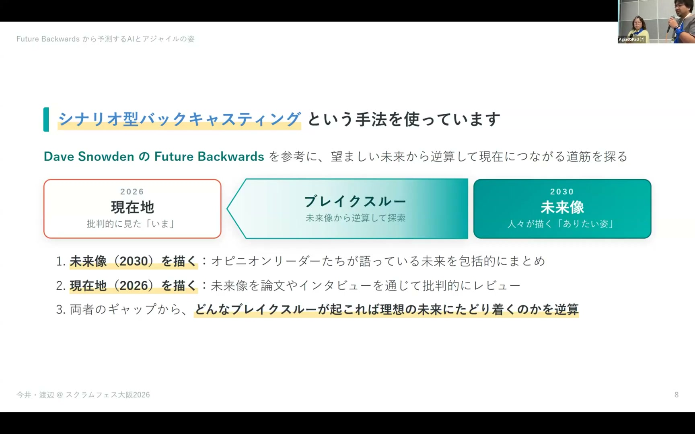
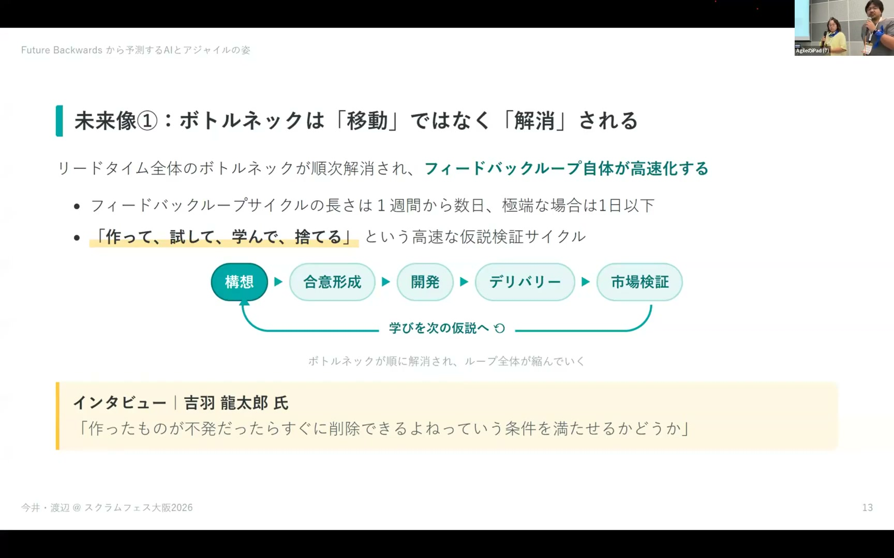
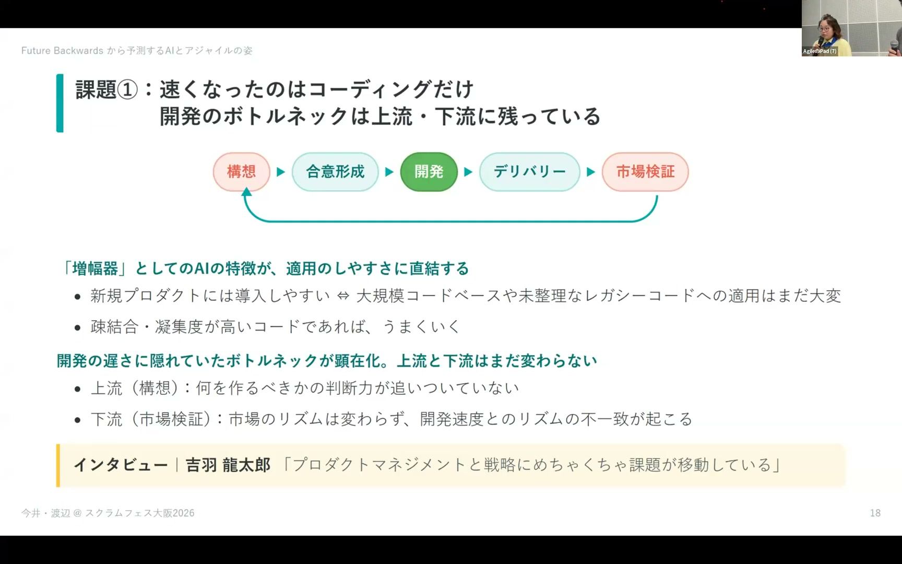
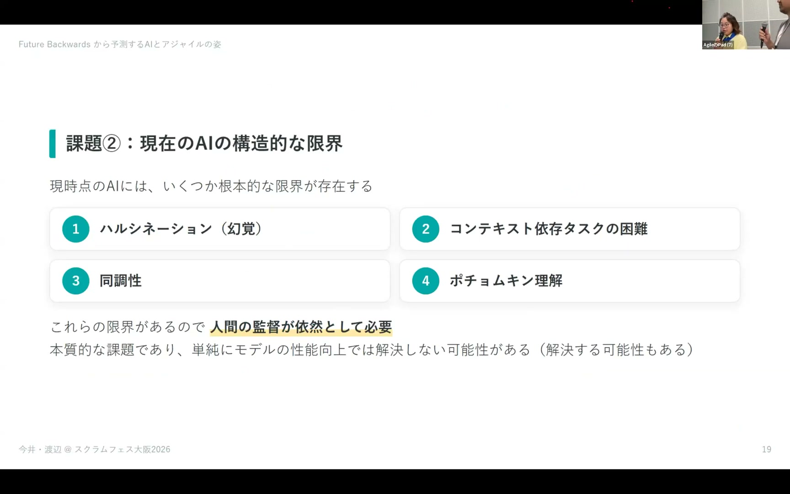
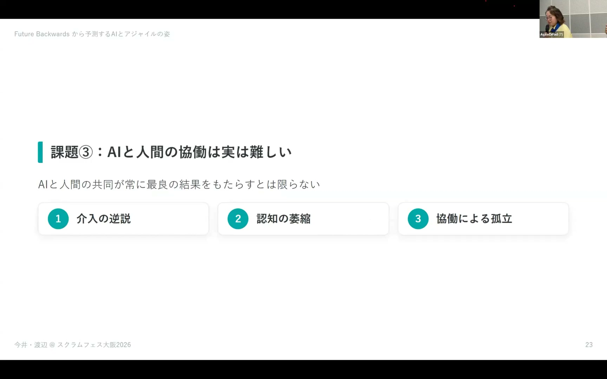
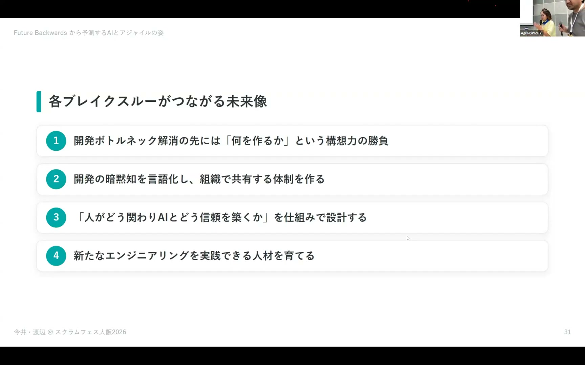

# Future Backwards から予測するAIとアジャイルの姿 / Takeo Imai (Bonotake) / Chiemi Watanabe

[https://www.youtube.com/watch?v=ORYnz6kwVKw](https://www.youtube.com/watch?v=ORYnz6kwVKw)

## 要点

- AIの導入によって開発自体は劇的に高速化したものの、ボトルネックは解消されたのではなく「何を作るか（構想）」と「市場での価値検証」へ移動している。
- 人間とAIの協働には「介入の逆説」や「認知の萎縮」、表面的に合わせる「同調性」など構造的課題が存在し、AIをいつ信頼し疑うかの「信頼の較正」が定まっていない。
- 2030年の理想的なアジャイル開発を実現するためには、高速な仮説検証、暗黙知の言語化と組織的共有、Human-in-the-Loopの再設計、新時代の人材育成という4つのブレイクスルーが必要である。

## 詳細

### 活動の背景とバックキャスティング手法

日本ソフトウェア科学会 機械学習工学研究会の「AIとアジャイルWG」では、デイヴ・スノーデン（Dave Snowden）の Future Backwards に着想を得たシナリオ型バックキャスティングを用いています。過度に楽観的で抽象的な言説と現場の現実とのギャップを埋めるため、2030年の望ましい未来像と現在地を対比し、その間をつなぐブレイクスルーを特定するレポートを取りまとめています。

*8:11 — [動画のこの位置を開く](https://www.youtube.com/watch?v=ORYnz6kwVKw&t=491s)*

### 2030年に予測されるAIとアジャイルの未来像

未来像として、構想から合意形成・開発・デリバリ・市場検証までのフィードバックループが極限まで短縮され、1日以下で仮説検証が回る姿が描かれています。開発チームは大人数のクロスファンクショナルチームから「少人数の人間と多数の自立的AIエージェント」で構成される小さなネットワークへと変わり、ロールの融合やスプリント期間の短縮・見積もりの形骸化が進むと考えられています。

*14:14 — [動画のこの位置を開く](https://www.youtube.com/watch?v=ORYnz6kwVKw&t=854s)*

### 現在地1：開発以外のボトルネックとコード品質の劣化

現在の開発現場では、AIによってコーディング速度は劇的に上がったものの、「何を作るべきか」というプロダクトディスカバリーや市場検証が追いついておらず、ボトルネックが前後に移動しています。また、AIに依存した長期的な開発ではアーキテクチャが崩壊し、コード品質の劣化によって数カ月後に開発速度が低下するという研究結果も報告されています。

*22:16 — [動画のこの位置を開く](https://www.youtube.com/watch?v=ORYnz6kwVKw&t=1336s)*

### 現在地2：AI固有の構造的限界

AIには、暗黙知やコンテキスト依存のデバッグに対応しきれない問題に加え、ユーザーの意見や対話の流暢さに過度に最適化して中身が伴わない「同調性（Sycophancy）」が存在します。さらに、概念を読み込んで理解したように見えて実際の内側処理に反映されていない「ポチョムキン理解」といった構造的な限界も指摘されています。

*23:38 — [動画のこの位置を開く](https://www.youtube.com/watch?v=ORYnz6kwVKw&t=1418s)*

### 現在地3：協働によるパフォーマンス低下と認知の萎縮

AIと人間の協働においては、共同作業によってかえって全体のパフォーマンスが落ちる「介入の逆説」や、AIへの信頼度が高い人ほど批判的思考力が低下し組織内のアイデアの多様性が損なわれる「認知の萎縮」が確認されています。人間が何をAIに任せるかの基準も属人的であり、いつAIを信じて疑うべきかという「信頼の較正（Trust Calibration）」の枠組みが確立されていません。

*28:56 — [動画のこの位置を開く](https://www.youtube.com/watch?v=ORYnz6kwVKw&t=1736s)*

### 未来へ到達するための4つのブレイクスルー

レポートではギャップを克服する鍵として、①作って試して捨てる高速な仮説検証サイクルの組織的獲得、②開発の理由や背景を含む暗黙知を言語化し組織で共有する仕組み、③人間が最も価値を発揮できる介入点を再設計するHuman-in-the-Loopと信頼の較正、④批判的思考やオーケストレーション能力、計算機科学の基礎知識を持つ人材育成、の4点を挙げています。

*38:03 — [動画のこの位置を開く](https://www.youtube.com/watch?v=ORYnz6kwVKw&t=2283s)*

## 用語

- **信頼の較正**（Trust Calibration） — AIの能力を適切に見極め、どの程度信頼し、いつ疑って人間が介入すべきかを正しく判断・調整すること。
- **ポチョムキン理解**（Potemkin understanding） — 見せかけの街（ポチョムキン村）のように、AIが指示された概念を理解しているように振る舞うものの、実際の内部処理や成果物にその本質が反映されていない状態。
- **同調性**（Sycophancy） — AIが対話相手の意見や好みに過剰に合わせたり、否定されるとすぐに自説を撤回して相手におもねる回答を出してしまう性質。
- **介入の逆説**（Paradox of intervention） — AI単独や人間単独の作業に比べ、人間とAIが中途半端に協働・介入することで全体の作業パフォーマンスが低下してしまう現象。

## 所感

<!-- ここは自分で書く -->
