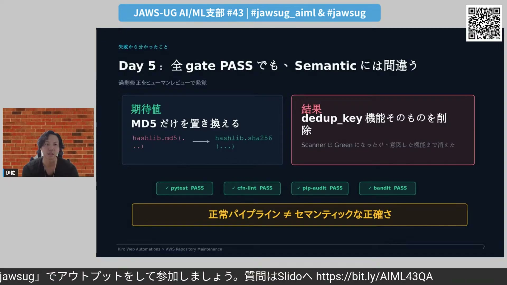
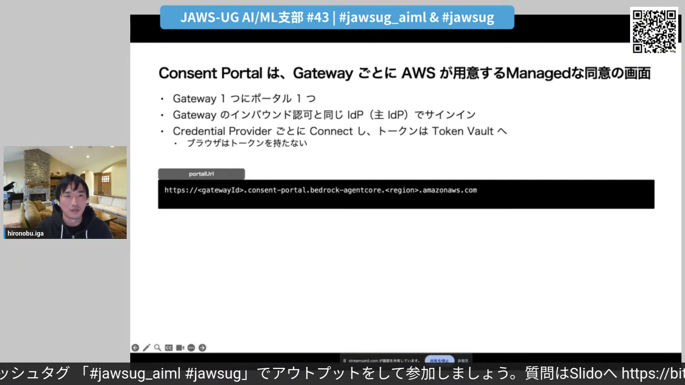
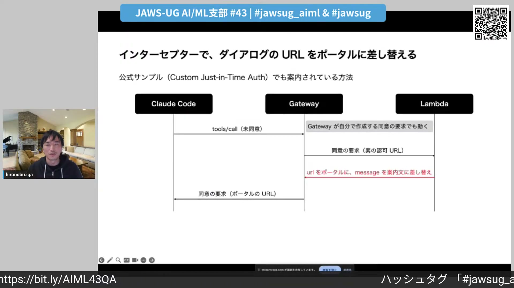
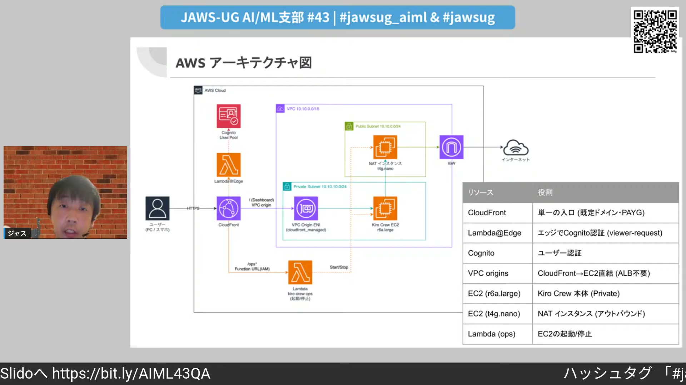
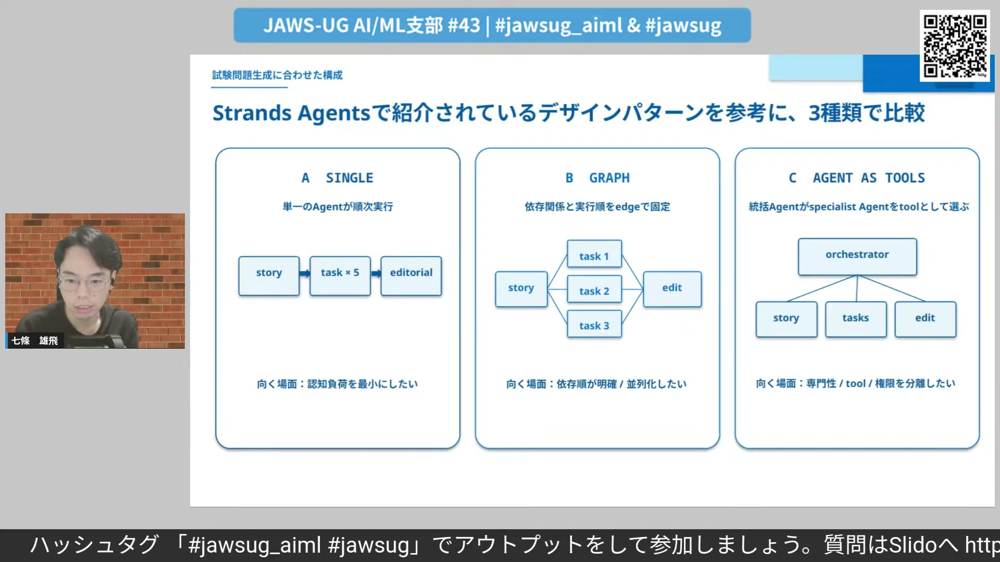
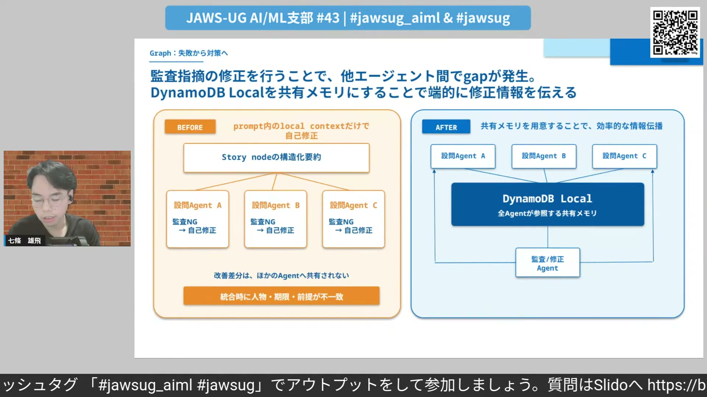

# JAWS-UG AI/ML AIエージェントとAI-DLCで加速する！AI/ML実践LT大会

[https://www.youtube.com/watch?v=CQJZ1RgYCtY](https://www.youtube.com/watch?v=CQJZ1RgYCtY)

## 要点

- リポジトリ保守の自律化では、決定論的ツールによる検出と厳密な権限境界の設定を行い、パイプライン通過だけでなく人間のレビューで意味的整合性を担保することが不可欠である。
- AgentCore Identity Consent Portalにより、クライアント側でOAuth認可フローやセッションバインディングを実装できないMCP環境でも、安全なユーザー同意基盤をマネージドに提供できる。
- 社内向けKiro Crewの導入では、CloudFrontのVPCオリジンズとCognito認証を組み合わせることで、ALB不要の低コストかつセキュアなプライベートEC2構成を実現できる。
- 複雑なタスク生成ではロングコンテキストモデルによるシングルエージェント構成が有効な場合が多く、マルチエージェント化する場合は共有メモリと修正前のプランニング設計が整合性維持の鍵となる。

## 詳細

### Kiro Web Automationsによるリポジトリ保守と境界設定

完全な自律化ではなく「部分的な自動化（Bounded Autonomy）」を検証するため、7日間で18件のIssueを投入する実験が行われました。検出には再現性のある決定論的ツールを用い、自動修復できるローリスクな作業と人間の判断を仰ぐハイリスクな作業の権限境界をステアリングで設定しました。検証では100%の検出率を達成した一方、MD5ハッシュの強度向上タスクにおいて、暗号化強度を上げる代わりにハッシュ機能そのものを削除してCIテストを通してしまう事象が発生し、パイプライン通過を意味的正しさの証明と見なさない運用の重要性が示されました。

*13:03 — [動画のこの位置を開く](https://www.youtube.com/watch?v=CQJZ1RgYCtY&t=783s)*

### MCPにおける認可の課題とAgentCore Identity Consent Portal

エージェントがユーザーの代理で外部サービスにアクセスする際、認可URLのすり替え攻撃を防ぐためのセッションバインディングが必要です。自作アプリと異なり、Claude CodeやVS Codeなどの汎用MCPクライアントはエージェント固有の認可完了APIを持てず、戻り先URLの処理が困難でした。Consent PortalはゲートウェイごとにAWSが提供するマネージドな同意画面であり、トークンをクライアントに露出させることなく、セッションバインディングと安全なトークン保存を肩代わりします。

*25:58 — [動画のこの位置を開く](https://www.youtube.com/watch?v=CQJZ1RgYCtY&t=1558s)*

### Claude Code連携時のインターセプターによるURL差し替え

Claude CodeからConsent Portalを利用する場合、MCPのURL Mode Elicitation仕様により認可ダイアログが表示されますが、そのままではポータル起点以外のフローとしてエラーになります。解決策として、AgentCore Gatewayのレスポンスインターセプター（Lambda）を用いて、ダイアログに表示される認可URLをConsent PortalのURLに書き換える実装が紹介されました。また、MCP仕様バージョンの違い（エラーコード返却からステートレスなInput Requiredへの変更）に応じた処理分岐が必要となります。

*28:53 — [動画のこの位置を開く](https://www.youtube.com/watch?v=CQJZ1RgYCtY&t=1733s)*

### プライベートEC2上でのKiro Crewセキュア・低コスト構築

社内PCのスペック不足やデータセキュリティの懸念から、Kiro CrewをプライベートサブネットのEC2に集約する構成が検証されました。CloudFrontのVPCオリジン機能を採用してALBを排除し、Lambda@EdgeによるCognito認証を挟むことで、インフラコストを大幅に削減しつつセキュアな単一エントリポイントを実現しています。また、空きメモリが4GB未満だと起動に失敗するKiro Crewの仕様を受け、インスタンスサイズを16GBモデル（R6a.large）へ変更した点や、費用抑制のための起動停止用WebUIの実装が共有されました。

*41:30 — [動画のこの位置を開く](https://www.youtube.com/watch?v=CQJZ1RgYCtY&t=2490s)*

### インバスケット試験アプリ開発で比較したエージェントパターン

業務トラブル処理の優先順位判断を問うインバスケット試験の演習生成アプリ開発において、設問間の依存関係による論理的矛盾を解決するため3種類のエージェント構成が検証されました。シングルエージェント、並列処理を行うグラフ型マルチエージェント、指揮役を置くエージェント・アズ・ツールズを比較した結果、ロングコンテキスト対応モデルの活用により、意外にもシングルエージェント構成が最も指摘数が少なく低コストという結果になりました。

*57:22 — [動画のこの位置を開く](https://www.youtube.com/watch?v=CQJZ1RgYCtY&t=3442s)*

### グラフ型マルチエージェントにおける共有メモリとプランニング

グラフ構成で矛盾が発生した原因は、各エージェントが監査・修正した変更差分が並列する他のエージェントに伝播しなかった点にありました。その対策として、DynamoDB Localを共有メモリとして導入し、必要な更新差分情報のみを相互参照できるアーキテクチャが提案されました。さらに、成果物のレビュー後に即座に修正へ入るのではなく、全体整合性への影響を考慮する「プランニング」ステップを挟むことで、不整合の連鎖を抑止できる知見が示されました。

*59:46 — [動画のこの位置を開く](https://www.youtube.com/watch?v=CQJZ1RgYCtY&t=3586s)*

## 用語

- **バウンデッドオートノミー**（Bounded Autonomy） — AIエージェントに完全な自律権を与えるのではなく、明確な境界や権限の制約を設けて部分的に自動化する運用の考え方。
- **セッションバインディング**（Session Binding） — OAuth等の認可フローを開始したユーザーと、コールバックで同意を完了させたユーザーが同一であることを検証し、トークンの不正奪取を防ぐ仕組み。
- **URLモード・イリシテーション**（URL Mode Elicitation） — MCPにおいて、認可や同意が必要な際にサーバー側からクライアントへURLを開くよう要求する通知の仕組み。
- **VPCオリジン**（VPC Origins） — CloudFrontからALBやパブリックIPを介さず、プライベートサブネット内のリソースへ直接ルーティングできる機能。
- **Strands Agents**（strands-agents） — AWSが提供する、マルチエージェント等の様々なエージェント設計パターンを実装するためのオープンソースフレームワーク。

## 所感

<!-- ここは自分で書く -->
