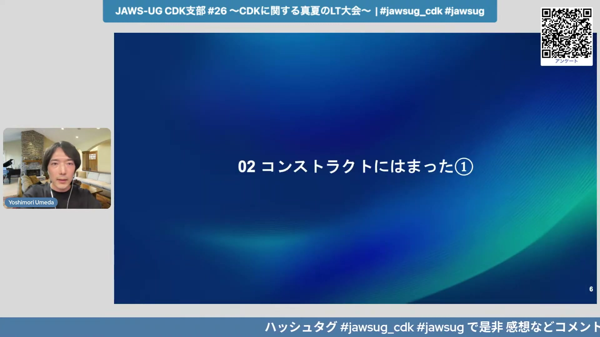
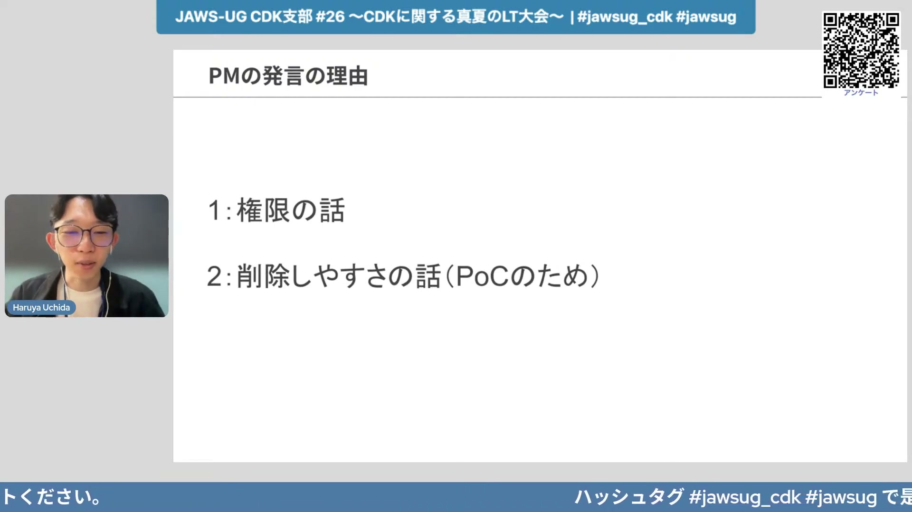
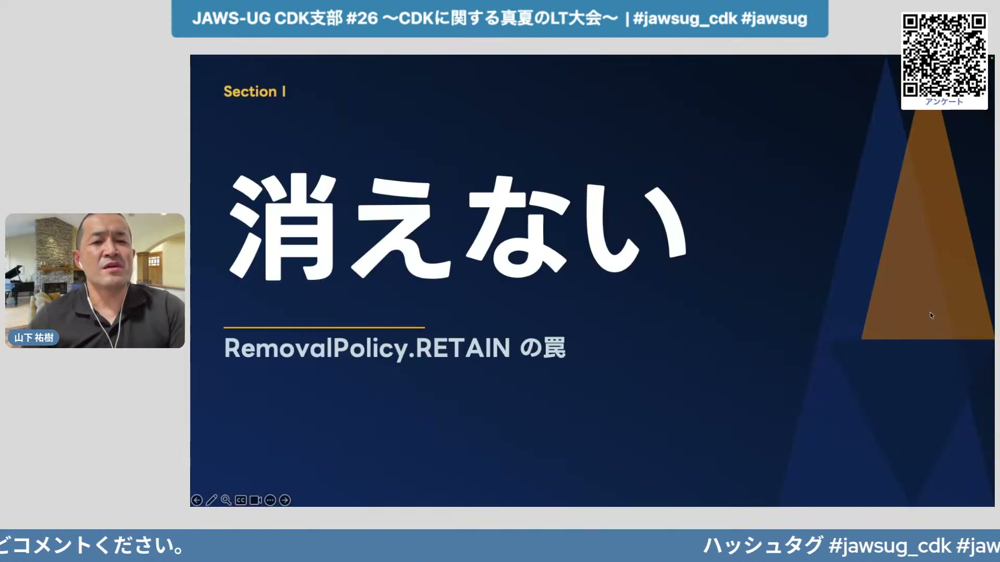
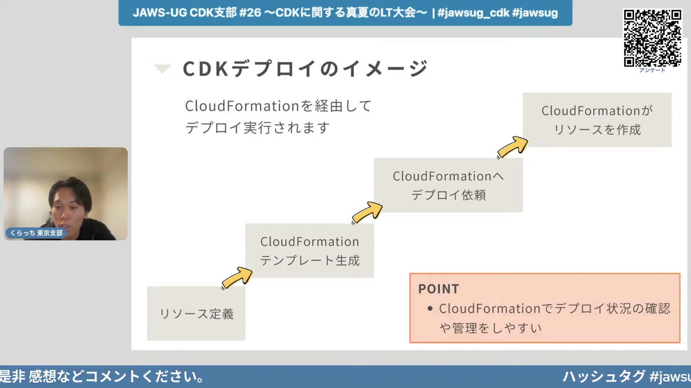
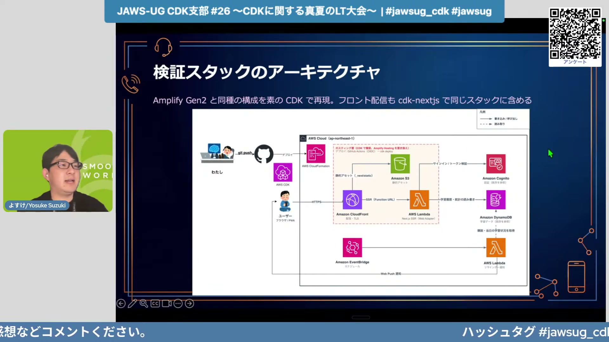

# JAWS-UG CDK支部 #26 〜CDKに関する真夏のLT大会〜

[https://www.youtube.com/watch?v=a4j5_HrZRkc](https://www.youtube.com/watch?v=a4j5_HrZRkc)

## 要点

- AWS CDKのコンストラクト（Construct）は、細かいリソース名制御や設定の柔軟性が求められる場合はL1、可読性や高水準な抽象化を活かす場合はL2と適材適所での使い分けが重要になる。
- CDKのBootstrapによる広範な管理者権限やデフォルト生成リソースの挙動を把握し、要件やPoCの規模に応じて適切なツール選定や権限設定を行う必要がある。
- 削除ポリシー（RemovalPolicy）の残留問題やCPUアーキテクチャの不一致、サーキットブレーカーの未設定など、CDK特有の実務上の落とし穴には事前対策が求められる。
- AWS CloudFormationを経由せずにSDKやCloud Control APIで直接リソースを作成する高速CLI「cdkd」を開発・テスト環境に導入することで、デプロイやビルドの待ち時間を劇的に短縮できる。

## 詳細

### L1・L2コンストラクトの特徴と使い分けの勘所

新卒エンジニアの梅田氏より、VPC構築時にサブネットの命名やCIDRの個別指定、自動作成されるルートテーブルの制御を行うため、L2からL1への切り替えを行った経験が共有された。一方でRoute 53のレコード設定のようにL1だと可読性が著しく低下するケースもあるため、エンドポイントのみL2で再記述し、既存サブネットの参照には `from` 系のAttributeメソッドを使って型を合わせるなど、ハイブリッドな使い分けが有効であると解説された。

*5:10 — [動画のこの位置を開く](https://www.youtube.com/watch?v=a4j5_HrZRkc&t=310s)*

### PoC案件におけるCDKの権限とリソース削除性の課題

学生インターンの内田氏より、生成AIエージェントのPoCでEC2を1台起動する際、PMから「CDKを使わなくていい」と判断された事例が発表された。CDKはBootstrap時に強力な管理者権限（AdministratorAccess）ロールを作成する点や、デフォルトでVPCやNAT Gatewayなど意図しない課金・削除対象リソースを多く作ってしまう性質があるため、検証目的やセキュリティ要件に応じた選定が不可欠であると学んだ経緯が語られた。

*18:15 — [動画のこの位置を開く](https://www.youtube.com/watch?v=a4j5_HrZRkc&t=1095s)*

### CDK実務での落とし穴：消えない・動かない・効かない問題

山下氏より、YouTube風アプリを構築した際に遭遇した3大トラブルが紹介された。スタック削除後もリソースが残留して再デプロイを阻む `RemovalPolicy.RETAIN`（消えない）、Mac（Apple Silicon/ARM64）とLambda/Fargate（x86_64）のアーキテクチャ不一致による `exec format error` やロールバック検知に必要なサーキットブレーカーの無効化（動かない）、CloudFront署名付きCookieでワイルドカードURL適用時にCanned Policyではなくカスタムポリシーが必要となる挙動（効かない）への対策が示された。

*28:01 — [動画のこの位置を開く](https://www.youtube.com/watch?v=a4j5_HrZRkc&t=1681s)*

### 高速デプロイツール「cdkd」の仕組みと速度計測検証

クラッチ氏より、AWS CloudFormationを経由せずAWS SDKやCloud Control APIを直接叩いてリソース作成を並列化するOSSツール「cdkd」の検証結果が発表された。ベースライン環境およびサーバーレス環境のデプロイ時間を計測したところ、通常のCDKデプロイで1〜3分程度かかっていた処理が、cdkdを用いることで20秒未満に短縮され、開発ループのイテレーション向上に極めて有効であることが実測データで示された。

*40:24 — [動画のこの位置を開く](https://www.youtube.com/watch?v=a4j5_HrZRkc&t=2424s)*

### AmplifyからCDK/cdkdへの移行によるビルド時間の劇的短縮

よし介氏より、個人開発の資格試験対策アプリ「AI模試ノート」において、AWS Amplify Hostingのビルド・キャッシュ生成にかかっていた平均7.5〜8分の時間を短縮するためにCDKおよびcdkdへ移行した事例が紹介された。S3・CloudFront・Lambda Web Adapter構成にリアーキテクトし、デプロイにcdkdを導入した結果、ビルド・デプロイ時間が約2分（約4倍高速化）となり、ビルド課金コストの削減と開発サイクルの加速が実現できたと報告された。

*57:21 — [動画のこの位置を開く](https://www.youtube.com/watch?v=a4j5_HrZRkc&t=3441s)*

## 用語

- **コンストラクト**（Construct） — AWS CDKにおける構成要素の最小単位。CloudFormationリソースと1対1で対応するL1（CFN Resource）、デフォルト値やベストプラクティスが組み込まれたL2、複数リソースを組み合わせた高水準パターンのL3などの階層がある。
- **cdkd**（cdkd） — AWS CDKのスタック定義を解析し、CloudFormationテンプレートを介さずにAWS SDKやCloud Control APIを用いて直接リソースを作成・デプロイする高速なオープンソースCLIツール。
- **サーキットブレーカー**（Circuit Breaker） — ECSなどのデプロイ失敗時に自動でロールバックを行い、スタックのデプロイが長時間ループやハングアップ状態に陥るのを防ぐ仕組み。
- **リムーバルポリシー**（RemovalPolicy） — CDKスタック削除時に、管理対象リソース（S3バケットやDynamoDBテーブルなど）を一緒に削除（DESTROY）するか、データを保護して残す（RETAIN）かを制御する設定。

## 所感

<!-- ここは自分で書く -->
