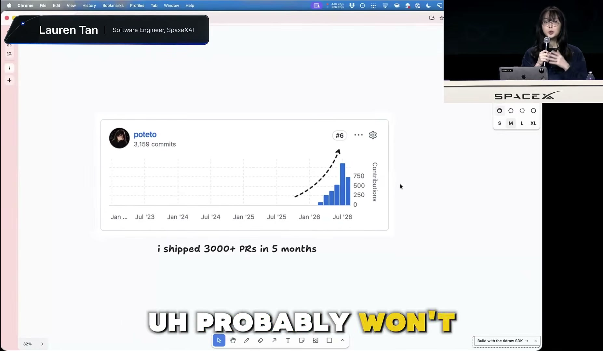
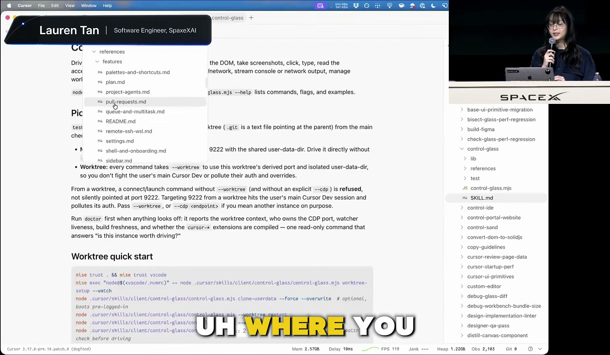
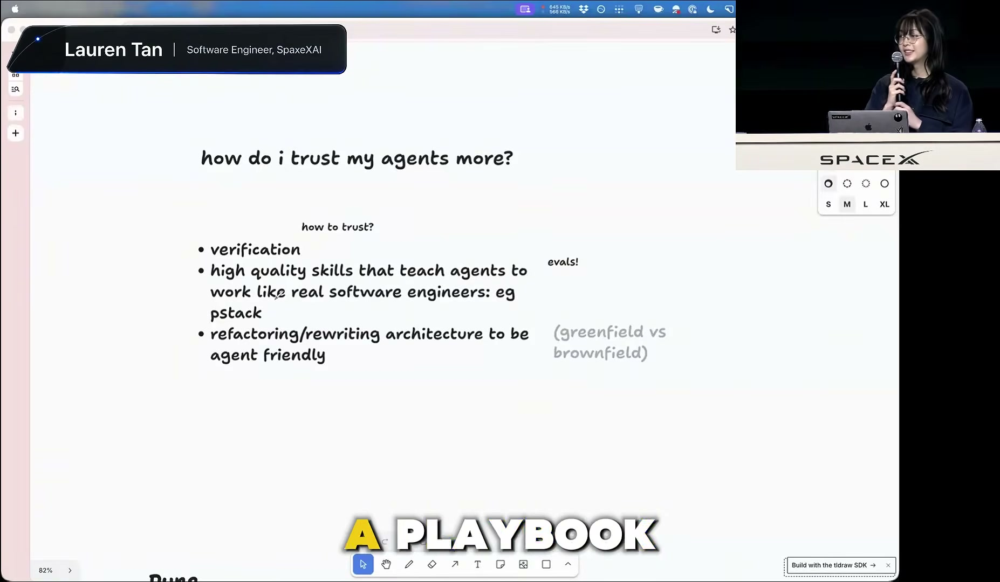
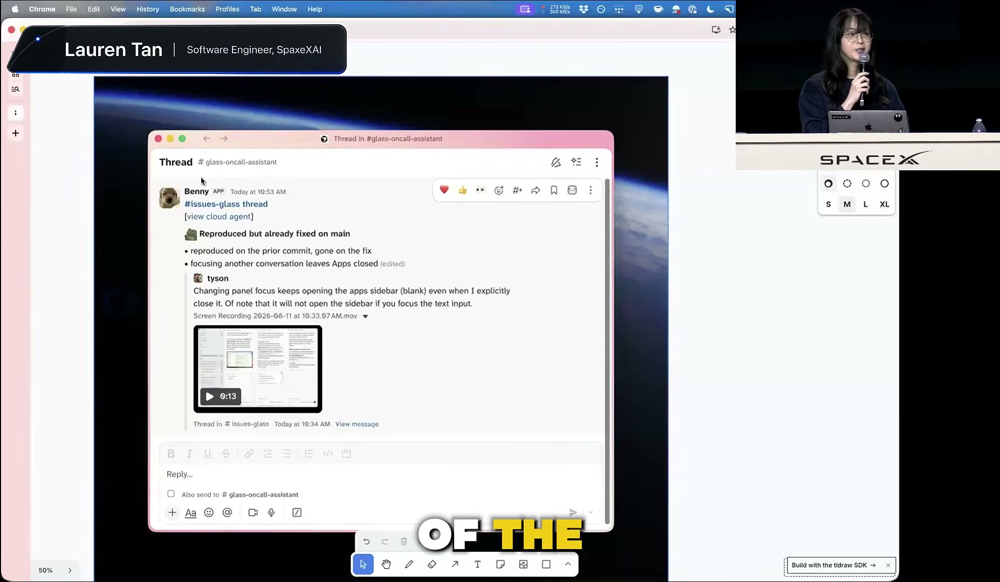
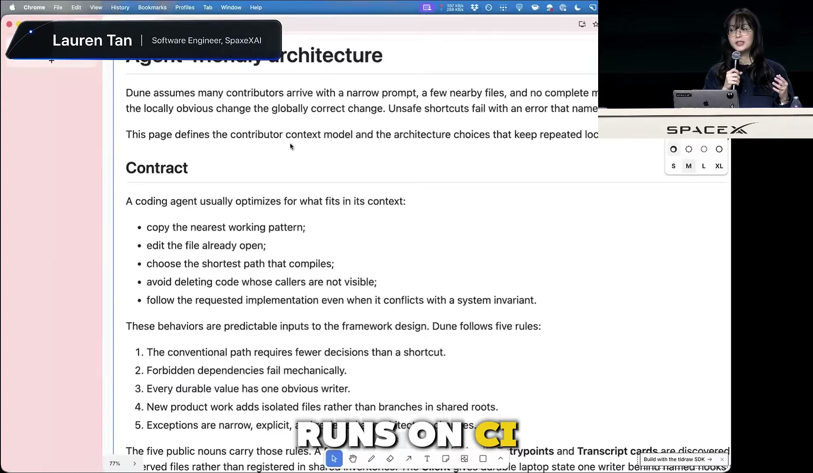
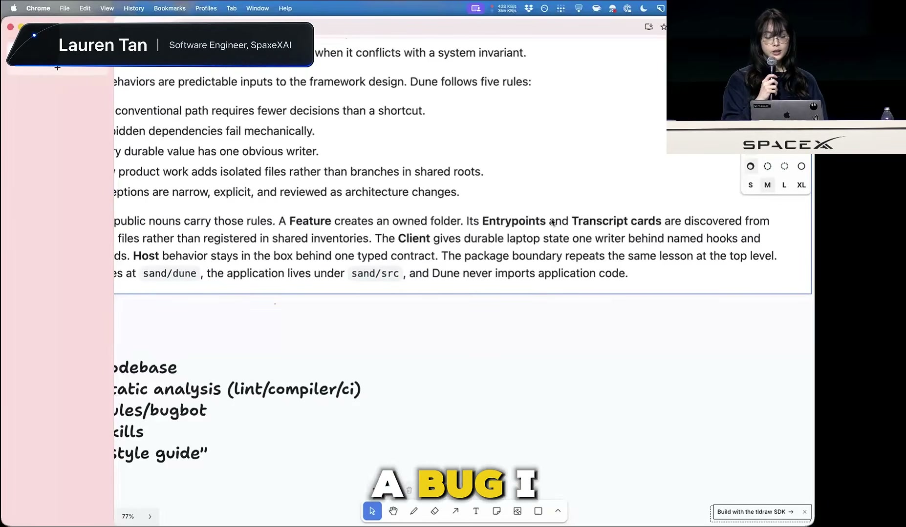

# Lauren Tan - SpaceXAI engineer

[https://www.youtube.com/watch?v=EWSUvEyFwjc](https://www.youtube.com/watch?v=EWSUvEyFwjc)

## 要点

- AIエージェントへの依存を深めて自律性を高めるには、エージェント自身がコードを実行して動作を確かめる「検証（Verification）」能力の付与が不可欠である。
- UIや機能の構造を整理した「機能マップ（Feature Map）」や、スキルの品質をユニットテストのように測る「評価テスト（Eval）」によってエージェントの迷いやハルシネーションを防ぐ。
- 指示やガイドラインといったソフトなルールではなく、CIや静的解析による「ハードな制約」をコードベースに課すことで、エージェントが安全にコードを書ける環境を構築する。
- 強固な検証ループと厳格なアーキテクチャが整えば、ローカルでの並列作業からクラウドエージェントによる自動検証・自動マージへスケールでき、非エンジニアの機能実装も可能になる。

## 詳細

### エージェントへの信頼度とマイクロマネジメントの課題

エンジニアがエージェントの出力を信用できない場合、すべてのコードや出力を人間が細かく監視するマイクロマネジメント状態に陥り、並列化が進みません。登壇者は信頼度と生産性の関係を示すチャートを提示し、初期は1〜2体のエージェントを手動で監視していた状態から、検証と制約の仕組みを整えることでPRの自動マージを行う段階まで信頼曲線を登った過程を説明しています。

*4:39 — [動画のこの位置を開く](https://www.youtube.com/watch?v=EWSUvEyFwjc&t=279s)*

### 検証スキルと機能マップ（Feature Map）の導入

エージェントが正しいコードを書くための最も重要なスキルは、実際にアプリを起動し、トレース取得や画面操作を行う「検証（Verification）」です。Cursorの「Control Glass」スキルでは、Chrome DevTools Protocol（CDP）などを介してUIを操作させつつ、「機能マップ」という定義ファイルを持たせることで、エージェントが迷わずに特定の機能やDOM要素へ到達できるようにしています。

*10:18 — [動画のこの位置を開く](https://www.youtube.com/watch?v=EWSUvEyFwjc&t=618s)*

### Eval（評価テスト）によるスキルのメンテナンスと最適化

製品の変更に伴ってスキルを維持するため、登壇者はエージェント向けのユニットテストである「Eval（評価テスト）」を活用しています。Pstackに含まれる「Eval Playbook」では、判定用の別モデルを配置してバイアスを防ぎつつ、スコアが満点になるまでCursorのループ機能でプロンプトや実装を反復改善（Hill Climbing）させています。

*18:45 — [動画のこの位置を開く](https://www.youtube.com/watch?v=EWSUvEyFwjc&t=1125s)*

### ローカル検証からクラウドエージェントへの拡張

検証スキルはローカル環境で動作を確認してから、クラウドエージェントへと展開します。登壇者のチームでは「Benny」というクラウドエージェントが不具合報告を受け取り、クラウド上の仮想環境でCursorを起動してバグの再現を自動で試行し、mainブランチで修正済みかどうかの確認までを自律的に行っています。

*25:28 — [動画のこの位置を開く](https://www.youtube.com/watch?v=EWSUvEyFwjc&t=1528s)*

### アーキテクチャ「Dune」とCIによるハードな制約

エージェントが最も手軽なショートカットを選んでコードベースを破綻させるのを防ぐため、GrokBotでは「Dune」と呼ばれる厳格な設計を採用しています。プロセスの完全分離やディレクトリ単位での機能カプセル化に加え、CIで`useEffect`やコードコメントの使用、不正な依存関係のインポートを機械的に禁止し、エージェントが雑なコードを書けないようにしています。

*42:04 — [動画のこの位置を開く](https://www.youtube.com/watch?v=EWSUvEyFwjc&t=2524s)*

### 厳格な制約がもたらす開発速度と非エンジニアへの波及

トークン消費や初期のリファクタリング投資は大きいものの、環境側で失敗を塞ぐ設計にすることで、モデルの賢さに依存せず安全な実装が可能になります。その結果、エンジニアだけでなくプロダクトマネージャーやデザイナーも直接バグ修正や機能実装のPRを作成・反映できるようになり、組織全体の開発速度が向上しています。

*54:19 — [動画のこの位置を開く](https://www.youtube.com/watch?v=EWSUvEyFwjc&t=3259s)*

## 用語

- **検証スキル**（Verification skill） — エージェントが自らコードを実行し、プロファイリングトレースやスナップショットの取得、シミュレータ操作などを通じて正しく動作しているか確認する能力のこと。
- **機能マップ**（Feature Map） — アプリケーションのUI構造、操作手順、ショートカット、セレクタ属性などをまとめたファイル。エージェントが機能の場所や到達方法を把握するために参照する。
- **評価テスト**（Eval） — AIエージェントやスキルの動作が期待通りかを自動検証するテスト。複数のサブエージェントにタスクを実行させ、別モデルの判定エージェントなどで採点を行う。
- **Chrome DevTools プロトコル**（Chrome DevTools Protocol (CDP)） — Chromium系ブラウザやElectronアプリの内部状態の検査、プロファイリング、DOM操作などを外部ツールからプログラム経由で行うための通信規約。
- **バイブコーディング**（Vibe coding） — 人間が詳細なコードを読んだり設計を詰めたりせず、AIへの指示とノリ（雰囲気）で手早くプロトタイプなどを書き進める開発手法。

## 所感

<!-- ここは自分で書く -->
