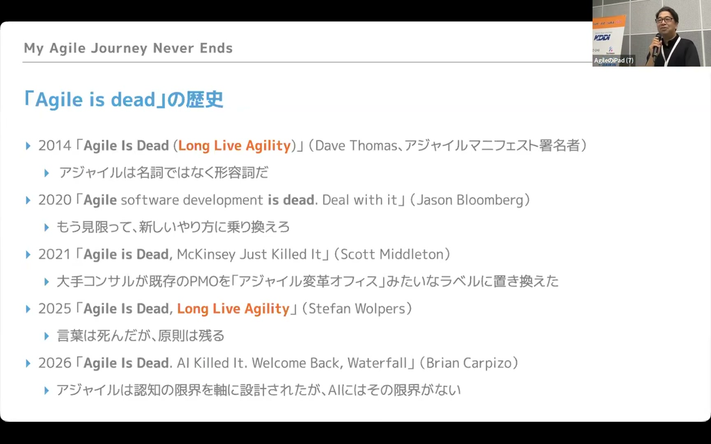
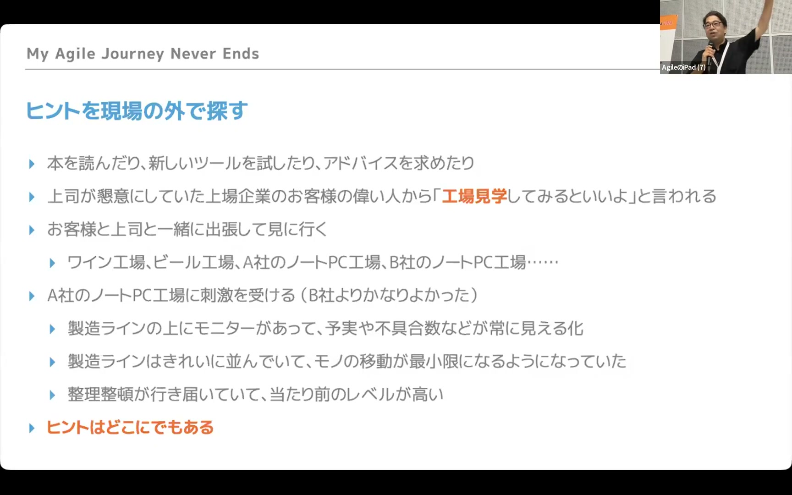
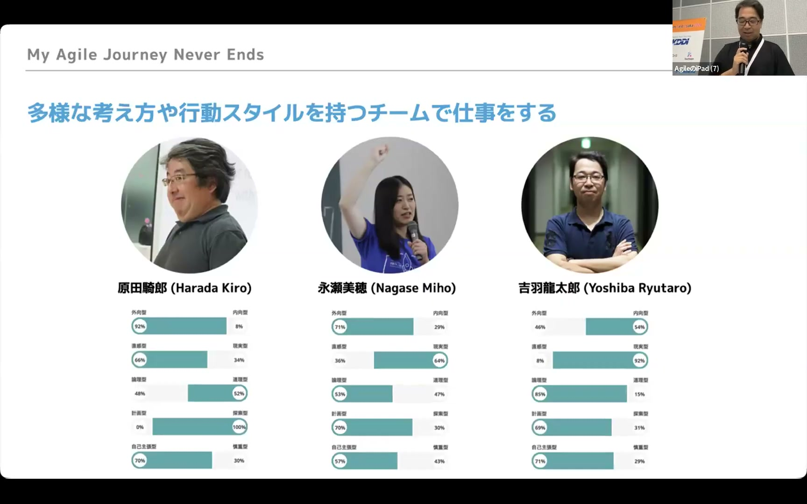

# My Agile Journey Never Ends

[https://www.youtube.com/watch?v=nKNIRIVVHh4](https://www.youtube.com/watch?v=nKNIRIVVHh4)

## 要点

- 「アジャイルは死んだ（Agile is dead）」という言説は過去に何度も繰り返されてきたが、淘汰されるのは一時的な名前や商売であり、原則や考え方は形を変えて生き残る。
- 受託開発現場での疲弊と失敗を機に訪れた工場見学やXPの実践から、「品質は工程で作り込む」「当たり前を整える」「実物から素早く学ぶ」ことの大切さを体得した。
- コミュニティ活動での徹底的なギブや現場訪問、AWSへの転職などを通じて、多様な仲間と小さく意思決定を繰り返しながら学び続ける重要性を実感してきた。
- 生成AIの時代にゼロクリアされるのは手法やツールのソリューション側であり、人間を中心に据えて「もっと良い方法はないか」と問い探し続ける姿勢そのものがアジャイルである。

## 詳細

### 「アジャイルは死んだ」と言われ続ける歴史と成熟

2014年にアジャイル宣言署名者のデイブ・トーマス（Dave Thomas）氏が発言して以来、「Agile is dead」という言説は定期的に繰り返されている。バズワードとしての名前や関連する商売、特定のプラクティスは時代とともに廃れるが、原則自体は形を変えて生き残り続ける。流行がパロディ化されたりオワコンと言われたりすること自体が、その分野が成熟した証拠でもある。

*5:01 — [動画のこの位置を開く](https://www.youtube.com/watch?v=nKNIRIVVHh4&t=301s)*

### 受託開発での挫折と「健康第一」の学び

競馬予想ソフトを作りたいという動機からエンジニアになりSIerに入社したものの、1年目の冬に十二指腸潰瘍と胃潰瘍で吐血し、健康はお金では買えないことを痛感した。その後の受託開発現場でも、納期遅れや品質問題、朝一番の謝罪、夜間バッチ障害のコール対応などに追われ、メンバー全員が疲弊する過酷な状況を経験した。人間は交換可能なリソースではなく、1人1システム体制やストレスのない休息の欠如は破綻を招くと学んだ。

### 工場見学からの持ち帰り：品質は工程で作り込む

現場を何でもいいから変えようという上司の言葉をきっかけに、顧客の役員とともにノートPCなどの工場見学へ赴いた。そこで目にしたのは、計画と実績・不良数・予測残業時間が一目でわかるモニター表示や、徹底された5S、さらには肩叩き機を転用して振動試験を行う現場の工夫だった。ここから「品質は工程で作り込む」「不良品を後工程に流さない」「見える化と改善」の重要性を持ち帰った。

*22:08 — [動画のこの位置を開く](https://www.youtube.com/watch?v=nKNIRIVVHh4&t=1328s)*

### 当たり前の復旧とXPによる成功体験

現場に戻った後は、共有フォルダ運用だったコードのバージョン管理や、Tracによるタスクの見える化といった「当たり前」の環境整備から着手した。さらに、要件定義がPowerPointのモック作成で停滞していた大規模案件に対し、エクストリーム・プログラミング（Extreme Programming: XP）の手法を取り入れて週1回実物を見せる形に刷新した。その結果、リリース当日には顧客が夏休みを取れるほどの信頼関係と品質を実現できた。

### コミュニティでの徹底的な「ギブ」と仲間との出会い

自社の外のやり方を知るため、30代半ばからツールやスクラムのコミュニティに参加し始めた。Regional Scrum Gathering Tokyo（RSGT）の立ち上げでは、チケット未達時の赤字補填を実行委員が覚悟して進めるなど深くコミットした。元上司の「見返りを期待せずギブしまくれ（Give and Give）」という教えを実践し、現場訪問などを通じて原田騎郎氏や永瀬美穂氏といった多様な仲間と巡り合った。

### AWSへの転職と「You build it, you run it」

外資系への不安から迷いながらも、「多くの意思決定はやり直せる」「決めないことが最大の問題」と考え、AWSの日本法人におけるプロフェッショナルサービス（コンサル部門）1人目として入社した。ゼロから案件を立ち上げる中でアジャイルな試行錯誤や注力領域のフォーカスを実践した。また、Amazon CTOの言葉である「You build it, you run it（自分たちで作って、自分たちで運用する）」に触れ、他人の作ったものを謝りながら運用していた過去の課題が腑に落ちた。

### アトラクタ設立と性格が真逆なチームの力

フリーランスを経て原田氏・永瀬氏と株式会社アトラクタを設立した。性格診断では自身と原田氏の特性がインとヤンのように真逆だったが、同質性の高いチームよりも多様性のあるチームのほうが弱みを補い合い、変化に強いことを実感した。また、チーム単体のアジャイル導入だけでは立ち行かず、プロダクトマネジメントや組織構造（チームトポロジーなど）へと関心が広がっていった。

*46:48 — [動画のこの位置を開く](https://www.youtube.com/watch?v=nKNIRIVVHh4&t=2808s)*

### 生成AI時代におけるアジャイルの本質

生成AIによって従来の分業前提のやり方や知識・ソリューションはゼロクリアされ、アジャイルコーチやスクラムマスターの役割も変化を迫られている。しかし、不確実な状況で人間を中心に据え、実物から素早く学びながら「もっと良いやり方はないか」と問い続ける姿勢自体は変わらない。答えやフレームワークが死んだとしても、より良い方法を探求し続ける限りアジャイルの旅が終わることはない。

## 用語

- **5S**（5S） — 製造業などの職場環境維持・改善スローガンである「整理・整頓・清掃・清潔・躾（しつけ）」の頭文字を取ったもの。
- **エクストリーム・プログラミング**（Extreme Programming） — ソフトウェア開発におけるアジャイル開発手法の1つ。実動するソフトウェアを頻繁に提供し、テスト駆動開発やペアプログラミングなどを通じて変化に柔軟に対応する。
- **You build it, you run it**（You build it, you run it） — AmazonのCTOである Werner Vogels 氏が提唱した、ソフトウェアを開発したチーム自身がその運用・保守まで責任を持つというDevOpsの思想を表す言葉。

## 所感

<!-- ここは自分で書く -->
