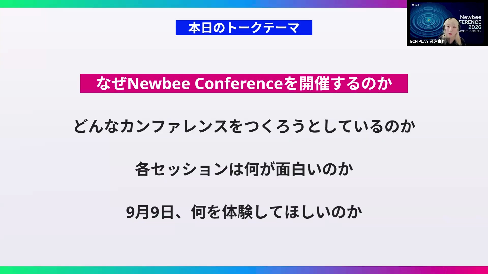
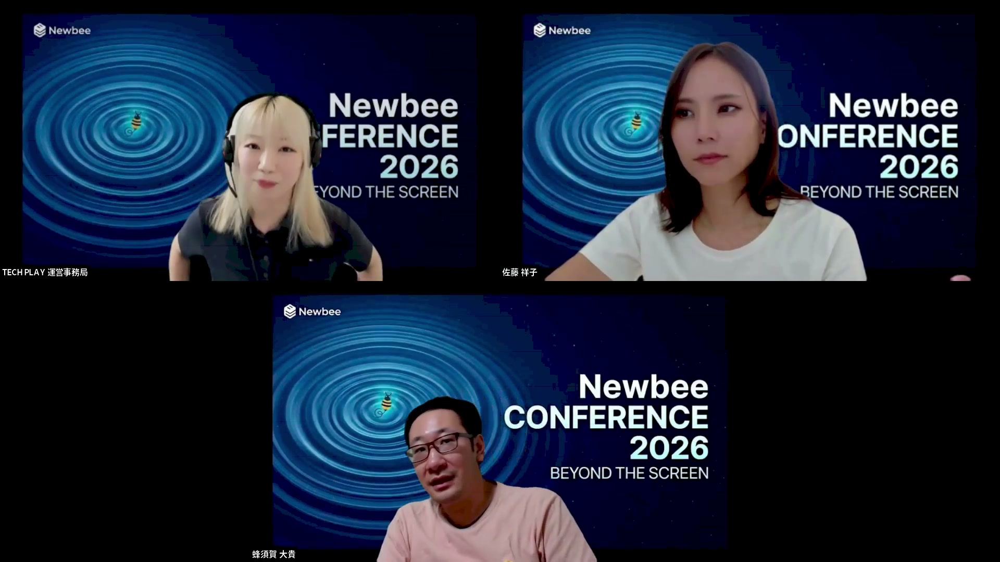
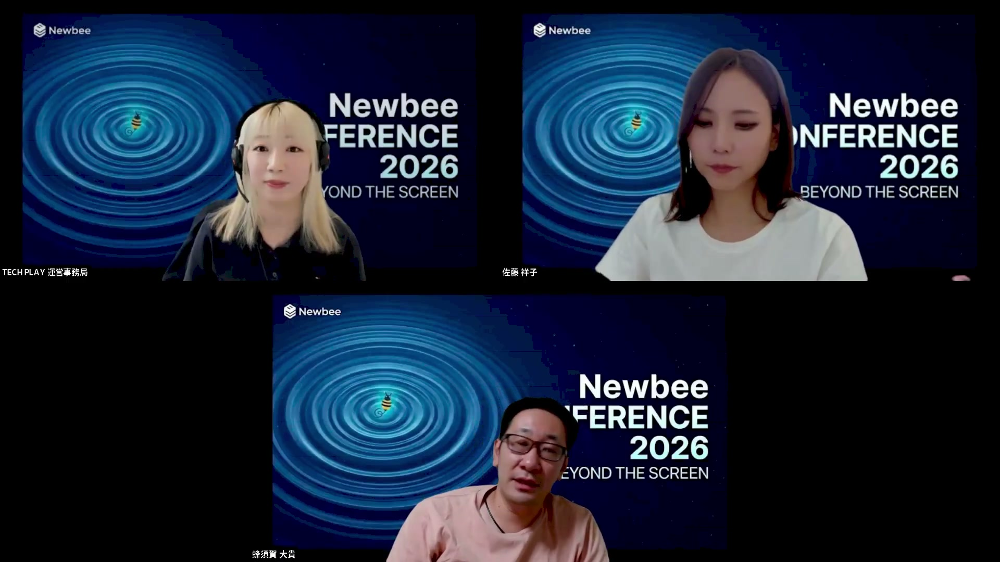
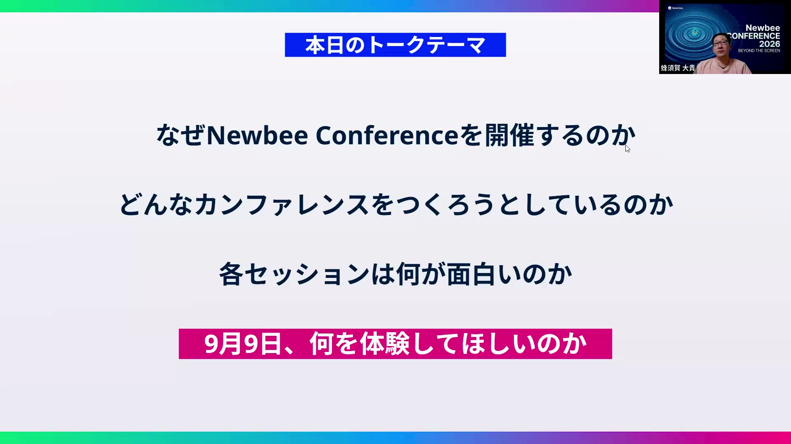

# Newbee Conference 2026 開催直前！テクノロジー×ビジネスの最前線が集うライブカンファレンスを見逃せない理由

[https://www.youtube.com/watch?v=wUd7GwzkE90](https://www.youtube.com/watch?v=wUd7GwzkE90)

## 要点

- Newbee初のオフラインカンファレンス「Newbee Conference 2026: Beyond the Screen」は、画面越しの情報収集を超えて参加者が議論し知見を血肉にできる場を目指している。
- 全セッションが基調講演レベルのパネルディスカッションで構成され、セッション時間の4〜5割をその場でのQ&Aに充てるライブ重視の進行になっている。
- スポンサーセッションを一切設けず、常設のディスカッションスペースや1枚購入でもう1枚無料になるペアチケット施策など、参加者同士や登壇者との対話を促す体験設計が徹底されている。

## 詳細

### 初開催の背景と「Beyond the Screen」の意図

テクノロジー業界における情報格差を埋めるためメディア活動を続けてきた中で、初めて熱量を肌で感じられる場を提供したいという思いからオフラインカンファレンスが企画されました。テキストや動画を消費するだけでなく、映画を見た後にカフェで感想戦をするように、同じ場を共有して対話することで知見を自分の血肉にしてもらう狙いがあります。

*5:10 — [動画のこの位置を開く](https://www.youtube.com/watch?v=wUd7GwzkE90&t=310s)*

### 基調講演級の組み合わせとライブQ&A重視のセッション構成

登壇者はそれぞれ単独で基調講演ができる実績を持つリーダーたちですが、あえて初対面や久しぶりの組み合わせによるパネルディスカッション形式が採用されています。各セッション（50分間）の後半15〜20分は会場からのリアルタイムな質問をもとに議論を展開する構成になっており、予定調和ではない生きた対話を生み出します。

*10:07 — [動画のこの位置を開く](https://www.youtube.com/watch?v=wUd7GwzkE90&t=607s)*

### 各セッションの注目テーマと議論の切り口

及川卓也氏と馬瓜エブリン氏による異分野の共通点を探る対談、広木大地氏と宮田善孝氏によるSaaS is DeadやFDEの本質論、藤倉成太氏と山崎祐治氏による人とAIへの投資バランスや組織戦略など、多角的なテーマが用意されています。さらに、宇野雄氏と土屋尚史氏によるAI時代のデザイナーの役割論や、若手エンジニアの本音に迫るミニセッションなど、現場から経営層まで響く議論が予定されています。

*16:38 — [動画のこの位置を開く](https://www.youtube.com/watch?v=wUd7GwzkE90&t=998s)*

### 参加者体験を最大化する会場設計とペアチケット施策

参加者体験を損なわないようスポンサーセッションを全廃し、実用的なノベルティや展示ブースを用意しています。会場の渋谷ストリームホール5階には常時ディスカッションやAsk the Speakerができるスペースを設置し、1人参加で孤立しないよう「1枚購入でもう1枚無料」となるチケット施策で同僚や友人と感想戦ができる仕掛けが施されています。

*40:23 — [動画のこの位置を開く](https://www.youtube.com/watch?v=wUd7GwzkE90&t=2423s)*

## 用語

- **FDE**（Forward Deployed Engineer） — 顧客の現場に深く入り込み、直接ビジネス課題の解決やシステム導入・開発を推進するエンジニア職種。
- **ハーネス**（Harness） — 開発やデザインにおいて、一定の品質やルールを保ちながら安全かつ効率的に作業を進めるための枠組みや制約の仕組み。
- **トークンマネージメント**（Token Management） — 生成AIの利用において、入出力されるトークン量やコスト、リソース配分を組織的に管理・最適化すること。

## 所感

<!-- ここは自分で書く -->
