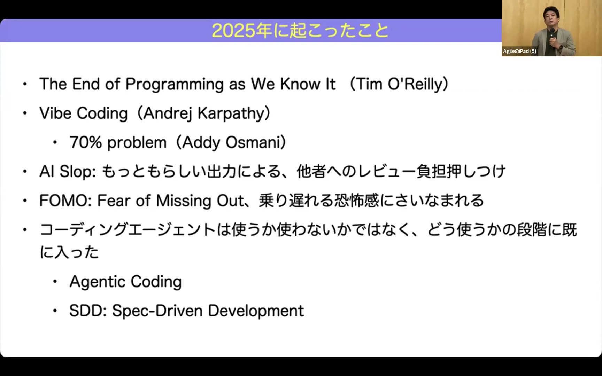
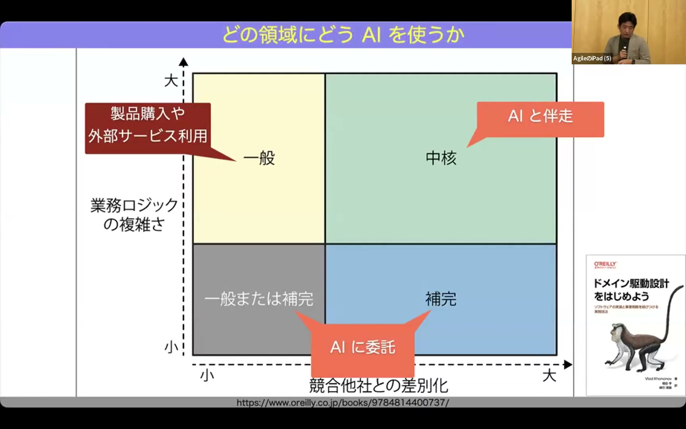
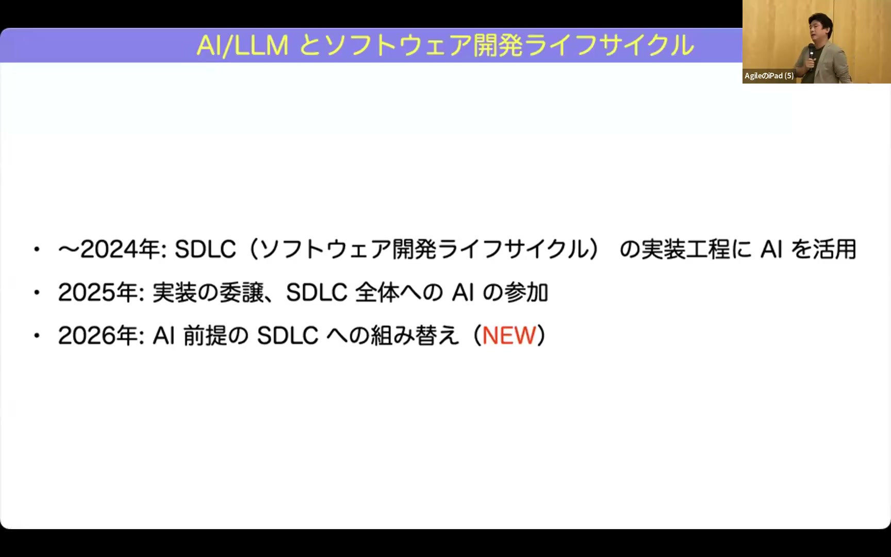
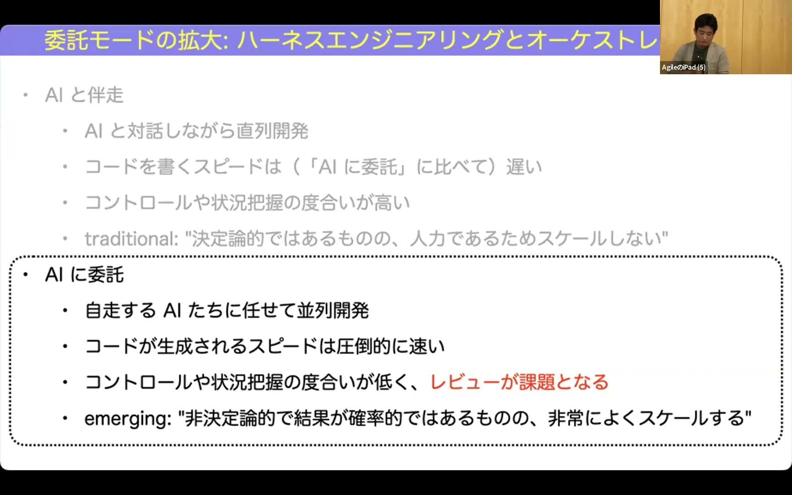
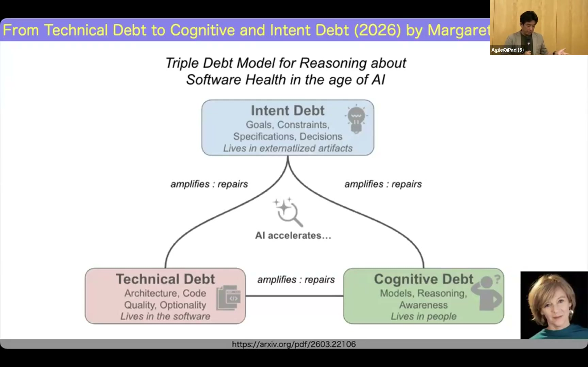

# Takuto WADA - 2026年のソフトウェアエンジニアリングを考える

[https://www.youtube.com/watch?v=PsnE-nA6Cyk](https://www.youtube.com/watch?v=PsnE-nA6Cyk)

## 要点

- 2025年に広がったバイブコーディングから、仕様駆動開発（SDD）やエージェンティックコーディングといったAIを従来の工学的手法に組み込む開発へとシフトしている。
- AIとの協業形態には人間がコントロールを保つ「伴走」と自律・並列で進める「委託」があり、ドメインの重要度や複雑さに応じて使い分ける必要がある。
- 委託モードによる大規模並列開発を進めるにあたり、ボトルネックとなるコードレビューを上流の仕様レビューやTDD、静的制約へと解体・再配置する試みが進んでいる。
- コード生成速度に人間の理解が追いつかないことで生じる「認知負債（Cognitive Debt）」が深刻化しており、思考は委託できても理解は委託できないという本質的な課題に直面している。

## 詳細

### 2025年の振り返り：バイブコーディングの熱狂から工学的な活用へ

2025年はティム・オライリー（Tim O'Reilly）氏による「我々の知るプログラミングの終焉」の提唱や、アンドレイ・カルパシー（Andrej Karpathy）氏のバイブコーディング（Vibe Coding）の流行により開発の常識が一変しました。しかし、7割程度まで動くものができても実用レベルの100%に達するのが困難な「70%問題」や、もっともらしい粗悪なコード・文章が生成されてレビュー負荷が跳ね上がる「AIスロップ（AI Slop）」などの歪みも顕在化しました。その結果、感覚的な開発から仕様駆動開発（SDD: Spec-Driven Development）やエージェンティックコーディング（Agentic Coding）へと、AIをソフトウェア開発ライフサイクルに組み込む動きが進みました。

*5:43 — [動画のこの位置を開く](https://www.youtube.com/watch?v=PsnE-nA6Cyk&t=343s)*

### AI協業の2つの形態「伴走」と「委託」、ドメイン戦略

AIとの協業は、対話的にマイクロマネジメントしながら進める決定論的な「伴走（トラディショナルアプローチ）」と、並列・非同期で自律的にコードを生成させる確率的な「委託（エマージングアプローチ）」の2種類に大別されます。ドメイン駆動設計（DDD: Domain-Driven Design）の観点を適用すると、業務ロジックが複雑で差別化の源泉となる中核（コアドメイン）にはコントロールを維持できる「伴走」が適しています。一方で、定石通りに作れる複雑度の低い保管・一般領域には「委託」を進め、差別化にならない領域はSaaS等の外部調達に任せる戦略が有効です。

*17:07 — [動画のこの位置を開く](https://www.youtube.com/watch?v=PsnE-nA6Cyk&t=1027s)*

### AI前提のライフサイクルへの移行とハーネスエンジニアリング

開発工程におけるAIの関与は、部分的なコード補完からライフサイクル全体への参加、さらには「AIが回すサイクルに人間が介入する」形への逆転が模索されています。技術トレンドもプロンプトエンジニアリングから、ロボット掃除機のために部屋を片付けるようにコンテキストを整える「コンテクストエンジニアリング（Context Engineering）」を経て、人間の介入を減らし自律的に開発をスケールさせる「ハーネスエンジニアリング（Harness Engineering）」へと移りつつあります。しかし、この言葉もAIベンダーや利用者ごとの解釈の違いにより意味の希薄化（Semantic Diffusion）が急速に進んでいます。

*31:55 — [動画のこの位置を開く](https://www.youtube.com/watch?v=PsnE-nA6Cyk&t=1915s)*

### スケールを阻む「コードレビュー」の解体と5つの再配置先

自律的な委託開発をスケールさせようとする際、最大のボトルネックとなるのが人間のコードレビューです。コードレビューをそのまま廃止すると品質が崩壊するため、その役割を5つの領域に解体・再配置する議論が進んでいます。具体的には「上流の厳密な仕様レビュー」「第1級の成果物としてのテストコード（TDD）」「静的検査や型システムによるガードレール」「ビジネスリスクに基づくレビュー密度の濃淡設定」、そしてレビューが担っていた知識伝達や文化形成を補うための「モブワークやペアプロといった人間側のチーム化」です。

*43:38 — [動画のこの位置を開く](https://www.youtube.com/watch?v=PsnE-nA6Cyk&t=2618s)*

### 新たな負債：コード生成が理解を追い越す「認知負債」

エージェントの進化により露骨に質の悪いコードは減った一方、人間の理解を大幅に超える速度でコードが生成されることで「認知負債（Cognitive Debt / Comprehension Debt）」が生じています。ピーター・ナウア（Peter Naur）氏が『プログラミングとは理論の構築である』で述べた通り、プログラミングの本質はコードそのものではなく開発者の頭の中のメンタルモデル構築にあります。かつての技術的負債は「人間の理解にコードが追いつかない」状態でしたが、現在は「コード生成に人間の理解が追いつかない」逆転現象が起きており、思考はAIに委託できてもシステムの理解そのものを外部委託することはできません。

*1:04:10 — [動画のこの位置を開く](https://www.youtube.com/watch?v=PsnE-nA6Cyk&t=3850s)*

## 用語

- **バイブコーディング**（Vibe Coding） — 詳細なコード設計を人間が行うのではなく、自然言語の指示や雰囲気、ノリ（バイブス）でAIにソフトウェアを作成させる開発手法。
- **エージェンティックコーディング**（Agentic Coding） — 単なるコード生成にとどまらず、AIエージェントが要件定義、タスク分割、テスト実行といった開発ライフサイクルの一連の工程を自律的に担う手法。
- **コンテクストエンジニアリング**（Context Engineering） — AIエージェントが適切な出力を生成できるよう、プロジェクト内のドキュメントや関連情報を整理整頓して適切な文脈をキュレーションする技術。
- **ハーネスエンジニアリング**（Harness Engineering） — 人間の直接的な介入を減らし、AIエージェントが安全かつ自律的・並列的にソフトウェア開発を推進できるように周辺環境や制約を設計・整備する取り組み。
- **認知負債**（Cognitive Debt） — AIによりコードが大量かつ高速に生成される一方で、開発者の頭の中にシステムの構造や設計意図に関する理解（メンタルモデル）が形成されないまま乖離が広がる状態。

## 所感

<!-- ここは自分で書く -->
