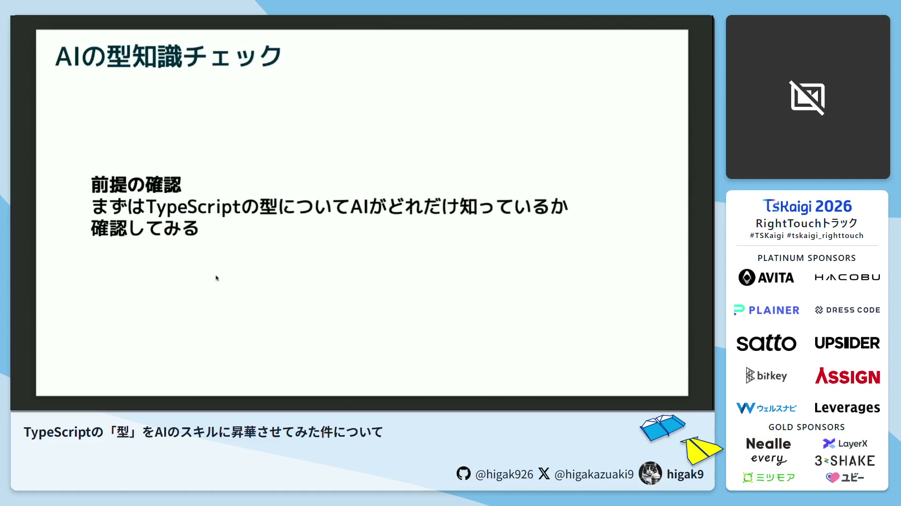
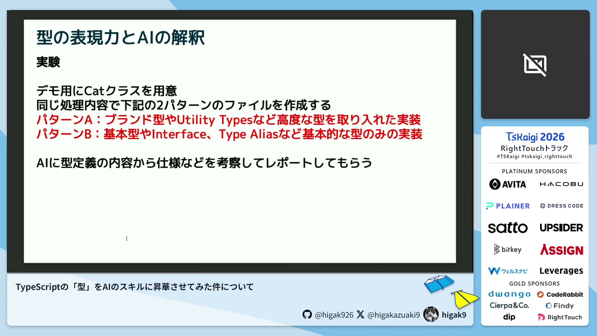
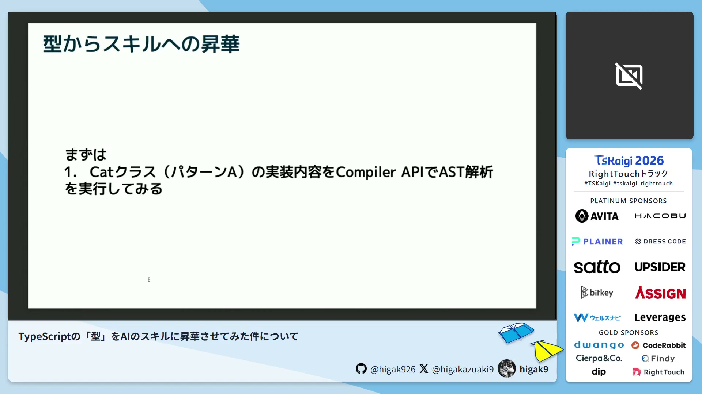
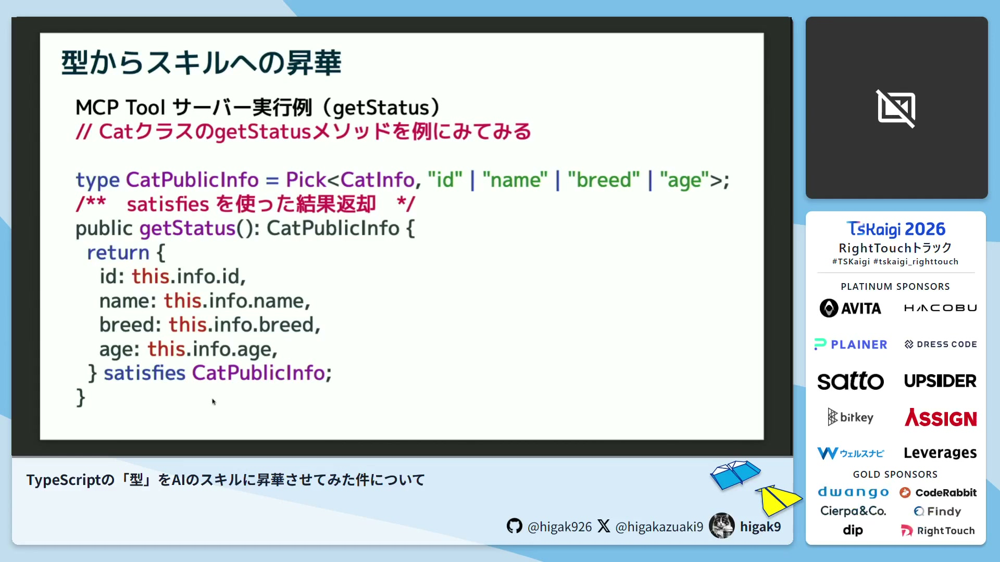

# TypeScriptの「型」をAIのスキルに昇華させてみた件について / higak9 - TSKaigi 2026

[https://www.youtube.com/watch?v=K-vCi9Y7pJU](https://www.youtube.com/watch?v=K-vCi9Y7pJU)

## 要点

- AIはTypeScriptの基本型からBranded Types、さらには型システムと集合論の学術的な関係性に至るまで、極めて高い知識を有している。
- Branded TypesやDiscriminated Unionなどの高度な型表現を用いたコードは、AIに対する強力な指示書（メタデータ）となり、仕様解釈やリスク分析の精度を大幅に向上させる。
- TypeScriptのCompiler APIを用いてAST（抽象構文木）を解析することで、実装コードからAIのスキル定義となるJSON Schemaや、MCPツールサーバーのコードを自動生成できる。
- satisfies等の型安全な仕組みを組み合わせることで、型変更に起因するコンパイルエラーをAI自身が自動検知してコードを修正するという、自走型開発の基盤を構築可能にする。

## 詳細

### AIが備えるTypeScriptの型システムに関する知識

AIは、numberやstringといった基本型だけでなく、Generics（ジェネリクス）、Mapped Types（マップ型）、Conditional Types（条件型）、Branded Types（ブランド型）などの高度な機能を備えています。さらに、型システムが集合論（Unionは和集合、Neverは空集合など）に立脚していることや、リスコフの置換原則、共変性・反変性といった概念についても、正確な知識をローカル環境の段階で備えていることが確認できます。

*3:42 — [動画のこの位置を開く](https://www.youtube.com/watch?v=K-vCi9Y7pJU&t=222s)*

### 型の表現方法がAIのソースコード解釈に与える影響

any（エニー）や安易な型アサーション（Type Assertion）を排し、Discriminated Union（判別可能なユニオン）やBranded Types、satisfies（サティスファイズ）による厳密な型制約を設けることで、AIのコード理解力は向上します。検証実験では、基本的な型だけで書かれたコードと比べて、高度な型表現を取り入れたコードを読み込ませた場合の方が、AIはより具体的で正確な仕様の考察、将来的な追加機能の提案、および潜在的な不具合リスクの予測レポートを出力しました。

*17:37 — [動画のこの位置を開く](https://www.youtube.com/watch?v=K-vCi9Y7pJU&t=1057s)*

### Compiler APIとAST解析を用いたAIスキルの動的構築

TypeScriptのCompiler APIを用いてAST（Abstract Syntax Tree: 抽象構文木）を解析することで、実装コードからクラス宣言、パブリックメソッド、引数・戻り値の型、JSDoc（ジェイエスドック）コメントなどの情報を自動抽出できます。抽出したデータをもとに、各メソッドの「名前」「説明」「入力スキーマ」「出力スキーマ」を構成するJSON Schema（ジェイソンスキーマ）を自動生成し、手動定義に頼ることなくプログラムの実装からダイレクトに「AIのスキル」を定義できます。

*22:40 — [動画のこの位置を開く](https://www.youtube.com/watch?v=K-vCi9Y7pJU&t=1360s)*

### 自動生成されたMCPツールとAIの自走型開発

動的に構築したスキーマ定義をもとに、バリデーション、テストコード、CLIツール、APIドキュメント、そしてMCP（Model Context Protocol）ツールサーバー用のコードをテキストベースで一気通貫に自動生成できます。型安全な設計（例：satisfiesを使用）にしておくことで、元となる型定義に変更があった際にAI自身がコンパイルエラーを拾い上げて検知し、自走してコードを自動修正する仕組みの構築まで繋げられます。

*28:01 — [動画のこの位置を開く](https://www.youtube.com/watch?v=K-vCi9Y7pJU&t=1681s)*

## 用語

- **ブランド型**（Branded Types） — TypeScriptの構造的型付けという性質において、特定のプロパティ（ブランド）を型に付与することで、同一のデータ構造を持つ異なる型を静的に厳密に区別・識別するための手法。
- **抽象構文木**（AST: Abstract Syntax Tree） — ソースコードのプログラム構文構造を、コンパイラが処理しやすいようにツリー構造のオブジェクトに表現したもの。
- **コンパイラーAPI**（Compiler API） — TypeScriptコンパイラの内部機能にアクセスし、プログラムによるソースコードの解析、検証、型情報の抽出などを可能にするAPI群。
- **モデル・コンテキスト・プロトコル**（MCP: Model Context Protocol） — AIアシスタントやLLM（大規模言語モデル）が、外部のデータソースや開発ツール、ローカル環境と安全に連携して機能（スキル）を実行するためのオープンな規格。

## 所感

<!-- ここは自分で書く -->
