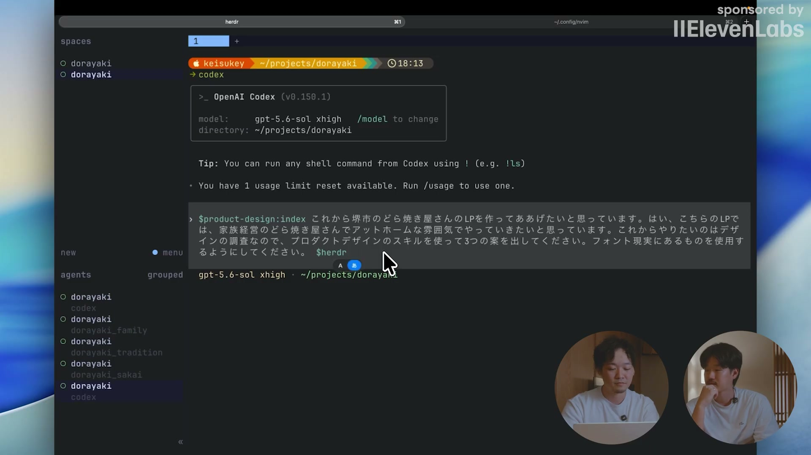

# 「なんか違う」デザインを爆誕させない方法。| 最小限の出戻りでイケてるデザインを生成しよう。

[https://www.youtube.com/watch?v=xIjU1go85Hc](https://www.youtube.com/watch?v=xIjU1go85Hc)

## 要点

- いきなりコードを生成させると修正の手戻りやバイアスが生じやすいため、まずは画像で複数のデザイン案を生成して方向性を決めるのが効率的である。
- Codexの「Product Design」スキルや複数エージェントを使い、異なるデザインパターンの画像を並行して出させて比較検討する。
- 画像で完成形（80%程度）のゴールを擦り合わせた後、コード化し、微調整はFigma（MCP連携）などのGUI側で行ってコードへ反映させるフローが推奨される。

## 詳細

### 最初からコード生成させることのデメリット

AIにいきなりHTMLやCSSを生成させると、生成の待ち時間が長い上に、一度コード化された成果物が次のプロンプトの文脈（バイアス）として入り込んでしまう。これにより、複数案を比較する前に1つのデザインに引っ張られ、修正に無駄な時間がかかる原因となる。

*4:14 — [動画のこの位置を開く](https://www.youtube.com/watch?v=xIjU1go85Hc&t=254s)*

### 画像生成から始めるデザインフローの利点

最初にコードではなく画像を生成して複数案を出させることで、バイアスなく複数の入り口からデザインを検討できる。コード生成に比べてトークン消費量が少なく、生成スピードも速いため、人間とAIの間での試行錯誤のループを素早く回すことができる。

*9:48 — [動画のこの位置を開く](https://www.youtube.com/watch?v=xIjU1go85Hc&t=588s)*

### Codexと複数エージェントによる候補案の生成

Codexの「Product Design」スキルとターミナルマルチプレクサ（Harbor）を活用し、複数のサブエージェントを並行して走らせて合計9パターンなどのデザイン案を一気に画像で生成する。その中から方向性に合った気に入ったデザインを選択する。

*13:44 — [動画のこの位置を開く](https://www.youtube.com/watch?v=xIjU1go85Hc&t=824s)*

### 画像からコード化する際のプロンプトの工夫

選んだデザインをコード化する際は、すべてをHTML/CSSで再現させようとせず、複雑なイラストや背景などは「アセット画像として生成して使う」よう指示することが重要である。コードで表現する部分とアセットとして切り出す部分を分けることで、生成の失敗を防ぎやすくなる。

*19:03 — [動画のこの位置を開く](https://www.youtube.com/watch?v=xIjU1go85Hc&t=1143s)*

### Figma連携によるGUI微調整とコードへの反映

生成されたコードをFigma MCPなどでFigmaのキャンバスに落とし込み、色味やレイアウトの微調整はGUI上で行う。修正したノードのリンクなどをAIに参照させてコードをアップデートさせることで、視覚的・直感的に高速な修正ループを回すことができる。

*25:57 — [動画のこの位置を開く](https://www.youtube.com/watch?v=xIjU1go85Hc&t=1557s)*

## 用語

- **POC**（Proof of Concept） — 概念実証。新しいアイデアや技術が実現可能であるかを検証するために簡易的に試作・実証すること。
- **MCP**（Model Context Protocol） — AIモデルと外部のツールやデータソース（Figmaなど）を安全かつ標準化された方法で連携させるためのプロトコル。
- **マルチプレクサ**（Multiplexer） — ターミナル内で複数の仮想ウィンドウやセッションを分割・管理し、同時に複数のプロセスやエージェントを動かすツール。

## 所感

<!-- ここは自分で書く -->
