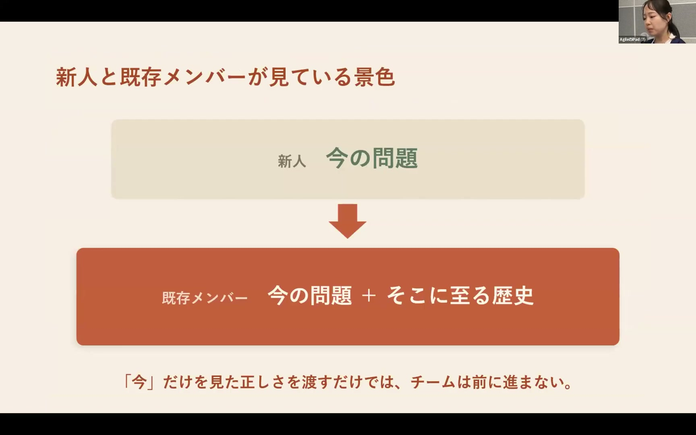
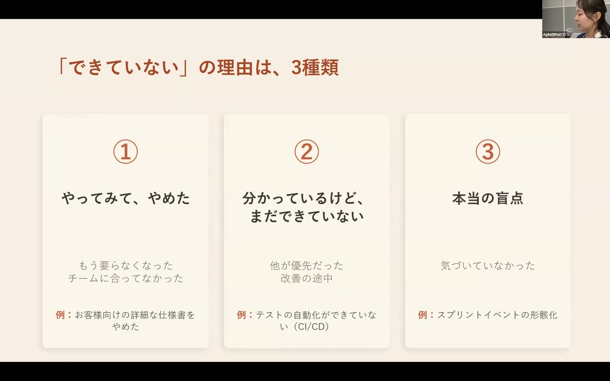
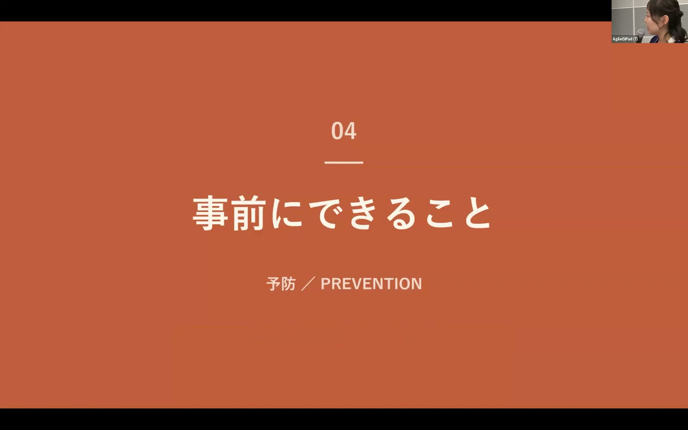
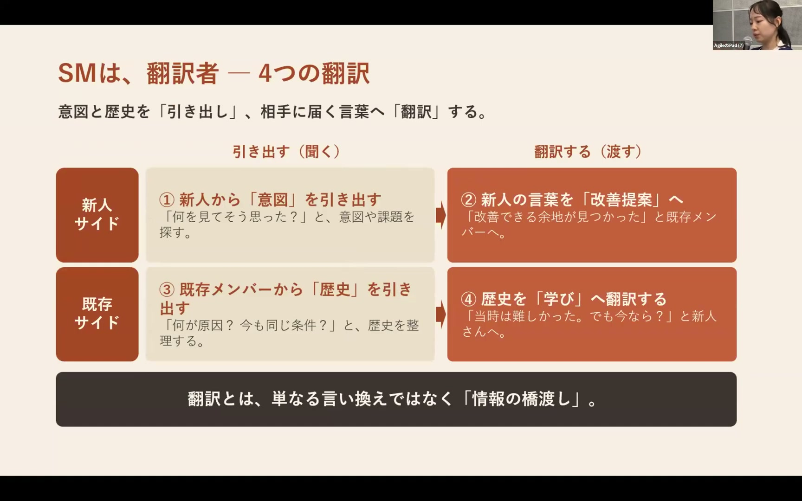
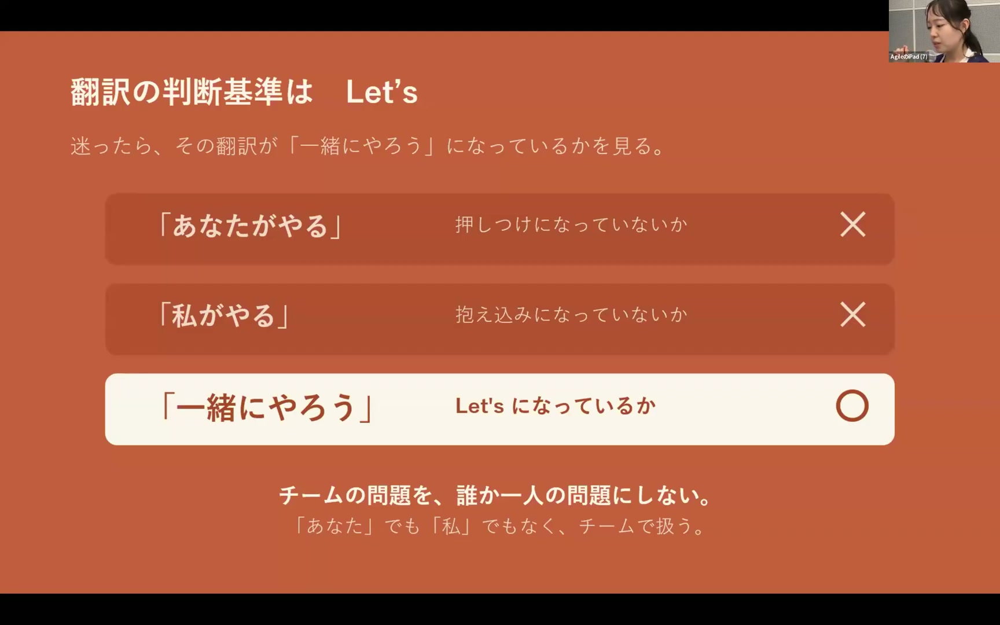

# 「普通こうですよね？」の声がつらい 〜新人と既存メンバーのすれ違いから考える改善〜 / Hikari Kagenaka

[https://www.youtube.com/watch?v=f2CyOm7JhwI](https://www.youtube.com/watch?v=f2CyOm7JhwI)

## 要点

- 新人には「現在の問題」が見え、既存メンバーには「そこに至る歴史」が見えているため、情報量の差によるすれ違いが発生する。
- 新人の指摘を受け流したり否定したりすると、疑問や提案を口にできなくなり、チームの改善そのものが止まってしまうことが最も危険である。
- すれ違いを解消するには、過去の経緯を記録して共有する事前準備と、新人の困りごとや既存の制約を相互に伝える「翻訳」が必要である。
- 新人を外からの評価者に留めず、当事者として巻き込み「Let's（一緒にやりましょう）」の姿勢で取り組むことが改善の鍵となる。

## 詳細

### 新人の正論による摩擦と「見えている景色」の違い

育休復帰後、配属された新人からドキュメント不足やスプリントイベントの形骸化などを指摘され、正論であるものの素直に受け止めきれず辛さを感じました。このすれ違いの原因は、新人には「今の問題」が見えているのに対し、既存メンバーには「そこに至るまでの歴史」が見えているという情報量の差にあります。既存メンバーは過去の失敗や制約の中で試行錯誤してきたため、指摘だけを受けると努力を否定されたように感じてしまいます。

*8:52 — [動画のこの位置を開く](https://www.youtube.com/watch?v=f2CyOm7JhwI&t=532s)*

### チームにおける「できていない」の3分類

新人から指摘される「できていないこと」は一律ではなく、大きく3種類に分類できます。1つ目は住宅開発時代の仕様書のように試行錯誤の末にチームに合わず「やってみてやめたもの」、2つ目はテスト自動化のように優先度や手間の関係で「分かっているけれど改善途中のもの」です。そして3つ目が、長くチームにいることで感覚が麻痺し見落としていた「本当の盲点」であり、これこそが新人の視点がもたらす最大の価値です。

*9:39 — [動画のこの位置を開く](https://www.youtube.com/watch?v=f2CyOm7JhwI&t=579s)*

### 一番怖い「改善の停止」を防ぐための事前準備

感情的な防衛本能から新人の指摘を否定・却下してしまうと、新人が発言を諦めてしまい、チームの改善が完全に停止してしまうことが最も恐れるべき事態です。これを防ぐ事前準備として、判断の経緯や試してやめた記録を残すこと、指摘はダメ出しではなく歓迎すべきものと心構えを持つこと、そして改善はチーム全体の責任だと合意しておくことの4点が挙げられます。登壇者のチームでは、思考の過程を可視化して後から経緯をたどれるよう、話し合いをMiroに残しています。

*13:19 — [動画のこの位置を開く](https://www.youtube.com/watch?v=f2CyOm7JhwI&t=799s)*

### 相互理解を促す4段階の「翻訳」

新人と既存メンバーの情報の差を埋めるため、スクラムマスターなどが担う「翻訳」には4つのステップがあります。まず新人の言葉の奥にある困りごとや意図を掘り下げ、それを既存メンバーへ「再発防止のための改善」として届けます。次に既存メンバーの「前にもやった」という言葉から当時の事情や制約を言語化し、過去を諦めの理由にするのではなく「学び」として新人に共有します。

*16:12 — [動画のこの位置を開く](https://www.youtube.com/watch?v=f2CyOm7JhwI&t=972s)*

### 新人を評価者にせず当事者に変える「Let's」の精神

新人の指摘を受け入れるだけでなく、新人自身にも当事者として改善に参加してもらうことが重要です。動画の事例では、新人が自ら「アジェンダ改善委員会」を立ち上げ、形骸化していたスプリントイベントの見直しを率戦して進めました。誰か1人の問題にするのではなく、「なんでやらないんですか」を「Let's（一緒にやりましょう）」に変えていく姿勢がチームを前進させます。

*20:56 — [動画のこの位置を開く](https://www.youtube.com/watch?v=f2CyOm7JhwI&t=1256s)*

## 用語

- **スプリントイベント**（Sprint Event） — スクラム開発において定期的に行われる計画、デイリースクラム、レビュー、振り返りなどの定例ミーティングの総称。
- **ミロ**（Miro） — オンライン上でリアルタイムに図や付箋を配置し、チームの思考過程や議論を可視化・記録できるホワイトボードツール。

## 所感

<!-- ここは自分で書く -->
