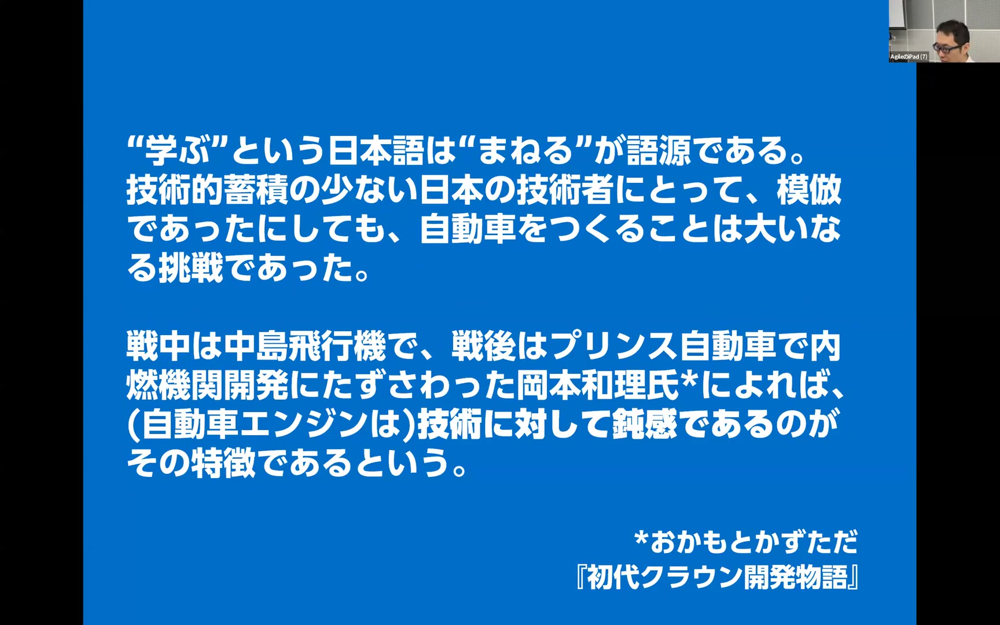
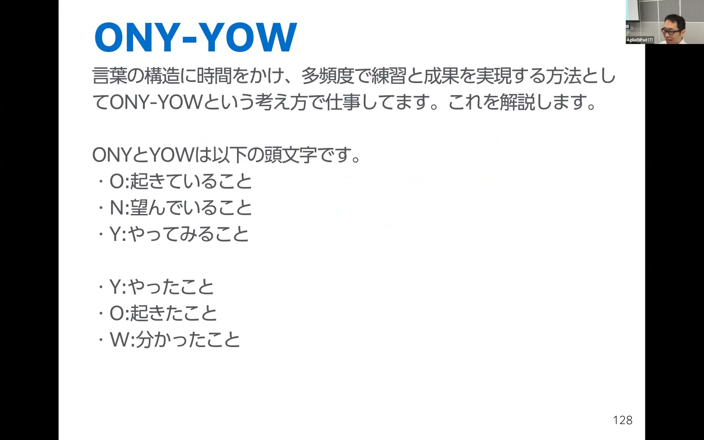
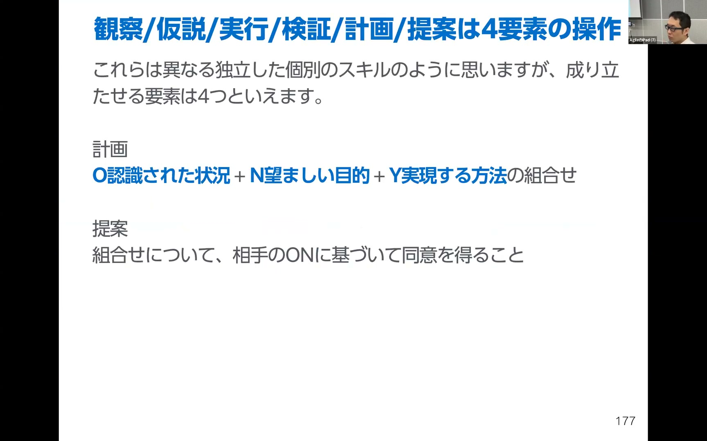
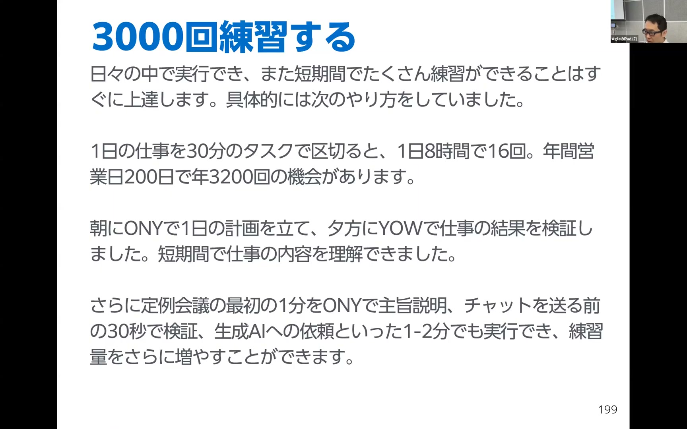
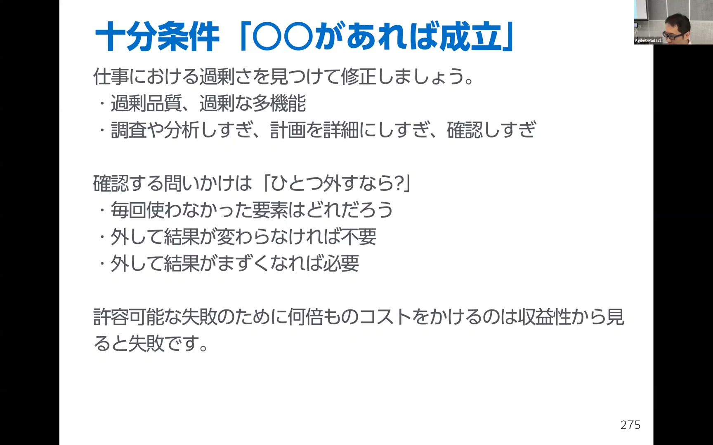
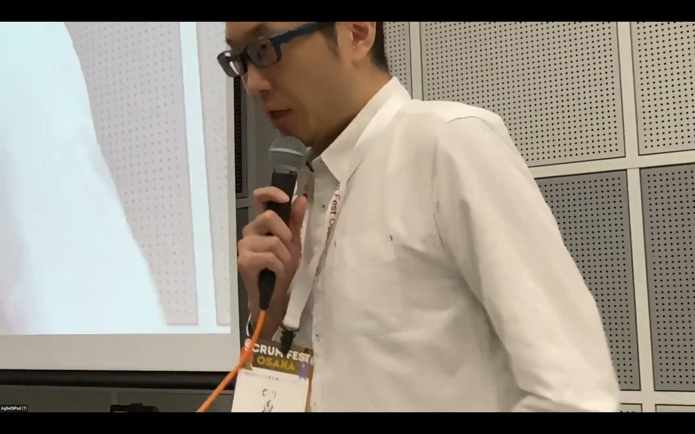

# 「生成AIの性能が上がってるのに自分がおバカ!」観察、仮説、実行、検証、計画、提案を一年で3000回トレーニングする方法 / Mori Yuya

[https://www.youtube.com/watch?v=aNkCu-G1SkQ](https://www.youtube.com/watch?v=aNkCu-G1SkQ)

## 要点

- 生成AIの急速な進化に伴い、AIの出力をそのまま受け入れて人間側が指示に従う状態を脱し、自らの手で仕事を組み立てる言語的・認知的スキルの獲得が不可欠になっている。
- 言葉の分解能と練習頻度を高める実践的な枠組みとして、「起きていること・望んでいること・やってみること（ONY）」と「やったこと・起きたこと・分かったこと（YOW）」を活用する。
- 観察・仮説・実行・検証・計画・提案といった多様なスキルは、ONY-YOWの4要素（状況・目的・行動・メカニズム）の組み合わせと増減によって一貫して操作・訓練できる。
- 業務を30分単位に区切るなどして年間3000回以上の高頻度でONY-YOWを回すことで、言葉の明瞭さ、因果関係、最小十分条件の判断精度を日常的に高められる。

## 詳細

### AI性能の向上と「技術と原理への鈍感さ」の課題

生成AIの性能が急速に伸びる一方で、人間側が「何をしたいか」を言語化できず、AIが出した案にただ承認を出して作業員化してしまう問題が生じています。これは戦後の自動車開発が模倣から始まったように、原理を理解しなくても動かせてしまう「技術への鈍感さ」と共通しています。手本から少し外れただけでトラブルが起きるブラックボックスな働き方から抜け出し、原理に透明なアプローチを取り戻す必要があります。

*3:33 — [動画のこの位置を開く](https://www.youtube.com/watch?v=aNkCu-G1SkQ&t=213s)*

### 言葉の分解能と頻度を高める「ONY-YOW」

言語能力を高めるには、スローモーションや顕微鏡のように言葉とその構造に時間をかけ、要素を絞って高頻度に練習することが有効です。その基本単位となるのが、計画を担う「起きていること（O）」「望んでいること（N）」「やってみること（Y）」のONYと、検証を担う「やったこと（Y）」「起きたこと（O）」「分かったこと（W）」のYOWです。これらはタスク管理だけでなく、日常の会話やAIへのプロンプト指示にもそのまま適用できます。

*15:14 — [動画のこの位置を開く](https://www.youtube.com/watch?v=aNkCu-G1SkQ&t=914s)*

### スキルの文法規則としての要素操作

観察、仮説立案、実行、検証、計画、提案といった一連のビジネススキルは、独立したものではなくONY-YOWの4要素の組み合わせで表現されます。例えば計画は「状況・目的・方法」の組み合わせであり、提案はそこに「相手の同意」を得る操作です。思考が机上の空論になったときは「起きていること（O）」を足し、作業が重くなったときは過剰な要素を外すといった形で、要素の足し引きによってスキルの性質を調整できます。

*20:13 — [動画のこの位置を開く](https://www.youtube.com/watch?v=aNkCu-G1SkQ&t=1213s)*

### 年間3000回の実践機会をつくるプラクティス設計

スキルは使わないと上達しないため、実施時間と練習頻度（プラクティスエフェクト）の設計が重要です。1日8時間の仕事を30分刻み（16コマ）で捉えれば、年間200営業日で3200回の実践機会が生まれます。朝にONYで計画を立て、夕方にYOWで検証するだけでなく、定例会議冒頭の1分やチャット送信前の30秒など、短時間で高頻度に思考を回すことでスキルを体に定着させます。

*25:27 — [動画のこの位置を開く](https://www.youtube.com/watch?v=aNkCu-G1SkQ&t=1527s)*

### 思考の精度を高める論理ツール群（明瞭さ・因果・条件ロジック）

ONY-YOWの各要素の質を高めるため、文の解釈が1つに定まる「明確さ」と、出所を確認する「事実の確かさ」を点検します。さらに、共通の原因によって見かけ上の相関が生じる「交絡」に注意して因果関係を捉えます。また、目的達成に欠かせない「必要条件」、過剰さを含む「十分条件」を見極め、過不足なく成果を出す「最小十分条件」へと要素を削ぎ落とす判断基準を養います。

*39:17 — [動画のこの位置を開く](https://www.youtube.com/watch?v=aNkCu-G1SkQ&t=2357s)*

### 質疑応答：間違った方向へ突き進まないための軌道修正

高頻度で実践する中で誤った方向に進んでしまうリスクに対しては、「事前のYOW（やってみること・起きそうなこと）」と「事後のYOW（実際にやったこと・起きたこと）」の差分を突き合わせることが対策になります。事前に立てた予測と実際の結果のズレを比較・評価することで、自分の行動や理解が適切だったかを検証し、自律的に方向を修正できます。

*44:40 — [動画のこの位置を開く](https://www.youtube.com/watch?v=aNkCu-G1SkQ&t=2680s)*

## 用語

- **ONY-YOW** — 物事の計画と検証を行うためのフレームワーク。「起きていること・望んでいること・やってみること（ONY）」と「やったこと・起きたこと・分かったこと（YOW）」の頭文字をとったもの。
- **交絡**（Confounding） — 2つの事象に共通する別の原因が存在することで、直接の因果関係がないにもかかわらず因果関係があるように見えてしまう現象。
- **最小十分条件**（Minimal Sufficient Condition） — 目的を確実に達成できる要素の集合（十分条件）から無駄な要素を削ぎ落とし、1つでも減らすと達成できなくなる過不足のない状態。
- **プラクティスエフェクト**（Practice Effect） — スキルやプラクティスを使うほど上達し、使わないほど下手になる現象。実施機会の頻度と1回あたりの実行時間によって習得効率が左右される。

## 所感

<!-- ここは自分で書く -->
