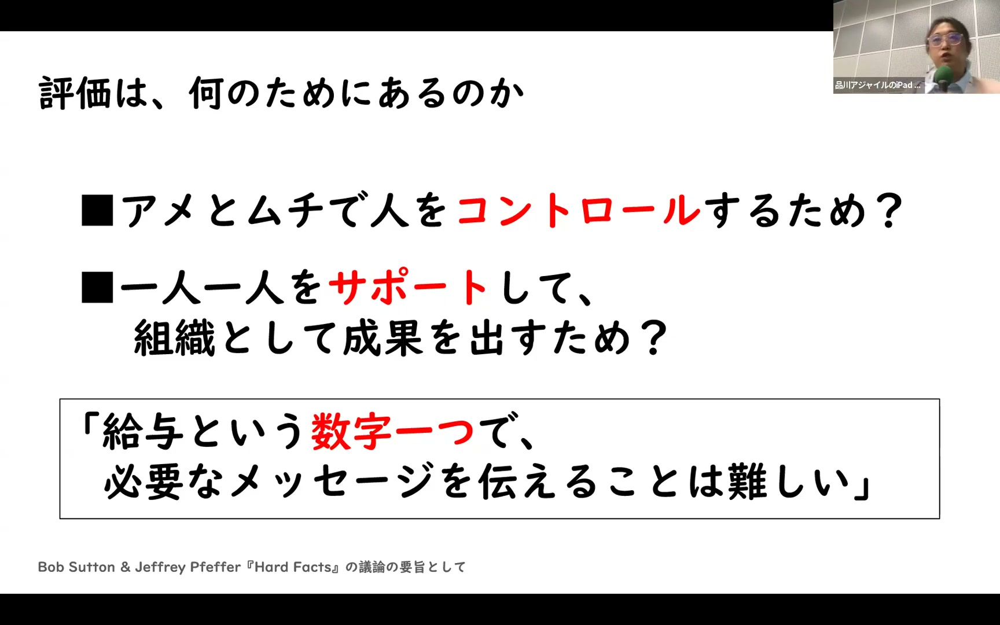
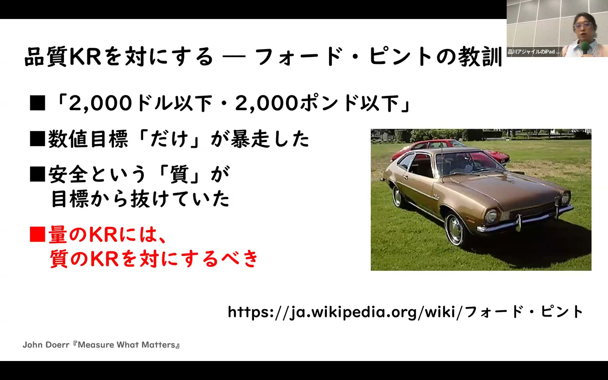
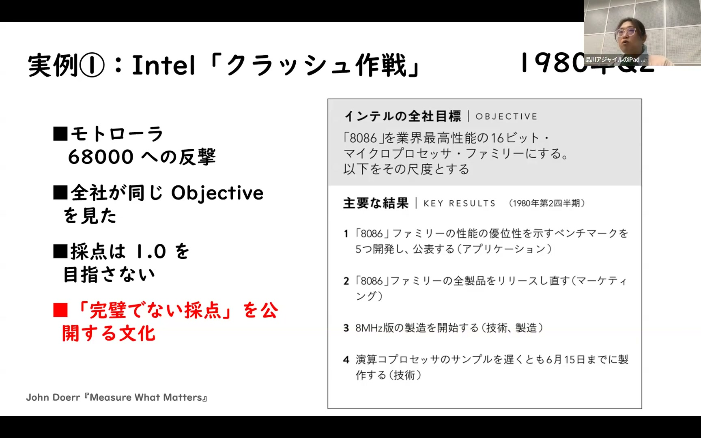
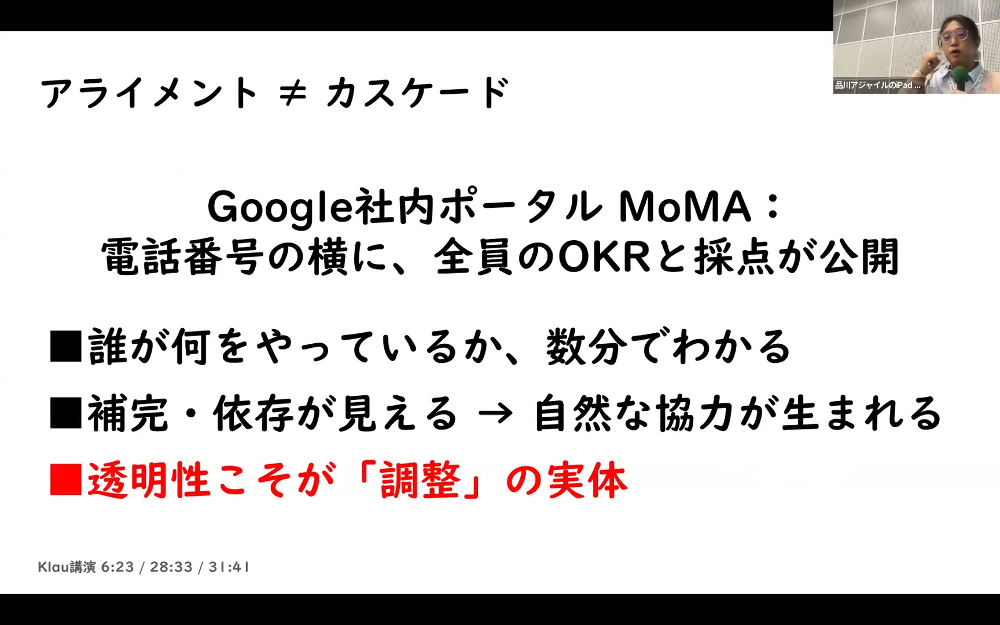
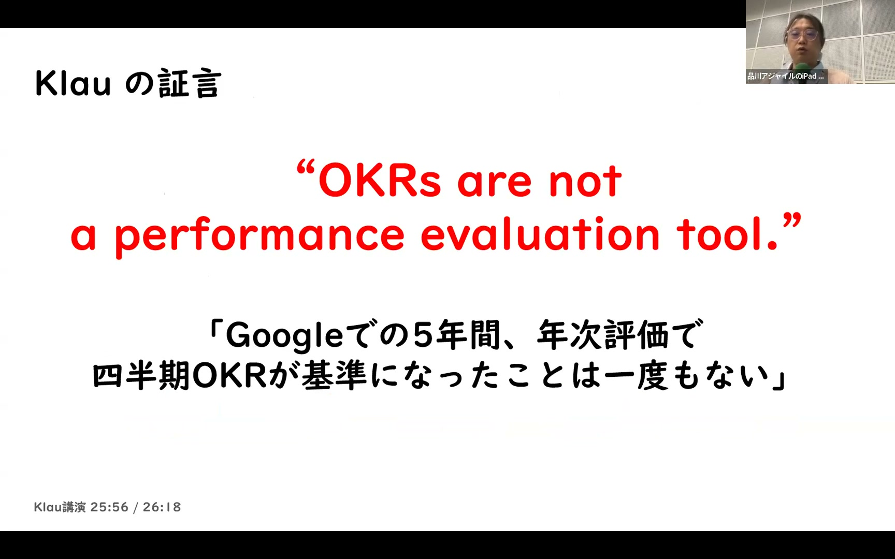
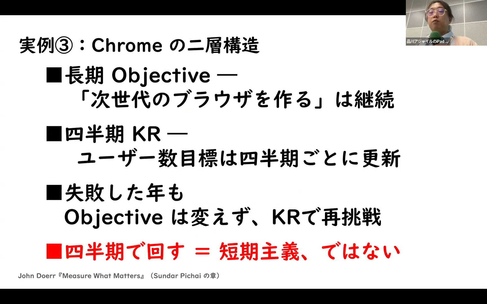

# 『Measure What Matters』に学ぶOKRの本質 ― カスケードしない、評価に使わない、四半期で回す / Yasunobu Kawaguchi

[https://www.youtube.com/watch?v=_JzfkKsW_gY](https://www.youtube.com/watch?v=_JzfkKsW_gY)

## 要点

- OKR（Objectives and Key Results）は単なる目標管理シートではなく、上意下達（カスケード）を排してボトムアップを促す組織管理の手法である。
- OKRを人事評価や給与査定と連動させると社員が安全策に走るため、評価と完全に切り離して野心的なストレッチゴールを促す必要がある。
- 全社員のOKRと採点を社内に公開する透明性によって、部門間の補完関係や自発的な協力が生まれる。
- 年間ロードマップではなく四半期サイクルと週次のチェックイン（CFR）で回し、検査と適応を繰り返しながらアウトカムを目指す。

## 詳細

### 「アメとムチ」による評価の限界と対話の必要性

給与査定や評価という「アメとムチ」で人を動かそうとしても、行動経済学のプロスペクト理論が示す通り、現状維持や減給によるモチベーション低下の影響は昇給の喜びよりも遥かに大きくなります。給与という数字1つですべてのメッセージを伝えることは不可能であり、評価のためではなく組織全体として成果を出すための対話の道具が求められます。

*13:09 — [動画のこの位置を開く](https://www.youtube.com/watch?v=_JzfkKsW_gY&t=789s)*

### OKRの原点と組織管理としての本質

OKRはIntel（インテル）のアンディ・グローブ（Andy Grove）が提唱した仕組みを、ジョン・ドーア（John Doerr）がGoogleへ持ち込んだ組織管理の手法です。1サイクルあたり3〜5個の目標（Objective）を設定し、そこに向かっているかを測る指標（Key Results）を定義します。数値指標だけに偏ると品質崩壊を招いたフォード・ピント（Ford Pinto）の悲劇のようになるため、量の指標には必ず質の指標を併記することが推奨されます。

*27:37 — [動画のこの位置を開く](https://www.youtube.com/watch?v=_JzfkKsW_gY&t=1657s)*

### カスケードの4つの弊害とボトムアップ文化

経営陣の数値を各部署へ上意下達で割り振る「カスケード」は、展開に時間がかかり、柔軟性を奪い、現場の声を軽視し、部門間の連携を阻害する4つの弊害を生みます。Googleの元人事責任者ラズロ・ボック（Laszlo Bock）もカスケードは逆効果と指摘しており、目標の50%以上は現場からのボトムアップで提案されるべきです。Intelの8086プロセッサにおける「クラッシュ作戦」のように、全社で共通の目標を共有しつつ、具体的なKRは現場が主体的に決めることが重要です。

*29:45 — [動画のこの位置を開く](https://www.youtube.com/watch?v=_JzfkKsW_gY&t=1785s)*

### 社内ポータルによる完全な透明性と相互支援

Googleでは社内ポータル「MoMA」において、電話番号の横に全社員のOKRと採点が公開されています。誰が何を目指して仕事をしているかが全員に見える状態を作ることで、チーム同士の依存関係や補完関係が明らかになり、指示命令ではなく自然な協力体制が生まれます。

*40:25 — [動画のこの位置を開く](https://www.youtube.com/watch?v=_JzfkKsW_gY&t=2425s)*

### 人事評価との分離とストレッチゴール

OKRの達成度を給与や年次評価と直結させると、社員は減点を恐れて確実に達成できる目標しか立てなくなる「サンドバッギング」に陥ります。達成度の中央値が0.6〜0.7となるような挑戦的なストレッチゴールを維持するため、Googleでも四半期OKRは年次評価の基準から完全に切り離して運用されています。

*42:30 — [動画のこの位置を開く](https://www.youtube.com/watch?v=_JzfkKsW_gY&t=2550s)*

### 四半期サイクル、CFR、アウトカムによる設計

OKRは年間で固定するのではなく四半期で更新し、週次の1on1を通じたCFR（対話・フィードバック・承認）で継続的に支援します。Google Chrome（グーグル・クローム）のように長期のObjectiveを保ったままKRを四半期ごとに更新して再挑戦することも可能です。KRは単なる作業のリリースではなく、顧客の行動変化といった「アウトカム」で設定し、ディスカバリーやストーリーマッピングを経てプロダクトバックログへと繋げます。

*44:54 — [動画のこの位置を開く](https://www.youtube.com/watch?v=_JzfkKsW_gY&t=2694s)*

## 用語

- **カスケード**（Cascading） — 全社の目標をピラミッド型にブレークダウンし、上意下達で下位組織や個人に割り振っていく目標展開の手法。
- **サンドバッギング**（Sandbagging） — 人事評価での減点を避けるため、本来の実力よりもあえて低く安全な目標を設定・申告すること。
- **CFR**（Conversations, Feedback, Recognition） — 目標達成と成長を支援するための「対話（Conversations）」「フィードバック（Feedback）」「承認（Recognition）」を指すコミュニケーションの枠組み。
- **アウトカム**（Outcome） — 機能リリースなどの成果物（アウトプット）そのものではなく、それによって生じた顧客の行動変化や具体的な効果。

## 所感

<!-- ここは自分で書く -->
