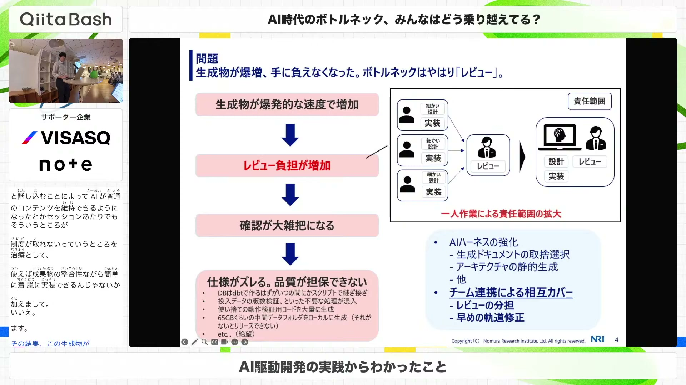
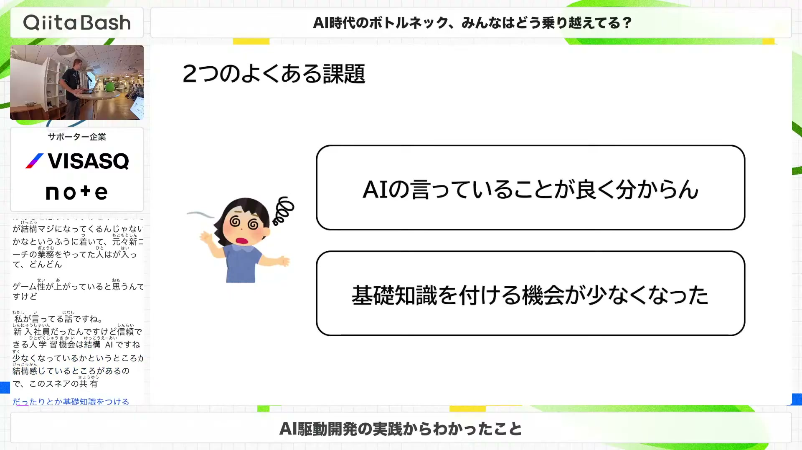
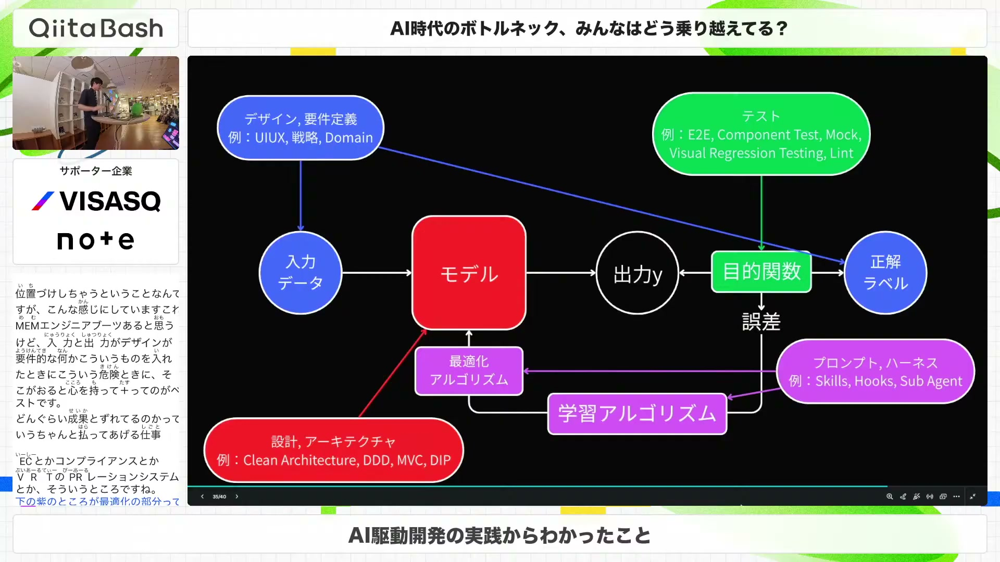
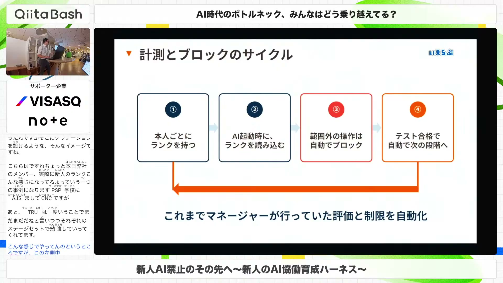
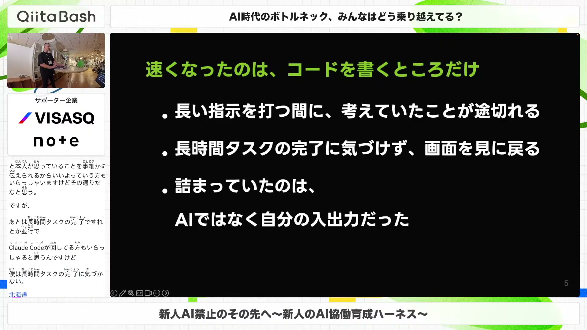
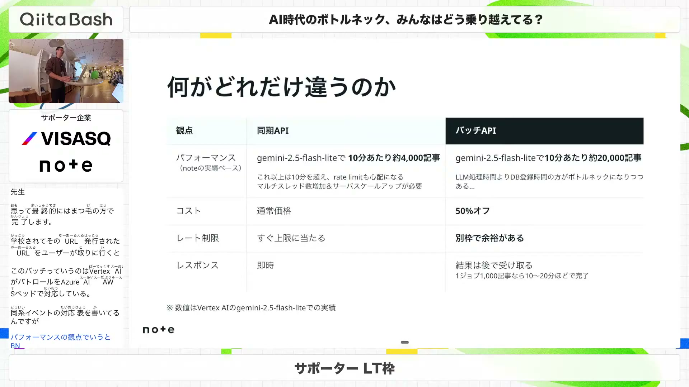
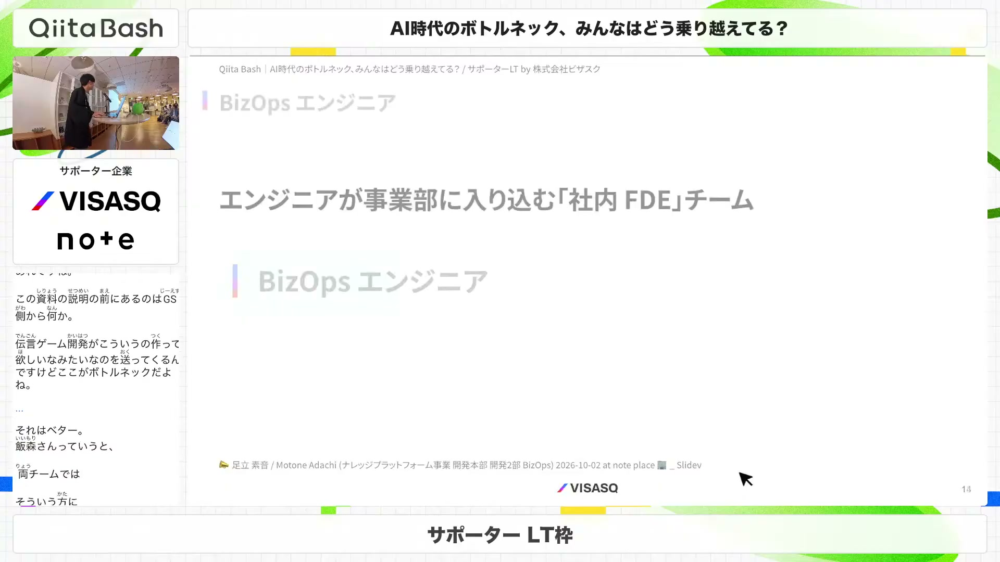

# 【#QiitaBash】AI時代のボトルネック、みんなはどう乗り越えてる？

[https://www.youtube.com/watch?v=ZNIX0ZjLhMA](https://www.youtube.com/watch?v=ZNIX0ZjLhMA)

## 要点

- AIによるコード生成が高速化する一方で、成果物の肥大化、レビュー工程のパンク、人間の入出力速度などが新たなボトルネックとして顕在化している。
- 検証作業をあえて学習機会として残したり、新人の習熟度ランクに応じてAIの操作権限を制限したりすることで、AIへの依存を防ぎエンジニアの理解力を担保する工夫が共有された。
- コードレビューに人手をかけるのではなく、Web開発を機械学習に見立ててテスト（目的関数）を厳密に組み、LLMによる自動修正（テキスト勾配）に委ねるアプローチが提案された。
- 大量データの一括処理にはBatch APIを活用してコストとスループットを改善し、開発組織の壁を越えるためにBizDevOps体制で事業部門の自動化を直接進める実践例が示された。

## 詳細

### AI駆動開発の成果物爆増とSaaS連携によるレビュー分散

生成AIやコーディングエージェントを活用することで1人の開発速度は爆速化したものの、生成される成果物が爆増してレビュー工程が追いつかず、仕様のずれや不要なコードの混入が発生しました。このボトルネックを解消するため、ローカルで抱え込みがちな成果物をMiroやGitHubといったSaaSとMCPツール経由で同期し、チームで分散して可視化・レビューできる体制づくりが進められています。

*17:32 — [動画のこの位置を開く](https://www.youtube.com/watch?v=ZNIX0ZjLhMA&t=1052s)*

### 検証フェーズをあえてボトルネックとして残す学習戦略

インフラ構築では要件定義から設計書、試験仕様書の作成まで自動化が進む一方で、検証作業には多くの時間が割かれています。しかし、AIの出力したコマンドや結果を正しく理解し判断できる知識を身につけるため、検証フェーズは自動化しすぎず、試行錯誤を通じてエンジニアの基礎知識を深める重要な学習機会としてあえて時間をかける方針が語られました。

*30:19 — [動画のこの位置を開く](https://www.youtube.com/watch?v=ZNIX0ZjLhMA&t=1819s)*

### 機械学習に見立てるコードレビュー不要論と目的関数設計

LLMの進化によりテキストの微分（テキスト勾配）が可能になったと捉え、Webアプリケーションの入出力を機械学習モデルに対応させる考え方が提示されました。人間が手作業で行うコードレビューや内部実装への過度な介入を排除し、ビジュアルリグレッションテスト（VRT: Visual Regression Testing）やE2Eテストといった目的関数（テスト）を厳密に設計することで、LLM自身に誤差を最小化させるべきだと主張されています。

*40:15 — [動画のこの位置を開く](https://www.youtube.com/watch?v=ZNIX0ZjLhMA&t=2415s)*

### 習熟度ランクに応じたAI協働育成ハーネスの導入

新人がAIの出力を鵜呑みにして大量のレビュー指摘を受ける問題に対し、全面禁止するのではなく習熟度ランクに応じた制限を設ける仕組み「ニューカマー」が紹介されました。ランク1ではコード生成を禁止し、ランク2で既存ファイル修正のみ許可、ランク3で全面協働といった権限分けを行い、さらに日々の作業意図やエラー要因を言語化させるテストを自動実施して評価・育成を行っています。

*51:18 — [動画のこの位置を開く](https://www.youtube.com/watch?v=ZNIX0ZjLhMA&t=3078s)*

### 音声入力と通知マスコットによる人間の入出力ボトルネック解消

AI自体の処理速度は速いものの、プロンプトをキーボードで打ち込む時間や、バックグラウンドで走らせた長時間タスクの完了に人間が気づかない待機時間がボトルネックになっていました。これに対し、ローカルで常駐動作する音声入力ツール「Apex Voice」で入力負荷を下げ、Claude CodeのフックとVOICEVOX（ずんだもん）を連携させて完了やエラーを音声通知する自作環境が構築されました。

*1:01:07 — [動画のこの位置を開く](https://www.youtube.com/watch?v=ZNIX0ZjLhMA&t=3667s)*

### Batch APIを活用した大規模記事判定と他言語翻訳

noteにおける全記事の品質・カテゴリー判定や他言語翻訳では、同期APIを使うとレート制限や高コストがボトルネックになっていました。非同期でまとめて処理するBatch API（バッチAPI）に移行したことで、Gemini 2.5 Flash-Liteでの処理能力が同期比で約5倍（10分あたり約2万記事）に向上し、コストも半額に抑えつつレコメンド改善やPV増加を達成しました。

*1:10:35 — [動画のこの位置を開く](https://www.youtube.com/watch?v=ZNIX0ZjLhMA&t=4235s)*

### 事業部門へ直接入り込むBizDevOpsによる伝言ゲームの打破

設計・実装・テストの自動化を徹底して開発スピードを上げた結果、ビジネス側から開発側への要望伝達（伝言ゲーム）自体が最大のボトルネックとして浮き彫りになりました。エンジニアが事業部に直接入り込んで業務手順を観察・ヒアリングし、その場で連携や自動化を提案・構築する「BizDevOpsチーム」を新設することで、受付審査時間を30分から数分に短縮するなどの成果が出ています。

*1:20:48 — [動画のこの位置を開く](https://www.youtube.com/watch?v=ZNIX0ZjLhMA&t=4848s)*

## 用語

- **AIハーネス**（AI Harness） — AIモデルやコーディングエージェントの操作権限、コンテキスト維持、開発プロセスを制御・支援するための周辺システムや枠組み。
- **テキスト勾配**（Text Gradient） — 機械学習の勾配降下法のように、LLMがコードや出力の良し悪しを判定して差分修正の指示（勾配）をエージェントにフィードバックし、誤差を最小化していく概念。
- **ビジュアルリグレッションテスト**（Visual Regression Testing (VRT)） — Web画面などの表示結果をピクセル単位でキャプチャ比較し、UIの意図しないレイアウト崩れや差分を自動検知するテスト手法。
- **バッチAPI**（Batch API） — リクエストを非同期でまとめて送信し、後から結果を一括取得するAPI方式。同期APIに比べて低コストかつレート制限を気にせず大量データを推論できる。

## 所感

<!-- ここは自分で書く -->
