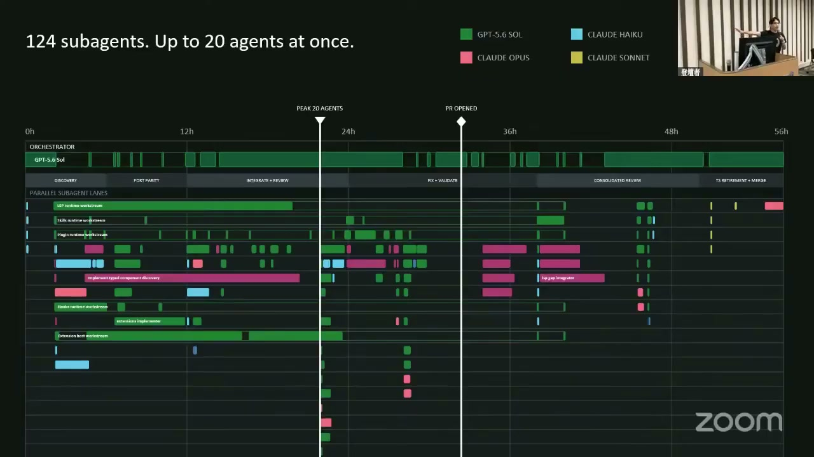
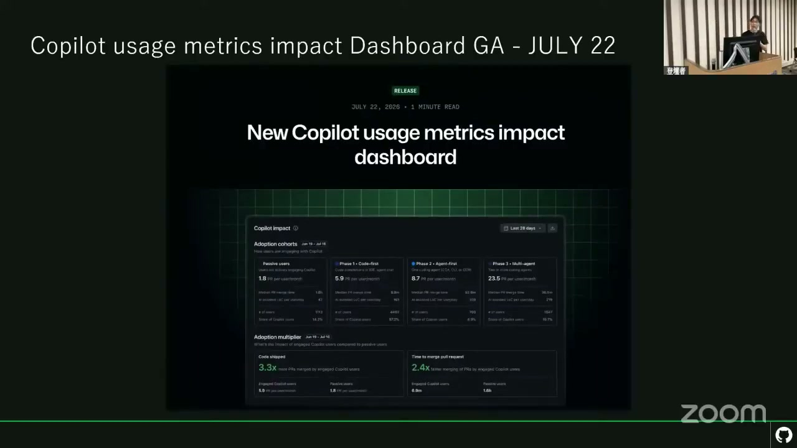
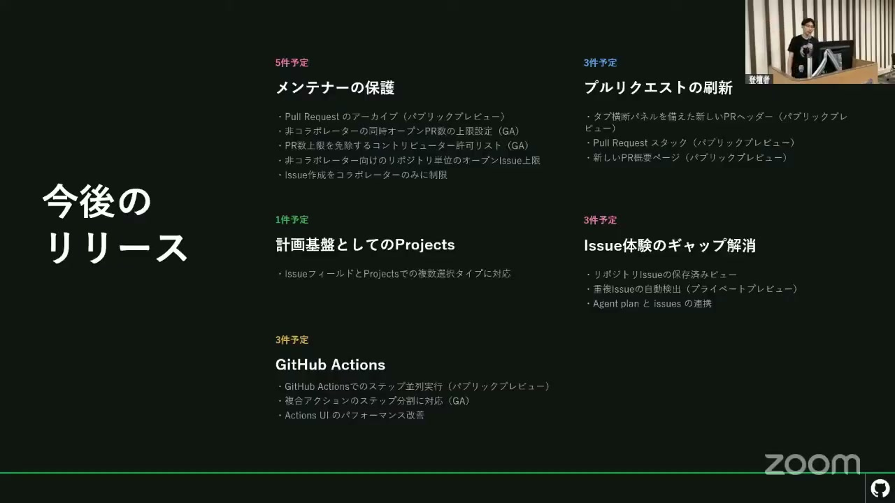

# 【AI駆動開発カンファレンス 2026 夏】2億人の開発者と、エージェントの時代 ― GitHub が次に描くもの

[https://www.youtube.com/watch?v=-6ZEIPlZsY4](https://www.youtube.com/watch?v=-6ZEIPlZsY4)

## 要点

- ソフトウェア開発は単にコードを書く時代から、開発者が自律型エージェントをオーケストレートする「エージェントネイティブエンジニアリングシステム」の時代へとシフトしています。
- GitHubのユーザー数は2億2500万人、GitHub Copilot（ギットハブ・コパイロット）のユーザー数は5000万人を突破し、2026年には年間コミット数が前年比14倍の140億に達する見込みです。
- GitHub社内でのマイグレーション事例では、1人のエンジニアと124のサブエージェントを駆使して数ヶ月分の作業を完了させ、一時的なAIコストは高額だったものの高い投資対効果（ROI）を実証しました。
- タスクの難易度に応じて異なるAIモデルやエージェントを使い分け、エラーが起きても自動で修正してマージまで導く「エージェントマージ」などの最先端開発フローが提示されました。
- 今朝リリースされた「プルリクエストのスタック」や、開発中の共同セッション規格「エージェントホストプロトコル（AHP）」など、開発体験を劇的に変えるロードマップが公開されました。

## 詳細

### 自律型エージェントの台頭と役割の変化

GitHubのCOOであるカイル・デイグル（Kyle Daigle）氏は、これまでの「開発を支援するAI」から「自律的に動くAIエージェント」へのシフトが、開発者のあり方を大きく変えつつあると指摘しました。開発者は単にコードを書くだけでなく、計画・テスト・リリース・監視を行う複数のエージェントをオーケストレートする存在になります。2025年に10億回だったプラットフォーム上のコミット数は、2026年には14倍の140億回に達すると予測されています。

*2:09 — [動画のこの位置を開く](https://www.youtube.com/watch?v=-6ZEIPlZsY4&t=129s)*

### GitHubとCopilotの成長と将来予測

最新の決算発表に基づき、GitHubの総ユーザー数が2億2500万人、GitHub Copilotのユーザー数が5000万人を突破したことが明かされました。CopilotのAPIトラフィックは過去2年間で16倍になり、毎日30兆（30 Trillion）ものトークンが消費されています。ガートナーのレポートでは、2027年までにIDEの利用はオプショナルになり、クラウドエージェントやCLIが主流になるほか、2028年にはエンジニア1人あたりのAIコストが平均給与を超えるとの予測が紹介されました。

*10:48 — [動画のこの位置を開く](https://www.youtube.com/watch?v=-6ZEIPlZsY4&t=648s)*

### 数億円規模の利益をもたらした社内エージェント活用事例

GitHub社内のマイグレーション事例（TypeScriptからRustへの移行）が共有されました。通常なら複数人が数ヶ月かけるプロジェクトを、1人のエンジニアが124のサブエージェント（マルチモデル）を並行稼働させてやり遂げました。期間中、AIの利用コストが1日あたり最高5000ドルを超えて一時的にスパイクしたものの、移行成功によるビジネスメリットは数億円規模にのぼり、ROIが極めて高い投資であったことが示されています。また、別チームの事例からは、AI開発を高速化するためにはテストカバレッジの向上や徹底したリンターの適用など、土台となるCI/CD（継続的インテグレーション/継続的デリバリー）環境の整備が重要であることが強調されました。

*20:07 — [動画のこの位置を開く](https://www.youtube.com/watch?v=-6ZEIPlZsY4&t=1207s)*

### 急激なトラフィック増に耐える可用性とガバナンスの強化

急激なワークロード増に伴う一時的な可用性の低下に対し、GitHubはAzure（アジュール）へのマイグレーションやActionsのCPU大幅増強、30倍の規模を想定したプラットフォームへの投資を行いました。また、企業がAI利用の統制をとるために、デフォルトのCopilotモデル制限やエージェントのログ監視機能、利用実績を可視化する新機能「Copilot Usage Metrics Impact Dashboard（Copilot使用状況メトリクス・インパクト・ダッシュボード）」などを拡充しています。

*32:02 — [動画のこの位置を開く](https://www.youtube.com/watch?v=-6ZEIPlZsY4&t=1922s)*

### 【デモ】マルチエージェント・マルチモデルを活用した未来の開発

デスクトップアプリ版のGitHub Copilotを用いた開発デモが披露されました。一度に割り当てられた4つの異なるタスクに対し、複雑なタスクには高度なモデル、軽微なタスクには軽量かつ安価な「Microsoft MAI-1 Flash」などのモデルを割り当てて並行実行させます。CIでのエラーや競合が発生した場合は、「エージェントマージ（Agent Merge）」機能を有効化することで、AIが自律的に修正からマージまでを行う様子が実演されました。

*35:51 — [動画のこの位置を開く](https://www.youtube.com/watch?v=-6ZEIPlZsY4&t=2151s)*

### 次世代ランタイムと待望の新機能ロードマップ

ユーザーからの要望が非常に多かった大望の機能「プルリクエストのスタック（Pull Request Stack）」が今朝リリースされたことが発表されました。これは大きな変更や複数の依存関係を持つプルリクエストを細かくスタック状に分割・管理できる機能です。さらに今後のロードマップとして、AIセッションを他のインターフェースから操作したり複数人で共同操作したりするためのインダストリー規格「エージェントホストプロトコル（Agent Host Protocol: AHP）」や、ワークスペース全体を丸ごと保存する「GitHub Drive（GitHubドライブ）」など、画期的な新技術の開発が進行中です。

*43:17 — [動画のこの位置を開く](https://www.youtube.com/watch?v=-6ZEIPlZsY4&t=2597s)*

## 用語

- **エージェントネイティブエンジニアリングシステム**（Agent-Native Engineering System） — 人間が意図や創造性を持ち込み、自律型AIエージェントが開発環境（IDE、CLI、Web、モバイル等）を横断して実務を遂行・協調する新しいソフトウェア開発のあり方。
- **エージェントマージ**（Agent Merge） — プルリクエスト作成後に発生したCI（継続的インテグレーション）の失敗、コード競合、あるいはレビューコメントによる指摘を、AIエージェントが自動で理解してコード修正を適用し、マージまで導く機能。
- **プルリクエストのスタック**（Pull Request Stack） — 大規模な開発において、フロントエンド、バックエンド、データベースなどの依存関係がある一連の変更を細かく分割し、スタック（積み重ね）状にして個別に管理・レビューできる機能。
- **エージェントホストプロトコル**（Agent Host Protocol: AHP） — AIエージェントの実行セッションを異なる外部インターフェースから操作したり、複数人で1つのセッションを共同操作したりできるように開発が進められている新しい業界規格。
- **ギットハブドライブ**（GitHub Drive） — CI/CDの操作時間などを短縮するために、開発時のワークスペース（作業状態）を丸ごと保存・キャッシュするGitHubの新しい取り組み。

## 所感

<!-- ここは自分で書く -->
