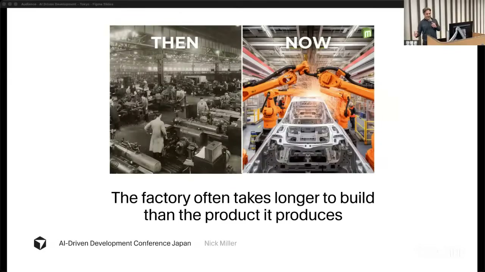
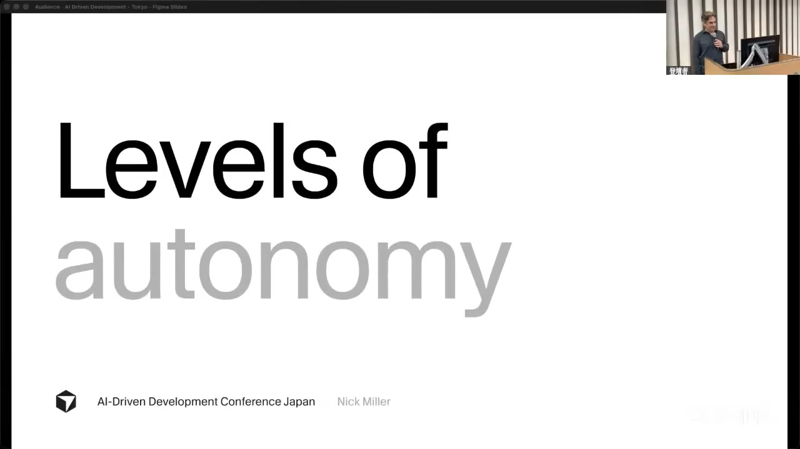
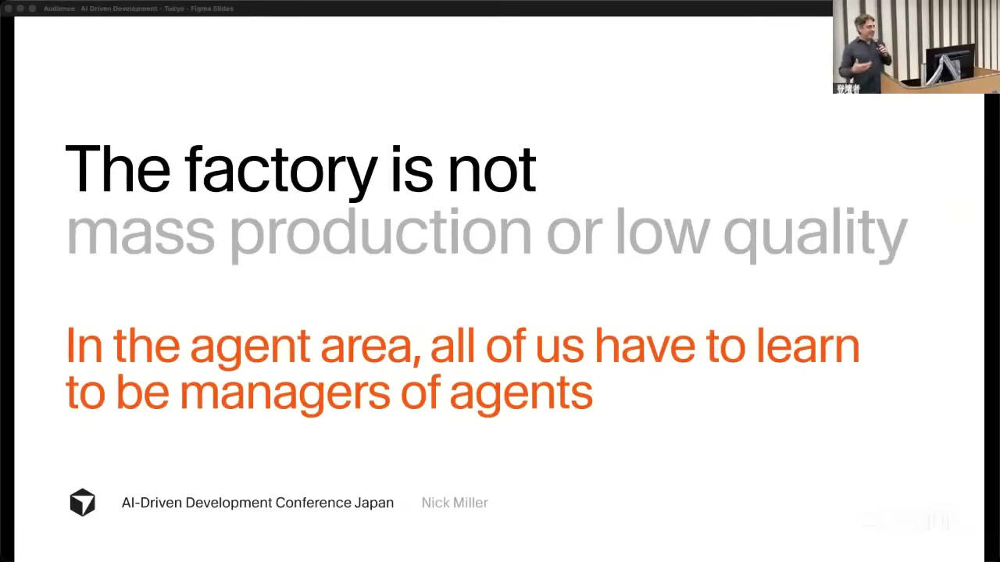
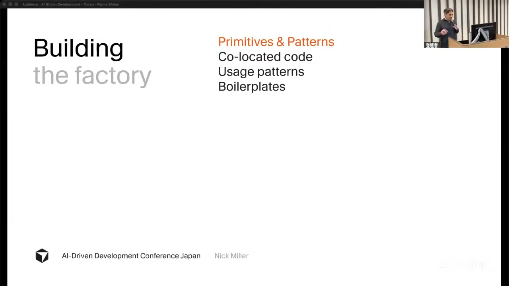
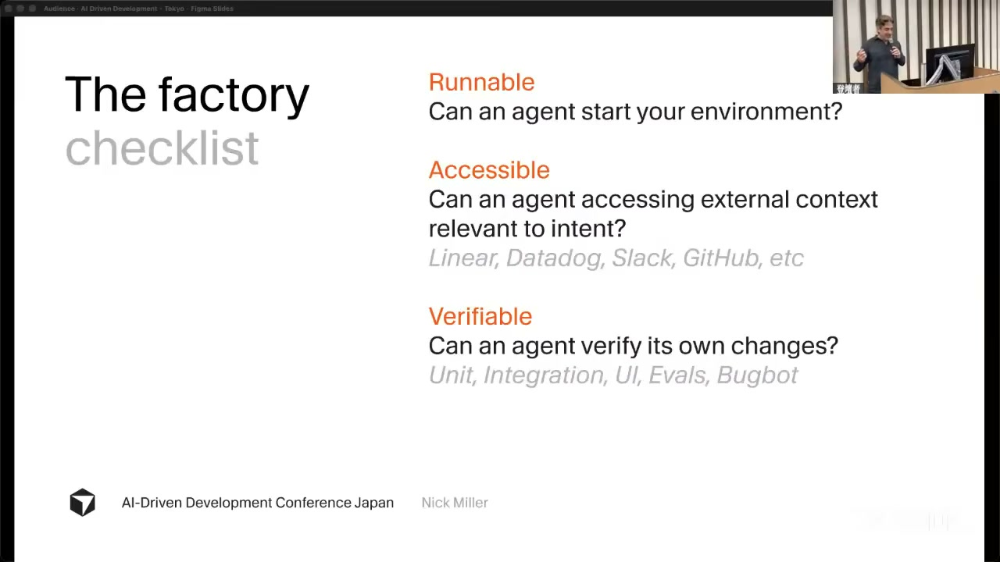

# 【AI駆動開発カンファレンス 2026 夏】Building Your Own Software Factory

[https://www.youtube.com/watch?v=f4lXSSWUB-Y](https://www.youtube.com/watch?v=f4lXSSWUB-Y)

## 要点

- AI駆動開発にはレベル0からレベル5までの段階があり、レベル3を突破してより高い生産性を得るためには、インフラとしての「ソフトウェア工場（Software Factory）」の構築が不可欠です。
- ソフトウェア工場を構築することで、セットアップやテスト実行、本番環境のテレメトリー確認など、これまで人間が仲介していた運用上の負担をAIエージェントに移行できます。
- AI時代において開発者は、自ら手を動かしてコードを書く役割から、エージェントのチームを管理する「マネージャー」の役割へとシフトする必要があります。
- 自律的に稼働する工場を構築するには、開発環境を人間なしで起動できる「実行可能性」、外部ツールから文脈を引ける「アクセス可能性」、自らテストをして修正できる「検証可能性」の3つの要素（ファクトリーチェックリスト）が求められます。

## 詳細

### なぜソフトウェア工場が必要なのか

テスラ（Tesla）がモデル3（Model 3）を製造した際、イーロン・マスク（Elon Musk）氏が工場の床で寝泊まりしたのは、車の設計よりも工場の構築の方が難しかったからです。これはソフトウェア開発でも同様であり、1000人のAIエージェントがいても現在それを有効活用できないのは、エージェントのコーディング能力の問題ではなく、それを動作させるインフラ（工場）が整っていないためです。人間が介在するボトルネックを減らし、システムに運用上の負担を移すことが工場の目的です。

*2:35 — [動画のこの位置を開く](https://www.youtube.com/watch?v=f4lXSSWUB-Y&t=155s)*

### AI開発における6つのレベル分類

AI開発は、2022年のCursorの原点であるレベル0「超強化版自動補完（Autocomplete）」から始まります。レベル1「コーディング」、レベル2「ジュニア開発者」、レベル3「開発者」へと進むにつれてエージェントの関与度は上がりますが、すべての差分を人間がレビューする必要があるためレベル3で頭打ちになります。レベル4「シニア開発者」ではスペック（仕様書）を渡せば自律稼働し、レベル5「ダークファクトリー（Dark factory）」では平易な言葉で意図を伝えるだけで、実装からバグ修正、リリースまでが完全に自動化されます。

*5:39 — [動画のこの位置を開く](https://www.youtube.com/watch?v=f4lXSSWUB-Y&t=339s)*

### 「エージェントのマネージャー」という新しい役割

ソフトウェア工場はコードの品質を落とす「安価な大量生産」のためのものではなく、ミシュラン（Michelin）の3つ星レストランのように高い品質を保ったまま規模を拡大させるためのものです。コードを書くのが好きなエンジニアであっても、エージェント時代においてはチームを管理するマネージャーにならざるを得ません。自分で作業を行い続けるだけではレベル3が上限となりますが、エージェントを他者として管理できればレベル5の生産性を達成できます。

*25:45 — [動画のこの位置を開く](https://www.youtube.com/watch?v=f4lXSSWUB-Y&t=1545s)*

### 工場を構成する3大要素：プリミティブ、ガードレール、イネイブラ

工場を動かすには3つの部品が必要です。1つ目は、モデルが学習しやすい馴染みのある構成で作られたモジュール「プリミティブとパターン」。2つ目は、自動で読み取られる「ルール」、人間を介在させる「フック」、そして自己修正を可能にする「テスト」からなる「ガードレール」です。3つ目は、スラッシュコマンドで呼び出せる再利用可能な「スキル（Skills）」、外部の各種ツールを接続する「MCP」、および自律的な「開発環境」を含む「イネイブラ（Enablers）」です。

*29:05 — [動画のこの位置を開く](https://www.youtube.com/watch?v=f4lXSSWUB-Y&t=1745s)*

### 工場が自律稼働するための「ファクトリーチェックリスト」

ある作業を工場に対応させるには、3つの質問をクリアする必要があります。第一に「Runnable（実行可能か）」で、エージェントが人の手を借りずに開発環境を起動・セットアップできる必要があります。第二に「Accessible（アクセス可能か）」で、MCPサーバー等を介して外部のコンテキストを取得できる必要があります。第三に「Verifiable（検証可能か）」で、自分で変更をテストし評価できなければなりません。これらが満たされて初めて、エンドツーエンドの自律化が可能になります。

*42:46 — [動画のこの位置を開く](https://www.youtube.com/watch?v=f4lXSSWUB-Y&t=2566s)*

## 用語

- **ダークファクトリー**（dark factory） — ライトアウトファクトリー（lights out factory）とも呼ばれ、完全に自動化されているため人間の作業員が不要で、照明がなくても稼働し続けられる工場のこと。AI開発においては、人間が介在せずエージェントが自律的に実装やリリースまでこなす「レベル5」の状態を指す。
- **スキル**（skills） — 自然言語を実行するエージェントにおける、再利用可能で組み合わせ可能な関数のこと。長いプロンプトからテンプレート化を経て開発されたスラッシュコマンドなどを指し、一度構築すれば手入力の手間を省くことができる。
- **MCPサーバー**（MCP servers） — Model Context Protocolの略。エージェントがコードベースの外側（Linear、Datadog、Slack、GitHub、Notionなど）の文脈を直接取得するための手段。人間がチャット欄へログや仕様をコピペして仲介する手間を削減する。

## 所感

<!-- ここは自分で書く -->
