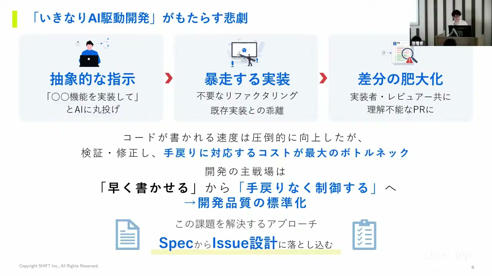
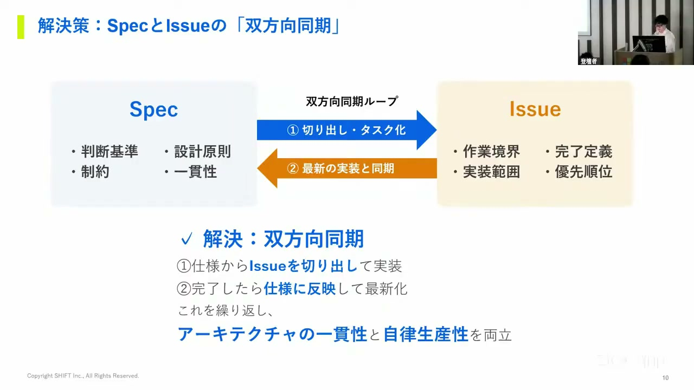
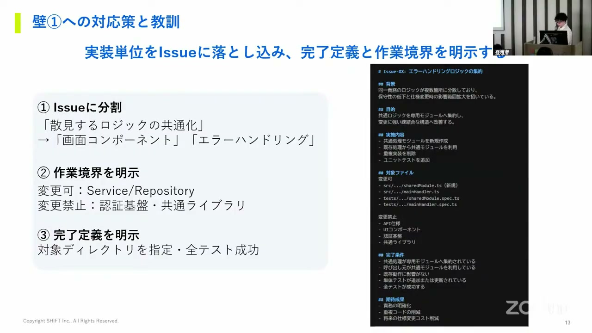
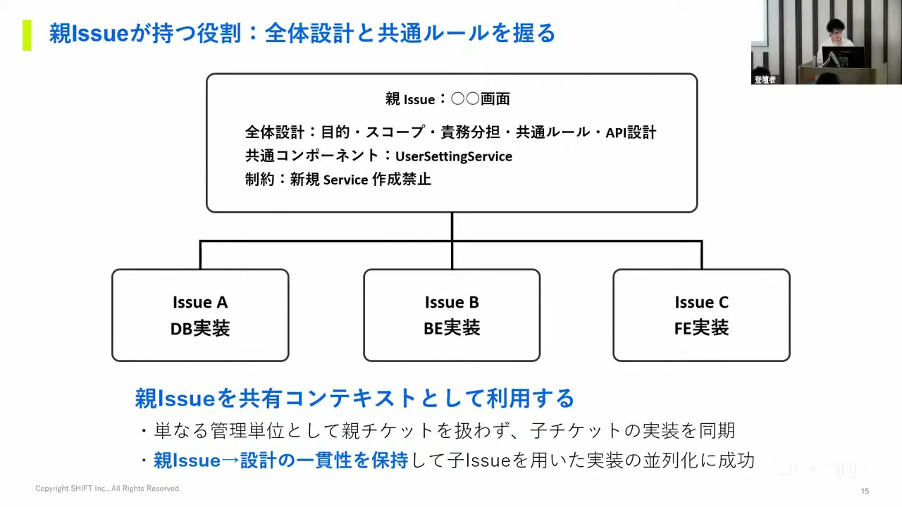
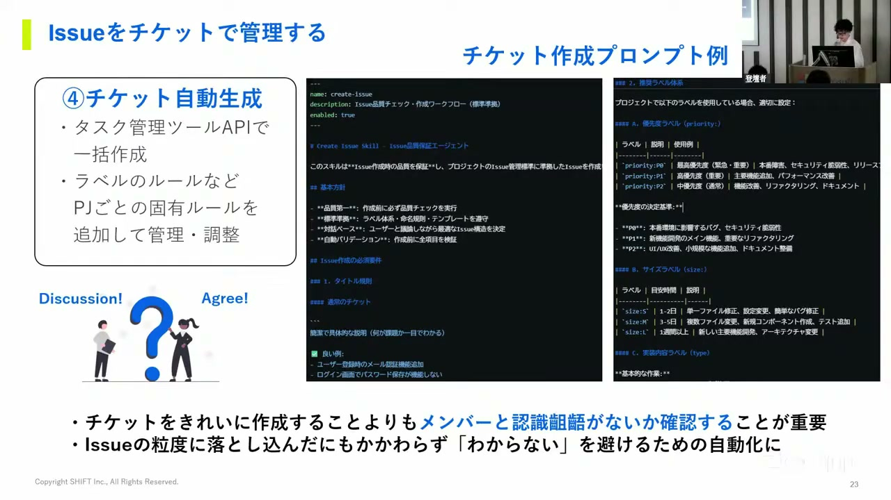
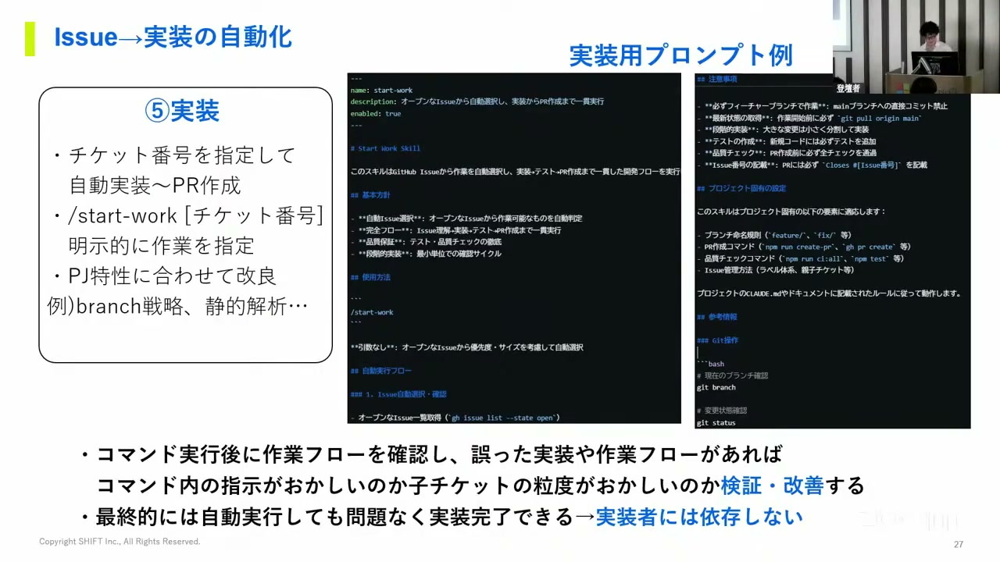
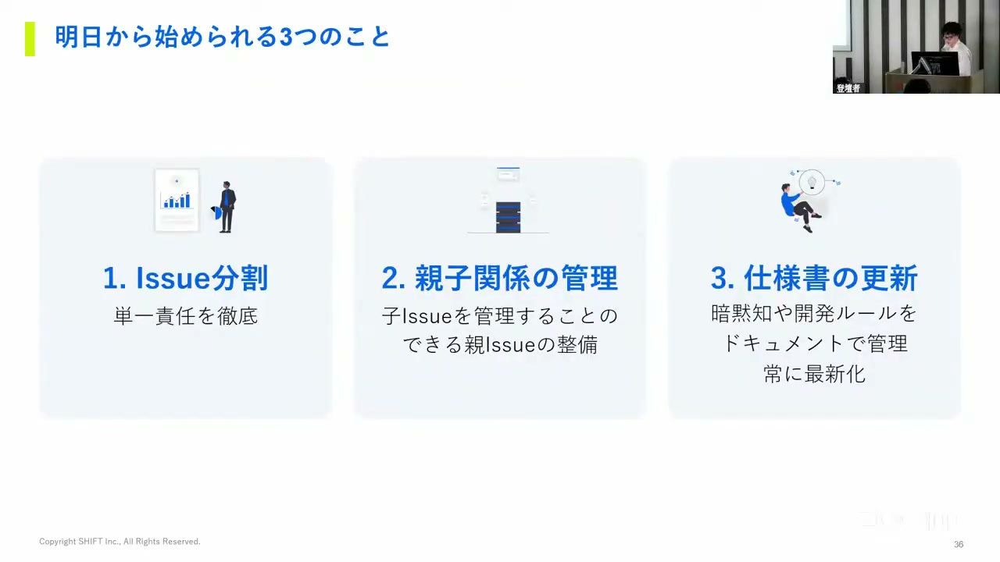

# 【AI駆動開発カンファレンス 2026 夏】Issue設計から始める仕様駆動開発

[https://www.youtube.com/watch?v=cg3y02wIHgE](https://www.youtube.com/watch?v=cg3y02wIHgE)

## 要点

- AI駆動開発のボトルネックはコード生成速度ではなく検証・手戻りコストであり、開発品質を標準化するには仕様（スペック）とIssueの双方向同期が鍵となる。
- 変更範囲の肥大化やタスク重複・コンフリクトは、作業境界や完了定義を定めたIssueテンプレートと親子関係による全体設計の管理で防ぐことができる。
- 仕様書からAPI経由でIssueを一括生成し、実装完了後に差分を仕様書へ自動反映するサイクルを回すことで、モデル性能や個人のスキルへの依存を低減できる。
- 今後のエンジニアの役割はコード実装作業そのものから、システムの境界定義やIssue設計のレビュー、事前合意形成へと移行していく。

## 詳細

### AI駆動開発のボトルネックとIssueの再定義

AIに抽象度の高いプロンプトをそのまま渡すと、不要なリファクタリングや既存実装の無視など「暴走した実装」が起き、レビュー不能なプルリクエスト（Pull Request）が作成されて手戻りが発生します。現在の開発のボトルネックはコード記述速度ではなく検証・修正コストにあります。ここではIssueをビジネス上の漠然とした問いではなく、「AIが迷わず自律実行完遂できる作業単位（チケット）」と再定義しています。

*2:48 — [動画のこの位置を開く](https://www.youtube.com/watch?v=cg3y02wIHgE&t=168s)*

### スペックとIssueの双方向同期による全体最適

Issueという単一の作業単位だけで開発を進めると、既存設計を考慮しない局所最適に陥り、コードの重複や責務の崩壊といった技術的負債が蓄積します。これを防ぐため、判断基準や設計原則を担う「スペック（仕様）」から作業境界や完了定義を担う「Issue」を切り出し、実装完了後に仕様を最新化して同期する双方向ループが不可欠となります。

*6:26 — [動画のこの位置を開く](https://www.youtube.com/watch?v=cg3y02wIHgE&t=386s)*

### 変更範囲の肥大化を防ぐIssueテンプレートの設計

AIが推論を拡大して不要なリファクタリングや過剰な切り出しを連鎖させ、数十ファイルに及ぶ変更を生む問題に対しては、Issueの粒度細分化とテンプレート化で対処します。テンプレート内に対象ファイルや変更禁止箇所といった「作業境界」と、完了条件および期待結果などの「完了定義」を明示することで、AIの実装範囲の肥大化を抑えることができます。

*9:05 — [動画のこの位置を開く](https://www.youtube.com/watch?v=cg3y02wIHgE&t=545s)*

### 作業重複とコンフリクトを防ぐ親Issueの導入

フロントエンドとバックエンドでスコープを分けて並行実装させた際、AIが未実装のAPIを勝手に作成して作業重複やマージコンフリクトが発生する問題がありました。これに対し、全体設計（目的、スコープ、責務分担）や共通ルール（利用クラス、テーブル）を束ねる「親Issue」を用意し、子Issueの実装時に親を参照させることで順序依存や他タスクの状況を把握させ、重複を回避しています。

*12:09 — [動画のこの位置を開く](https://www.youtube.com/watch?v=cg3y02wIHgE&t=729s)*

### 仕様書からのIssue自動生成とモデル・メンバー依存の低減

リポジトリのdocs配下で一元管理された仕様書から要件を抽出し、タスク管理ツールのAPIを叩いて親・子チケットを一括生成する仕組みを構築しています。明確なラベル体系とテンプレートを用いてチームですり合わせを行うことで、担当者ごとの認識齟齬を防ぎます。このアプローチにより、AIモデルの性能差（ベンダー間や上位・中位モデル間）やメンバーのスキル差による成果物のばらつきを吸収し、開発品質の下限を引き上げることが可能になります。

*17:58 — [動画のこの位置を開く](https://www.youtube.com/watch?v=cg3y02wIHgE&t=1078s)*

### スラッシュコマンドによる実装自動化と仕様書の自動同期

「/start-work チケット番号」のようなスラッシュコマンドを起点に、タスク管理ツールからIssueを取得して実装からプルリクエスト作成までを自動実行します。さらに実装完了後は、差分を検出して仕様書やREADME、agent.md等のドキュメントに自動反映・追記する同期コマンドを実行します。これにより仕様と実装の乖離を防ぎ、次のIssue設計へ最新の仕様を引き渡す学習サイクルを回すことができます。

*23:44 — [動画のこの位置を開く](https://www.youtube.com/watch?v=cg3y02wIHgE&t=1424s)*

### エンジニアの役割変化と明日から始められるアクション

今後のエンジニアは個別実装ではなく、仕様の設計やAIに渡す前のIssue設計レビュー、合意形成が主戦場になります。明日から始められる実践として、①Issue分割と単一責任の徹底、②親子関係を意識したIssue管理、③実装後の仕様書の継続的更新、の3点が挙げられています。

*34:17 — [動画のこの位置を開く](https://www.youtube.com/watch?v=cg3y02wIHgE&t=2057s)*

## 用語

- **アトミック**（Atomic） — これ以上分割できない単一の作業単位のこと。タスクのスコープを明確にするために用いられる。
- **スラッシュコマンド**（Slash Command） — チャットやCLIツール等で「/」から始まる文字列を入力して、特定のスクリプトや定型アクションを呼び出す機能。
- **プロンプト**（Prompt） — AIエージェントや大規模言語モデルに対して与える指示文や入力テキストのこと。

## 所感

<!-- ここは自分で書く -->
