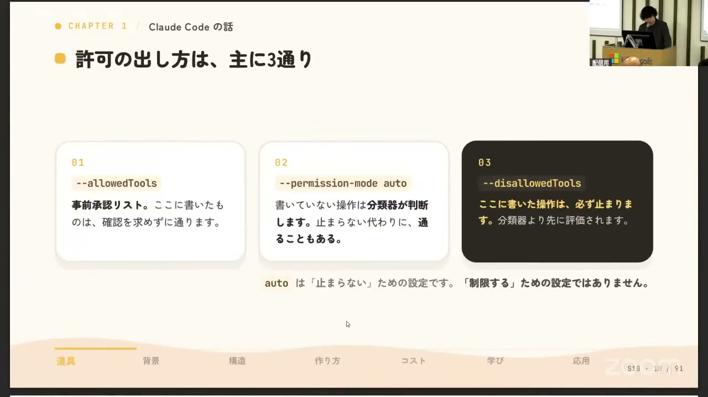
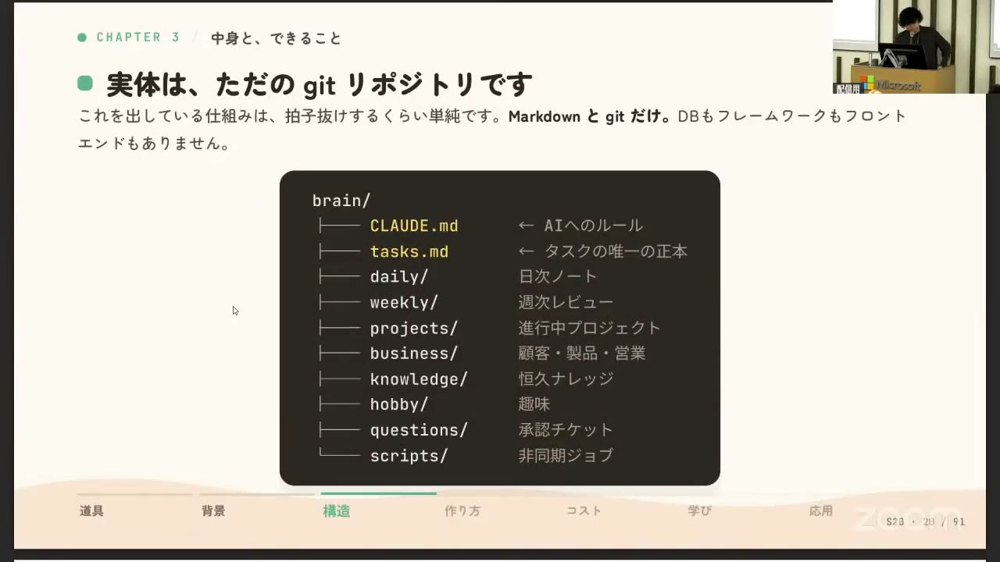
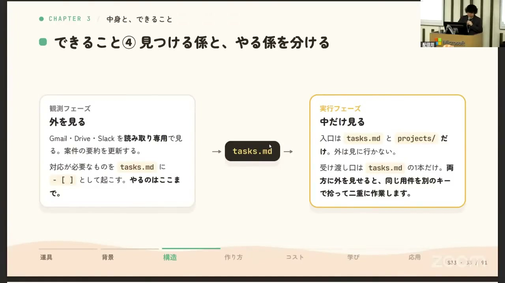
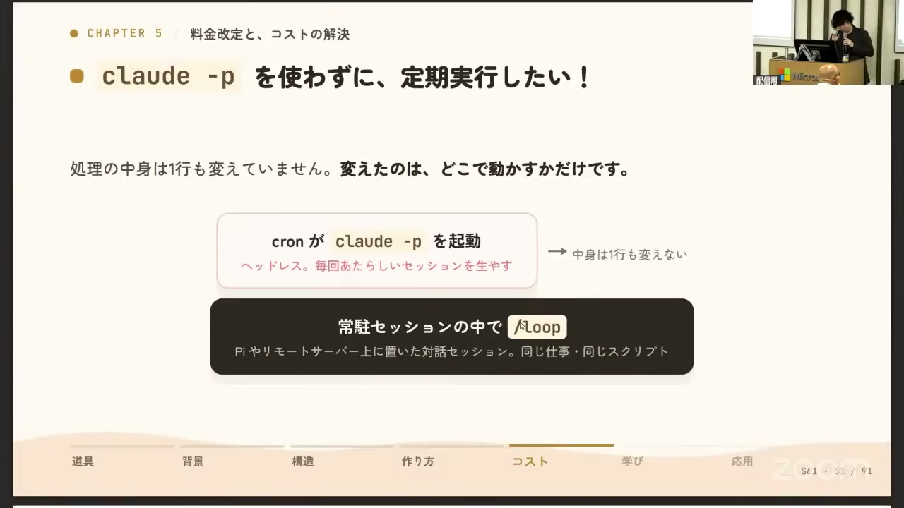
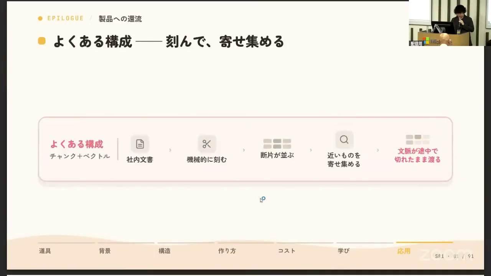

# 【AI駆動開発カンファレンス 2026 夏】「寝てても仕事が進む」Claude Codeで組む第二の脳

[https://www.youtube.com/watch?v=LC8CgyjlIYM](https://www.youtube.com/watch?v=LC8CgyjlIYM)

## 要点

- タスク管理やコンテキスト切り替えの負荷を減らすため、MarkdownファイルとGitリポジトリをベースにした第二の脳「クマブレイン」をClaude Codeで構築している。
- 安全性と自動化を両立するため、読み取り専用の観測フェーズと実行フェーズを分離し、不可逆な操作のみSlackのリアクションを用いた1ステップ承認制を導入している。
- ヘッドレス実行のコスト対策として、tmux上の常駐セッションで`/loop`コマンドを回し、7日間の制限をcronによるセッション再生成で回避するアーキテクチャを採用している。
- 第二の脳で得られた知見を応用し、従来のRAGにおける文脈断絶を解決する単一トピック集約型の「ノート機能」を自社AIプラットフォームへ展開している。

## 詳細

### 第二の脳を支えるClaude Codeの主要機能と権限管理

自然言語で手順を記述できるスラッシュコマンド（.claude/commands/）や、状況に応じて自動発火するスキル（.claude/skills/）を活用している。完全自動化のためにパーミッションモードはオート（permission_mode: auto）に設定しつつ、メール送信やファイル削除などの不可逆な処理はディスアラウドツール（disallowed_tools）に明示指定して事故を防いでいる。

*6:30 — [動画のこの位置を開く](https://www.youtube.com/watch?v=LC8CgyjlIYM&t=390s)*

### MarkdownとGit、Raspberry Piで組むシステム構成

データベースは持たず、ディレクトリ構成自体をスキーマとしたMarkdownファイル群をプライベートGitリポジトリで管理している。重い作業や直接の対話はローカルPCで行い、定期実行ジョブやSlackゲートウェイなどの常駐処理はRaspberry Piに逃がして運用を分散させている。

*11:21 — [動画のこの位置を開く](https://www.youtube.com/watch?v=LC8CgyjlIYM&t=681s)*

### タスク管理・自律実行とSlackによる承認フロー

tasks.md内の「@waiting」タグや期日をgrepで抽出し、毎朝Slackへブリーフィングを送る仕組みを導入している。エージェントの競合を防ぐため「観測フェーズ」と「実行フェーズ」を分離し、承認が必要な操作はチケットファイルを生成してSlackスレッドにリアクションを1回押すだけで完了するよう設計している。

*19:12 — [動画のこの位置を開く](https://www.youtube.com/watch?v=LC8CgyjlIYM&t=1152s)*

### ヘッドレス実行のコスト削減と/loopによる常駐化ハック

差分がない場合や承認ポーリング時はClaudeを起動しない判定を挟んでAPI消費を抑制している。また、ヘッドレス実行の従量課金を避けるため、対話セッション内で`/loop`を実行させている。`/loop`が7日で失効する仕様に対しては、cronで毎日tmuxセッションを作り直すことで永続ループを実現している。

*30:47 — [動画のこの位置を開く](https://www.youtube.com/watch?v=LC8CgyjlIYM&t=1847s)*

### 知見の製品応用：従来のRAGを超えるノート機能

個人用のクマブレインの構造を企業向けAI「クマAI」に応用している。従来のRAG（Retrieval-Augmented Generation）が抱えるチャンク分割による文脈断絶や時系列の混乱を、1トピックを1つのノートに最新情報として集約・上書きする「ノート機能」によって解決している。

*38:39 — [動画のこの位置を開く](https://www.youtube.com/watch?v=LC8CgyjlIYM&t=2319s)*

## 用語

- **パーミッションモード**（Permission Mode） — Claude Codeなどのツール実行時に、ユーザーへの都度確認を省略して安全な操作を自動実行するかどうかを制御する設定モード。
- **ディスアラウドツール**（disallowed_tools） — AIエージェントに対して明示的に呼び出しを禁止・制限するツールの指定リスト。
- **RAG**（Retrieval-Augmented Generation） — 外部ドキュメントを検索してプロンプトに追加し、LLMの回答精度を向上させる技術手法。

## 所感

<!-- ここは自分で書く -->
