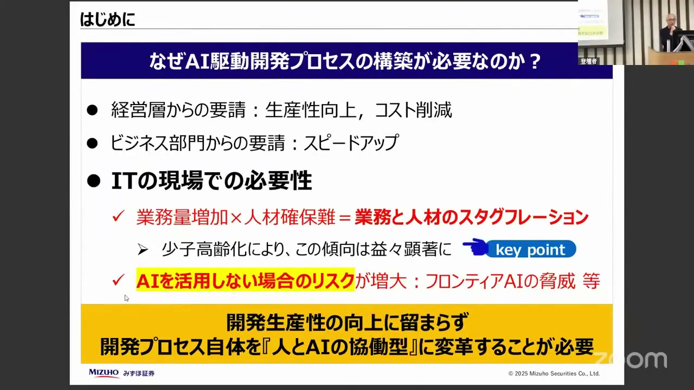
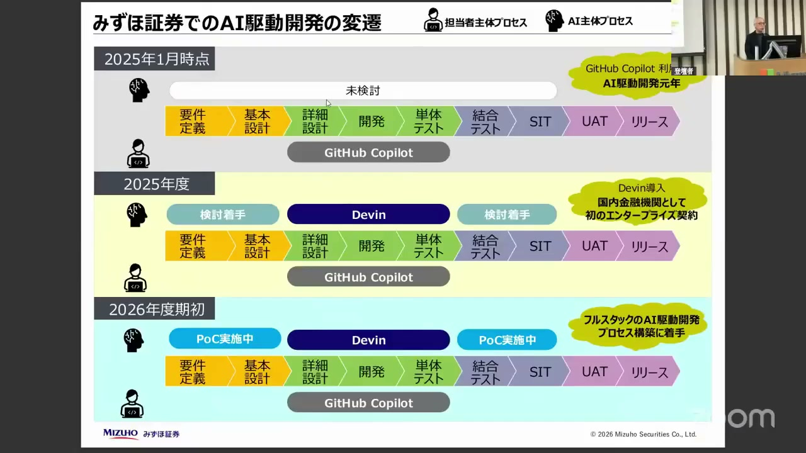
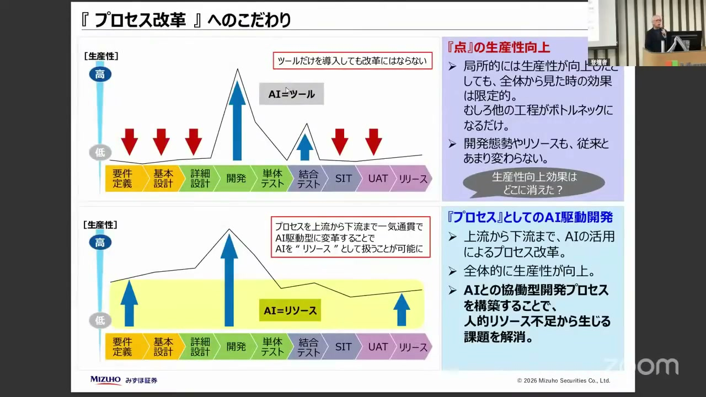
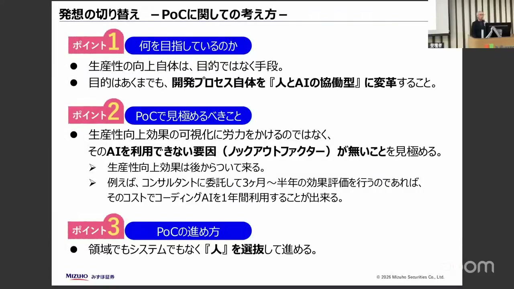
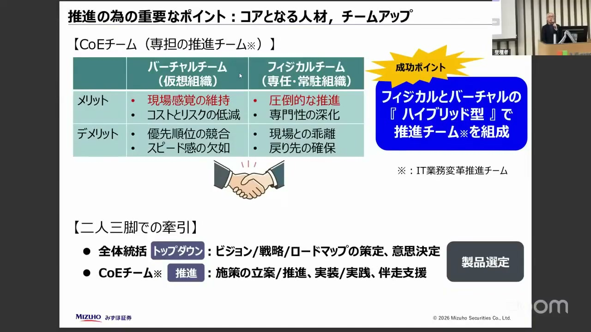

# 【AI駆動開発カンファレンス 2026 夏】みずほ証券スタイルのAI駆動開発－ これまでの取り組みと今後のビジョン ー

[https://www.youtube.com/watch?v=Kfmjc8nJIvw](https://www.youtube.com/watch?v=Kfmjc8nJIvw)

## 要点

- IT現場における業務量の増加と人材不足の深刻化に対処するため、人とAIが協働して役割を代替する開発プロセスへの変革が求められている。
- 上流の要件定義から中流のコーディング、下流のテスト工程までを一気通貫でAI駆動型にする「フルスタックのAI駆動開発プロセス」の構築を進めている。
- POC（概念実証）では生産性向上効果の数値化に固執せず、阻害要因（ノックアウトファクター）がないことを確認して、感度の高い人材を中心に早く実務で使い始めることが重要である。
- 2023年度からのGitHub移行を含むインフラ・セキュリティ整備という土台と、専任・兼務を融合したCOE（Center of Excellence）体制の確立が、短期間でのAI推進を支えている。

## 詳細

### 背景：IT現場における人材と業務の「スタグフレーション」

経営層からは生産性向上やコスト削減を求められ、ビジネス部門からは開発スピードの向上を要求される一方、IT現場ではDX推進等による業務量の増加と深刻なIT人材不足が重なる「スタグフレーション状態」が起きています。また、AIを不使用とするリスクはコントロールが極めて難しいため、開発プロセス自体を人とAIの協働型へシフトすることが不可欠な状況となっています。

*2:59 — [動画のこの位置を開く](https://www.youtube.com/watch?v=Kfmjc8nJIvw&t=179s)*

### みずほ証券が取り組む「フルスタックAI駆動開発プロセス」

2025年1月にGitHub Copilotを活用開始後、2025年度中には自律型AIデベロッパー「Devin」を国内金融機関で初めてエンタープライズ導入しました。現在構築中のプロセスでは、要件定義からマークダウン形式の設計書を自動生成し、それをDevinが読み込んでコーディングを行い、さらにその設計書から「Genesis Nexus」がテストケースを自動生成して実行するという、上流から下流まで一気通貫した自動化連携を目指しています。

*14:42 — [動画のこの位置を開く](https://www.youtube.com/watch?v=Kfmjc8nJIvw&t=882s)*

### 点の生産性向上にとどまらない「プロセス改革」へのこだわり

コーディングなどの特定の工程（点）だけAIによって生産性を劇的に向上させても、他の工程がボトルネックとなり全体のリリースリードタイムは短縮されません。そのため、プロセス全体をAI駆動型に変革することにこだわっています。さらに、コーディングAIからナレッジ（JiraやRedmine、障害管理、設計書等のコンテキスト）を切り離してデータプラットフォーム「Snowflake」に集約し、AIが適宜それを参照できる仕組みの評価も並行して進めています。

*18:41 — [動画のこの位置を開く](https://www.youtube.com/watch?v=Kfmjc8nJIvw&t=1121s)*

### POC（概念実証）における発想の転換

POCにおいて生産性向上効果を細かく可視化する労力を割くよりも、利用できない要因（ノックアウトファクター）がないことを素早く確認して使い始めるべきです。AIツールは実務で使いこなすことで後から効果が付いてくるため、外部委託での長期POCにお金をかけるより先に導入する方がコスト効率的です。また、POCは特定のシステムや領域ではなく、感度の高い「人」を選定して実施し、その周囲から段階的に普及させています。

*22:01 — [動画のこの位置を開く](https://www.youtube.com/watch?v=Kfmjc8nJIvw&t=1321s)*

### 2023年度からの準備と、ハイブリッド型COEによる推進体制

わずか1年半でAI駆動開発を進められた背景には、2023年度からオンプレミスのSubversionからGitHub Cloudへのリポジトリ移行、セキュリティ対策、CI/CDパイプライン構築などの前準備を徹底してきたことがあります。さらに推進体制として、10名強の専任メンバー（フィジカル）と現場の兼務者20〜30名（バーチャル）からなるハイブリッド型のCOE（Center of Excellence）チームを組成し、トップダウンの意思決定と現場のボトムアップの変革を繋いでいます。

*29:07 — [動画のこの位置を開く](https://www.youtube.com/watch?v=Kfmjc8nJIvw&t=1747s)*

## 用語

- **デビン**（Devin） — Cognition社が開発した、自律的にコーディングや問題解決を行うことができる世界初の自律型AIソフトウェアエンジニア。みずほ証券では国内金融機関で初となるエンタープライズ契約を結び導入している。
- **ジェネシス ネクサス**（Genesis Nexus） — オーファイサー（Ofigar）社が提供する、テスト工程の自動化やテストケース作成などを行うためのAIツール。
- **スノーフレーク**（Snowflake） — クラウドベースのデータプラットフォーム。みずほ証券ではコーディングAIと連携させ、変更チケット（Jira/Redmine）や障害管理情報、設計ドキュメントなどのナレッジを一元的に集約する先として検証している。
- **COE**（Center of Excellence） — 組織内の優秀な人材やノウハウを集約し、特定の技術やビジネス領域を横断的にリードして推進する専門組織。

## 所感

<!-- ここは自分で書く -->
