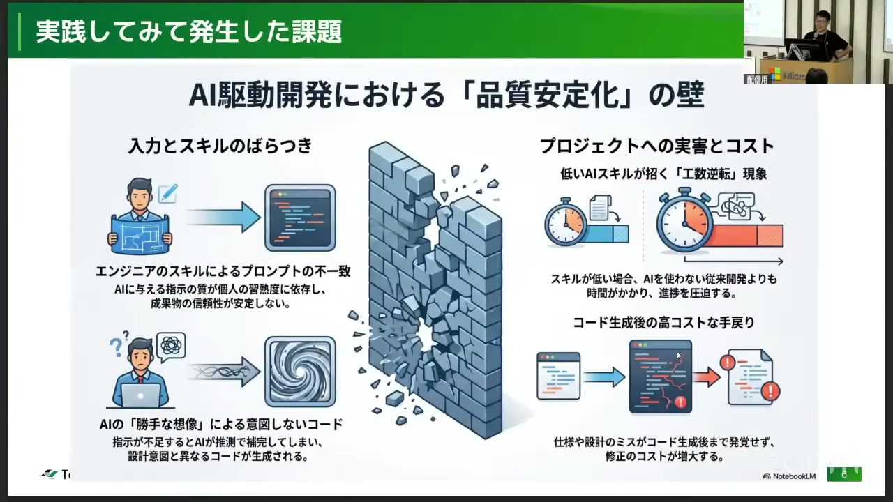
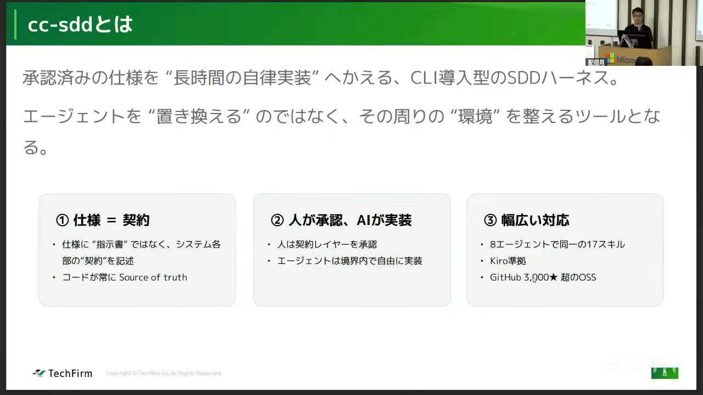
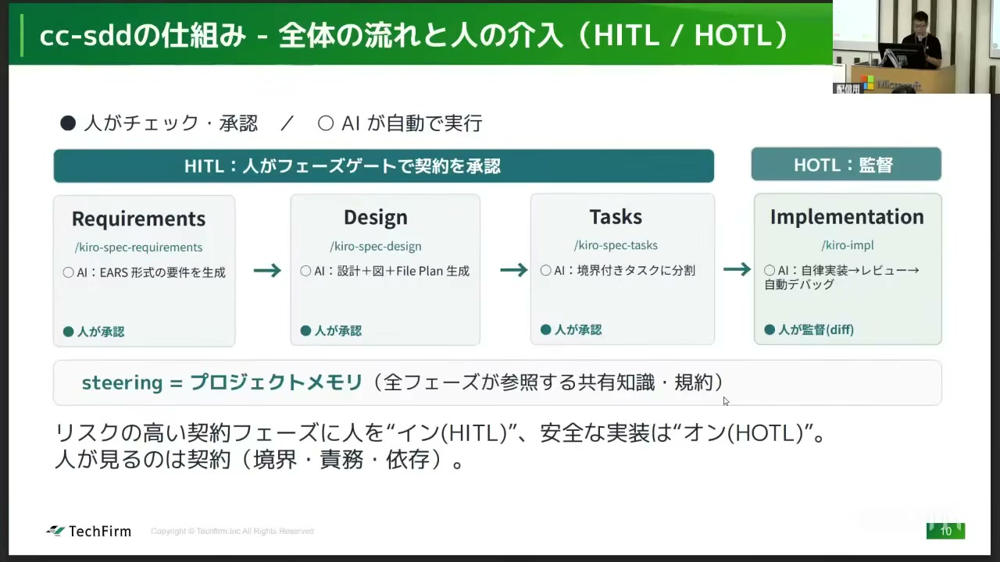
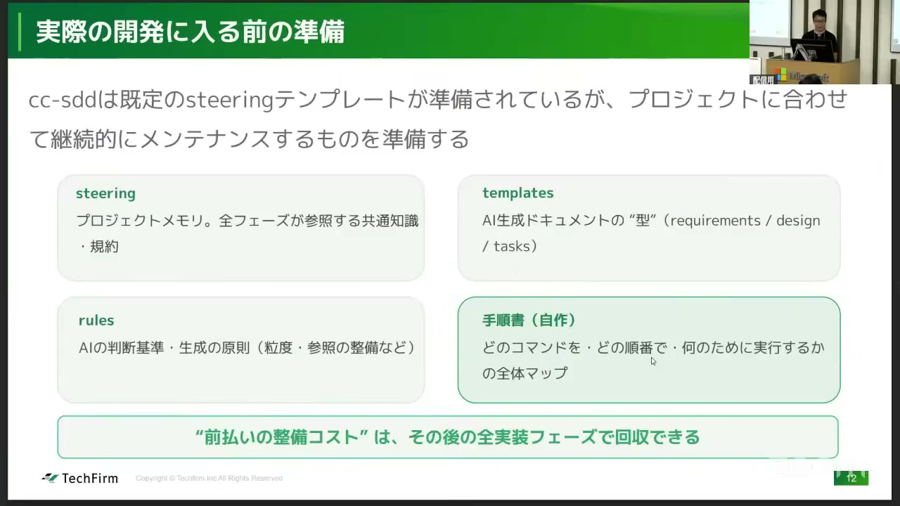
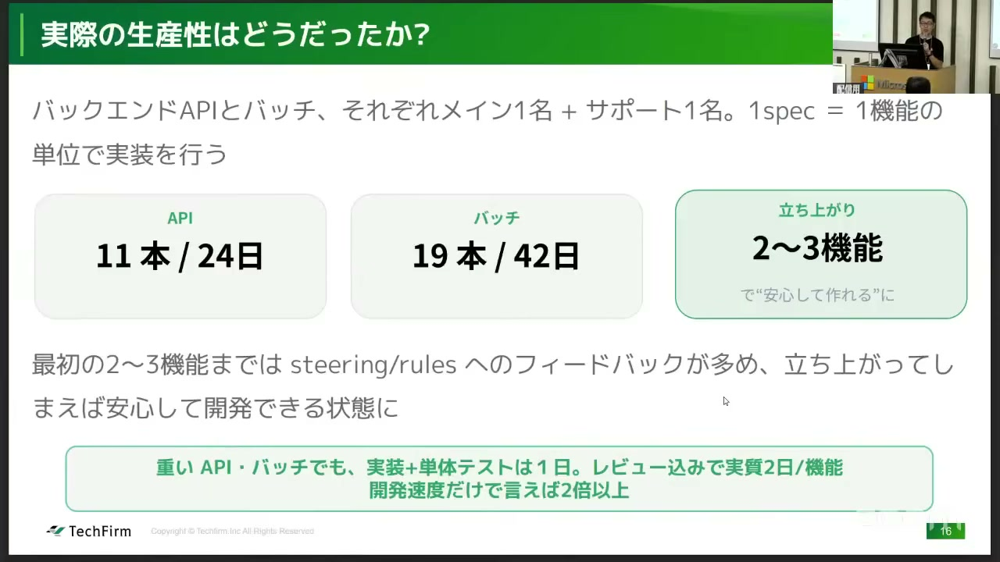

# 【AI駆動開発カンファレンス 2026 夏】新規開発案件でSDDを使ってAI駆動開発してみた

[https://www.youtube.com/watch?v=WBRiM17-UfE](https://www.youtube.com/watch?v=WBRiM17-UfE)

## 要点

- AI駆動開発において品質を安定させるため、仕様を命令ではなくAIが守るべき「契約・境界」として扱う仕様駆動開発（SDD）のアプローチが有効である。
- CCSDDなどのハーネスを導入して要件・設計・タスクの各フェーズで人間が承認（HITL）を行うことで、エンジニアのスキル差による成果物の品質下限を底上げできる。
- AI向けのルールや参照ドキュメントの整理に加え、人間向けの手順書を事前に整備する「前払いの準備コスト」をかけることで、実装フェーズで2倍以上の開発速度を達成できる。

## 詳細

### AI駆動開発の初期に直面した4つの課題

AI駆動開発の初期には、エンジニアのAIスキルやプロンプトの習熟度によって成果物の品質がぶれ、手作業よりも工数が逆転してしまう問題がありました。また、AIが勝手な想像で意図しないコードを生成することや、設計時点の誤りがコード生成後に見つかって手戻りコストが増大するという課題が発生しました。

*11:56 — [動画のこの位置を開く](https://www.youtube.com/watch?v=WBRiM17-UfE&t=716s)*

### CCSDDの導入と仕様を「契約」とする考え方

品質のばらつきを抑えるため、仕様駆動開発（SDD: Specification-Driven Development）ワークフローを取り入れたツール「CCSDD」を導入しました。仕様をエージェントへの完全な命令とするのではなく「守るべき契約（境界）」と定義し、境界の内側における詳細設計や実装の自由度をAIに委ねるアプローチを取っています。

*17:27 — [動画のこの位置を開く](https://www.youtube.com/watch?v=WBRiM17-UfE&t=1047s)*

### ゲート承認による開発プロセスと品質の下限保証

開発は「要件定義（Requirements）」「設計（Design）」「タスク生成（Tasks）」「実装（Implementation）」の順で進められ、コード生成前の各ゲートで人間が契約内容を承認するヒューマン・イン・ザ・ループ（HITL: Human-in-the-Loop）を採用しています。これによりレビュー対象が仕様準拠の確認に絞られ、誰が担当しても一定の品質下限が保たれるようになります。

*22:59 — [動画のこの位置を開く](https://www.youtube.com/watch?v=WBRiM17-UfE&t=1379s)*

### 参照ドキュメントの設計と人間向け手順書の整備

AIが大量のドキュメントを正しく扱えるよう、機能ごとに参照すべきドキュメントを整理してルール（Rules）に落とし込みました。さらに、チームへ途中参加したメンバーでも迷わず同じ手順で操作できるよう、人間向けの実行手順書を用意するなど、実装前の準備にコストをかけることがプロジェクト成功の鍵となりました。

*30:24 — [動画のこの位置を開く](https://www.youtube.com/watch?v=WBRiM17-UfE&t=1824s)*

### 導入成果：コードレビューの質向上と開発生産性2倍の達成

AIが生成したコードのレビュー自体は内容把握に時間がかかるものの、仕様（契約）と設計が明確に残るためレビューの質そのものは向上しました。初期のルール調整を経て立ち上がった後は、重いAPIやバッチ処理でも実装からテスト・レビュー完了まで実質2日で完了し、従来の2倍以上の開発生産性を実現しました。

*37:31 — [動画のこの位置を開く](https://www.youtube.com/watch?v=WBRiM17-UfE&t=2251s)*

## 用語

- **仕様駆動開発**（SDD (Specification-Driven Development)） — コードの生成や実装に先立ち、明確に合意・定義された仕様（スペック）を起点として開発を進める手法。
- **ハーネスエンジニアリング**（Harness Engineering） — AIエージェントの動作範囲や人間の確認プロセスを一定の仕組み・枠組みで固定し、品質のばらつきを防ぐ取り組み。
- **ヒューマン・イン・ザ・ループ**（HITL (Human-in-the-Loop)） — AIによる自動プロセスの各重要フェーズに人間の確認・承認ゲートを挟み、品質や安全性を担保する仕組み。

## 所感

<!-- ここは自分で書く -->
