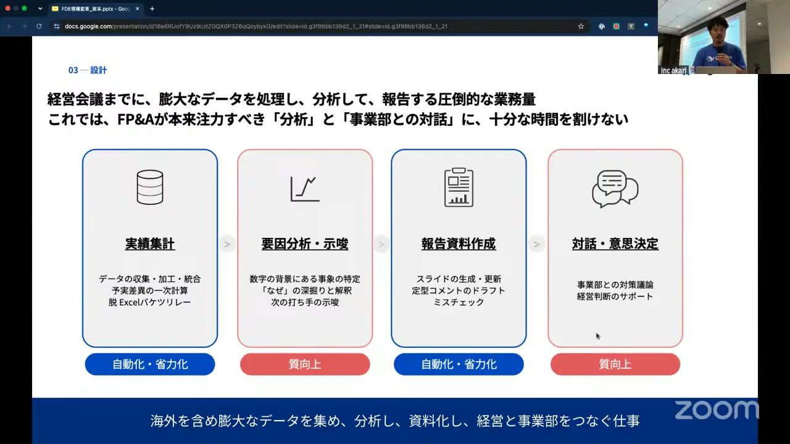
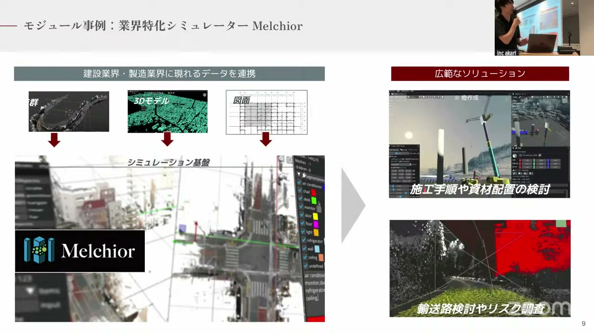
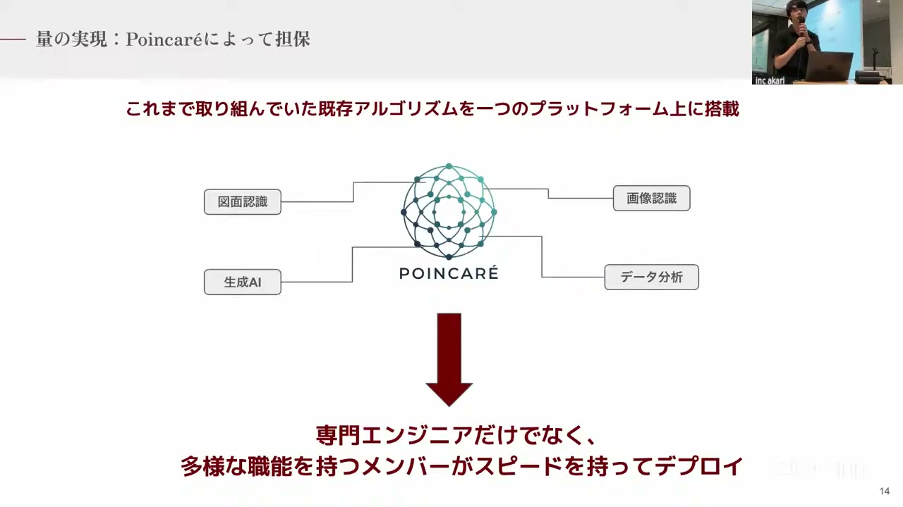
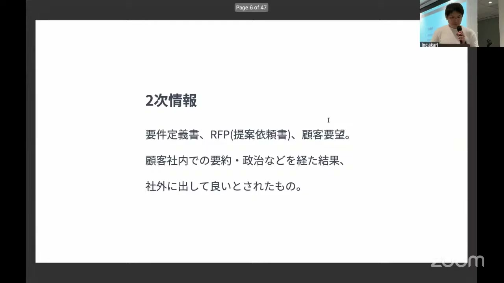
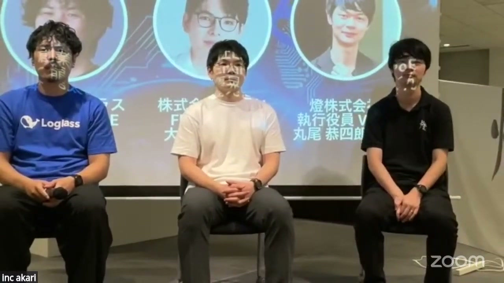

# 【AI駆動開発（番外編）】現場変革スペシャル #1

[https://www.youtube.com/watch?v=umnoC6KltxI](https://www.youtube.com/watch?v=umnoC6KltxI)

## 要点

- 顧客が口にする要望や要件定義書は「2次情報」であり、現場で無意識に行われている言語化されていない「0次情報」を捉えることこそがAI時代における価値提供の本質である。
- 技術的知識を持ったエンジニア（FDE）が自ら現場に入り込みアンテナを張ることで、初めて現場の0次情報をキャッチし、本質的な課題解決を設計できる。
- 個別開発による労働集約的なボトルネックを突破するためには、現場の課題解決から共通の「技術モジュール」を切り出し、専門職以外でもデプロイできるプラットフォームを構築して民主化することが重要である。
- 高度なAI技術を現場に導入しても、誰がその出力責任を持ち、組織としてどう意思決定に活かすかという人間社会のプロセスまで設計しなければ価値は生まれない。

## 詳細

### 元CTOが現場に出る理由：AIと人間組織の意思決定の接続

株式会社ログラスの坂本氏は、経営管理領域においてAIを活用した意思決定の高度化に取り組んでいます。AIが「事業から撤退すべき」と正論を導き出しても、そのままでは経営会議の材料にはなりません。誰が出力責任を持ち、どのような材料があれば人間が判断できるのかという「組織の仕組み」に接続するために、元CTO自らがFDE（Forward Deployed Engineer）として現場に深く入り込む必要があります。個別最適で終わらせず、再現性のあるプラットフォームへ還元していくことがFDEの役割です。

*29:06 — [動画のこの位置を開く](https://www.youtube.com/watch?v=umnoC6KltxI&t=1746s)*

### バーティカルな現場から技術モジュールを創出して事業資産化する

燈株式会社の丸尾氏は、建設・製造などの特定ドメイン（バーティカル領域）の現場に入り込み、手書き図面などの「泥臭いデータ」を扱う開発を推進してきました。1社ずつの個別課題を解決する中で、同じドメインにおける共通ニーズを切り出し、業界特化型シミュレーター「Melchior」などの「技術モジュール」を創出。これにより、個別の高度な開発をスケール可能な事業資産へと変換しています。

*57:02 — [動画のこの位置を開く](https://www.youtube.com/watch?v=umnoC6KltxI&t=3422s)*

### 専門外のメンバーでも検証・デプロイを可能にする「民主化」

個別開発における最大のボトルネックは、ドメイン理解・AI技術・デプロイ・PMのすべてを兼ね備えた希少なエンジニアの人的リソースです。燈では、既存のアルゴリズムや解析技術を1つの基盤に搭載した社内共通プラットフォーム「Poincare」を開発。汎用的なAIを載せるのではなく、業界特有のユースケースに特化したアルゴリズムをあらかじめ実装することで、非技術職のメンバーでもクイックにAIを検証・デプロイできる環境を整え、事業のスケールを実現しました。

*1:01:47 — [動画のこの位置を開く](https://www.youtube.com/watch?v=umnoC6KltxI&t=3707s)*

### 顧客の要望は2次情報：情報の非圧縮と「0次情報」の価値

株式会社LayerXの大治氏は、情報の解像度には「次数」があると定義します。顧客から提示される要件定義書（2次情報）は、現場の声（1次情報）が組織の要約や政治的プロセスを経て「非可逆的に圧縮」されたものです。本質的な解決を阻む真の要因は、現場の作業者すら無意識で行っている「0次情報（誰も言語化していない現象）」の中に存在します。FDEが技術知識を持ったアンテナとして現場に赴くことで、この0次情報を直接キャッチし、抽象化してプロダクトへ還元することが可能になります。

*1:15:42 — [動画のこの位置を開く](https://www.youtube.com/watch?v=umnoC6KltxI&t=4542s)*

### クロストーク：現場から本音を引き出し、アセットに昇華する手法

顧客の表面的な要望に騙されず本質を探るためには、まず感情的な負荷と時間的な負荷をマッピングするなどの対話アプローチで心理的距離を近づけ、腹を割って話せる関係を作ることが不可欠です。また、得られた0次情報をアセット化する際は、現状のベストケースから引き算を行い「本当に必要なもの」を磨き上げること、そして投資対効果（ROI）を精緻に計算して「あるべき姿（To-Be）」とのギャップを明らかにすることが重要であると議論されました。

*1:35:10 — [動画のこの位置を開く](https://www.youtube.com/watch?v=umnoC6KltxI&t=5710s)*

## 用語

- **FDE**（Forward Deployed Engineer） — フォワードデプロイ型エンジニア。顧客の現場に深く入り込み、直接課題をヒアリングして、実運用に耐えうるシステムの構築とデプロイを迅速に行うロール。
- **0次情報**（Zero-th order information） — 当事者ですら無意識で言語化できていない、現場で実際に起きているありのままの事象や現象のこと。
- **バーティカル**（Vertical） — 特定の業界や業種（建設業、製造業など）に特化して、深く掘り下げたソリューションやサービスを提供するビジネスモデル。
- **DS**（Deployment Strategist） — デプロイメントストラテジスト。開発したプロダクトやAIを、顧客の組織や業務プロセスに合わせて最適に展開・定着させるための戦略を練る役割。

## 所感

<!-- ここは自分で書く -->
