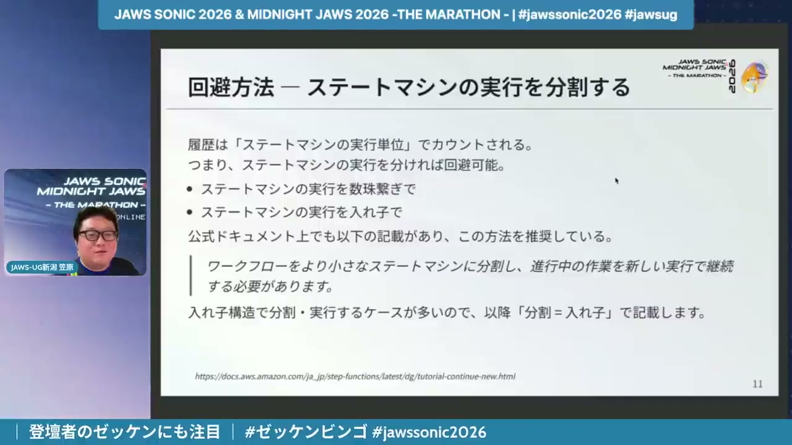
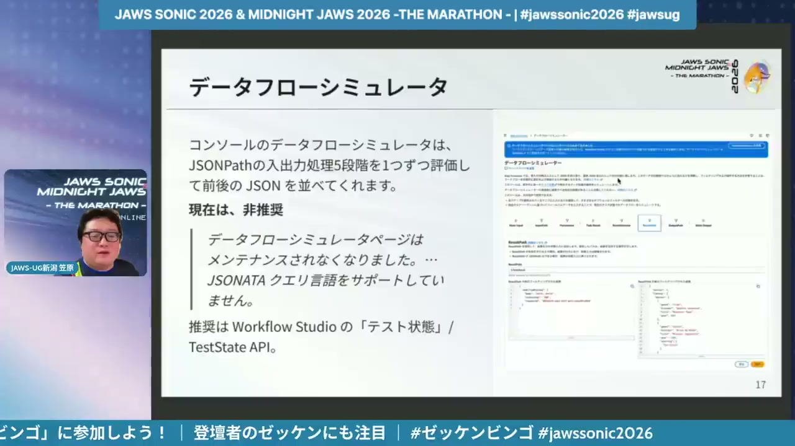
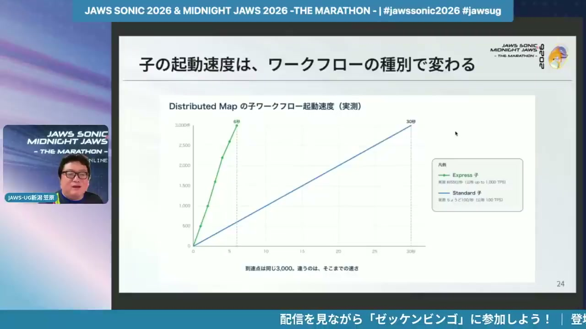
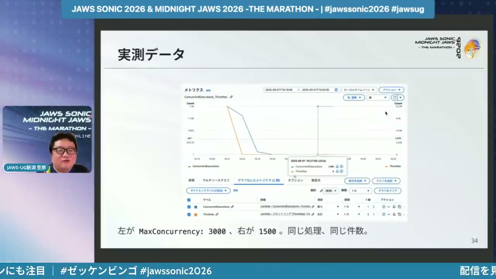

# 【JAWS SONIC 2026】AWS Step Functions 大規模並列の壁を越える

[https://www.youtube.com/watch?v=rra1MW3dd4I](https://www.youtube.com/watch?v=rra1MW3dd4I)

## 要点

- AWS Step Functionsのスタンダードワークフローには25,000イベント履歴のハードクォータがあり、大規模処理ではステートマシンを分割して回避する必要がある。
- ワークフロー分割時のデータ受け渡しは256KB上限があるため、JSONataや変数化（Assign）を活用して入出力を最小限に絞る。
- 大規模並列処理にはDistributed Mapが有効であり、子ワークフローをExpressにすることで起動速度を高められる。
- 並列度を過剰に上げると下流のLambda等のスケーリングレート制限でスロットリングが発生するため、MaxConcurrencyで適切に同時実行数を抑える必要がある。

## 詳細

### 実行イベント履歴25,000件の制約と入れ子分割

スタンダードワークフロー（Standard Workflows）には25,000実行イベントのハードクォータがあり、ループ処理などを行うと状態遷移数（課金対象）よりも早くイベント上限に達して失敗します。このイベント履歴はステートマシンの実行単位でカウントされるため、処理を入れ子構造などに分割して別のステートマシンを呼び出すことで回避できます。分割時は追跡性を保つため、タスクステートから子ステートマシンを実行し、親子の実行IDをリンクさせることが推奨されます。

*4:00 — [動画のこの位置を開く](https://www.youtube.com/watch?v=rra1MW3dd4I&t=240s)*

### ペイロード上限256KBとJSONataによる入出力制御

ステートマシンの入出力ペイロードには256KBのハードクォータが存在するため、分割したワークフロー間のデータ受け渡しサイズを調整する必要があります。JSONata（ジェイソンナタ）を採用すると、ArgumentsやOutputを用いてJSONPath（ジェイソンパス）よりもシンプルな指定で入出力を加工できます。また、Assign機能を使って必要な値を変数化し、不要なデータを入出力に載せないように制御することも有効です。

*6:31 — [動画のこの位置を開く](https://www.youtube.com/watch?v=rra1MW3dd4I&t=391s)*

### Distributed Mapによる並列化とワークフロー種別

数千規模の並列処理を行う際は、S3バケット内のファイル処理などに強みを持つ分散マップ（Distributed Map）が強力な手段となります。子ワークフローにはスタンダードとエクスプレス（Express Workflows）が選択可能で、起動速度を優先する場合は最大1,000TPSを誇るエクスプレスの採用が適しています。実際に計測した検証では、スタンダードが秒間約100件の起動だったのに対し、エクスプレスはその倍程度の速度で起動しました。

*9:34 — [動画のこの位置を開く](https://www.youtube.com/watch?v=rra1MW3dd4I&t=574s)*

### 下流サービスのクォータとMaxConcurrencyによる最適化

並列度を過剰に引き上げると、下流サービスであるAWS Lambda（ラムダ）側のスケーリングレートやリクエスト速度のハードクォータに衝突し、スロットリングが発生します。3,000並列のLambda（30秒待機）を実行した検証では、3,000並列のままだとスロットリングにより約4分半かかりましたが、MaxConcurrency（最大同時実行数）を1,500に制限したところスロットリングが0になり約2分で完了しました。並列度は単に上げるのではなく、適切に絞り込む制御が重要です。

*13:38 — [動画のこの位置を開く](https://www.youtube.com/watch?v=rra1MW3dd4I&t=818s)*

## 用語

- **ハードクォータ**（Hard Quota） — AWS側で定められた上限値のうち、サポートへの申請などによる上限緩和（引き上げ）が不可能な固定の制約。
- **JSONata**（JSONata） — JSONデータを変換・抽出するための軽量クエリ言語。Step Functionsの入出力処理を簡潔に定義できる。
- **分散マップ**（Distributed Map） — AWS Step FunctionsのMapステートの一種で、大量のデータやワークフローを高並列かつ分散して実行する機能。
- **スケーリングレート**（Scaling Rate） — Lambda関数などの同時実行数が急増する際に、一定時間あたりにスケールできる速度の上限。

## 所感

<!-- ここは自分で書く -->
