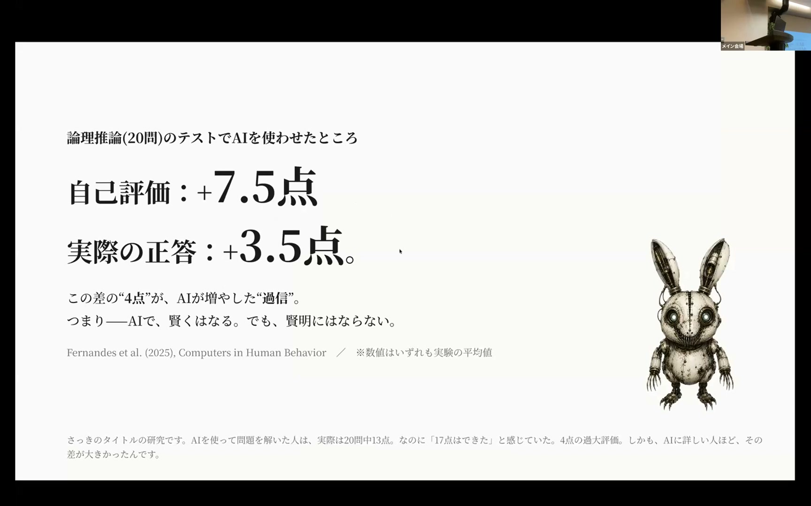
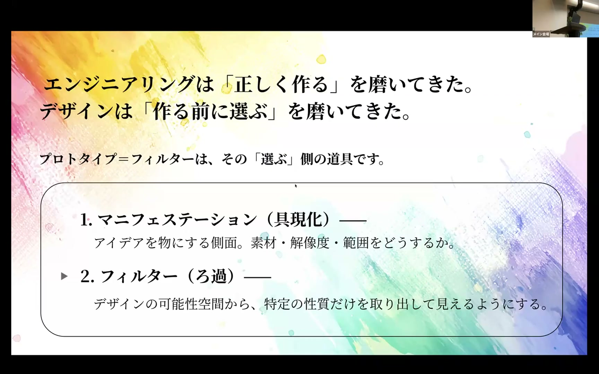

# アウトプットは速くなった。では、チームの学びは速くなったのか？ AI時代の内製スクラムチームで学んだ、価値探索を前に進める問いのデザイン tsuyoshi kaneko

[https://www.youtube.com/watch?v=BtQ7RglXVxI](https://www.youtube.com/watch?v=BtQ7RglXVxI)

## 要点

- AIの普及により成果物を作る速度は上がったが、綺麗に整った成果物を手放せなくなることでチームの学習速度が落ちる問題が起きている。
- 検証したい問いを決めずに成果物を作ると、レビューが全方位の感想戦になって議論が発散し、後から大きな手戻りの利子を払うことになる。
- チームの学びを加速させるには、作る前に検証したいことを決める「検査のデザイン」と、結果が外れたと明確に分かる「反証可能性」を持った問いが必要である。
- プロトタイプはミニチュアではなく不要な論点を止めるフィルターであり、AI時代においても何を選び・止めるかを判断するコストは下がっていない。

## 詳細

### 成果物の高速化と手放せなくなる罠

AIの登場によってそれらしい企画書やプロトタイプが一瞬で生成できるようになりました。しかし、成果物の見栄えが最初から整っていることで「もったいない」と感じて手放せなくなり、捨てる理由が見つからないまま不要な機能や仕様が積み上がってチームが前に進まなくなる現象が起きています。

*4:49 — [動画のこの位置を開く](https://www.youtube.com/watch?v=BtQ7RglXVxI&t=289s)*

### 説明度の錯覚とAIによる過大評価

なんとなく分かったつもりになる現象を「説明度の錯覚」と呼びます。AIを利用した実験では実際の推論スコア以上に自己評価が肥大化することが示されており、AIは人を賢くしても懸命にはしません。思考の粗さが成果物の粗さとして表れにくくなったため、本当に検討が深まっているのか見極めが難しくなっています。

*8:12 — [動画のこの位置を開く](https://www.youtube.com/watch?v=BtQ7RglXVxI&t=492s)*

### 問いの不在が生む全方位の感想戦

何を確かめたいかを決めずに成果物をレビューに出すと、参加者から多角的なフィードバックが際限なく集まる「全方位の感想戦」に陥ります。最初に問いを立てずに進めると、後から手戻りという形で重い利子を支払うことになるため、作る前に検証したい論点を1つに絞り込む必要があります。

*13:06 — [動画のこの位置を開く](https://www.youtube.com/watch?v=BtQ7RglXVxI&t=786s)*

### 検査のデザインとフィルターとしてのプロトタイプ

プロトタイプの本質はミニチュアではなく、無限の選択肢から不要なものを止めて論点を絞る「フィルター」です。検証を成立させるには、結果が間違っていたら間違いと判定できる「反証可能性」の高い問いを立てることが不可欠です。AIが効率化したのは作る工程だけであり、何を止めて何を選ぶかを決める人間の判断コストは変わっていません。

*16:45 — [動画のこの位置を開く](https://www.youtube.com/watch?v=BtQ7RglXVxI&t=1005s)*

## 用語

- **説明度の錯覚**（Illusion of Explanatory Depth） — 実際には仕組みを詳しく説明できないにもかかわらず、自分は十分に理解していると思い込んでしまう認知バイアスのこと。
- **反証可能性**（Falsifiability） — 仮説や問いが、観察や実験の結果によって「間違いである」と証明できる余地を持っている性質のこと。

## 所感

<!-- ここは自分で書く -->
