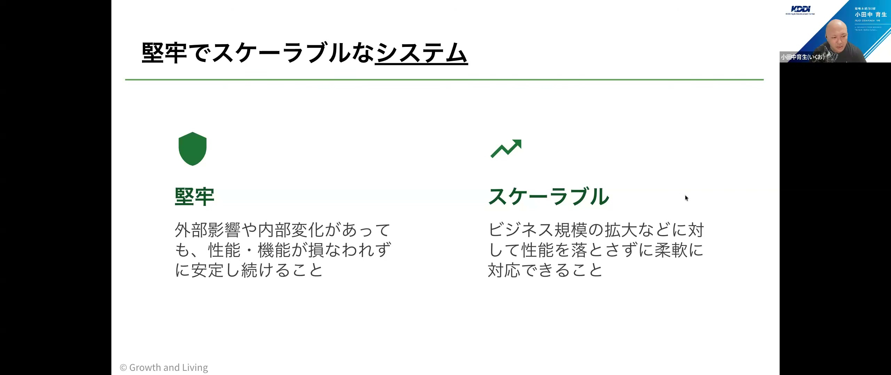
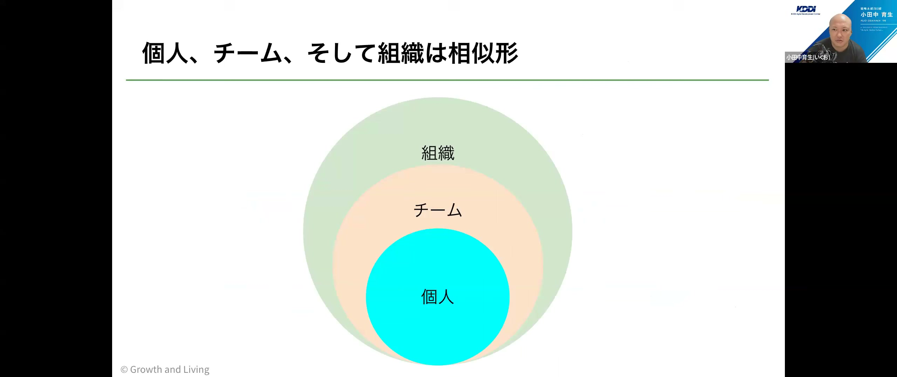
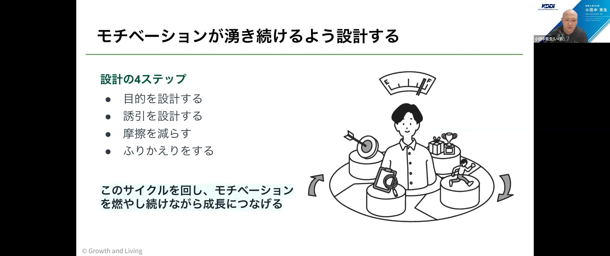
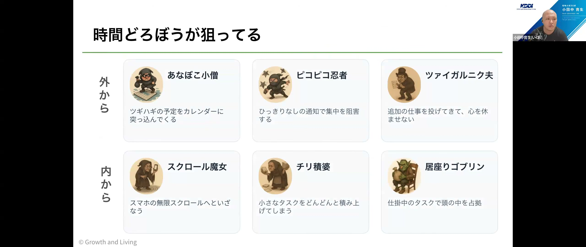
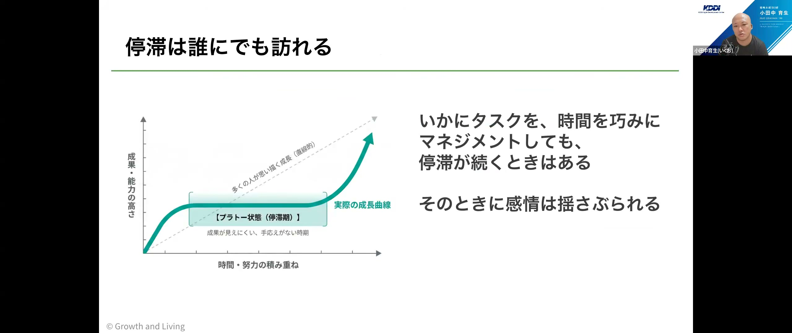
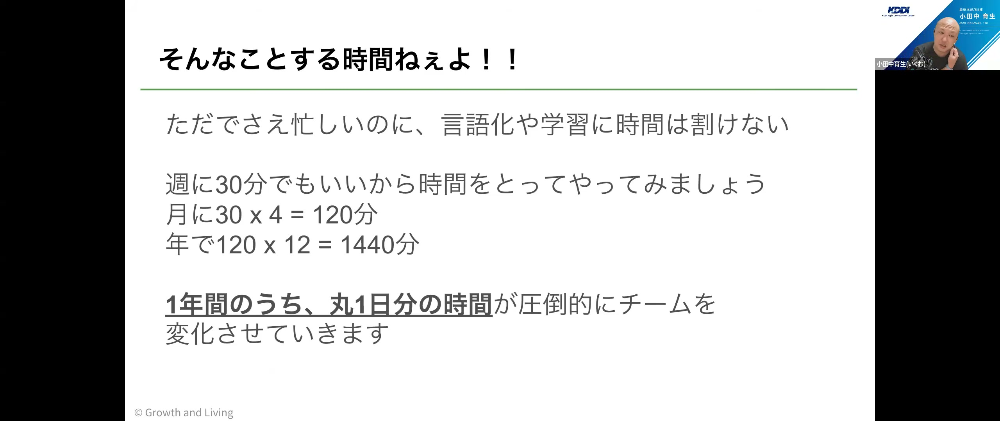
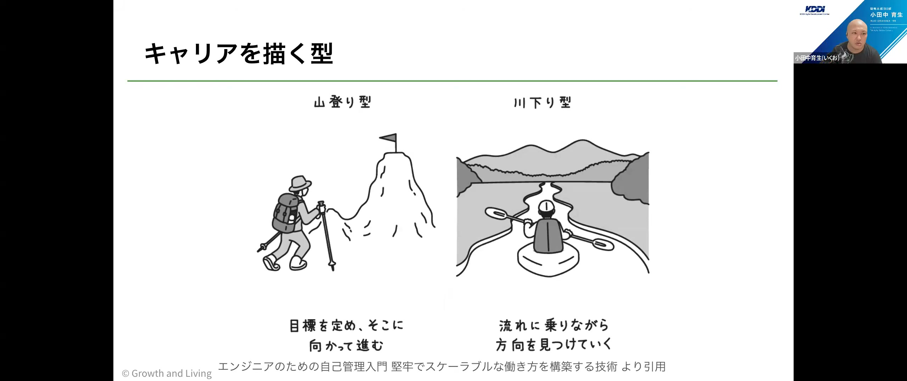

# エンジニアのための自己管理入門 堅牢でスケーラブルな働き方を構築する技術 / 小田中育生

[https://www.youtube.com/watch?v=p1ojdgQ7Ohs](https://www.youtube.com/watch?v=p1ojdgQ7Ohs)

## 要点

- セルフマネジメントにおける「堅牢」とは消耗を回避する余白を持つことであり、「スケーラブル」とは仕事の拡大に対し優先順位付けや委譲・自身の成長によって柔軟に適応できることである。
- 脆いチームはリソース効率の過度な追求や属人化によって余白を失うことで生まれ、個人・チーム・組織の相似形を意識してまず個人の自己管理から変化を起こすことが重要である。
- 自己管理は「モチベーション」「タスク・タイム」「アンガー・ストレス」「スキル」「キャリア」の5領域を一連の営みとして構造的に捉え、個人の根性ではなく仕組みとして実践する必要がある。
- キャリア形成には明確なゴールを目指す山登り型だけでなく偶然を活かす川下り型があり、定期的な見直し（ダブルループ学習）やコミュニティ活動を通じた繋がりが機会を広げる。

## 詳細

### 堅牢でスケーラブルな働き方と脆いチームの構造

堅牢さとは外部影響や内部変化に対して消耗を回避し余白を持つことであり、スケーラビリティとは業務拡大に対して適切な優先順位付けや委譲によって柔軟に対応できる能力を指します。チームにおいてリソース効率の追求や特定個人への依存（属人化）が進むと、学習機会や対話といった「余白」が奪われ、変化に脆いチームが形成されてしまいます。アジャイルソフトウェア開発宣言にある持続可能性や変化への適応を実現するためにも、余白の維持が不可欠です。

*20:57 — [動画のこの位置を開く](https://www.youtube.com/watch?v=p1ojdgQ7Ohs&t=1257s)*

### 個人・チーム・組織の相似形とアプローチ

個人、チーム、組織のあり方は相似形（フラクタル構造）の関係にあります。組織全体を一気に変えるのは困難ですが、チーム、そして個人へとスコープを小さくするほど変革のハードルは下がります。組織がマイクロマネジメントや失敗を許さない文化で縛ると個人の自己管理が阻害されるため、まずは自分自身のセルフマネジメントから始め、その自立をチーム、さらには組織へと波及させていくアプローチが有効です。

*27:44 — [動画のこの位置を開く](https://www.youtube.com/watch?v=p1ojdgQ7Ohs&t=1664s)*

### モチベーションマネジメント：仕組みで意欲を維持する

未知のソフトウェア開発や激しい変化に向き合うには、個人のやる気頼みではなく仕組みとしてのモチベーション維持が求められます。外発的動機だけでなく、好奇心や価値実感を伴う内発的動機を引き出すことが重要です。具体的には「目的の設計」「誘因の設計」「摩擦の低減」「振り返り」のサイクルを回すことで、意欲が湧き続ける環境を整えます。

*35:08 — [動画のこの位置を開く](https://www.youtube.com/watch?v=p1ojdgQ7Ohs&t=2108s)*

### タスク・タイムマネジメント：時間泥棒の排除と委譲の可視化

業務効率が上がっても新たな仕事でカレンダーが埋まる「ジェボンズのパラドックス」に対抗するため、通知や割り込みといった内外の「時間泥棒」を仕組みで防ぐ必要があります。WIP（Work In Progress: 仕掛かり）を1に絞ることやタイムボクシングが有効です。さらにチーム内では、デリゲーションポーカー（Delegation Poker）などを活用して誰にどの程度タスクが委譲されているかを透明化し、特定個人への集中を防ぐことが推奨されます。

*39:12 — [動画のこの位置を開く](https://www.youtube.com/watch?v=p1ojdgQ7Ohs&t=2352s)*

### アンガー・ストレスマネジメント：しなやかな回復力（レジリエンス）

成長や成果には必ず平坦な停滞期（プラトー）が訪れるため、感情の揺らぎをメタ認知して立ち直るレジリエンス（Resilience）が欠かせません。出来事（Activating event）そのものではなく個人の信念（Belief）が感情を引き起こすという構造を理解し、散歩や趣味などのコーピング（Coping）で心を落ち着かせます。その上で事象の捉え方を再構築するリフレーミング（Reframing）を行いますが、理不尽な状況には無理に適応せず距離を置く判断も自己管理の一部です。

*48:49 — [動画のこの位置を開く](https://www.youtube.com/watch?v=p1ojdgQ7Ohs&t=2929s)*

### スキルマネジメント：学びをチームで仕組み化する

卓越した技術はアジャイルチームの土台ですが、新しいスキルの習得初期には自身の無力さに直面してインポスター症候群に陥りやすくなります。個人だけで抱え込まず、読書会やハンズオンといった学びの場をチームで明示的に確保することが推奨されます。週に30分だけでも学習時間を確保すれば年間約1日分（1440分）の投資となり、継続的な成長サイクルを生み出すことができます。

*59:29 — [動画のこの位置を開く](https://www.youtube.com/watch?v=p1ojdgQ7Ohs&t=3569s)*

### キャリアマネジメント：川下り型とダブルループ学習

キャリアには目標を定めて登る「山登り型」だけでなく、変化に柔軟に適応しながら好機を掴む「川下り型」があります。川下り型では、日々の行動を軌道修正するシングルループ学習にとどまらず、なりたい姿や目標そのものを定期的に見直すダブルループ学習（Double-loop learning）が鍵となります。また、社内でのマネージングアップや社外コミュニティでの発信・繋がりが、予期せぬチャンスやキャリアの広がりをもたらします。

*1:01:07 — [動画のこの位置を開く](https://www.youtube.com/watch?v=p1ojdgQ7Ohs&t=3667s)*

### マネージャーとメンバーの関わり：進捗支援と個性の観察

質疑応答では、自己管理が苦手なメンバーへのマネジメントが議論されました。マネージャーの重要な役割は日々の小さな進捗を支援することであり、本人がどのような業務にモチベーションを感じ、何が得意なのかを対話や観察を通じて引き出すことが重要です。また、新卒研修や若手の育成においては、単なる業務能力だけでなく「チームの雰囲気を良くする」「困っている隣人を助ける」といった多様な貢献の形があることに気づかせることが自立への第一歩となります。

## 用語

- **ジェボンズのパラドックス**（Jevons paradox） — 資源の利用効率が向上すると、かえって全体の消費量が増加してしまう現象。AI導入などで作業効率が上がっても仕事が減らない状況などに当てはまる。
- **タイムボクシング**（Timeboxing） — あらかじめ作業枠となる時間をカレンダー等に確保し、その決められた枠内で集中してタスクを前進させる時間管理手法。
- **デリゲーションポーカー**（Delegation Poker） — チーム内で誰がどこまで決定権やタスクを委譲されているかをカードを用いて可視化し、合意を形成するためのプラクティス。
- **プラトー**（Plateau） — 学習や成長の過程において、努力を続けているにもかかわらず成果や進歩が一時的に平坦（停滞）になる状態。
- **コーピング**（Coping） — ストレス要因に対して直接働きかけたり（問題焦点型）、気分転換や趣味などで感情を落ち着かせたり（情動焦点型）して対処する行動。
- **リフレーミング**（Reframing） — 直面した出来事に対する解釈の枠組みを変え、別の視点や前向きな意味合いを見出す心理学的アプローチ。
- **ダブルループ学習**（Double-loop learning） — 既存の目標や枠組みの中で行動を修正するだけでなく、目標や方針、前提そのものを問い直して修正する学習プロセス。

## 所感

<!-- ここは自分で書く -->
