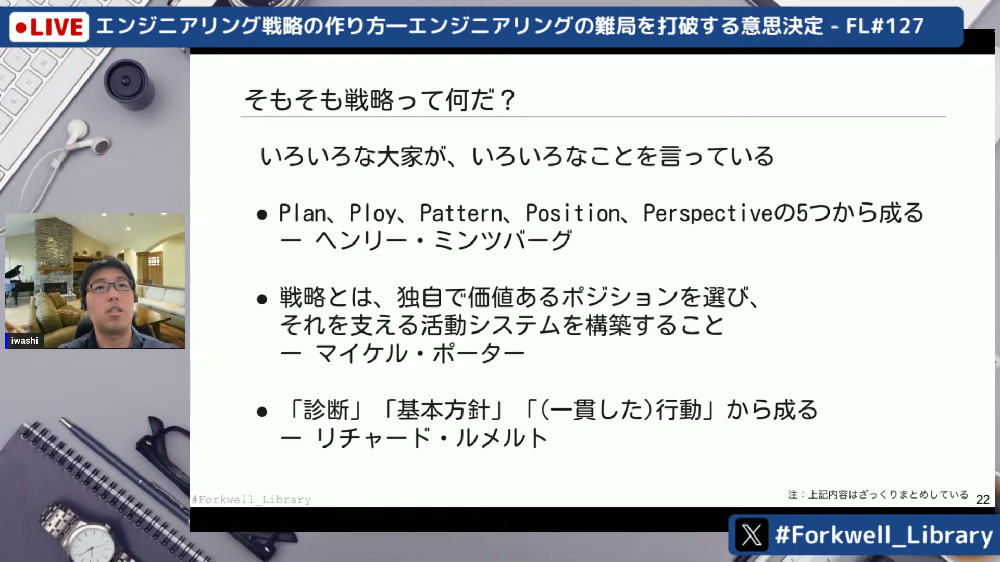
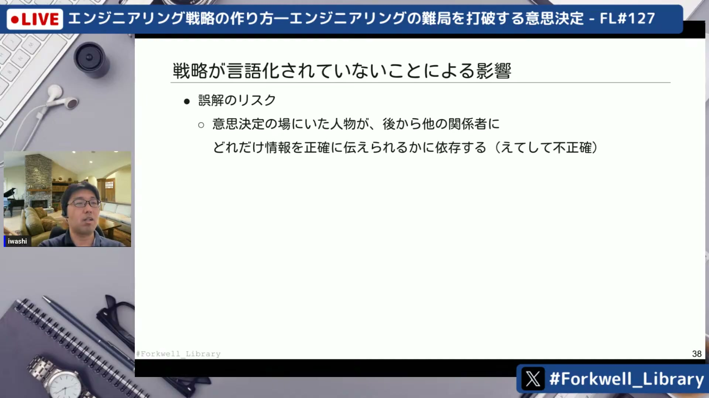
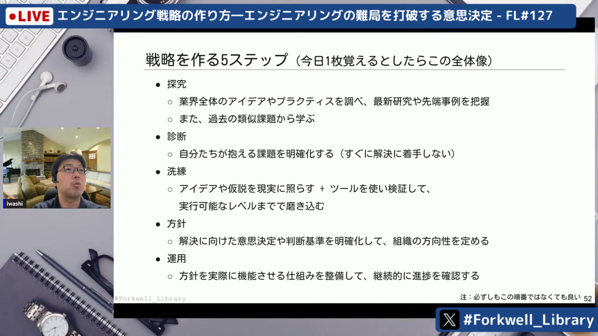
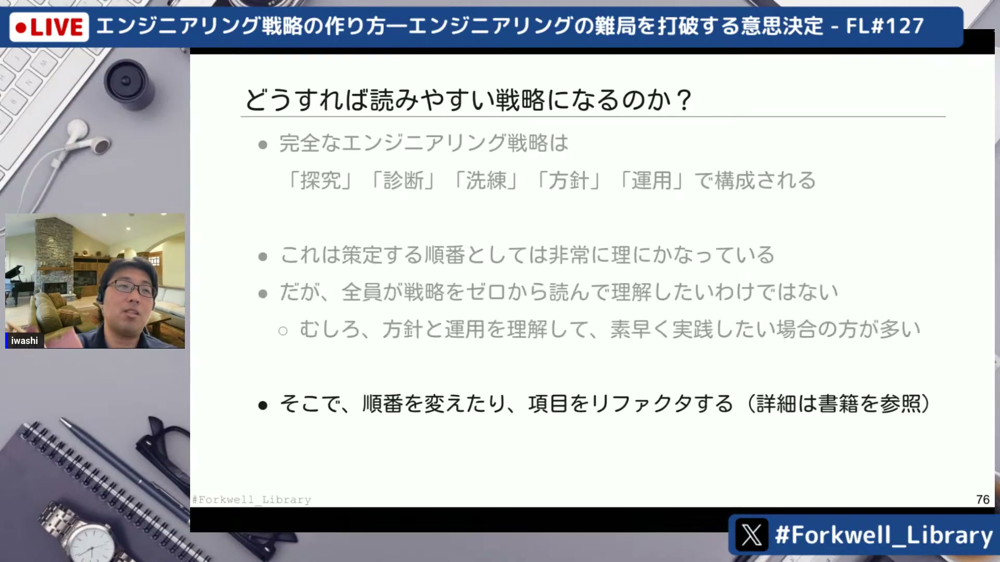
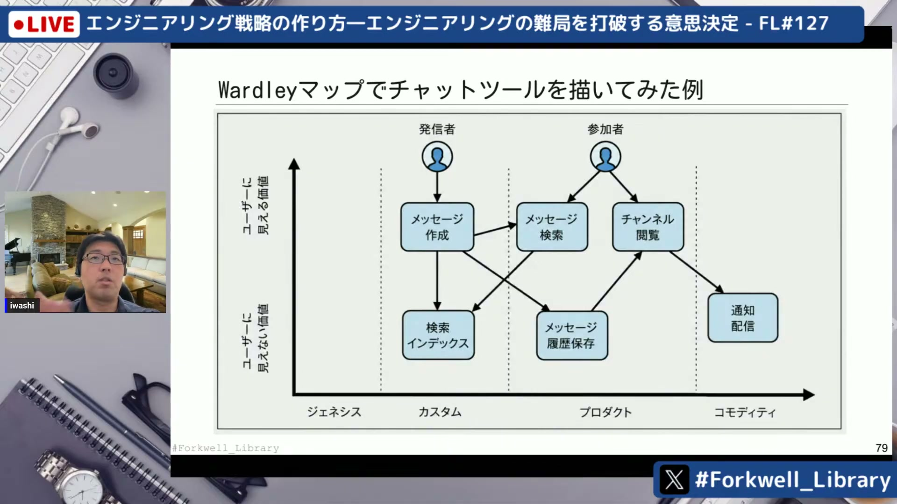
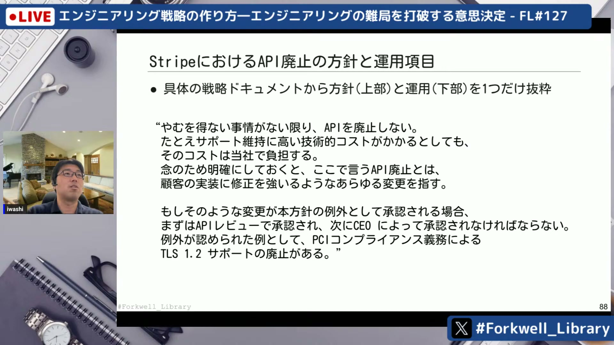

# エンジニアリング戦略の作り方―エンジニアリングの難局を打破する意思決定 - FL#127

[https://www.youtube.com/watch?v=S-YTAUvjIvM](https://www.youtube.com/watch?v=S-YTAUvjIvM)

## 要点

- エンジニアリング戦略は、リチャード・ルメルトの「診断」「方針」「行動」の3要素（戦略のカーネル）をベースに構築される。
- 戦略策定は「探求」「診断」「洗練」「方針策定」「運用」の5ステップで進められ、中でもバイアスを避ける「探求」と組織に定着させる「運用」が極めて重要である。
- 戦略ドキュメントは探求や診断から順に書くのではなく、読み手がすぐに理解・行動できるよう方針や運用を先頭に配置するなどのリファクタリングが効果的である。
- 洗練のプロセスでは、状況認識を可視化して暗黙知を共有する「ウォードリーマップ」などのツールを活用して戦略の妥当性を検証する。

## 詳細

### 戦略がない組織で起きる問題と戦略のカーネル

流行りに乗ってAI導入のPoCを乱発しても、戦略がないと本番に反映されず成果（アウトカム）が失われるアンチパターンに陥ります。ウィル・ラーソンの書籍ではリチャード・ルメルト（Richard Rumelt）の提唱する「診断」「方針」「行動」の3要素からなる「戦略のカーネル」を重視しており、根本原因を突き止めてトレードオフを明確にした方針を定めることが良い戦略の前提となります。

*13:23 — [動画のこの位置を開く](https://www.youtube.com/watch?v=S-YTAUvjIvM&t=803s)*

### 戦略の言語化と適切な策定タイミング

戦略が言語化されていないと、伝言ゲームによる誤解や組織間の一貫性の欠如、新任リーダーがコンテキストを把握できないといったリスクが生じます。また、戦略は常に作ればよいわけではなく、チーム内外ですでに一貫した方針が共有されている場合は乱立を避けるべきです。戦略を導入する際は、現場に自由度を残す「寛容的戦略」と、ルールを強制する「規範的戦略」の使い分けがポイントになります。

*22:50 — [動画のこの位置を開く](https://www.youtube.com/watch?v=S-YTAUvjIvM&t=1370s)*

### 戦略策定の5ステップと「探求」「運用」の重要性

エンジニアリング戦略は「探求」「診断」「洗練」「方針策定」「運用」の5ステップで進めます。最初の「探求」は、親しんだ技術や前職の知識に引きずられるアンカリング効果を防ぐために業界や社内外の情報を広く集めるプロセスです。最後の「運用」では、定例やルール、ナッジ（Nudge）などを通じて組織に定着させますが、利用者・提供者の負担や特定の権威（リーダー）への依存度をルーブリックなどで点検することが成功の鍵となります。

*28:32 — [動画のこの位置を開く](https://www.youtube.com/watch?v=S-YTAUvjIvM&t=1712s)*

### 読まれる戦略ドキュメントへのリファクタリング

策定順（探求→診断→洗練…）のままドキュメント化すると長大な文章になり、現場に読まれなくなってしまいます。そのため、多くの人が知りたい「方針」や「運用」を冒頭に配置し、理由や背景を知りたい人だけが「診断」や詳細なシミュレーションを辿れるように構成をリファクタリングすることが推奨されます。

*43:48 — [動画のこの位置を開く](https://www.youtube.com/watch?v=S-YTAUvjIvM&t=2628s)*

### 戦略を洗練する「ウォードリーマップ」の活用

洗練フェーズのツールの一つである「ウォードリーマップ（Wardley Map）」は、縦軸に「ユーザーに見える価値」、横軸に「進化の度合い（特注からコモディティまで）」を取り、システムの依存関係や将来予測を1枚の図に可視化します。これにより、環境変化の激しいIT業界においてチーム内の暗黙知や現状認識を共有し、方針の妥当性を検証しやすくなります。

*45:52 — [動画のこの位置を開く](https://www.youtube.com/watch?v=S-YTAUvjIvM&t=2752s)*

### Stripeに見る方針・運用・診断の具体例

書籍の約半分には実際の戦略ドキュメント例が掲載されています。例えばStripeにおけるAPI廃止方針では、「やむを得ない事情がない限りAPIを廃止しない」という強い方針、例外承認をAPIレビューやCEOに委ねる運用、そして中小・大企業の移行負担や収益影響のシミュレーションに基づいた診断が明確に記述されています。

*50:01 — [動画のこの位置を開く](https://www.youtube.com/watch?v=S-YTAUvjIvM&t=3001s)*

## 用語

- **戦略のカーネル**（Kernel of Strategy） — リチャード・ルメルトが提唱した、優れた戦略を構成する3つの核となる要素（診断・基本方針・一貫した行動）のこと。
- **アンカリング効果**（Anchoring Effect） — 最初に得た情報や自分が慣れ親しんだ過去の経験に引きずられ、その後の判断や意思決定が偏ってしまう認知バイアス。
- **ナッジ**（Nudge） — 強制や罰則ではなく、自発的により望ましい行動を選択するようにそっと後押しする仕組みやアプローチ。
- **ウォードリーマップ**（Wardley Mapping） — ユーザーに対する価値の可視性とコンポーネントの進化段階（成熟度）の2軸でバリューチェーンを視覚化し、戦略的な状況認識を揃えるためのフレームワーク。

## 所感

<!-- ここは自分で書く -->
