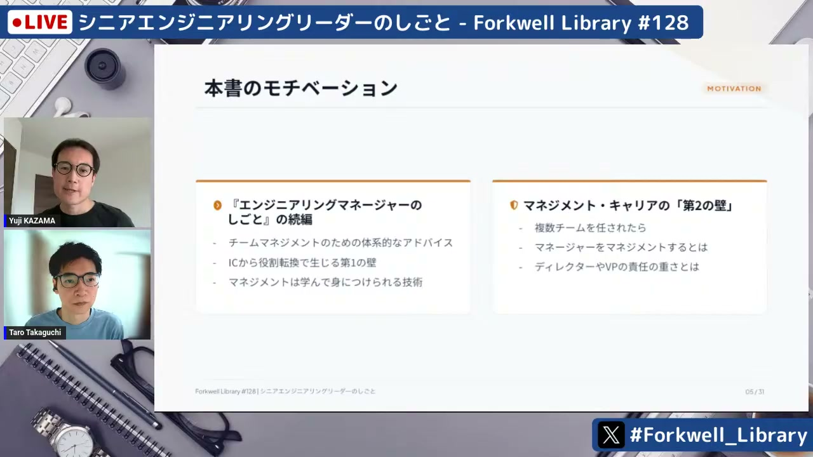
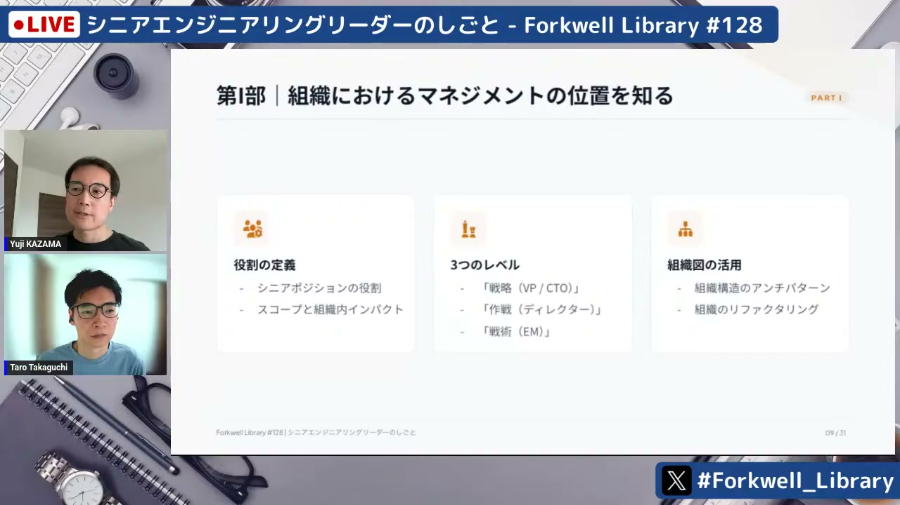
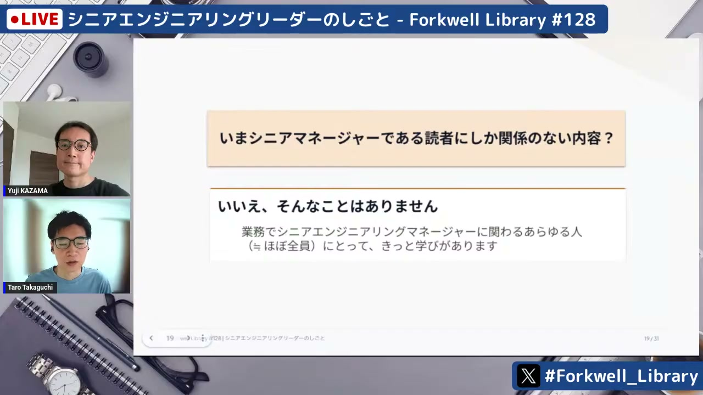
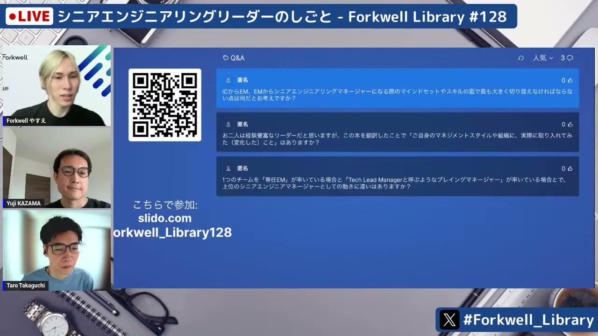
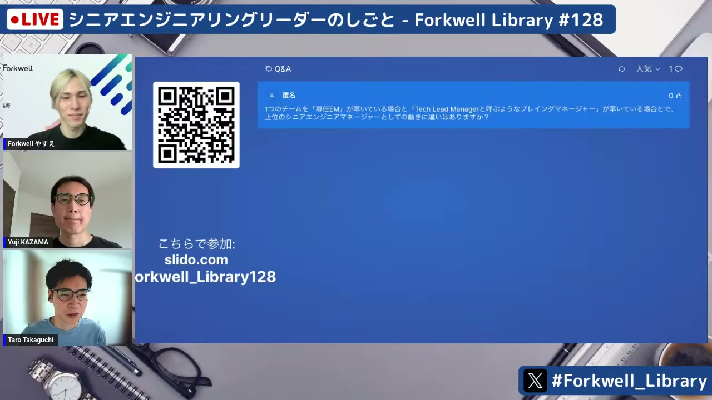

# シニアエンジニアリングリーダーのしごと - Forkwell Library #128

[https://www.youtube.com/watch?v=ts8EWvxmaJ4](https://www.youtube.com/watch?v=ts8EWvxmaJ4)

## 要点

- 『シニアエンジニアリングリーダーのしごと』は、単一チームのマネジメントから組織全体へとスコープとインパクトを広げるリーダーのための体系的な実践ガイドである。
- 本書は現職のシニアマネージャーだけでなく、IC（Individual Contributor）から経営層まで、自身のキャリア段階に応じた視点で活用できる。
- シニアエンジニアリングリーダーには、自組織の枠を超えた経営戦略・予算のすり合わせや、不確実性削減への先行投資、横の協業関係の構築が求められる。
- コントロールできないキャリアの終着点に過度な期待を抱くのではなく、手元でコントロール可能なスキル育成や実践的なアプローチに集中することが重要である。

## 詳細

### 書籍の背景とシニアマネジメントへのステップアップ

ジェームズ・ステニア（James Stanier）氏の前著『エンジニアリングマネージャーのしごと』がチームマネジメントへの役割転換という第1の壁を扱ったのに対し、続編である本書は単一チームから組織全体へ視野を広げる際の第2の壁を越えるための知見をまとめています。役職が上がるにつれて組織に与えるインパクトが増大し、それに伴ってより大きなスコープが任されるという好循環の構築を目指します。

*7:55 — [動画のこの位置を開く](https://www.youtube.com/watch?v=ts8EWvxmaJ4&t=475s)*

### 本書の全体構成と主要なテーマ

第1部では戦略・作戦・戦術の3レベルによる組織構造の定義や組織構造のリファクタリングを扱います。第2部では時間管理、長期主義、シニアICの4つのアーキタイプ（テックリード、ソルバー、アーキテクト、右腕）などを解説しています。第3部ではエンジニアリング戦略の策定、財務やマーケティングなど他部門との年間サイクルの連携、不確実性削減への先行投資、そしてキャリアの捉え方を提示しています。

*11:13 — [動画のこの位置を開く](https://www.youtube.com/watch?v=ts8EWvxmaJ4&t=673s)*

### キャリア段階に応じた本書の読み方

本書は現役のシニアマネージャーだけでなく幅広い層に役立ちます。ICにとってはシニアマネージャーの役割やICへの期待値（アーキタイプ）の理解につながり、単一チームのEMにとっては次の一歩としての影響力拡大や戦略・予算業務の予習になります。またディレクター以上の経営層にとっては、暗黙知になりがちなマネジメントスキルを言語化し、後進を育成・登用するための指針として活用できます。

*18:08 — [動画のこの位置を開く](https://www.youtube.com/watch?v=ts8EWvxmaJ4&t=1088s)*

### 現場実践とマインドセットの転換

訳者の実践例として、1年間のエンジニアリング戦略の立案や、配下メンバーの人事情報をまとめたスプレッドシートの四半期更新による人員計画の交渉などが紹介されました。ICからEM、さらにシニアEMへと進むにつれて、「自分でやる」から「チームに任せる」、そして「自チームの成果」から「他部門や横の連携を含めた会社全体へのインパクト」へと視点を切り替えることが重要になります。

*35:39 — [動画のこの位置を開く](https://www.youtube.com/watch?v=ts8EWvxmaJ4&t=2139s)*

### 権限委譲と上下左右の期待値マネジメント

プレイングマネージャーやメンバーへの権限委譲では、どこまで何を委譲するかを言語化してすり合わせることが欠かせません。また、1人目のシニアEMや若手エンジニアとの協業においては、上司・自チーム・他部門との間で期待値のズレをなくす日常的なコミュニケーションや、課題に対する自分なりの提案を持っていく姿勢が組織の円滑な運営につながります。

*43:39 — [動画のこの位置を開く](https://www.youtube.com/watch?v=ts8EWvxmaJ4&t=2619s)*

## 用語

- **IC**（Individual Contributor） — 管理職ではなく、個人の専門スキルや実務を通じて成果を出す技術者・専門職のこと。
- **アーキタイプ**（Archetype） — 典型的な類型やパターンのこと。本書ではシニアICの役割を領域の広さと期間の長さで4つのタイプに分類している。
- **スコープ**（Scope） — 業務や責任が及ぶ対象範囲のこと。
- **インパクト**（Impact） — 業務や意思決定が組織や事業全体に対して与える影響や成果の大きさのこと。

## 所感

<!-- ここは自分で書く -->
