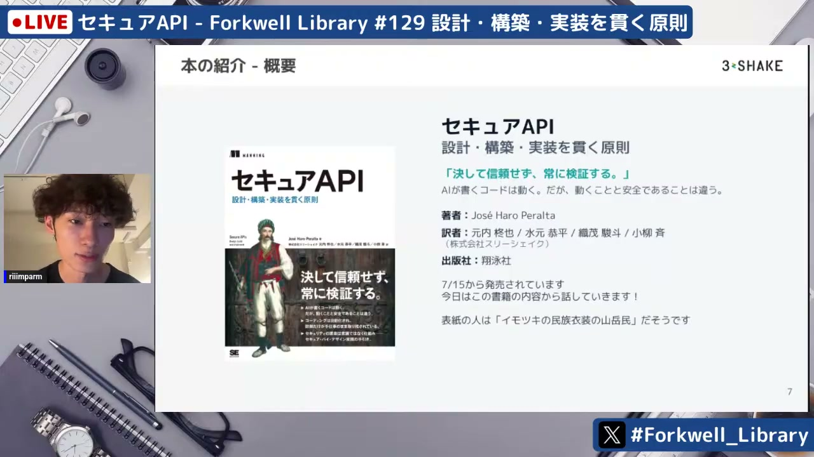
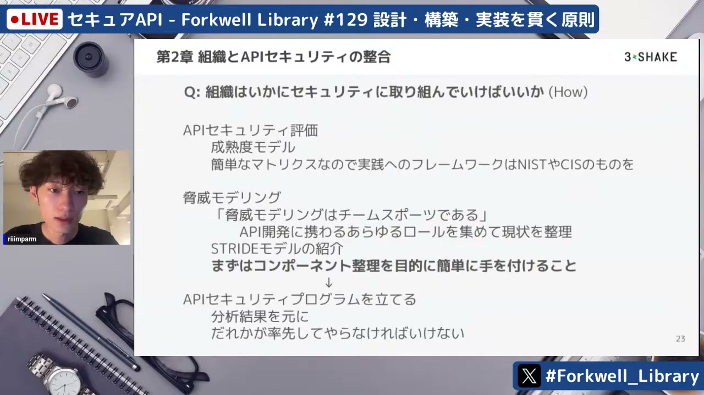
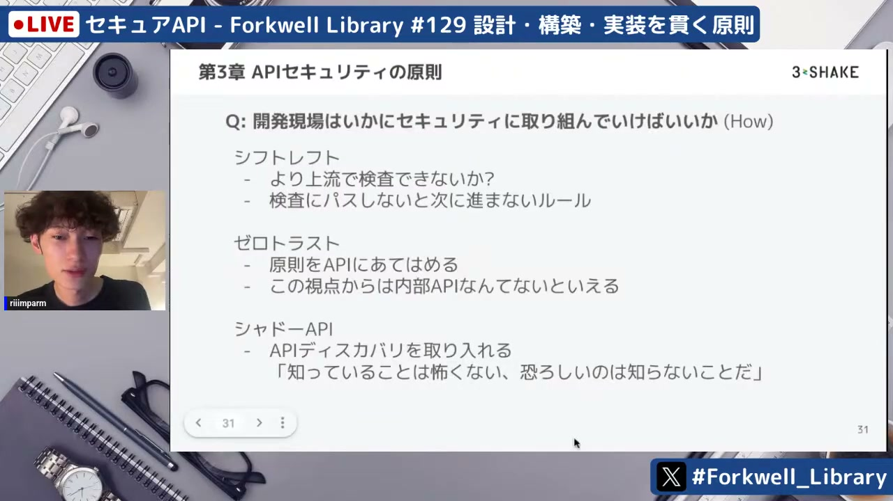
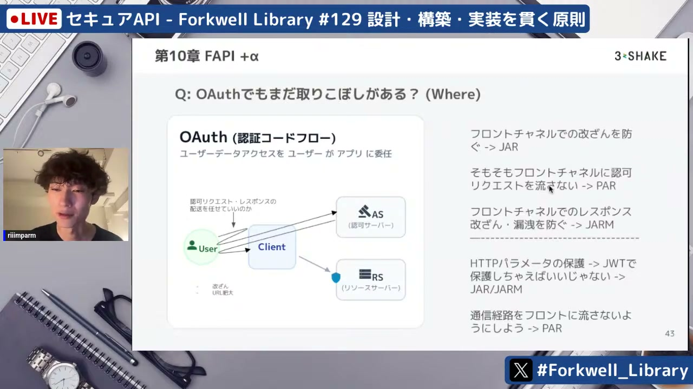
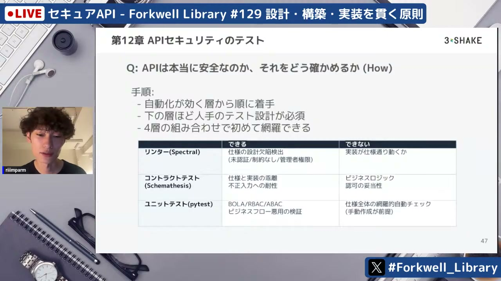

# セキュアAPI - Forkwell Library #129

[https://www.youtube.com/watch?v=V4TcQAlRub4](https://www.youtube.com/watch?v=V4TcQAlRub4)

## 要点

- 書籍『セキュアAPI』は、「決して信頼せず、常に検証する」ゼロトラストの原則のもと、設計・実装・インフラの3軸からAPIセキュリティを体系的かつ網羅的に解説している。
- セキュリティは開発現場だけでなく組織全体で取り組むべき活動であり、STRIDEなどのフレームワークを用いた脅威モデリングを通じて関係者を巻き込むことが重要である。
- APIにおける認証・認可ではOAuth 2.1やOIDC、さらにフロントチャンネルの改ざんや漏洩を防ぐPKCE、JAR、PAR、DPoPといった高度な仕様への理解と適用が求められる。
- セキュリティテストはリンター、コントラクトテスト、ユニットテスト、ペネトレーションテストなどをレイヤーごとに組み合わせ、自動化と人手による検証を使い分ける必要がある。

## 詳細

### 書籍『セキュアAPI』の概要と位置付け

本書は、APIセキュリティの原則を「設計・実装・インフラ」の3軸で網羅的に解説した入門書である。RESTful APIおよびWebのクライアント・サーバーモデルを前提としており、Python（FastAPI）による脆弱なコード例とその修正方法を手を動かして学べる構成になっている。

*9:44 — [動画のこの位置を開く](https://www.youtube.com/watch?v=V4TcQAlRub4&t=584s)*

### 組織でのセキュリティへの取り組みと脅威モデリング

APIセキュリティを担保するには、開発者だけでなくビジネス層やステークホルダーを巻き込んだチーム横断の脅威モデリングが不可欠である。STRIDE、PASTA、DREADといったフレームワークを用い、漏れを防ぎつつ「何に取り組み、何が問題になり得るか、どう対処するか」を定期的に見直すサイクルを回すことが推奨される。

*35:39 — [動画のこの位置を開く](https://www.youtube.com/watch?v=V4TcQAlRub4&t=2139s)*

### APIセキュリティの原則とゼロトラスト

APIセキュリティの原則として「シフトレフト（Shift Left）」と「ゼロトラスト（Zero Trust）」が強調される。ゼロトラストの観点では、サービス間の依存関係に関わらず各コンポーネントへの入出力をすべて検証するため、「内部用API」という概念自体が存在しないとされる。

*47:17 — [動画のこの位置を開く](https://www.youtube.com/watch?v=V4TcQAlRub4&t=2837s)*

### 設計段階の配慮とAPI認証・認可の進化（OAuth/OIDC/FAPI）

設計段階ではOpenAPIに加えてビジネスフローの依存関係を記述するArazzoの活用が挙げられる。認証・認可ではOAuth 2.1やOIDCのフローを正しく使い分けるとともに、PKCE、DPoP、mTLS、さらに金融グレード（FAPI）で使われるJARやPARなどを活用してフロントチャンネル経由のリスクを低減させることが解説されている。

*1:04:34 — [動画のこの位置を開く](https://www.youtube.com/watch?v=V4TcQAlRub4&t=3874s)*

### オブザーバビリティと多層防御的なテスト戦略

完全な防御は存在しないため、OpenTelemetryによる計装で事後追跡を可能にすることが重要である。また、テストにおいてはリンター（Spectral）で使用上の欠陥を検出し、コントラクトテスト（Schemathesis）で実装との乖離を検査し、それらでカバーできないビジネスロジックはユニットテストやペネトレーションテストで補うという多層的なアプローチが必要となる。

*1:07:34 — [動画のこの位置を開く](https://www.youtube.com/watch?v=V4TcQAlRub4&t=4054s)*

## 用語

- **STRIDE**（STRIDE） — 脅威を「なりすまし・改ざん・否認・情報漏えい・サービス拒否・権限昇格」の6つの頭文字で分類・分析する脅威モデリングの手法。
- **Arazzo**（Arazzo Specification） — OpenAPIなどの仕様書を拡張し、複数のAPIエンドポイント間の呼び出し順序や依存関係といったビジネスワークフローを記述・検証するための仕様。
- **PKCE**（Proof Key for Code Exchange） — 認可コード横取り攻撃を防ぐために、動的に生成した検証コードを用いてアクセストークンの要求元が正規クライアントであるかを検証するOAuthの拡張仕様。
- **DPoP**（Demonstrating Proof-of-Possession） — 公開鍵暗号による署名を用いてアクセストークンを送信者に結びつけ、トークンの盗難や不正再利用（なりすまし送信）を防ぐアプリケーション層の仕組み。
- **FAPI**（Financial-grade API） — 高セキュリティが求められるAPI通信向けに、OAuthやOIDCの仕様を厳格化・拡張したセキュリティ標準。

## 所感

<!-- ここは自分で書く -->
