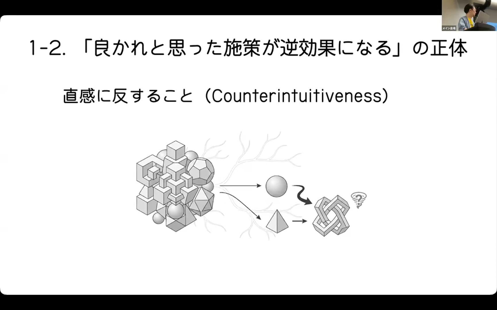
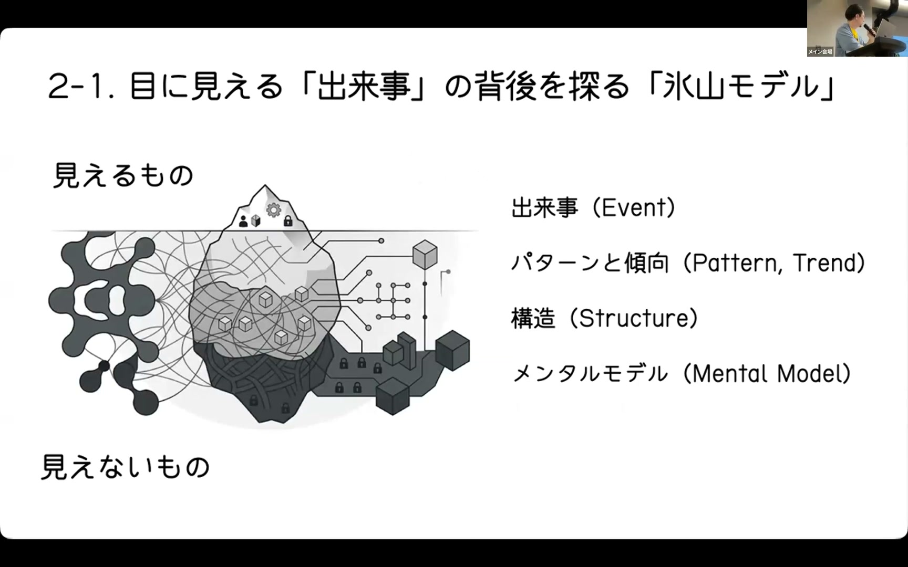
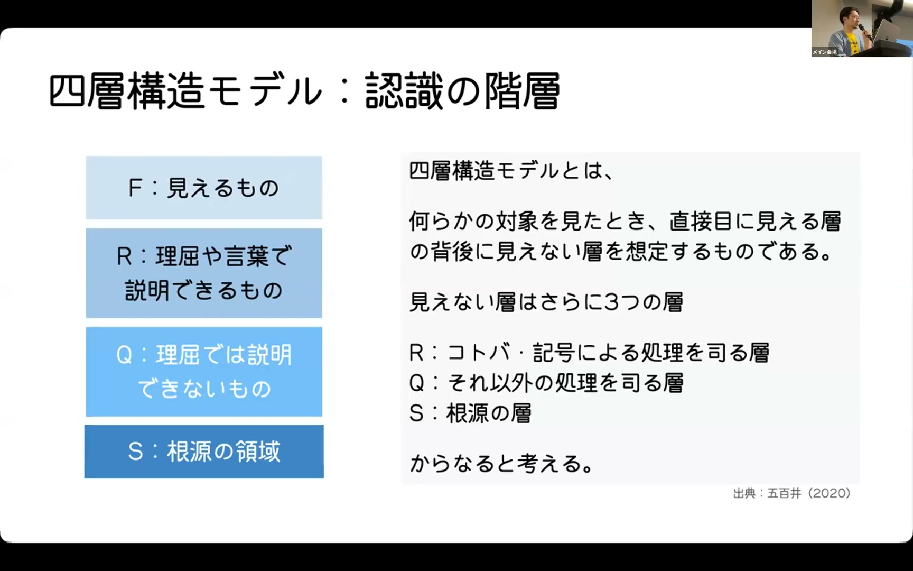
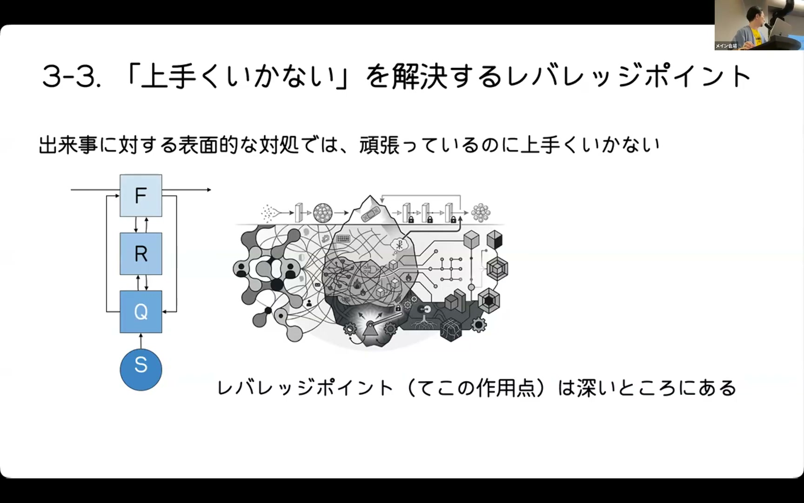
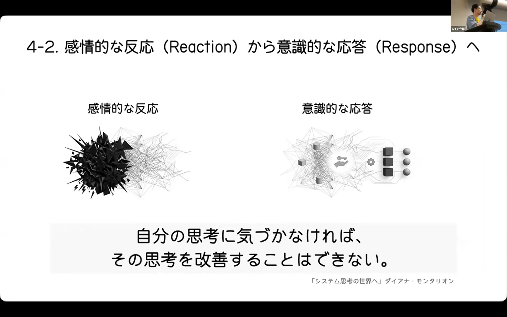

# ソフトウェア技術者のための「システム思考」再入門〜複雑な状況の中で考え続けるために〜 Taku Iwamura

[https://www.youtube.com/watch?v=7eXmFamP3hI](https://www.youtube.com/watch?v=7eXmFamP3hI)

## 要点

- ソフトウェアや組織は人と技術が複雑に相互作用するソシオテクニカルなシステムであり、問題を細かく分割して解こうとする線形思考や還元主義だけでは根本解決ができません。
- 氷山モデルや五百井教授の四層構造モデルを活用することで、表面的な出来事の背後にあるパターン、組織構造、そして無意識のメンタルモデル（物語や情念）を捉えることができます。
- システムに大きな変化をもたらすレバレッジポイント（テコの作用点）は深い階層にあり、チームが無意識に信じている前提や物語を書き換えることが重要です。
- 複雑な状況に向き合うには、感情的な反射ではなく意識的な応答を心がけ、異なる視点を持つ他者と共に考えながらシステムの変化にしなやかに適応していく姿勢が求められます。

## 詳細

### 線形思考・還元主義の限界と直感に反する現象

ソフトウェア開発で定石とされる「全体を細かく分割して個別に解決する」還元主義や線形思考（Linear Thinking）は、要素間のつながりを見落としがちです。複雑なシステムに対して線形思考で直感的に対処しようとすると、人手不足を一時的な残業でカバーした結果アラートが消えて人員が補充されないように、状況をかえって悪化させる「直感に反する事象（Counterintuitiveness）」を引き起こします。

*13:51 — [動画のこの位置を開く](https://www.youtube.com/watch?v=7eXmFamP3hI&t=831s)*

### ソシオテクニカルシステムと「氷山モデル」の視点

システムは人や文化、技術が相互作用するソシオテクニカル（Socio-technical）な存在であり、単独のソフトウェアだけで成立しているわけではありません。水面上に見える「出来事」の奥には「繰り返されるパターン」「組織の構造」「メンタルモデル（Mental Model）」が存在するという氷山モデル（Iceberg Model）を通じて、問題の深層を探る必要があります。セラノス社の事例のように、善悪の二項対立や誰も反対できない大義名分が現場の違和感を封じ込めてしまう構造にも注意が必要です。

*20:01 — [動画のこの位置を開く](https://www.youtube.com/watch?v=7eXmFamP3hI&t=1201s)*

### 五百井教授の「四層構造モデル」と人間の多面性

故・五百井清右衛門教授が提唱した「四層構造モデル」では、人間の振る舞いや認識を行動・アウトプット（F層）、言葉や論理（R層）、心や身体感覚・情念（Q層）、そしてすべての根源であるS層に分類します。理屈（R層）で正論を押し通しても感情や腹落ち（Q層）が伴わなければ人は動かず、論理の枠組みだけでは解決できない問題が存在することを示しています。

*30:19 — [動画のこの位置を開く](https://www.youtube.com/watch?v=7eXmFamP3hI&t=1819s)*

### 物語（メンタルモデル）の書き換えとレバレッジポイント

小さな変化で全体を大きく動かすテコの作用点をレバレッジポイント（Leverage Point）と呼び、これは氷山の深い位置（メンタルモデルや共有する物語）に存在します。例えばリモートワークで会話が途絶えた際、発言ルール（R層）を決めるのではなく、業務開始時の雑談（チェックイン）を取り入れることで「部品ではなく人間として繋がっている」という前提物語を共有でき、コミュニケーションや品質の改善につながりました。

*33:28 — [動画のこの位置を開く](https://www.youtube.com/watch?v=7eXmFamP3hI&t=2008s)*

### 他者との共同思考とシステムリーダーシップ

複雑な課題には1人ではなく多様な視点を持つ他者と共にモデリングやフィードバックを行い、立体的に全体像を捉えることが不可欠です。感情的な「反応」に流されず一呼吸置いて自己の認知を客観視する「意識的な応答」を意識し、システムを無理に支配するのではなく変化に合わせて柔軟に振る舞う「システムと踊る（Dancing with Systems）」姿勢がシステム的リーダーシップにつながります。

*41:10 — [動画のこの位置を開く](https://www.youtube.com/watch?v=7eXmFamP3hI&t=2470s)*

## 用語

- **ソシオテクニカル**（Socio-technical） — 人、組織、文化などの社会的要素と、ハードウェアや技術、プロセスなどの技術的要素が切り離せず、互いに影響し合いながら機能している性質。
- **氷山モデル**（Iceberg Model） — 目に見える表面的な「出来事」の下に、「パターンと傾向」「構造」「メンタルモデル（無意識の価値観・前提）」という深い階層が隠れていると捉えるシステム思考の分析手法。
- **四層構造モデル** — 五百井清右衛門教授が提唱した認識モデル。外形的な行動（F層）、論理や言葉（R層）、感情や身体感覚（Q層）、万物の根源（S層）の4層で人間の行動や関係性を捉える。
- **レバレッジポイント**（Leverage Point） — システム全体の構造や振る舞いを大きく好転させるために、最小限の力で最大の効果を生み出すテコの作用点。

## 所感

<!-- ここは自分で書く -->
