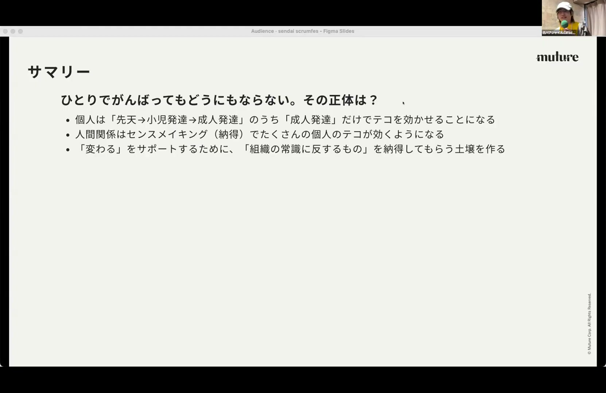
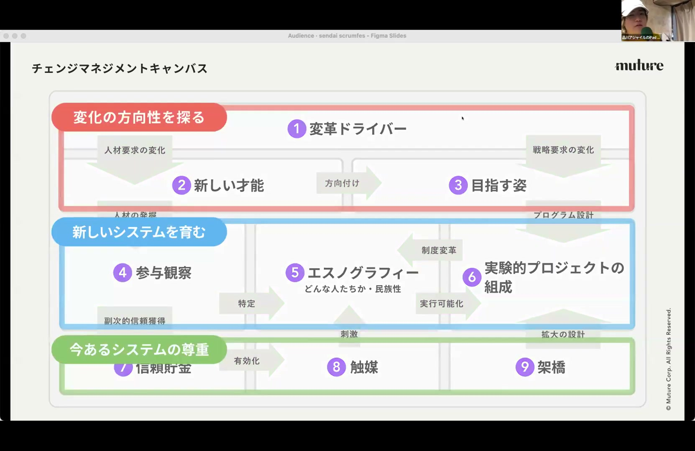
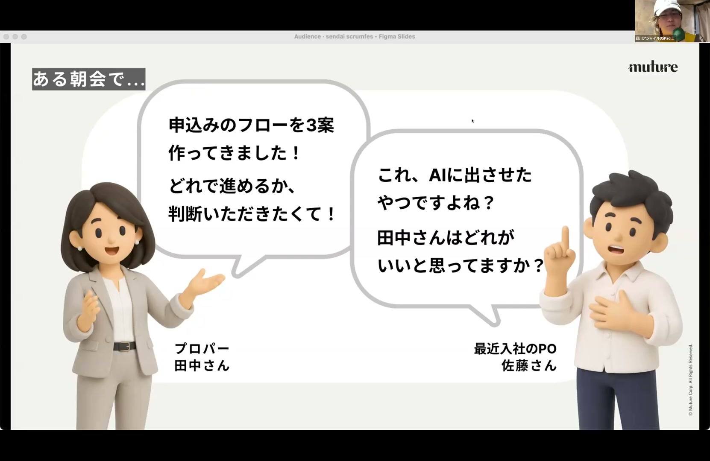
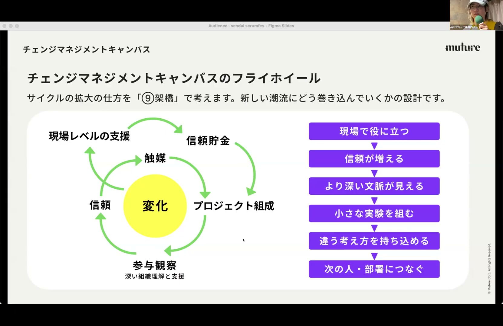
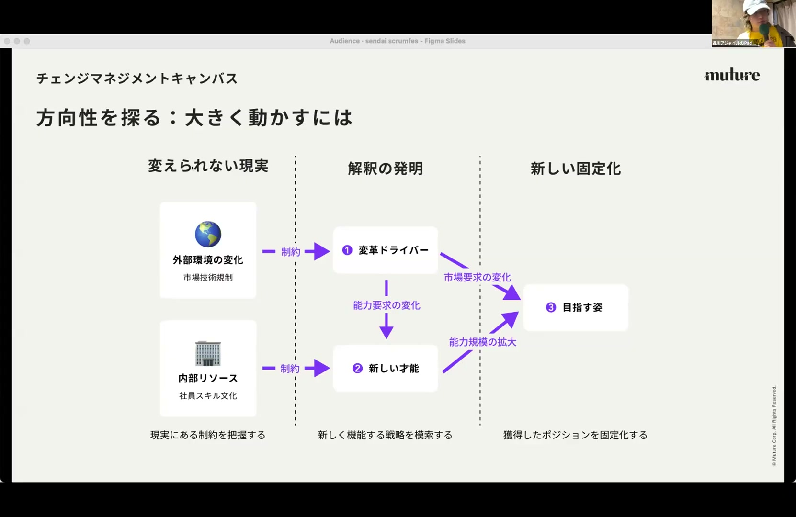

# チェンジマネジメントキャンバス –– 綺麗事言っても、まわりが変わらないと無理じゃない? - kakeru sarashino ida

[https://www.youtube.com/watch?v=n0SMeXVXElo](https://www.youtube.com/watch?v=n0SMeXVXElo)

## 要点

- 個人が1人で変わるだけでは組織の変化は難しく、周囲が納得して行動を変えるための「センスメイキング（Sensemaking）」の土壌（関係性）を作ることが不可欠です。
- 「チェンジマネジメントキャンバス（Change Management Canvas）」は、変化の全体像を俯瞰し、異なる場所で活動する支援者同士の認識を揃えて動くための地図として機能します。
- 変化を促すには、まず現場で直接的に役に立つ（信頼を得る）ことから始め、二重のアウトカム（ビジネス上の成果と組織事情の解釈）を伴うプロジェクトを組成してフライホイールを回します。
- 理想の姿を描くボックス3は、変化が完了して文化が固定化した段階では不要になるため、議論の仮説として余白にされ、最終的にはキャンバス自体を破棄することが想定されています。

## 詳細

### 個人から関係性の変容へ：センスメイキングの必要性

大人になってからの成長を扱う「成人発達理論（Adult Development Theory）」などによる個人のアプローチには限界があります。個人が1人で頑張るのではなく、人間関係の中で「これでやっていこうよ」という納得を生み出す「センスメイキング」が必要です。今までと違うものを受け入れられる土壌を作り、周囲が変わるためのアシストをしていくことが重要です。

*1:20 — [動画のこの位置を開く](https://www.youtube.com/watch?v=n0SMeXVXElo&t=80s)*

### チェンジマネジメントキャンバスの3段・9ボックス構造

所属会社である「ミュチュア（Mutual）」での活動から生まれた「チェンジマネジメントキャンバス」は、9つのボックスからなり、大きく3段に分かれています。上段は内外の環境から変化の方向性を探る領域、中段は観察と解釈によって「新しいシステム（関係性のエコシステム）」を組む領域、下段は既存のシステムを尊重して接続・展開していく領域で構成されています。

*10:18 — [動画のこの位置を開く](https://www.youtube.com/watch?v=n0SMeXVXElo&t=618s)*

### 田中さんと佐藤さんの事例にみる「組織の文脈」の紐解き

プロパー新卒の田中さんと、外部から入社したプロダクトオーナーの佐藤さんとの衝突事例が語られます。小売文化での指示遂行に馴染んできた田中さんと、アウトカム思考を追求する佐藤さんの対立の背景には、会社が「おろし業（B2Bサービス）」へシフトしつつあるという大きな経営戦略の変化がありました。こうした背景（文脈）をヒアリングによって解き明かし、キャンバスの内外事情に落とし込むことで自律的な変化を促します。

*5:16 — [動画のこの位置を開く](https://www.youtube.com/watch?v=n0SMeXVXElo&t=316s)*

### 信頼構築と実験的プロジェクトを回す「フライホイール」

現場の支援は「役に立つこと」から始まります。手作業を助けたり専門知識を提供したりして信頼（Credibility）を得ることで、初めて組織理解を深めるプロジェクトを組成できます。この「現場レベルの支援 → プロジェクト組成 → 深い組織理解と対話」というサイクルをフライホイール（グローサイクル）として回し、関係性が温まった段階で耳の痛い正論や別のアプローチを現場に提案できるようになります。

*25:20 — [動画のこの位置を開く](https://www.youtube.com/watch?v=n0SMeXVXElo&t=1520s)*

### 「理想の姿（ボックス3）」が余白である理由とコッター理論との違い

理想の姿（ボックス3）は最後まで埋まりません。未来を考える行為自体には価値がありますが、未来が固定化した時点で変化は終了し、文化の維持管理フェーズに入るためキャンバス自体が不要になります。また、「危機感を煽る」ことを起点とするコッターの変革8段階（Kotter's 8 Steps）とは異なり、このキャンバスは日本のプロパー人材が多い組織に寄り添い、少しずつ「橋をかける（架橋）」ことを大切にしています。

*36:11 — [動画のこの位置を開く](https://www.youtube.com/watch?v=n0SMeXVXElo&t=2171s)*

## 用語

- **センスメイキング**（Sensemaking） — 組織のメンバーが周囲の状況に対して、納得や合意を形成し、次の行動への共通理解を作り出すこと。
- **成人発達理論**（Adult Development Theory） — 大人になってからの認知や精神、心の成長のプロセスを段階的に説明する心理学理論。
- **エスノグラフィー**（Ethnography） — 対象となる組織や人々の日常を観察（参与観察）し、その行動様式や「民族性（独自の暗黙ルール）」を詳細に記述・解釈する手法。
- **コッターの変革の8段階**（John Kotter's 8 Steps of Change） — 組織変革を進めるための著名なフレームワーク。最初のステップとして「危機感の醸成（Create a Sense of Urgency）」を掲げることで知られる。

## 所感

<!-- ここは自分で書く -->
