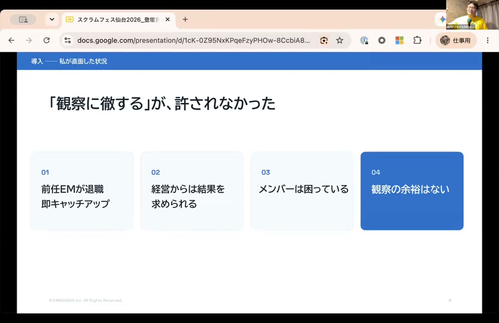
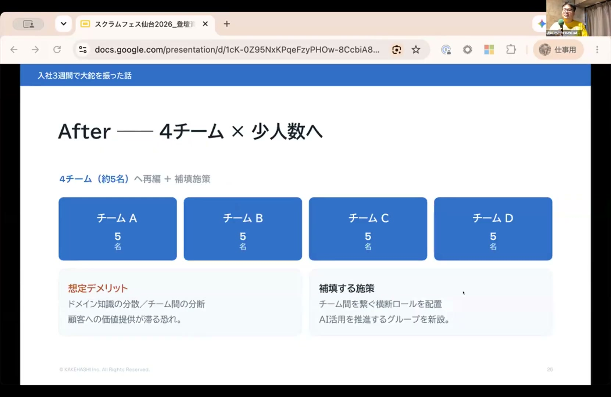
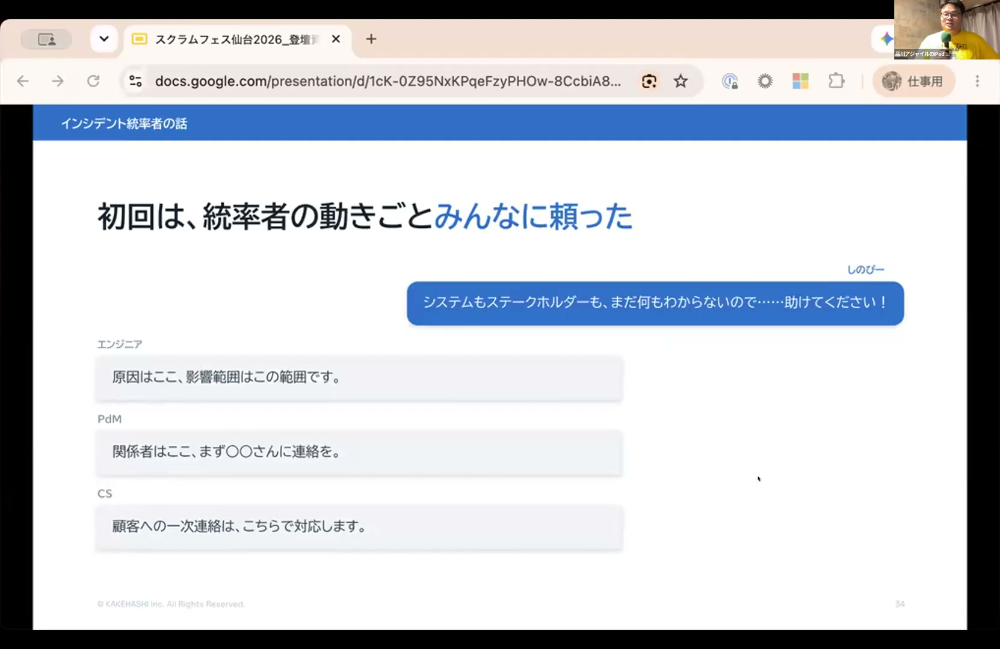
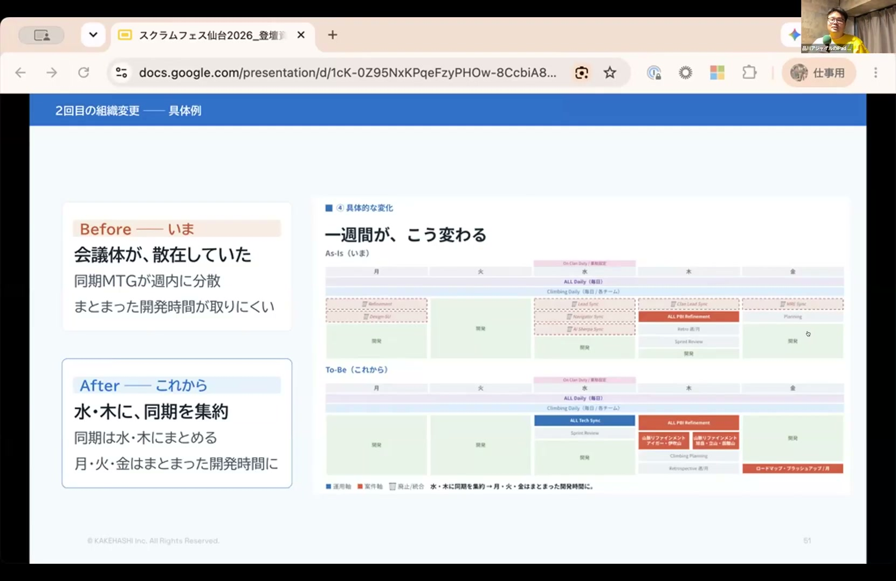
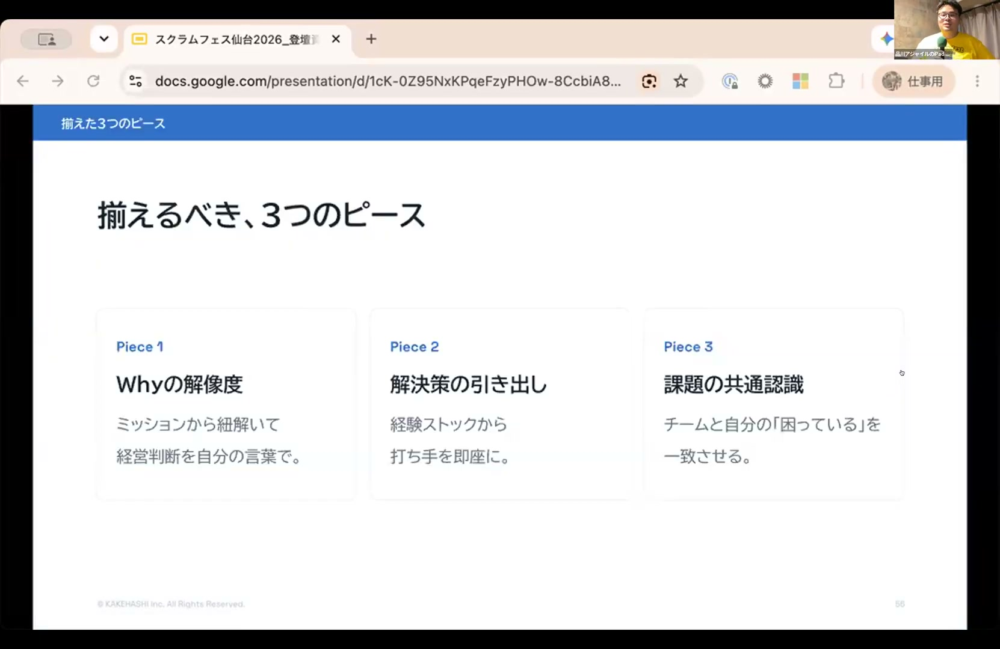

# 人を動かすのは時間ではなく、納得感 〜新任EMが入社3ヶ月、組織を2回変えた話〜 - Shohei Shinozuka

[https://www.youtube.com/watch?v=htgbAjj5jqA](https://www.youtube.com/watch?v=htgbAjj5jqA)

## 要点

- マネジメントで定説とされる「最初の2〜3ヶ月は観察期間」という時間軸は本質ではなく、動くためのピースが揃っているかどうかが重要である。
- 信頼関係が浅い段階でも「Whyの解像度」「解決策の引き出し」「課題の共通認識」の3つのピースを揃えることで、人を動かす納得感を生み出せる。
- 信頼の蓄積には時間を要するが納得感は瞬間的に成立するため、納得感を積み重ねて共に結果を出すことが強固な信頼関係の構築につながる。

## 詳細

### 「観察2〜3ヶ月」という定説への疑問と着任直後の状況

新任マネージャーは最初の2〜3ヶ月を観察に充てるべきと語られがちですが、現実には前任EMの退職や経営陣からの期待などにより、じっくり観察する余裕がない状況も存在します。発表者は入社直後の状況を通じ、観察期間とは単に「必要なピースが揃うまでの時間」に過ぎず、条件が整えば短期間でも組織を動かせると捉え直しました。

*4:10 — [動画のこの位置を開く](https://www.youtube.com/watch?v=htgbAjj5jqA&t=250s)*

### 入社3週間での1回目の組織再編と「ベース信頼」の形成

入社直後、メンバーとの1on1から合意形成の遅滞という課題を把握し、約20名の3チーム体制から小人数×AI活用を前提とした4チーム体制へ再編しました。相手への信頼を前提に、組織変更の背景（Why）を説明して課題の共通認識を合わせたことで、アンチパターンとされる早期の組織変更をハレーションなく着地させ、「ベース信頼（少なくとも味方である状態）」を築きました。

*15:34 — [動画のこの位置を開く](https://www.youtube.com/watch?v=htgbAjj5jqA&t=934s)*

### 未知の領域で打席に立つインシデント統率

着任早々に多発したインシデントにおいて、業務やドメイン知識が不足している状態ながらインシデントコマンダーとして最前線に立ち続けました。過去の障害対応パターンから引き出しを活用しつつ、メンバーの専門性を頼り切る姿勢を示したことで、課題解決への姿勢やオーナーシップがチームに伝わり、さらなる信頼へとつながりました。

*19:43 — [動画のこの位置を開く](https://www.youtube.com/watch?v=htgbAjj5jqA&t=1183s)*

### 主要メンバー異動に伴う2度目の組織再編と情報流通の見直し

入社3ヶ月目に新規事業立ち上げで主力メンバーが抜ける際、経営陣に徹底的にヒアリングして新規戦略の必然性を自分の言葉（Why）に昇華させました。不完全な検討段階からメンバーに共有して対話を重ね、SREチームを含む5チーム体制への再編と、定例ミーティングを整理・集約する情報流通の再設計を共創しました。

*32:10 — [動画のこの位置を開く](https://www.youtube.com/watch?v=htgbAjj5jqA&t=1930s)*

### 納得感を生み出す3つのピースと信頼の関係

人を動かす納得感は「Whyの解像度（経営判断を自分の言葉で語れるか）」「解決策の引き出し（議論の叩きとなる複数の打ち手を出せるか）」「課題の共通認識（自分とチームの困りごとが一致しているか）」の3ピースで構成されます。納得感は瞬間的に生み出せるため信頼の手前に位置し、納得感による合意と前進の積み重ねが中長期的な信頼関係を形成します。

*34:48 — [動画のこの位置を開く](https://www.youtube.com/watch?v=htgbAjj5jqA&t=2088s)*

## 用語

- **2ピザルール**（Two-Pizza Rule） — 2枚のピザを分け合える規模（5〜8人程度）を、コミュニケーションの効率や自律性を保つための適切なチームサイズとする考え方。
- **インシデントコマンダー**（Incident Commander） — システム障害などのインシデント発生時に、状況把握、役割分担、意思決定およびステークホルダー連携を統括・指揮する役割。

## 所感

<!-- ここは自分で書く -->
