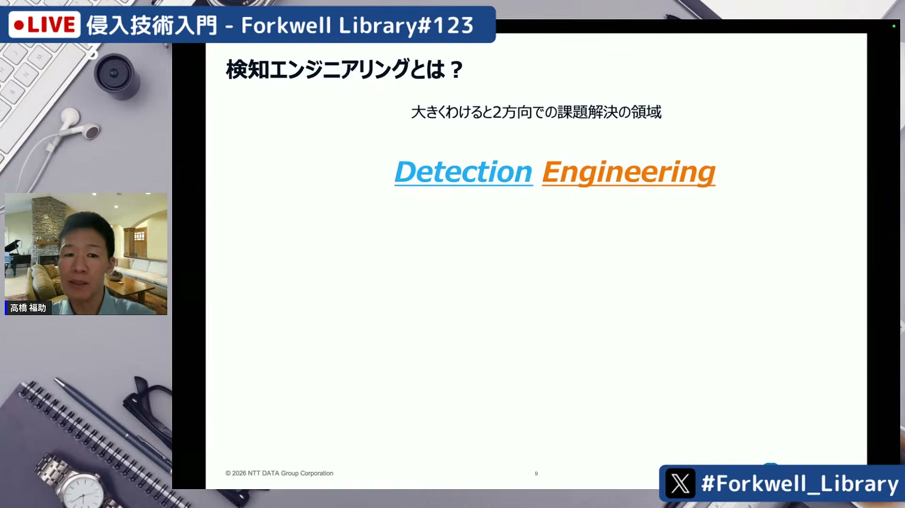
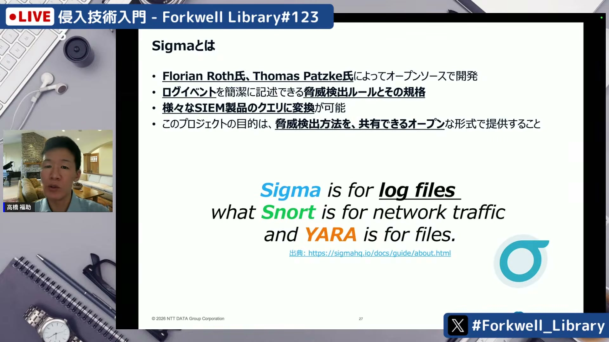
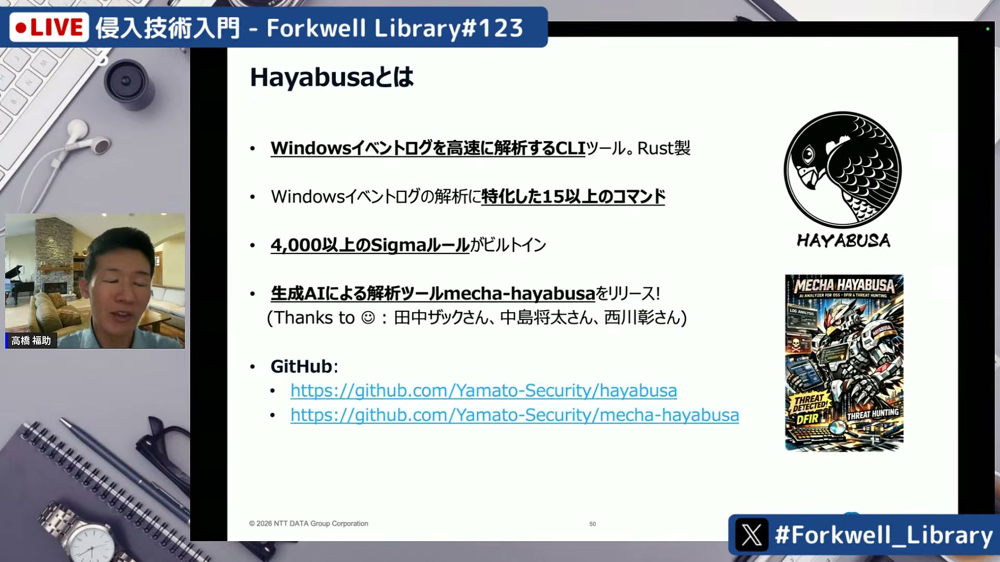
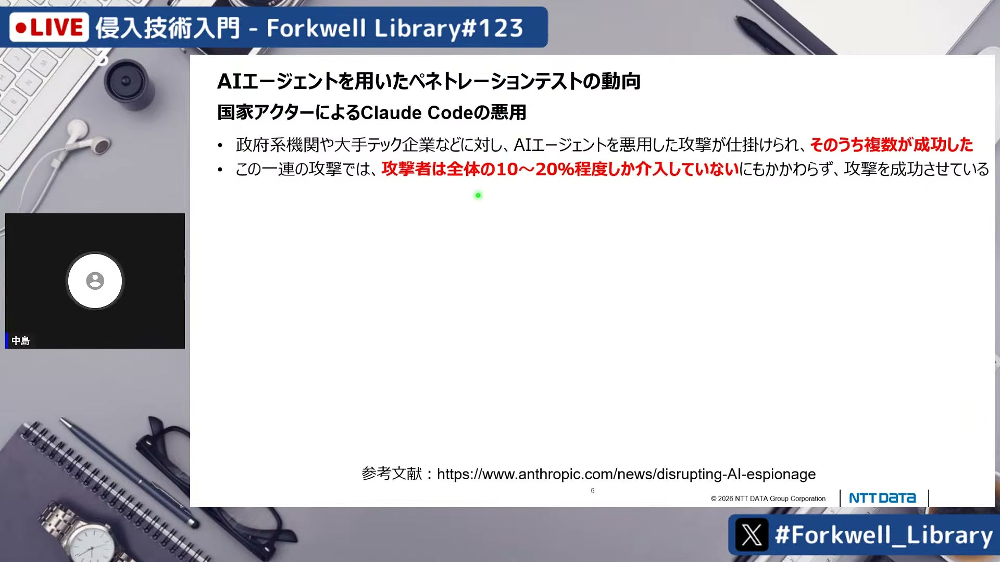
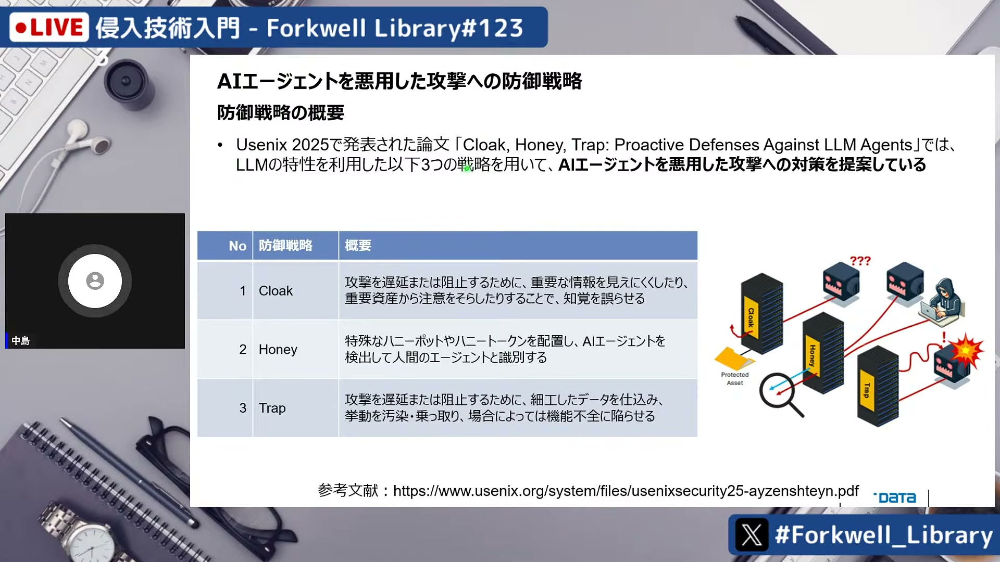
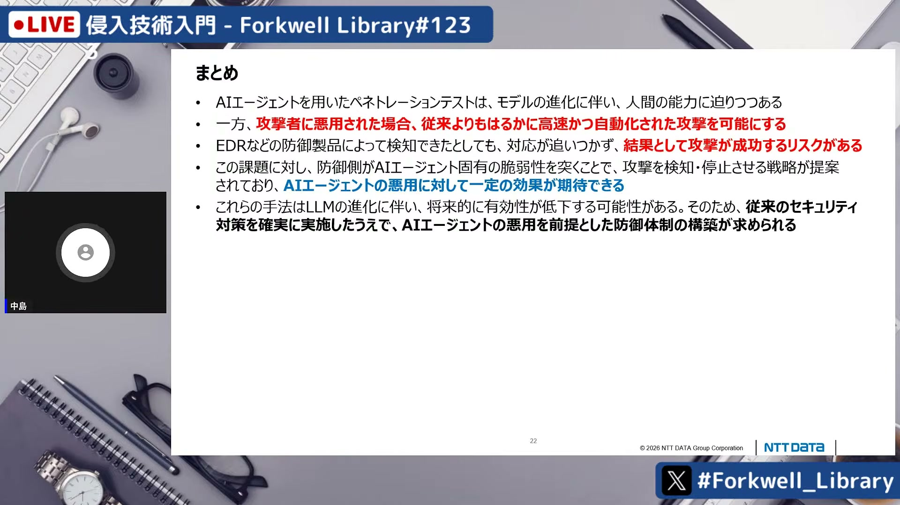

# 侵入技術入門 - Forkwell Library #123

[https://www.youtube.com/watch?v=hdTdsj08n5k](https://www.youtube.com/watch?v=hdTdsj08n5k)

## 要点

- ディテクションエンジニアリング（Detection Engineering）は、脅威検出ロジックの向上とソフトウェア工学のベストプラクティスを融合させ、侵入を早期検知・最小化する専門領域である。
- オープンな検出ルール規格であるSigmaを活用することで、特定のSIEM製品に依存せずYAML形式で高度な検知ロジックを共有・運用できる。
- AIエージェントの悪用により攻撃の自動化と高速化が進んでおり、従来の検知・対応タイムラインでは目標達成を阻止できないリスクが高まっている。
- AIエージェント固有の特性を逆手に取り、人間には見えない特殊文字を用いたハニー（Honey）や循環参照・パズルによるトラップ（Trap）で攻撃を検知・遅延させる防御戦略が有効である。

## 詳細

### ディテクションエンジニアリングの概念と歴史

ディテクションエンジニアリング（Detection Engineering）は、脅威検出ロジックの品質向上と、ディテクション・アズ・コード（Detection as Code）やCI/CDなどのソフトウェア工学手法をセキュリティに適用する2つの方向性を持つ領域です。2005年頃のSIEM普及期における職人技的なルール作成から、2015年のMITRE ATT&CKや2017年のSigmaの登場を経て、検出ロジックを共通言語として共有・自動運用する形へと進化してきました。

*9:35 — [動画のこの位置を開く](https://www.youtube.com/watch?v=hdTdsj08n5k&t=575s)*

### Sigmaによる検知ロジックの構造化

Sigmaはログイベントから脅威を検出するためのオープンなルール仕様であり、YAML形式で簡潔に記述できます。ピラミッド・オブ・ペイン（Pyramid of Pain）におけるツールやコマンドラインレベルの挙動を捉えることができ、各種SIEMのクエリへ変換して利用可能です。ルールはタイトル、リファレンス、対象ログソース、検出条件（AND/ORや正規表現マッチなど）で構成されます。

*18:53 — [動画のこの位置を開く](https://www.youtube.com/watch?v=hdTdsj08n5k&t=1133s)*

### オープンソースで実践するログ検知・解析

大和セキュリティコミュニティが開発するRust製のCLIツール「はやぶさ（Hayabusa）」は、4,000以上のSigmaルールを組み込み、Windowsイベントログを高速解析してタイムラインを出力します。さらに、AIエージェントを活用してフォレンジックレポートを作成する「メカはやぶさ」や、AWS CloudTrailログ解析に特化した「スサノオ（Susanoo）」「T-Hunt Cloud」などのOSSを活用して学習・実践が可能です。

*27:59 — [動画のこの位置を開く](https://www.youtube.com/watch?v=hdTdsj08n5k&t=1679s)*

### AIエージェントによる攻撃の高速化とリスク

Claude CodeなどのAIエージェントを悪用した攻撃では、人間の介入が10〜20%程度でも侵害が成立する事例が報告されています。AIエージェントが自律的に情報収集や権限昇格を高速実行するため、EDR（Endpoint Detection and Response）がアラートを発報しても、SOC（Security Operation Center）が対応を始める前に攻撃目標を達成されてしまうリスクが予見されています。

*47:22 — [動画のこの位置を開く](https://www.youtube.com/watch?v=hdTdsj08n5k&t=2842s)*

### AIエージェント固有の脆弱性を突く能動的防御

AIエージェントによる攻撃への対抗策として、クローク（Cloak）、ハニー（Honey）、トラップ（Trap）という能動的防御戦略が提唱されています。人間には不可視でLLMのみが認識する特殊文字を仕込んだハニートークンで侵入者を特定する手法や、動的に変化するパズルや循環参照データでAIエージェントを無限ループに陥らせて攻撃を足止めする手法が実証されています。

*1:02:03 — [動画のこの位置を開く](https://www.youtube.com/watch?v=hdTdsj08n5k&t=3723s)*

### 効果的なセキュリティ防御体制のあり方

AIエージェントを足止めする手法は有効である一方、モデルの進化に伴ういたちごっこになる側面もあります。そのため、EDRの適切な運用、ネットワークのセグメンテーション、過剰な権限の棚卸しといった基本的なセキュリティ対策を前提とした上で、AIエージェント悪用を想定した防御体制を構築することが重要です。

*1:14:39 — [動画のこの位置を開く](https://www.youtube.com/watch?v=hdTdsj08n5k&t=4479s)*

## 用語

- **ディテクションエンジニアリング**（Detection Engineering） — サイバー脅威の検出ロジックを作成・改良・管理し、ソフトウェア工学の手法を用いてそのプロセス全体を高度化する専門領域。
- **シグマ**（Sigma） — SIEMなどのログ検索製品に依存しない形で、ログイベントに対する脅威検出ルールをYAML形式で記述・共有できるオープンな標準フォーマット。
- **ピラミッド・オブ・ペイン**（Pyramid of Pain） — 攻撃者の痕跡（ハッシュ、IP、ツール、攻撃手順など）を階層化し、検知された際に攻撃者側にかかる変更コスト（痛み）の大きさを示した概念図。
- **はやぶさ**（Hayabusa） — Sigmaルールを活用し、Windowsイベントログを高速に解析・タイムライン化するRust製のオープンソースCLIツール。
- **ハニートークン**（Honey Token） — 正当な業務では使用されない偽の認証情報やファイルであり、アクセスされた際に侵入活動を即座に検知するために配置されるおとりデータ。

## 所感

<!-- ここは自分で書く -->
