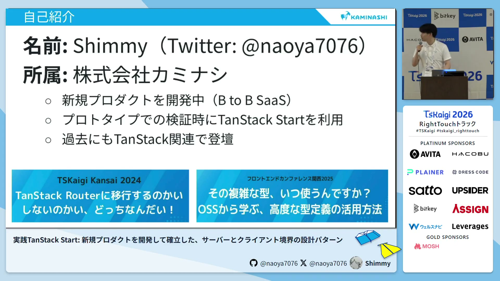
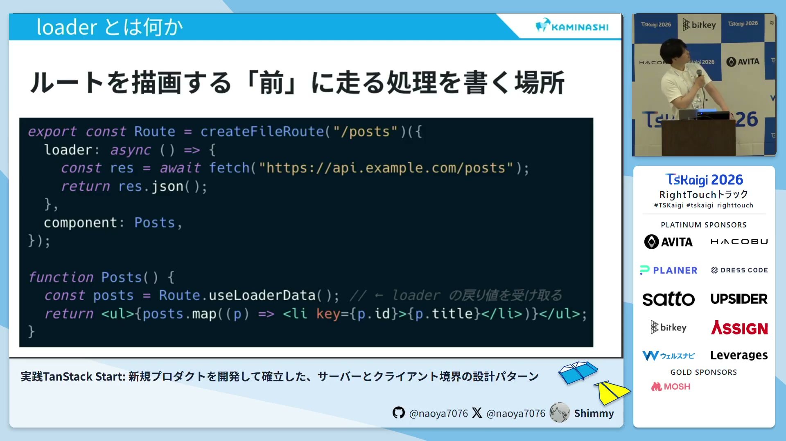
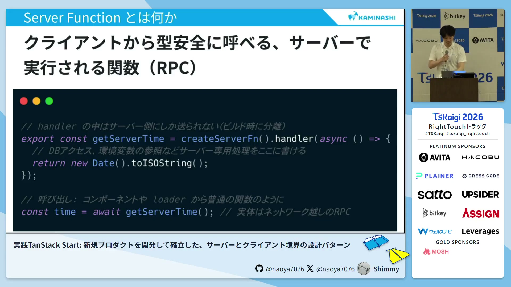
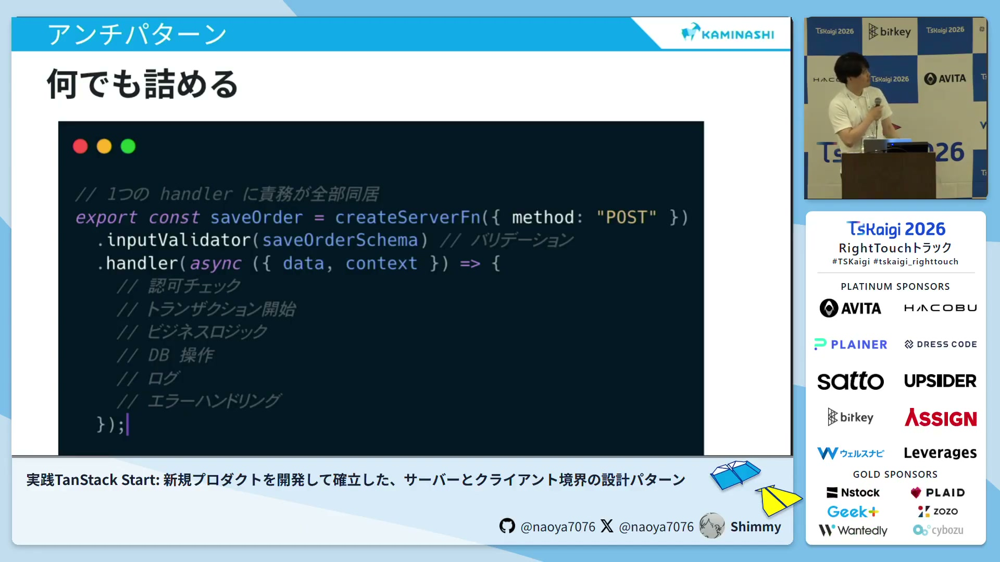

# 実践TanStack Start: 新規プロダクトを開発して確立した、サーバーとクライアント境界の設計パターン / Shimmy - TSKaigi 2026

[https://www.youtube.com/watch?v=EI7qfIkmKSw](https://www.youtube.com/watch?v=EI7qfIkmKSw)

## 要点

- TanStack StartはNext.jsのようなマジックレイヤーを持たず、明示的（Explicit）なフレームワークであるため、開発者が自身でサーバーとクライアントの境界の設計責任を持つ必要があります。
- ローダー（loader）にすべてのデータ取得を詰め込むと画面遷移がブロックされるため、ローダーは必要最低限の値を渡すだけの薄い境界にとどめ、実際のデータ取得はコンポーネント側に任せるのが理想です。
- サーバーファンクション（Server Functions）に直接ロジックを書きすぎると肥大化しテストも困難になるため、ビジネスロジックやI/O（入出力）処理は外部へ移譲する必要があります。
- 認証やロギングなどの横断的な関心ごとはミドルウェア（Middleware）に集約することで、サーバーファンクションのハンドラーを徹底的に薄く保つことができます。

## 詳細

### TanStack Startのスタンスと設計の前提

TanStack Startは、Next.jsのような規約（Convention）ベースのフレームワークとは異なり、明示的（Explicit）に記述することを重視しています。リアクト（React）と開発者の間に暗黙的なマジックレイヤーが存在しないため、ローダーやサーバーファンクションの責務は自分たちで設計し、境界を定義する必要があります。

*1:49 — [動画のこの位置を開く](https://www.youtube.com/watch?v=EI7qfIkmKSw&t=109s)*

### ローダーを薄く保ち、画面遷移のボトルネックを防ぐ設計

ローダーはルートを描画する前にデータ取得を行う仕組みですが、すべてのデータ取得をここに集中させると、一番遅い処理がボトルネックとなり画面遷移がブロックされてしまいます。そのため、ローダーはテナントID（Tenant ID）などの描画に必要な最低限の値を渡す「薄い境界」として扱い、実際のデータ取得はコンポーネント側で行いサスペンス（Suspense）に制御を任せます。

*3:56 — [動画のこの位置を開く](https://www.youtube.com/watch?v=EI7qfIkmKSw&t=236s)*

### サーバーファンクションの肥大化を防ぐ移譲設計

サーバーファンクションは便利である反面、バリデーション、ビジネスロジック、I/O処理などが混在して肥大化しやすい問題があります。これを防ぐため、ロジックはサーバー側のビジネスロジックに、データベース操作などのI/Oはリポジトリ（Repository）ディレクトリなどに切り出して移譲します。サーバーファンクション自体は、入力バリデーションとロジックの繋ぎ込みだけを行う薄い状態を維持します。

*6:51 — [動画のこの位置を開く](https://www.youtube.com/watch?v=EI7qfIkmKSw&t=411s)*

### ミドルウェアによる横断的関心ごとの分離

ロギングや認証といった各サーバーファンクションで共通して発生する処理は、ハンドラーに直接記述するのではなくミドルウェアに逃がします。共通の関心ごとをミドルウェアに集約することで、実装の漏れを防ぐとともに、サーバーファンクションのハンドラーをさらにシンプルで薄い状態に保つことができます。

*7:22 — [動画のこの位置を開く](https://www.youtube.com/watch?v=EI7qfIkmKSw&t=442s)*

## 用語

- **ローダー**（loader） — 画面（ルート）を描画する前にサーバー側から必要なデータを事前に取得し、クライアントに受け渡す仕組み。
- **サーバーファンクション**（Server Functions） — クライアントから通常の関数のように呼び出すことで、実質的にサーバー側で処理を実行させることができる仕組み。
- **ミドルウェア**（Middleware） — サーバー処理の前後で動作し、認証やロギングなどの複数の処理にまたがる共通の関心ごとをまとめて扱う仕組み。

## 所感

<!-- ここは自分で書く -->
