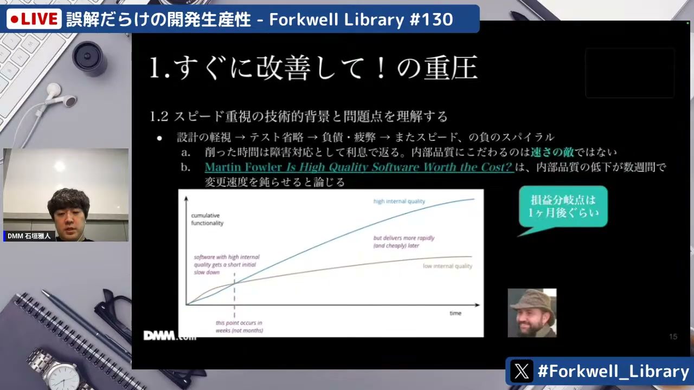
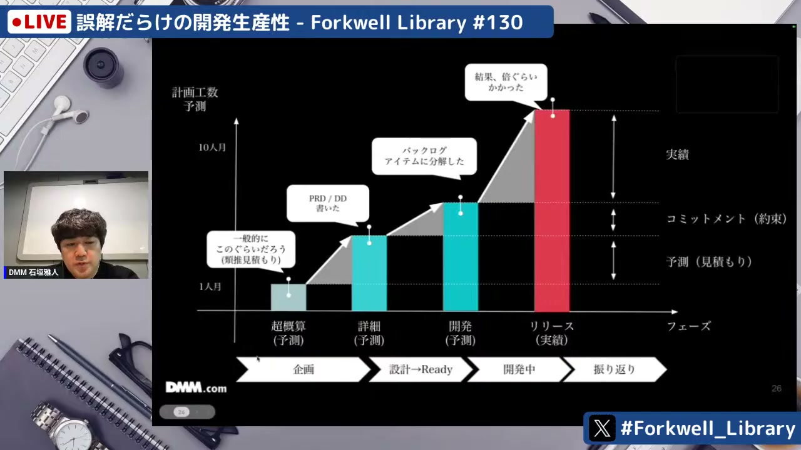
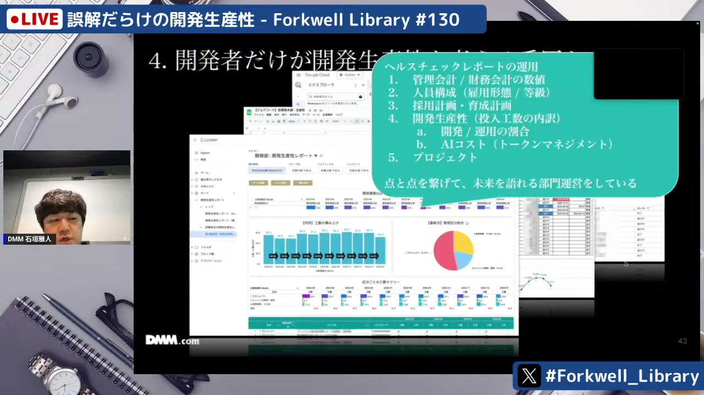

# 誤解だらけの開発生産性 - Forkwell Library #130

[https://www.youtube.com/watch?v=_DGcfn5fzLA](https://www.youtube.com/watch?v=_DGcfn5fzLA)

## 要点

- 開発生産性の向上には組織間の信頼関係が不可欠であり、信頼がないまま外部から監視・測定しようとすると指標のハックや形骸化を招く。
- テスト等の内部品質を犠牲にした開発は手戻りコストを増大させ、約1ヶ月後には損益分岐点を超えてかえって開発速度を低下させるため、質とスピードは二者択一ではない。
- 技術的負債やAI普及による認知的負債といった「測りにくい生産性」を意識し、類推見積もりと自社システム向け詳細設計の差分などから予兆を検知することが重要である。
- エンジニアが見る開発メトリクスと経営・事業側が見る財務指標（損益計算書や人件費、開発・運用工数の内訳）をツリー構造で接続し、一連のストーリーとして説明できる状態を作る必要がある。
- 成功したチームの指標や手法をトップダウンで全社に標準化しようとすると、チームごとの特性が無視され形骸化を招くため、適応力や学習文化を尊重すべきである。

## 詳細

### 開発生産性の誤解と信頼関係の重要性

開発生産性の改善をチーム外部から監視・管理する形（外的動機）で求めると、指標を達成すること自体が目的化するグッドハートの法則（Goodhart's law）に陥りやすくなります。本来は自分たちやエンドユーザーのために改善する内発的動機が重要であり、開発組織と事業側との間に信頼が築かれていれば、外部に見せるためだけの数字遊びは不要になります。

*8:20 — [動画のこの位置を開く](https://www.youtube.com/watch?v=_DGcfn5fzLA&t=500s)*

### 質とスピードの二者択一という誤解

大枠の要件だけで実装を進めたりテストを省略したりすると、後の工程になるほど手戻りコストが数十倍に跳ね上がります。マーティン・ファウラー（Martin Fowler）の論を引くように、内部品質を落とした開発は最初の約1ヶ月こそ速く見えるものの、すぐに損益分岐点を迎えて高品質を維持した開発速度に追い抜かれます。質と速度はトレードオフではありません。

*17:15 — [動画のこの位置を開く](https://www.youtube.com/watch?v=_DGcfn5fzLA&t=1035s)*

### 測りにくい生産性（技術的負債・認知的負債）の検知

進捗遅延やプルリクエスト数などの測りやすい数字だけに依存すると、本質的なボトルネックを見落とします。一般的な機能開発にかかる類推見積もりと、自社の実システムに落とし込んだ詳細設計（デザインドック等）の見積もりとの差分を比較することで、技術的負債の予兆を検知できます。また、AIが書いたコードを開発者が理解しないまま取り込むことで生じる「認知的負債」への配慮も必要です。

*27:19 — [動画のこの位置を開く](https://www.youtube.com/watch?v=_DGcfn5fzLA&t=1639s)*

### 開発指標と財務・事業視点のツリー接続

エンジニアが追うFour Keysなどの指標と、事業責任者や経営層が気にする損益計算書（PL: Profit and Loss Statement）や人件費は、見ているレイヤーや変数が異なります。チームの総人件費から開発と保守運用の割合、各プロジェクトごとの工数、その内訳である設計・開発・レビュー時間、プルリクエストの処理時間へとブレイクダウンして接続することで、開発の遅延や課題をナラティブ（ストーリー）として説明できるようになります。

*41:25 — [動画のこの位置を開く](https://www.youtube.com/watch?v=_DGcfn5fzLA&t=2485s)*

### 安易な横展開・標準化の落とし穴

特定チームの成功指標をトップダウンで横展開・標準化しようとすると、扱うプロダクトやメンバーのスキル構成、等級の違いに対応できず失敗します。単一の数値を追わせる組織になると適用力や学習文化が損なわれるため、チームごとの文脈を考慮したアプローチが求められます。

*42:58 — [動画のこの位置を開く](https://www.youtube.com/watch?v=_DGcfn5fzLA&t=2578s)*

### 質疑応答：AI導入と開発体制・認知負荷の管理

AIの活用により、1プロダクトあたりの人数を10名から少数精鋭（3〜4名）に絞り、余力を他のプロダクト改善に充てる体制移行の実例が共有されました。AIツールの投資対効果は、運用・保守や非開発業務にかかる工数を削減し、新規開発へ工数をシフトできたか（生産量）で評価されています。また、AI利用による「認知負荷」や「AI疲れ」は残業時間だけでは検知できないため、1on1等を通じた個別の対話でメンタル負荷をケアすることが重要とされています。

*1:02:12 — [動画のこの位置を開く](https://www.youtube.com/watch?v=_DGcfn5fzLA&t=3732s)*

## 用語

- **グッドハートの法則**（Goodhart's law） — ある統計的指標が政策決定や評価の目標として設定された瞬間、その指標がハックされ、本来持っていた測定基準としての価値を失ってしまう法則。
- **認知的負債**（Cognitive Debt） — AI等の支援により生成されたコードを開発者自身が十分に理解しないまま本番環境に投入することで蓄積する、システムの理解不足や保守困難さに起因する負債。
- **Four Keys**（Four Keys） — ソフトウェア開発組織のデリバリー性能を測定するための代表的な4つの指標（デプロイ頻度、変更のリードタイム、変更障害率、サービス復元時間）。

## 所感

<!-- ここは自分で書く -->
