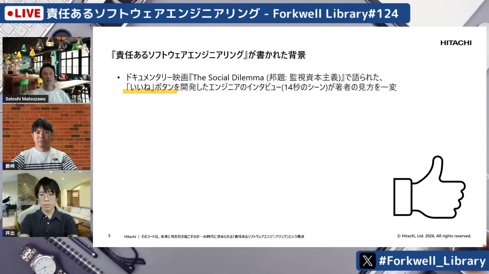
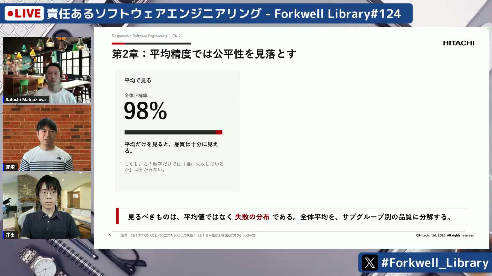
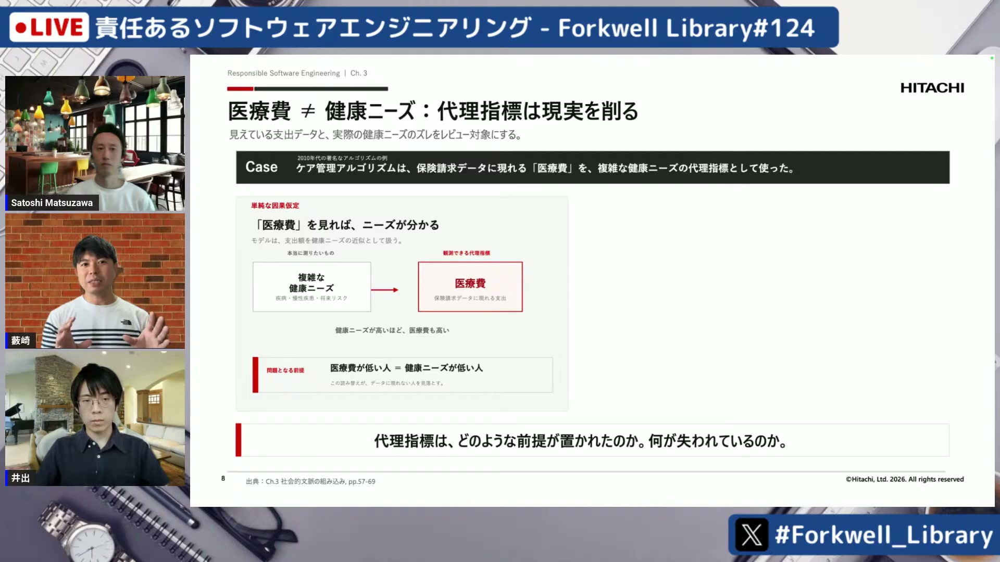
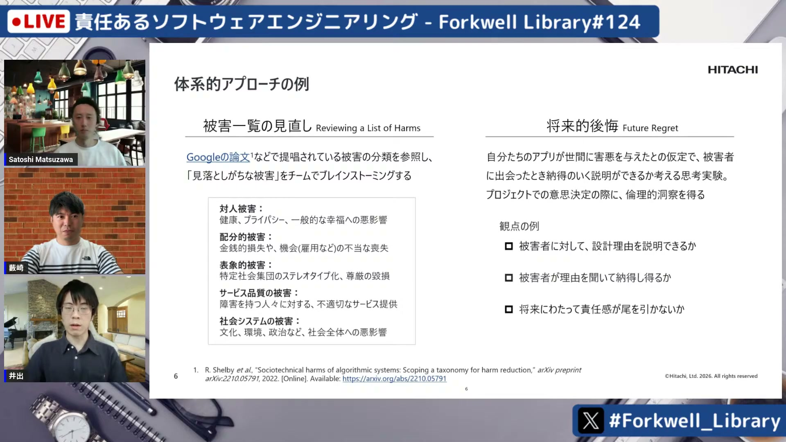
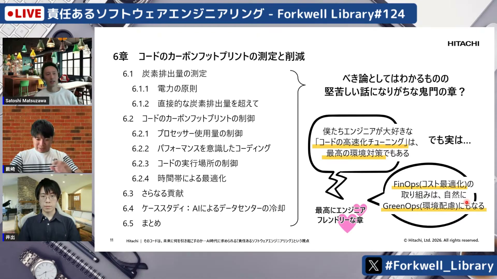

# 責任あるソフトウェアエンジニアリング - Forkwell Library#124

[https://www.youtube.com/watch?v=Z_ZOeGDj_kA](https://www.youtube.com/watch?v=Z_ZOeGDj_kA)

## 要点

- ソフトウェアが仕様通りに正しく動作しても、ユーザーの社会的文脈や前提の違いによって意図せず危害を生み出すことがある。
- 全体平均の精度だけで品質を判断せず、失敗が特定のサブグループに偏っていないか（公平性）や、代理指標が何を切り捨てているかを検証する必要がある。
- 想定外の波及効果やプライバシー侵害を防ぐため、被害の体系的な洗い出しや「将来的後悔」などの思考実験、k-匿名性といった技術的アプローチを設計に組み込む。
- コードの高速化やコスト最適化（FinOps）は環境負荷低減（GreenOps）にも直結し、責任あるソフトウェアエンジニアリングの実践となる。

## 詳細

### 書籍の背景と「責任あるエンジニアリング」の意義

SNSの「いいね」ボタンのように、善意から開発された機能であってもメンタルヘルス悪化や社会の分断といった予期せぬ害を生む現実があります。本書『責任あるソフトウェアエンジニアリング（Responsible Software Engineering）』は、仕様通りの正しさや使いやすさを超え、製品が社会や住人に害を及ぼさないための実践的なアプローチをGoogleのエンジニアの知見をもとに体系化しています。

*10:37 — [動画のこの位置を開く](https://www.youtube.com/watch?v=Z_ZOeGDj_kA&t=637s)*

### 平均精度の落とし穴と公平性の検証

全体の正解率が98%と高くても、残りの2%の失敗が特定のサブグループ（少数派や特定の身体条件を持つ人々など）に集中していれば、それは重大な欠陥となります。開発時には全体平均だけでなく失敗の分布をサブグループ別に分解して評価する必要があります。特定の利用者に配慮した改善は、歩道の段差をなくすことで誰もが恩恵を受ける「カーブカット効果（Curb-Cut Effect）」のように、全体的な品質向上にも寄与します。

*17:20 — [動画のこの位置を開く](https://www.youtube.com/watch?v=Z_ZOeGDj_kA&t=1040s)*

### 社会的文脈と代理指標の前提崩れ

ソフトウェアはコードの実行環境だけでなく、利用者の価値観や制度といった「社会的文脈」の中で動作します。また、測りやすい数値を目標にする「代理指標（Proxy Metric）」には暗黙の前提が存在します。例えば医療費の高低を健康ニーズの予測に用いた場合、医療費が低い貧困層が「健康である」と誤判定されるような前提のズレが発生するため、開発者以外の専門家や当事者とともに前提を検証することが不可欠です。

*23:13 — [動画のこの位置を開く](https://www.youtube.com/watch?v=Z_ZOeGDj_kA&t=1393s)*

### 波及効果の予測とプライバシー保護

救急カートに指紋認証を導入した結果、手袋を着けた緊急時に開けられないといった想定外の被害を防ぐため、「被害の体系的な見直し」や、被害者に納得のいく説明ができるかを問う「将来的後悔（Future Regret）」という思考実験が紹介されました。また、社内検索ログの匿名公開で病歴が推測された事例などを通じ、属性を丸めて個人特定を防ぐ「k-匿名性（k-anonymity）」などの保護技術や設計原則の重要性が示されました。

*28:16 — [動画のこの位置を開く](https://www.youtube.com/watch?v=Z_ZOeGDj_kA&t=1696s)*

### 環境負荷への配慮と現場での実践

第6章のカーボンフットプリント削減は一見堅苦しいテーマですが、エンジニアが行うコードの高速化チューニングやコスト最適化（FinOps）の活動そのものが、そのまま環境対策（GreenOps）につながります。また、上層部への説明では倫理問題を炎上時の信頼失墜やビジネスリスクとして可視化すること、対応範囲を決める際は「道徳的想像力ワークショップ」などを通じて制約と優先順位を整理することが有効です。

*36:00 — [動画のこの位置を開く](https://www.youtube.com/watch?v=Z_ZOeGDj_kA&t=2160s)*

## 用語

- **カーブカット効果**（Curb-Cut Effect） — 車椅子利用者のために歩道の縁石をカットしたスロープが、ベビーカーや自転車利用者などすべての人に恩恵をもたらしたように、特定のマイノリティへの配慮が全体の利益につながる現象。
- **k-匿名性**（k-anonymity） — データの特定の属性（年齢や住所など）を一般化・抑制することで、データセット内のどのレコードも最低k人以上のグループと区別がつかないようにするプライバシー保護手法。
- **代理指標**（Proxy Metric） — 直接測定することが難しい対象の代わりに、測定しやすい別の数値（例：医療ニーズの代わりに医療費データ）を使って評価するための指標。

## 所感

<!-- ここは自分で書く -->
