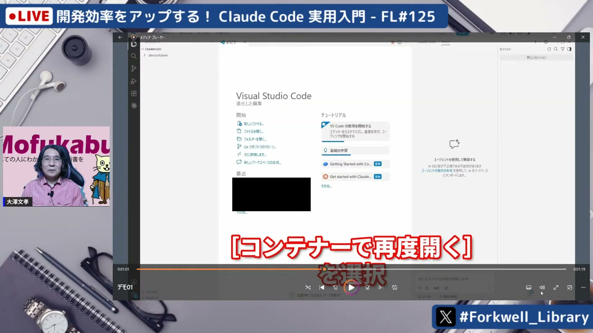
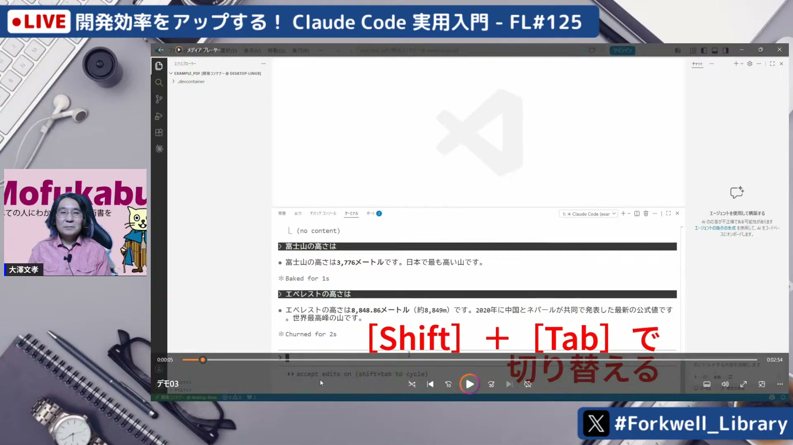
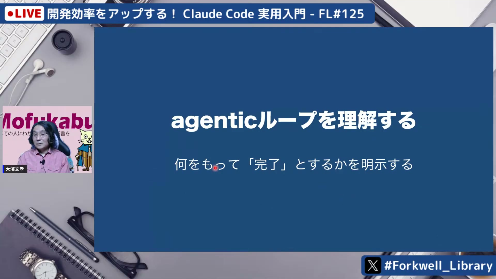
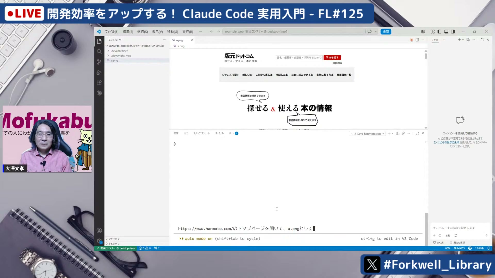
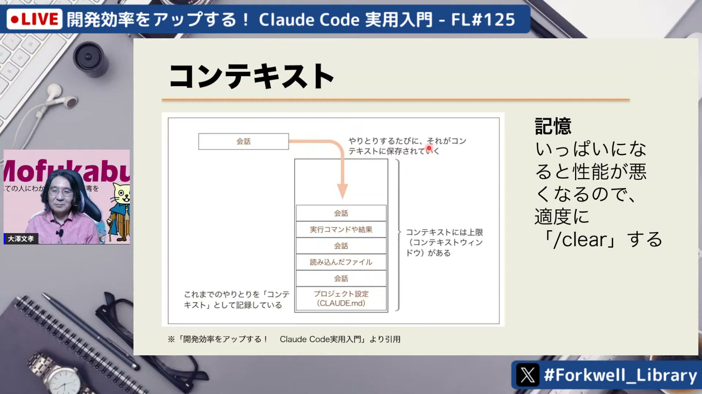

# 開発効率をアップする！ Claude Code 実用入門 - FL#125

[https://www.youtube.com/watch?v=32Q-PNLRVyU](https://www.youtube.com/watch?v=32Q-PNLRVyU)

## 要点

- Claude Code（クロードコード）はPC上でファイル編集やコマンド実行を自律的に行うAIエージェントであり、Dockerコンテナ環境で動かすことで安全性とLinuxコマンドの利便性を両立できる。
- 生成物のブレを防ぐためには指示の仕様を明確にする必要があり、プランモード（Plan Mode）を活用して実行前にAIと対話しながら計画を固める手法が有効である。
- エージェントが自律的に作業を完了させるには明確な終了条件が必要であり、テストを作成してテスト駆動開発（TDD）の形で実行させることが推奨される。
- MCP（Model Context Protocol）を導入することでブラウザ自動操縦などの外部ツールを連携でき、開発だけでなくデータ収集などへも活用の幅を広げられる。
- コンテキスト肥大化を防ぐ定期的なクリア、CLAUDE.mdでのプロジェクト規則の共有、予期せぬコード破壊に備えたGitでの履歴管理が実務運用において不可欠である。

## 詳細

### Claude Codeの仕組みとコンテナ実行の重要性

Claude Codeは従来のチャット型AIと異なり、ローカルPC環境でファイルの読み書きやビルド・テストなどのコマンド実行を自律して行うAIエージェントである。自動実行のために権限確認をスキップするモードを利用する際は、PCの安全確保および強力なLinuxコマンド群を活用できるように、Visual Studio CodeとDev Containers（デブコンテナー）を組み合わせたDockerコンテナ内での運用が強く推奨される。

*23:20 — [動画のこの位置を開く](https://www.youtube.com/watch?v=32Q-PNLRVyU&t=1400s)*

### 落ち物パズルゲームの生成デモと「仕様」の必要性

HTMLとJavaScriptを用いた落ち物パズルゲームの作成指示を出すと、1分程度で約600行の動作するコードが一発で生成される。しかし、同じプロンプトであっても実行ごとに言語やデザイン、得点計算などの仕様にブレ（生成ガチャ）が発生するため、実務コードの開発では人間が欲しい仕様の範囲を絞り込んで明示的に指示することが重要となる。

*26:38 — [動画のこの位置を開く](https://www.youtube.com/watch?v=32Q-PNLRVyU&t=1598s)*

### プランモードを活用した対話的な仕様策定と修正

複雑なプロジェクトでは、実行前に計画を立てる「プランモード（Plan Mode）」を活用することで、フォント設定や改行処理など不足している要件をClaude Code側から質問させて仕様を詰められる。デモのPDFラベルメーカー作成では、生成後に発生した日本語の文字化けに対しても追加プロンプトで修正を指示し、短時間で完成させている。

*36:43 — [動画のこの位置を開く](https://www.youtube.com/watch?v=32Q-PNLRVyU&t=2203s)*

### エージェンティックループとテスト駆動開発（TDD）の相性

Claude Codeは「コンテキスト収集」「アクション実行」「結果の検証」というエージェンティックループ（Agentic Loop）で動作する。明示的な終了条件がないと処理が完了しないか中途半端に終わるため、テストを作成して合否を判定基準にするテスト駆動開発（TDD: Test-Driven Development）が極めて有効である。テストコード自体も仕様書からClaude Codeに生成させることが可能である。

*40:59 — [動画のこの位置を開く](https://www.youtube.com/watch?v=32Q-PNLRVyU&t=2459s)*

### MCP（Model Context Protocol）によるブラウザ自動操縦デモ

外部プログラムを操作する仕組みであるMCP（Model Context Protocol）を用いることで、AIに手足を付与できる。Microsoft製のPlaywright（プレイライト）を組み込んだPlaywright MCPのデモでは、ヘッドレスブラウザを自動操縦して指定サイトのスクリーンショット撮影や、書籍検索結果（発売日・書名・出版社）を抽出してCSVファイルへ出力する処理が実演された。

*49:36 — [動画のこの位置を開く](https://www.youtube.com/watch?v=32Q-PNLRVyU&t=2976s)*

### 実務で押さえるべき運用Tips（コンテキスト、CLAUDE.md、Git）

会話が長くなるとAIの精度が落ちるため、`/clear`コマンドで定期的にコンテキストを整理し、必要な情報は中間ファイルへ書き出させて引き継ぐのが良い。また、共通規則を記述する`CLAUDE.md`は最新状態を保つこと、予期せぬコード破壊に備えてGitによる事前コミットやフック（Hooks）を活用した自動巻き戻し環境を整えることが推奨される。

*53:12 — [動画のこの位置を開く](https://www.youtube.com/watch?v=32Q-PNLRVyU&t=3192s)*

## 用語

- **デブコンテナー**（Dev Containers） — Dockerコンテナを開発環境として利用するためのVisual Studio Codeの拡張機能。
- **プランモード**（Plan Mode） — Claude Codeにおいて、コードの変更やコマンド実行を行う前にAIが作業計画を立て、不足情報をユーザーと対話して詰めるモード。
- **エージェンティックループ**（Agentic Loop） — AIエージェントが「状況把握」「アクション実行」「結果検証」のサイクルを自律的に繰り返す動作構造。
- **モデルコンテキストプロトコル**（MCP (Model Context Protocol)） — AIモデルと外部のツールやサービスを連携させ、AI側から機能を実行可能にするためのオープンな規格。
- **フック**（Hooks） — Claude Codeの処理前後やツール実行時などの特定イベントを契機に、任意のスクリプトや処理を実行させる仕組み。

## 所感

<!-- ここは自分で書く -->
